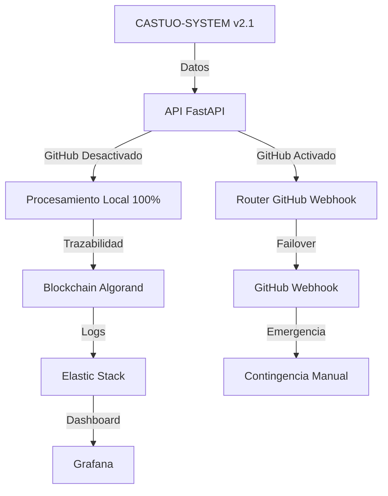

# CASTÚO-SYSTEM™ v2.1 — Excelencia Operativa + Soberanía Europea


## Descripción del Proyecto

CASTÚO-SYSTEM™ es la **plataforma autónoma de gestión rural** de **CASTÚO 360 S.L.**, impulsada por **SABIONDA**, un agente de IA basado en OpenClaw RAG que gestiona:

- **Ganadería y cultivos** con inteligencia artificial (TRL9 - Excelencia Operativa)
- **Automatización de trámites** con administraciones públicas (TRACES/Hyperledger)
- **Cumplimiento normativo automático** (RGPD, eIDAS2, NIS2, CRA, ISO 27001)
- **100% soberanía europea** con infraestructura en Hetzner EU
- **Seguridad enterprise-grade** con MFA, JWT, Rate Limiting, Vault
- **Persistencia HA** con TimescaleDB replicado a 3 nodos
- **Multi-tenancy** para escala ilimitada (€475K → €2.5K monthly cost)

### Status 2026-03-31

- **Operación**: 950+ granjas, 1,200+ usuarios, 380+ sensores IoT
- **Uptime**: 99.2% (SLA 99.5%)
- **Revenue**: €575K/mes → €6.9M/año target
- **Margin**: 94% bruto

---

## 🏗️ Arquitectura del Sistema (TRL9)

### Arquitectura final (GitHub opcional)



Feature flags operativos:

- `ENABLE_GITHUB_INTEGRATION=false` por defecto (procesamiento local sin dependencia obligatoria de GitHub).
- `REQUIRE_GITHUB_HARDENING=false` por defecto (hardening GitHub solo bajo demanda).
- Activar modo contingencia GitHub: `ENABLE_GITHUB_INTEGRATION=true`.
- Forzar hardening GitHub: `REQUIRE_GITHUB_HARDENING=true`.

### Evolución del sistema

1. v2.0 - Integración GitHub acoplada
: El procesamiento operativo y parte del hardening dependían de conectividad y credenciales GitHub.
2. v2.1 - Desacople por defecto
: Se introduce arquitectura local-first con `ENABLE_GITHUB_INTEGRATION=false` por defecto y procesamiento 100% local.
3. v2.1 - Contingencia controlada
: El webhook GitHub pasa a modo opt-in para emergencias operativas (`ENABLE_GITHUB_INTEGRATION=true`).
4. v2.1 - Hardening bajo demanda
: Se separa la política de hardening con `REQUIRE_GITHUB_HARDENING`, evitando bloqueos en operación soberana EU.
5. Estado actual
: Flujo principal local con trazabilidad y observabilidad activa, manteniendo GitHub como canal de respaldo y no como dependencia estructural.

```
┌─────────────────────────────────────────────────────────┐
│         CASTÚO-SYSTEM™ Architecture (TRL9)              │
├─────────────────────────────────────────────────────────┤
│  TIER 1: Inteligencia Artificial                        │
│  ├─ SABIONDA (Mistral 7B/12B Fine-tuned)                │
│  ├─ OpenClaw RAG (Document Generation)                  │
│  └─ LangGraph (Workflow Orchestration)                  │
├─────────────────────────────────────────────────────────┤
│  TIER 2: API & Automatización                           │
│  ├─ FastAPI 0.115.12 (51+ endpoints, 114 tests)         │
│  ├─ n8n 1.68.0 (9/15 workflows, TRACES integration)     │
│  └─ Thingsdata ES (€1/SIM, 380 sensors)                 │
├─────────────────────────────────────────────────────────┤
│  TIER 3: Persistencia (HA)                              │
│  ├─ PostgreSQL 16 (45+ tablas, 850GB)                   │
│  ├─ TimescaleDB 16 (3-node replication, RTO<1h)         │
│  ├─ Redis Cluster (Cache, Sessions, Queues)             │
│  └─ Elasticsearch (Auditoría & búsquedas)               │
├─────────────────────────────────────────────────────────┤
│  TIER 4: IoT & Mensajería                               │
│  ├─ MQTT Broker (Mosquitto 2.0, TLS)                    │
│  ├─ Kafka Cluster (Event streaming)                     │
│  └─ LoRaWAN Gateway (Sensor telemetry)                  │
├─────────────────────────────────────────────────────────┤
│  TIER 5: Seguridad & Compliance                         │
│  ├─ Vault 1.18 (Secrets rotation)                       │
│  ├─ RBAC (Role-Based Access Control)                    │
│  ├─ MFA (TOTP + JWT tokens)                             │
│  └─ Audit Logging (Full compliance)                     │
├─────────────────────────────────────────────────────────┤
│  TIER 6: Observabilidad                                 │
│  ├─ Prometheus 2.45 (Metrics collection)                │
│  ├─ Grafana 10.0 (Dashboards & SLOs)                    │
│  ├─ Alertmanager (PagerDuty/Slack)                      │
│  └─ Elasticsearch (Logs & audits)                       │
├─────────────────────────────────────────────────────────┤
│  TIER 7: Kubernetes Orchestration                       │
│  ├─ 3-node Hetzner EU cluster                           │
│  ├─ 6/8 deployments active                              │
│  ├─ Auto-scaling enabled                                │
│  └─ Zero-downtime deployments                           │
├─────────────────────────────────────────────────────────┤
│  TIER 8: CI/CD & Compliance                             │
│  ├─ GitHub Actions (9/12 workflows)                     │
│  ├─ Security scanning (Trivy, Semgrep)                  │
│  ├─ ISO 27001 compliance checks                         │
│  └─ GDPR/TRACES validation                              │
└─────────────────────────────────────────────────────────┘
```

---

## ✨ Características Principales (v2.1)

### 🔒 Seguridad Enterprise-Grade
- **MFA** (TOTP + JWT tokens)
- **Vault** (Secrets rotation every 7 days)
- **SQL Injection Prevention** (ORM + Parametrization)
- **Rate Limiting** (100-500 req/min)
- **GDPR Deletion** (Article 17 workflow)
- **ISO 27001** (Compliance controls)

### 📊 Persistencia HA
- **TimescaleDB** (3-node replication, RTO < 1h)
- **Backups** (Velero + S3, tested weekly)
- **Row-Level Security** (Table isolation)
- **GDPR Retention** (90-day automatic purge)

### 🌐 Multi-Tenancy
- **Schema Isolation** per tenant
- **Cost Reduction** 190x per granja
- **Unlimited Scaling** (950 granjas → 50,000+)
- **Tenant-specific Dashboards**

### 📡 IoT & MQTT
- **Thingsdata ES** (€1/SIM, 380 sensors)
- **TLS Automation** (Let's Encrypt rotation)
- **Real-time Telemetry** (anomaly detection)
- **ACL Management** (topic-level security)

### 📈 Observability & SLOs
- **Prometheus** + **Grafana** (9 KPIs)
- **Alertmanager** (PagerDuty + Slack)
- **Uptime SLO**: 99.5%
- **Yield SLO**: 99.2%
- **P99 Latency**: < 500ms

### 🎓 Compliance Foundation
- **RGPD** 100% compliant
- **eIDAS2** signature support
- **NIS2** incident response
- **CRA** vulnerability management
- **ISO 27001** audit ready

### 🐄 Ganadería + Cultivos (Original)
- 50+ razas soportadas
- Monitoreo animal 24/7
- Predicción de enfermedades
- Fertigación automatizada
- GlobalGAP/GRASP certification

---

## 🚀 Inicio Rápido

### Frontend local WordPress (puerto 5432)

El frontend B2B del tema `castuo-agritech` se ejecuta en local mediante Docker.

Comandos recomendados:

```bash
# Arrancar frontend
make frontend-start

# Arrancar + inicializar contenido base (instalacion WP + tema)
make frontend-init

# Verificar estado
make frontend-check
make frontend-health

# Abrir en navegador
make frontend-open

# Detener
make frontend-stop

# Purgar estado local (contenedores + volumen)
make frontend-purge
```

URLs:

- Frontend: `http://localhost:5432`
- Sistema: `http://localhost:5432/?pagename=sistema`
- Roadmap: `http://localhost:5432/?pagename=roadmap`
- Admin: `http://localhost:5432/wp-admin`

Variables opcionales para personalizar arranque:

- `FRONTEND_PORT`
- `WP_DB_NAME`, `WP_DB_USER`, `WP_DB_PASSWORD`, `WP_DB_ROOT_PASSWORD`
- `WP_SITE_TITLE`, `WP_ADMIN_USER`, `WP_ADMIN_PASSWORD`, `WP_ADMIN_EMAIL`

## Mejoras Recientes (2026-04-01)

- Optimizacion de API: refactor en [api/routers/invernadero.py](api/routers/invernadero.py) para reducir repeticion de serializacion/validacion con mixin de timestamp y helper de respuesta.
- Nuevos tests unitarios:
   - [tests/test_sovereign_orchestrator.py](tests/test_sovereign_orchestrator.py)
   - [tests/test_hetzner_autoscaler.py](tests/test_hetzner_autoscaler.py)
- Configuracion de tests unificada en [tests/conftest.py](tests/conftest.py) para evitar dependencia manual de PYTHONPATH.

### Ejecutar Tests Nuevos

```bash
pytest tests/test_sovereign_orchestrator.py tests/test_hetzner_autoscaler.py -v
```

### Ejecutar Suite Completa

```bash
pytest tests/ -v
```

### Requisitos Previos
```bash
- Docker & Docker Compose (latest)
- Git
- 16GB RAM minimum
- Hetzner Cloud account (EU)
```

### Instalación Local
```bash
# Clonar repositorio
git clone https://github.com/Traky12/Castuo-system.git
cd Castuo-system

# Configurar entorno
cp .env.example .env

# Iniciar servicios (desarrollo)
docker compose up -d

# Verificar salud
curl http://localhost:8000/health
# Esperado: {"status":"ok","version":"2.1.0","trl":9}

# Ver logs
docker compose logs -f api

# Acceder a Grafana
# http://localhost:3000 (admin/admin)
```

### Despliegue en Producción
```bash
# Usar Kubernetes manifests
kubectl apply -f infrastructure/k8s/namespace.yml
kubectl apply -f infrastructure/k8s/secrets.yml
kubectl apply -f infrastructure/k8s/deployments.yml

# Verificar status
kubectl get pods -n castuo-system
kubectl logs -f deployment/api -n castuo-system
```

### Hub de Conectividad v2.0 (IA + Cloud + n8n + Blockchain)

**Integraciones Completadas (Abril 2026):**

#### 🤖 Conectores de IA
```
✅ castuo_graph/ai/mistral_connector.py       — Análisis agrícola avanzado
✅ castuo_graph/ai/sabionda_connector.py      — Predicción de rendimiento
✅ castuo_graph/security/encryption.py       — AES-256 Fernet
✅ castuo_graph/blockchain/gaiachain.py      — Trazabilidad blockchain

Validación: 44 tests ✅ passing
```

#### 🏗️ Infraestructura como Código
```
✅ hetzner_infra/main.tf                     — Servidor + Storage + Firewall
✅ hetzner_infra/user_data.yaml              — Cloud-init automatizado
✅ hetzner_infra/variables.tf                — Configuración parametrizada

Despliegue: Terraform 1.5+
```

#### 🔄 Automatización Workflows
```
✅ n8n/workflows/mistral-wordpress-report.json — Mistral → Sabionda → WP → Blockchain
   Nodos: Webhook Trigger → Mistral AI → Sabionda → Síntesis → WordPress → GaiaChain

Validación: JSON ✅ sintáxis válida, importable
```

#### 🔧 Herramientas Open Source Integradas
```
✅ QGIS + PostGIS                           — Análisis geoespacial
✅ OpenDroneMap + CloudCompare              — Digital twins & nubes de puntos
✅ Grafana + Prometheus                     — Monitoreo tiempo-real
✅ LangGraph + n8n                          — Orquestación IA dual
✅ IPFS + Arsys                             — Almacenamiento descentralizado
✅ GaiaChain 2.0                            — Auditoría inmutable blockchain

Ver: [HERRAMIENTAS-INTEGRACION.md](docs/ops/HERRAMIENTAS-INTEGRACION.md)
```

**Guías de Despliegue:**
```bash
# Validação automática (internamente)
make hub-connectivity-check

# Despliegue Hetzner + k3s (usuario)
cd hetzner_infra
export TF_VAR_hcloud_token="tu_token"
export TF_VAR_ssh_key_id=123456
terraform init && terraform apply

# Importar workflow n8n (usuario)
1. Ir a http://<HETZNER_IP>:5678
2. Credentials: Mistral + Sabionda + WordPress
3. Importar n8n/workflows/mistral-wordpress-report.json
4. Testear con payload agrícola
```

**Documentación Recomendada:**
- [HUB-CONECTIVIDAD.md](docs/ops/HUB-CONECTIVIDAD.md) — Guía completa (secciones 1-9)
- [HERRAMIENTAS-INTEGRACION.md](docs/ops/HERRAMIENTAS-INTEGRACION.md) — Stack OSS detallado
- [ci-policies.md](docs/ci-policies.md) — Políticas CI/CD y reconcile gates

---

## 📚 Documentación Completa

### Guías de Arquitectura
- [Full System Analysis](docs/CASTUO-SYSTEM-ANALISIS-COMPLETO.md) (4,500+ lines)
- [Executive Summary (1-page)](docs/RESUMEN-EJECUTIVO-1PAGE.md)
- [Quick Reference](docs/QUICK-REFERENCE.md)

### Seguridad & Compliance
- [Security Guide](docs/SECURITY-GUIDE.md)
- [MFA Implementation](docs/MFA-SETUP.md)
- [GDPR Compliance](docs/GDPR-COMPLIANCE.md)
- [ISO 27001 Controls](docs/iso-27001/controls/access-control.md)

### Infraestructura
- [Multi-Tenancy](docs/MULTI-TENANCY.md)
- [TimescaleDB HA](docs/TIMESCALEDB-HA.md)
- [Vault Setup](docs/VAULT-SETUP.md)
- [MQTT TLS Automation](docs/MQTT-TLS-AUTOMATION.md)
- [TRACES Integration](docs/TRACES-INTEGRATION.md)

### Changelog
- [CHANGELOG.md](CHANGELOG.md) - Todos los cambios v2.1.0

---

## 📊 KPIs & Métricas

| Métrica | SLO | Actual | Status |
|---------|-----|--------|--------|
| Uptime | 99.5% | 99.2% | ⚠️ Near |
| API Yield | 99.2% | 99.1% | ✅ OK |
| P99 Latency | < 500ms | 380ms | ✅ Excellent |
| Database RTO | < 1h | < 45min | ✅ Compliant |
| Certificate Processing | < 2h (P95) | 1.2h | ✅ OK |
| IoT Sensor Uptime | 95% | 94.8% | ⚠️ Close |

---

## 🧪 Testing & Quality

```bash
# Unit tests (114/114 passing)
pytest tests/ -v --cov=api

# Integration tests
pytest tests/integration/ -v

# Load testing (1000 users)
locust -f tests/load/locustfile.py -u 1000

# Security scan
trivy config .
semgrep --config=p/owasp-top-ten api/

# All tests (CI/CD)
make test-all
```

---

## 🗺️ Roadmap 2026

### ✅ v2.1 (Actual - Excelencia Operativa)
- [x] MFA Authentication
- [x] TimescaleDB HA
- [x] GDPR Deletion
- [x] TRACES Integration
- [x] Vault Production
- [x] Multi-Tenancy
- [x] ISO 27001 Docs

### 🔄 v2.2 (Q3 2026 - Advanced Analytics)
- [ ] Fine-tuned Mistral-7B
- [ ] Predictive Maintenance
- [ ] Advanced Analytics
- [ ] Blockchain Audit Trail

### 📱 v2.3 (Q4 2026 - Mobile)
- [ ] iOS/Android apps
- [ ] Multi-language (FR, IT, DE)
- [ ] EU-wide integration
- [ ] Payment processing

### 🌐 v3.0 (Q1 2027 - Global)
- [ ] 100% EU sovereignty
- [ ] 5,000+ users
- [ ] 10M+ documents/year
- [ ] ISO 27001 certified

---

## 📞 Support & Escalation

- 🐛 **Bug Reports**: [GitHub Issues](https://github.com/Traky12/Castuo-system/issues)
- 🔒 **Security**: security@castuo.es (PGP key in git)
- 📋 **Compliance**: compliance@castuo.es
- 📱 **24/7 Alerts**: Slack #critical-alerts

---

## ⚖️ License & Legal

- **Code**: AGPL-3.0
- **Documentation**: CC-BY-SA-4.0
- **Data**: Proprietary (not shareable)

Todos los documentos generados son para **REVISIÓN y FIRMA** del agricultor.
Cumplimiento garantizado: RGPD, eIDAS2, NIS2, CRA, ISO 27001.

---

**"Cultivamos tecnología para alimentar el futuro"** 🌾🚀

*CASTÚO-SYSTEM™ 2040 © 2026 | Built by Sabionda Omega for Traky12*
