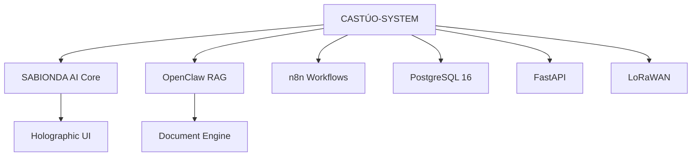

# CASTÚO-SYSTEM™ v2.0 — Agente SABIONDA

## Descripción del Proyecto

CASTÚO-SYSTEM™ es la **plataforma autónoma de gestión rural** de **CASTÚO 360 S.L.**, impulsada por **SABIONDA**, un agente de IA basado en OpenClaw RAG que gestiona:

- **Ganadería y cultivos** con inteligencia artificial
- **Automatización de trámites** con administraciones públicas
- **Cumplimiento normativo automático** (UE, España)
- **100% legal y auditado** con trazabilidad blockchain

## Arquitectura del Sistema



### Componentes principales

| Componente | Descripción |
|---|---|
| **SABIONDA AI Core** | Motor de inteligencia artificial con modelos Mistral |
| **OpenClaw RAG** | Sistema de recuperación y generación de documentos |
| **n8n** | Automatización de flujos de trabajo |
| **PostgreSQL 16** | Base de datos con soporte para grandes volúmenes de datos agrícolas |
| **FastAPI** | Backend para integración con sistemas gubernamentales |
| **LoRaWAN** | Conexión con sensores IoT en el campo |

## Características Principales

### 🐄 Gestión Ganadera Avanzada

- 50+ razas soportadas (Retinta, Avileña, Duroc, Ibérico, etc.)
- Monitoreo animal con sensores IoT
- Cumplimiento normativo automático (GRASP, ISO 14001)

### 🌾 Gestión de Cultivos Inteligente

- Control de riego y fertilización con algoritmos predictivos
- Integración GlobalGAP 5.4 para cultivos premium
- Optimización de invernaderos (CO₂, VPD, pH)

### 💧 Sistema de Riego Autónomo

- Sensores de humedad en tiempo real
- Fertigación automatizada con control de nutrientes
- Protocolos de ahorro hídrico

### 📄 Generación de Documentos Gubernamentales

```python
# Documentos generados automáticamente:
# - SIEX Cuaderno de Campo Digital
# - Certificados TRACES para exportación
# - Declaraciones PAC 2026
# - Registros SIGPAC y REGEPA
# - Certificados GlobalGAP/GRASP
```

## Inicio Rápido

### Requisitos Previos

- Docker y Docker Compose
- Git
- 16GB RAM recomendados

### Configuración

```bash
# Clonar repositorio
git clone https://github.com/Traky12/Castuo-system.git
cd Castuo-system

# Configurar entorno
cp .env.example .env
# Editar .env con tus credenciales

# Iniciar sistema
docker compose up -d
```

### Verificación

```bash
# Verificar estado
curl http://localhost:8000/health
# Respuesta esperada: {"status":"ok","agent":"SABIONDA","version":"2.0"}
```

## Estructura del Proyecto

```
.
├── .github/workflows/          # CI/CD workflows
│   ├── ci.yml                  # Validación y tests en cada PR/push
│   ├── deploy-staging.yml      # Despliegue automático a Hetzner
│   └── e2e-smoke-traces.yml    # Smoke tests E2E tras el despliegue
├── agents/sabionda/            # Configuración del agente
│   ├── system-prompt.md        # Prompt del sistema
│   └── config.json             # Configuración
├── api/                        # Backend FastAPI
│   ├── main.py                 # Endpoints
│   └── Dockerfile              # Imagen Docker
├── config/schemas/             # Esquemas JSON de validación
├── tests/                      # Tests de la API
├── docker-compose.yml          # Despliegue completo
└── README.md                   # Documentación
```

## Endpoints de API

| Método | Ruta | Descripción |
|--------|------|-------------|
| `GET`  | `/health` | Estado del sistema |
| `POST` | `/api/v1/siex/cuaderno-campo` | Generar cuaderno de campo SIEX |
| `POST` | `/api/v1/traces/certificado` | Generar certificado TRACES |
| `POST` | `/api/v1/pac/eco-esquema` | Generar eco-esquemas PAC |
| `POST` | `/api/v1/regepa/explotacion` | Registrar explotación REGEPA |
| `POST` | `/api/v1/sigpac/parcelas` | Informe de parcelas SIGPAC |
| `GET`  | `/api/v1/schemas/{name}` | Obtener esquema JSON |

## CI/CD

| Workflow | Disparador | Descripción |
|----------|-----------|-------------|
| **CI** (`ci.yml`) | Push / PR a `main` | Validación de esquemas, sintaxis y tests |
| **Deploy Staging** (`deploy-staging.yml`) | Push a `main` | Despliegue automático a Hetzner vía SSH |
| **E2E Smoke** (`e2e-smoke-traces.yml`) | Tras deploy exitoso | Smoke tests contra la API en staging |

## Legal y Cumplimiento

Todos los documentos siguen este proceso:

1. Generación por el agente (JSON estructurado)
2. Revisión por el agricultor
3. Firma digital del productor
4. Envío a sistemas oficiales

> ⚠️ Cada documento incluye: *"Documento generado para REVISIÓN y FIRMA del productor"*

## Licencia

- **Código:** AGPL-3.0
- **Documentación:** CC-BY-SA-4.0
- **Datos:** No compartibles (protegidos)

---

*"Cultivamos tecnología para alimentar el futuro"*

