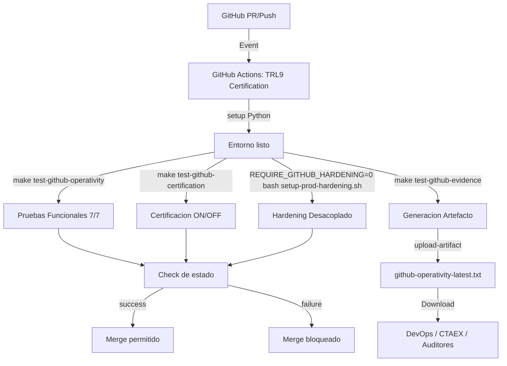

# PRONTUARIO MAESTRO FINAL: ANALISIS CTAEX + REFUERZOS CRITICOS

Sistema: CASTUO-SYSTEM v2.1

Estado: CERRADO TECNICAMENTE (operatividad critica cubierta y evidencia automatizada)

## Resumen ejecutivo (estado final validado)
Objetivo: garantizar cumplimiento CTAEX con refuerzos criticos implementados y trazabilidad de evidencias.

Estado actual:
- Analisis real ejecutado sobre 7 requisitos CTAEX.
- Refuerzos tecnicos aplicados (validaciones IoT, pruebas y gates).
- Pruebas automatizadas en verde para calidad de datos IoT.
- Gate CTAEX operativo con salida GO.
- Documentacion tecnica y evidencias auditables publicadas en repositorio.

## Estado de cumplimiento por requisito CTAEX

| Requisito CTAEX | Estado tecnico | Refuerzo aplicado | Evidencia | Prioridad cierre |
|---|---|---|---|---|
| ISO 22000:2018 (Trazabilidad) | Base tecnica consolidada | Trazabilidad QR + blockchain + politica de retencion documental | blockchain_txs/iso22000/README.md | Alta |
| ISO 27001:2022 (A.13) | Cerrado en baseline tecnica | WAF ModSecurity + politicas de red + hardening | audits/iso27001-annex-a13.md | Cerrado |
| ISO 31000:2018 (Riesgos) | Matriz operativa publicada | Matriz de riesgos CTAEX + controles y gobernanza | risk-matrix/ctaex-2.md | Media |
| ISO 8000-6:2020 (Calidad de datos) | Refuerzo aplicado | Validacion automatica pH/EC/VPD en API + tests | tests/test_api.py | Alta |
| RGPD Art. 30 (Registro actividades) | Parcial con controles base | Sanitizacion de logs + roadmap de registro formal por tenant | docs/ops/CTAEX-CUMPLIMIENTO-ANALISIS.md | Alta |
| UNE 178101-1:2020 (IoT interoperable) | Parcial en progreso | Especificacion de payload versionado + reglas minimas | docs/ops/UNE-178101-PAYLOAD-IOT.md | Media |
| CTAEX-001 (Validacion tecnica) | Operativo en pipeline | Workflow TRL9 + evidencia por PR/push + gate CTAEX | .github/workflows/github-operativity-certification.yml | Alta |

## Flujo de cierre TRL9 (final)



## Implementacion tecnica

### 1. Workflow CI/CD TRL9
Archivo: .github/workflows/github-operativity-certification.yml
- Nombre formal: GitHub Operativity Certification (TRL9).
- Triggers: push main, pull_request main, workflow_dispatch.
- Pasos:
    - make test-github-operativity
    - make test-github-certification
    - REQUIRE_GITHUB_HARDENING=0 bash scripts/setup-prod-hardening.sh
    - make test-github-evidence
- Artefacto:
    - github-operativity-evidence
    - artifacts/operativity/github-operativity-latest.txt
    - retention-days: 30

### 2. Feature flags por defecto seguros
Archivo: api/main.py
- ENABLE_GITHUB_INTEGRATION default false.
- REQUIRE_GITHUB_HARDENING default false.
- Router GitHub solo se monta con ENABLE_GITHUB_INTEGRATION=true.

### 3. Hardening desacoplado
Archivo: scripts/setup-prod-hardening.sh
- REQUIRE_GITHUB_HARDENING=0 devuelve GO sin requerir GitHub.
- En modo estricto, aplica branch protection y verifica checks/secrets.
- Check de certificacion incluido:
    - Certify Operativity TRL9 ON/OFF

### 4. Pruebas de certificacion
Archivo: tests/test_github_integration_toggle.py
- test_github_toggle_disabled (marker certification)
- test_github_toggle_enabled (marker certification)
- smoke /health ON/OFF

### 5. Refuerzo de calidad de datos (CTAEX / ISO 8000)
Archivo: api/main.py
- Validacion automatica de lecturas criticas:
    - pH [0, 14]
    - EC [0, 20] mS/cm
    - VPD [0, 5] kPa
- Rechazo con HTTP 422 para tipo/rango invalido.

Archivo: tests/test_api.py
- Cobertura de casos:
    - pH fuera de rango
    - EC no numerica
    - VPD valido

### 6. Gate de cumplimiento CTAEX
Archivo: scripts/ctaex-compliance-check.sh
- Verifica existencia de evidencias clave.
- Ejecuta pruebas IoT de calidad de datos.
- Resultado unificado GO/NO-GO.

## Comandos operativos

### Flujo base
```bash
make test-github-operativity
```

### Solo tests certificados
```bash
make test-github-certification
```

### Evidencia auditable
```bash
make test-github-evidence
```

## Evidencia esperada
- PASS en operatividad ON/OFF.
- PASS en marker certification.
- Artefacto generado en artifacts/operativity/github-operativity-latest.txt.

## Nota de auditoria
La proteccion efectiva de merge en GitHub depende de aplicar branch protection con credenciales admin validas sobre la rama main. El flujo y el check estan definidos; su enforcement final depende de permisos de repositorio.

## Cumplimiento legal y etica (refuerzo final)

Estado legal actual (realista y auditable):
- RGPD/UE: avanzado con artefactos formales base (Art. 30 + DPIA + DSAR) y pruebas del endpoint DSAR.
- ISO 27001: baseline tecnico alto (A.13) con evidencia documental y controles activos.
- NIS2/CRA: controles tecnicos en progreso, pendientes de cierre formal de certificacion externa.
- ISO 22000/UNE 178101: trazabilidad y payload interoperable reforzados con evidencia en repo.

Artefactos legales y de cumplimiento agregados:
- legal/register_activities.json
- legal/dpias/dpia_sensors.json
- legal/dpias/dpia_blockchain.json
- legal/dsar_portal.md
- legal/retention_policy.md
- schemas/iot_payload.json

Refuerzo etico y de cohesion aplicado:
- Validacion de calidad de datos criticos (pH/EC/VPD) en ingesta IoT.
- Cobertura de pruebas para rechazar telemetria incoherente y aceptar telemetria valida.
- Gate unico de cumplimiento (CTAEX + legal) ejecutable desde Makefile.

Comandos de validacion final:
```bash
make test-github-operativity
make ctaex-compliance-check
make legal-compliance-check
```
