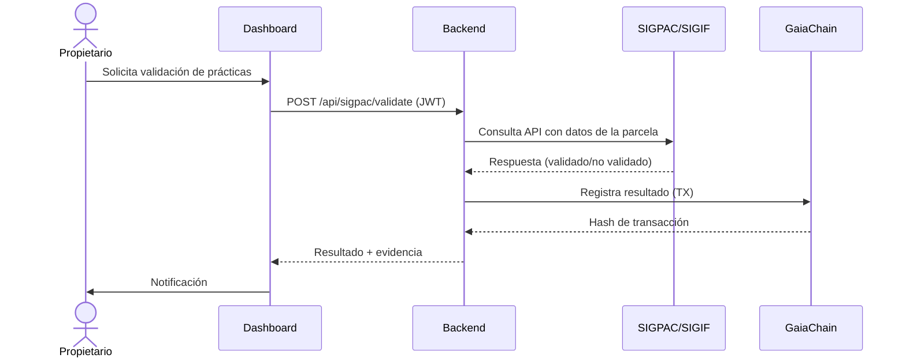

# **📊 PROCEDIMIENTO DE VALIDACIÓN CON Validación con SIGPAC-Extremadura**
**Sistema**: CASTÚO-SYSTEM™
**Región**: extremadura
**Fecha**: 2026-03-16T18:51:47.012457Z
**Versión**: 1.0
**Responsable**: María Gómez López

---
## **📌 1. CONTEXTO LEGAL**
Este procedimiento garantiza el cumplimiento con:

- **Orden de 12 de marzo de 2021**

- **Ley 3/2023 de Montes de Extremadura**


**Objetivo**: Validar que las prácticas forestales registradas en CASTÚO-SYSTEM™ cumplen con la normativa mediante integración con el sistema oficial de información geográfica.

---
## **📌 2. FLUJO DEL PROCEDIMIENTO**

### **2.1. Diagrama de Flujo**


### **2.2. Pasos Detallados**

**Paso 1: Solicitud de validación**
- **Descripción**: El propietario solicita validación de prácticas forestales en su parcela.
- **Implementación**: Endpoint POST /api/sigpac/validate
- **Evidencia**: backend/api/routes/sigpac.py (en desarrollo)


**Paso 2: Consulta a SIGPAC**
- **Descripción**: El sistema consulta el SIGPAC para validar prácticas.
- **Implementación**: Integración con API de SIGPAC (https://sigpac.mapa.gob.es/sigpac/api)
- **Evidencia**: backend/api/services/sigpac_service.py (stub)


**Paso 3: Registro del resultado**
- **Descripción**: El resultado se registra en GaiaChain y se notifica al propietario.
- **Implementación**: Evento en GaiaChain con sigpac_validation_result
- **Evidencia**: Transacción de ejemplo: 0xSIGPAC...


---
## **📌 3. DETALLES TÉCNICOS**
| **Aspecto**                  | **Detalle** |
|------------------------------|-------------|
| Endpoint API                  | https://sigpac.mapa.gob.es/sigpac/api/v1/validate |
| Método de Autenticación       | Certificado digital (FNMT) |
| Formato de Datos              | GeoJSON con propiedades de la parcela (código SIGPAC, uso, superficie) |
| Criterios de Validación       | Coherencia con PORN de Extremadura; Cumplimiento de densidades de arbolado (Orden 12/03/2021); Alineación con usos del suelo declarados en SIGPAC; Validación de prácticas de poda según Ley 3/2023 Art. 12 |

---
## **📌 4. CUMPLIMIENTO NORMATIVO**
| **Normativa** | **Artículos / Implementación** |
|---------------|--------------------------------|

| ley_3_2023 | Art. 12, Art. 15 |

| gdpr | Art. 6.1(e) |

| decreto_45_2020 | Art. 3 |


---
## **📌 5. EJEMPLO DE SOLICITUD Y RESPUESTA**
**Solicitud (Request)**:
```json
{
  "parcel_id": "EXT-12345",
  "practices": [{"type": "poda", "intensity": "media", "date": "2026-03-15"}],
  "documents": ["certificado_ecologico.pdf"],
  "validation_type": "subsidy_eligibility"
}
```

**Respuesta (Response)**:
```json
{
  "status": "validated",
  "parcel_id": "EXT-12345",
  "validation_result": {"compliance": true, "details": {}},
  "gaiachain_tx": "0xSIGPAC-12345-20260316",
  "compliance": {"ley_3_2023": ["Art. 15"], "gdpr": ["Art. 6.1(e)"]}
}
```

---
## **📌 6. REGISTRO Y AUDITORÍA**
- **GaiaChain**: Todas las validaciones se registran con parcel_id, validation_result, timestamp, compliance_metadata.
- **Wazuh**: Eventos con `event_type:sigpac_validation` (o sigif_validation) incluyen datos anonimizados, resultado y hash de transacción.

---
**Firma del Responsable Técnico**:
_________________________
Carlos Martínez
CTO, CASTÚO-SYSTEM™
2026-03-16