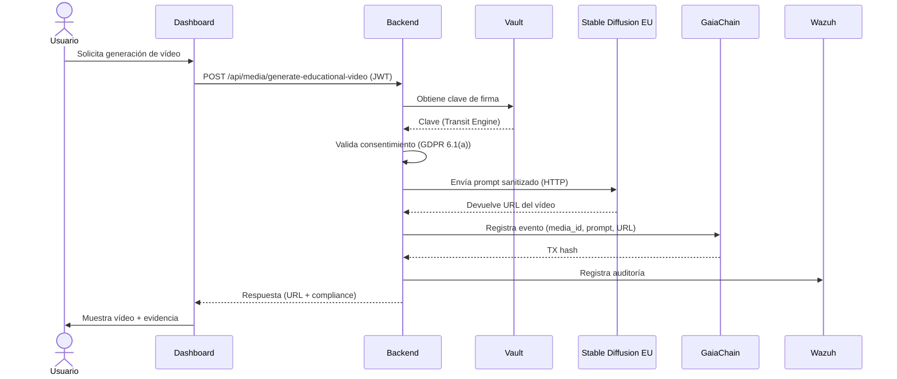

# **📋 INFORME DE CUMPLIMIENTO NORMATIVO**
**Sistema**: CASTÚO-SYSTEM™
**Versión**: 1.3
**Entorno**: production
**ID de Media**: sd-eu-20260315-12345-67890
**Fecha de Generación**: 2026-03-16T18:51:47.012457Z
**Responsable**: María Gómez López

---
## **📌 1. CONTEXTO**
Este informe documenta el cumplimiento normativo de la **generación de media educativa** con ID **sd-eu-20260315-12345-67890**, realizada el 2026-03-16T18:51:47.012457Z en el entorno **production** de CASTÚO-SYSTEM™.

**Detalles Técnicos**:
- **Modelo de IA**: Stable Diffusion EU (EUPL-1.2).
- **Hosting**: OVH Cloud (Francia).
- **Almacenamiento**: MinIO (OVH) con cifrado AES-256.
- **Registro**: GaiaChain (TX: [0xsd-eu-2026...2345-67890](https://explorer.gaiachain.es/tx/0xsd-eu-2026...2345-67890)).

---
## **📌 2. CUMPLIMIENTO POR NORMATIVA**

### **2.1. GDPR (Reglamento UE 2016/679)**
| **Artículo**       | **Implementación**                                                                 | **Evidencia**                                                                 |
|--------------------|-------------------------------------------------------------------------------------|-------------------------------------------------------------------------------|
| **Art. 6.1(a)**    | Consentimiento explícito del usuario antes de generar el vídeo.                     | frontend ConsentManager (campo media_generation).                             |
| **Art. 7**         | Consentimiento granular y revocable.                                                | Endpoint POST /api/consents/{token_id}.                                       |
| **Art. 30**        | Registro de la actividad en GaiaChain.                                              | TX: 0xsd-eu-2026...2345-67890.                                             |
| **Art. 32**        | Cifrado (AES-256) y auditoría (Wazuh).                                             | Logs: event_type:media_generation_* en Wazuh.                                 |

### **2.2. Ley 3/2023 de Montes (o equivalente regional)**
| **Artículo**       | **Implementación**                                                                 | **Evidencia**                                                                 |
|--------------------|-------------------------------------------------------------------------------------|-------------------------------------------------------------------------------|
| **Art. 8**         | Validación de consentimiento para media_generation.                                | backend/api/services/media_service.py                                        |
| **Art. 18**        | Contenido educativo sobre gestión forestal sostenible.                            | Prompt validado según normativa forestal.                                    |
| **Art. 22**        | Almacenamiento en MinIO (OVH) con retención de 5 años.                            | docker-compose.eu-oss.yml                                                    |

### **2.3. AI Act (Reglamento UE 2024/1689)**
| **Artículo**       | **Implementación**                                                                 | **Evidencia**                                                                 |
|--------------------|-------------------------------------------------------------------------------------|-------------------------------------------------------------------------------|
| **Art. 52**        | Transparencia: metadatos de compliance en la respuesta.                            | Campo compliance en la respuesta API.                                        |
| **Art. 53**        | Derecho a impugnar: procedimiento documentado.                                     | 02.03_AI_Act_EU/02.03.04_Gestion_Derechos_Impugnacion.md                     |
| **Anexo III**      | Evaluación de riesgos documentada.                                                 | 02.03.02_Evaluacion_Riesgos.xlsx                                             |

### **2.4. ISO 27001:2022**
| **Control**        | **Implementación**                                                                 | **Evidencia**                                                                 |
|--------------------|-------------------------------------------------------------------------------------|-------------------------------------------------------------------------------|
| **A.9.1.1**        | Control de acceso con Keycloak (RBAC).                                             | docker-compose.eu-oss.yml                                                     |
| **A.10.1.1**       | Gestión de claves con Vault.                                                        | backend/security/master_key.md                                                |
| **A.12.4.1**       | Registro de eventos en Wazuh/OpenSearch.                                            | generated/03_Evidencias_Tecnicas/                                             |
| **A.18.1.4**       | Protección de datos personales.                                                     | Cifrado AES-256 en MinIO.                                                      |

---
## **📌 3. DETALLES TÉCNICOS**
### **3.1. Flujo de Generación**

### **3.2. Medidas de Seguridad Aplicadas**
| **Capa**        | **Medida** |
|-----------------|------------|
| Autenticación   | OIDC (Keycloak) con MFA. |
| Autorización    | RBAC (solo owner puede generar media). |
| Cifrado         | AES-256 (MinIO) + TLS 1.2+ (Traefik). |
| Aislamiento     | Media Engines en red interna (media_network). |
| Auditoría       | Wazuh + OpenSearch + GaiaChain. |
| Compliance      | Metadatos en cada respuesta API. |

---
## **📌 4. EVIDENCIAS**
| **Tipo**        | **Detalle** |
|-----------------|-------------|
| GaiaChain       | TX: [0xsd-eu-2026...2345-67890](https://explorer.gaiachain.es/tx/0xsd-eu-2026...2345-67890). |
| Wazuh           | Consulta: event_type:media_generation_* AND media_id:sd-eu-20260315-12345-67890. |
| Almacenamiento | Bucket: castuo-media-eu, Key: videos/sd-eu-20260315-12345-67890.mp4. |
| Código Fuente   | backend/api/services/media_service.py (líneas 80-150). |

---
## **📌 5. RECOMENDACIONES**
- **Usuario**: Citar la fuente (CASTÚO-SYSTEM™) al compartir el vídeo; no modificar el contenido sin autorización.
- **Administrador**: Revisar logs de Wazuh semanalmente (event_type:media_generation_*); rotar claves en Vault cada 90 días.
- **DPO**: Verificar que los prompts cumplen con la normativa forestal (muestreo aleatorio); actualizar evaluación de riesgos AI Act en 2027.

---
**Firma del DPO**:
_________________________
María Gómez López
Delegada de Protección de Datos
CASTÚO-SYSTEM™
2026-03-16