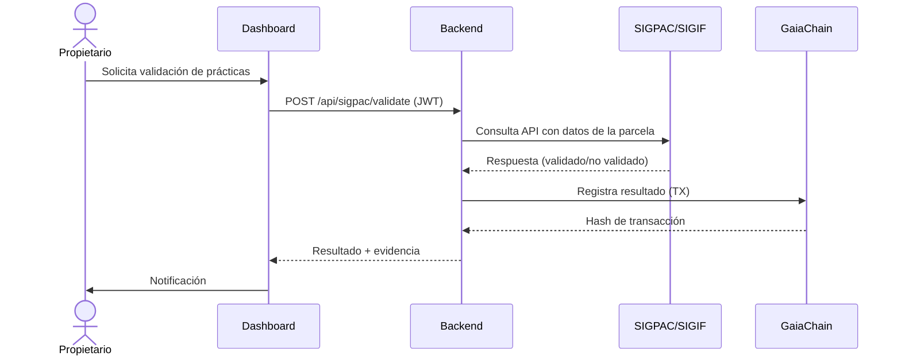

# **📊 PROCEDIMIENTO DE VALIDACIÓN CON {{ data.procedure.name }}**
**Sistema**: CASTÚO-SYSTEM™
**Región**: {{ region }}
**Fecha**: {{ data.generated_at }}
**Versión**: 1.0
**Responsable**: {{ system.dpo.name }}

---
## **📌 1. CONTEXTO LEGAL**
Este procedimiento garantiza el cumplimiento con:

- **{{ law }}**


**Objetivo**: Validar que las prácticas forestales registradas en CASTÚO-SYSTEM™ cumplen con la normativa mediante integración con el sistema oficial de información geográfica.

---
## **📌 2. FLUJO DEL PROCEDIMIENTO**

### **2.1. Diagrama de Flujo**


### **2.2. Pasos Detallados**

**Paso {{ loop.index }}: {{ step.name }}**
- **Descripción**: {{ step.description }}
- **Implementación**: {{ step.implementation }}
- **Evidencia**: {{ step.evidence }}



---
## **📌 3. DETALLES TÉCNICOS**
| **Aspecto**                  | **Detalle** |
|------------------------------|-------------|
| Endpoint API                  | {{ data.procedure.technical_details.api_endpoint }} |
| Método de Autenticación       | {{ data.procedure.technical_details.auth_method }} |
| Formato de Datos              | {{ data.procedure.technical_details.data_format }} |
| Criterios de Validación       | {{ c }};  |

---
## **📌 4. CUMPLIMIENTO NORMATIVO**
| **Normativa** | **Artículos / Implementación** |
|---------------|--------------------------------|

| {{ norm }} | {{ articles|join(", ") }} |


---
## **📌 5. EJEMPLO DE SOLICITUD Y RESPUESTA**
**Solicitud (Request)**:
```json
{
  "parcel_id": "EXT-12345",
  "practices": [{"type": "poda", "intensity": "media", "date": "2026-03-15"}],
  "documents": ["certificado_ecologico.pdf"],
  "validation_type": "subsidy_eligibility"
}
```

**Respuesta (Response)**:
```json
{
  "status": "validated",
  "parcel_id": "EXT-12345",
  "validation_result": {"compliance": true, "details": {}},
  "gaiachain_tx": "0xSIGPAC-12345-20260316",
  "compliance": {"ley_3_2023": ["Art. 15"], "gdpr": ["Art. 6.1(e)"]}
}
```

---
## **📌 6. REGISTRO Y AUDITORÍA**
- **GaiaChain**: Todas las validaciones se registran con parcel_id, validation_result, timestamp, compliance_metadata.
- **Wazuh**: Eventos con `event_type:sigpac_validation` (o sigif_validation) incluyen datos anonimizados, resultado y hash de transacción.

---
**Firma del Responsable Técnico**:
_________________________
Carlos Martínez
CTO, CASTÚO-SYSTEM™
{{ data.generated_at[:10] }}
