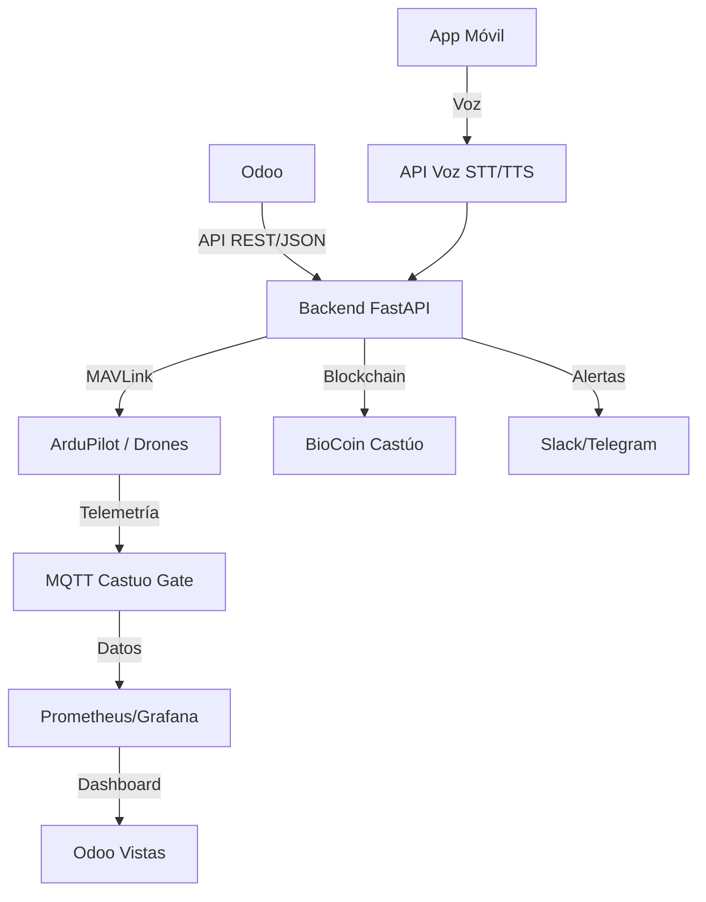

# CASTUO-SYSTEM™ — Arquitectura Drones + IoT + Voz

Integración completa: Odoo (CRM/ERP), FastAPI (MAVLink, MQTT, visión, riego, energía), chatbot IA y asistente de voz.

## Diagrama de flujo



## Estructura de archivos

- **Odoo** (`custom-addons/castu_system/`)
  - `models/`: drone, drone.mission, drone.alert, drone.camera, drone.sensor, teledeteccion, riego, energia, chatbot, energia.excedente
  - `controllers/drone_api.py`: endpoints `/castu/drones/<id>/telemetry` y `start_mission`
  - `views/`: drone_views, camera_views, sensor_views, teledeteccion_views, riego_views, energia_views, chatbot_views, energia_market_views
- **Backend** (`backend/`)
  - `routers/drones.py`: `POST /drones/{id}/start_mission`, `POST /drones/{id}/telemetry`
  - `routers/cameras.py`: `POST /cameras/stream/start`, `POST /cameras/detect/plagas`
  - `routers/sensors.py`: `POST /sensors/update` (actualización desde MQTT)
  - `routers/riego.py`: `POST /riego/{id}/activar`, `POST /riego/{id}/ajustar`
  - `routers/energia.py`: `POST /energia/{id}/optimizar`
  - `routers/chatbot.py`: `POST /chatbot/ask` (Mistral)
  - `routers/voice.py`: `POST /voice/chat` (STT + chatbot + TTS)
  - `routers/notifications.py`: `POST /notifications/slack`
- **Castu Drones** (`castu_drones/`)
  - `docker-compose.yml`: FastAPI + MQTT para despliegue local
  - `scripts/deploy.sh`: script de despliegue

## Flujos principales

1. **Telemetría**: Drone/SITL → FastAPI `POST /drones/{id}/telemetry` → (opcional) reenvío a Odoo `/castu/drones/{id}/telemetry` → actualización de `castu.drone` (posición, batería). Si batería &lt; 20% se crea alerta y se notifica por Slack/Telegram.
2. **Misión**: Usuario en Odoo pulsa "Iniciar Misión de Mapeo" → Odoo crea `castu.drone.mission` y llama a FastAPI `POST /drones/{id}/start_mission` → backend delega a `dronica.missions.run_mission`.
3. **Sensores IoT**: MQTT/LoRa → FastAPI `POST /sensors/update` → Odoo XML-RPC `castu.drone.sensor.update_from_mqtt` → umbrales y alertas.
4. **Riego**: Odoo "Activar Riego" → `castu.riego.action_activar_riego` → FastAPI `POST /riego/{id}/activar` (GPIO/PLC en producción).
5. **Chatbot**: Odoo o app móvil → FastAPI `POST /chatbot/ask` → Mistral → respuesta. Voz: app → `POST /voice/chat` (audio base64) → STT → chatbot → TTS → audio respuesta.

## Variables de entorno

- **Backend**: `ODOO_URL`, `ODOO_DB`, `ODOO_UID`, `ODOO_PASSWORD` (para sensores y callbacks), `MISTRAL_API_KEY`, `SLACK_WEBHOOK_URL`.
- **Odoo**: Parámetro de sistema `castu.fastapi.url` (ej: `http://api:8000`) para llamadas desde Odoo al backend.

## Pruebas rápidas

```bash
# Telemetría
curl -X POST http://localhost:8000/drones/1/telemetry \
  -H "Content-Type: application/json" \
  -d '{"lat":39.47,"lon":-0.38,"alt":10,"battery":95}'

# Chatbot
curl -X POST http://localhost:8000/chatbot/ask \
  -H "Content-Type: application/json" \
  -d '{"question":"¿Debo regar la granja 1?","contexto":"{}"}'

# Sensor (actualizar en Odoo si ODOO_* configurado)
curl -X POST http://localhost:8000/sensors/update \
  -H "Content-Type: application/json" \
  -d '{"sensor_id":"sensor_humedad_1","valor":25,"granja_id":1}'
```

## Documentación relacionada

- [ODOO-CRM-ERP-LEGAL.md](ODOO-CRM-ERP-LEGAL.md): despliegue Odoo + Nextcloud + EPCIS.
- Grafana: usar métricas `castu_drones_*` y `castu_sensor_*` ya expuestas por el backend.
