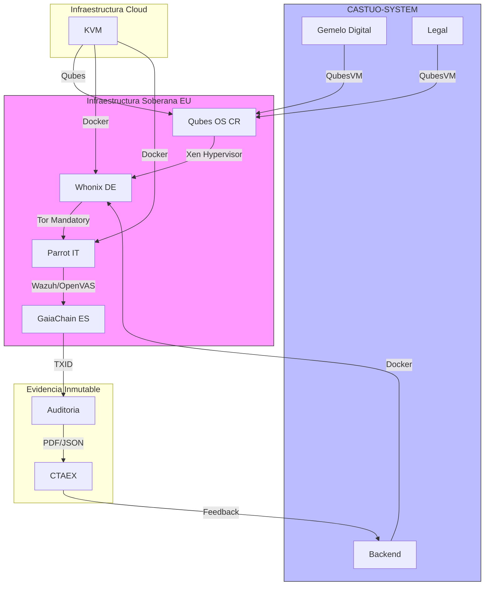

# Arquitectura Legal y Tecnica (EU Open-Source)

**Version:** 1.0  
**Fecha:** 20/03/2026  
**Autor:** Gregorio Jimenez Bodes / Sabionda IA  

> Documento de referencia para auditorias. Debe respaldarse con evidencias (GaiaChain TXID, hashes y reportes de Wazuh/OpenVAS) y con documentacion contractual aplicable (DPA/SLA).

---

## 1) Arquitectura verificable (diagrama)



---

## 2) Cumplimiento normativo (mapa de evidencia)

| Normativa | Componentes | Evidencia (repo) | Por validar |
|---|---|---|---|
| GDPR (UE 2016/679) | Whonix (anonimizacion) | Logs Tor + TXID GaiaChain (via `scripts/Register-SecurityEvent.ps1`) | Retenciones/controles exactos por despliegue |
| eIDAS 2.0 | GaiaChain (inmutabilidad) | Witness SHA256 + TXID | Fabricacion/uso de sello cualificado (si aplica) |
| ISO 27001:2022 | Parrot (Wazuh/OpenVAS) | Informes OpenVAS/Wazuh + TXID | Frecuencias y criterios de aprobacion |
| NIS2 (UE 2022/2555) | Qubes OS (aislamiento) | Evidencia de segmentacion AppVM | Politicas operativas finales por proveedor |
| AI Act (UE 2024) | Sabionda IA (Mistral) | Trazabilidad de evidencias generadas | Contratos, evaluaciones de riesgo y policy de IA |

---

## 3) Integracion con Qubes OS (CR) - compartimentacion legal

### 3.1 Configuracion de AppVMs (plantilla)

```yaml
# qubes-config/castuo-qubes-legal.yml (plantilla)
---
appvms:
  - name: castuo-backend
    template: fedora-38
    label: red
    netvm: sys-whonix
    services:
      - qubes-firewall
      - docker
    volumes:
      - /home/user/castuo-data:/data

  - name: castuo-legal
    template: debian-12
    label: yellow
    netvm: sys-whonix
    services:
      - qubes-firewall
      - libvirtd
```

### 3.2 Registro de evidencia legal (ejemplo con witness)

Para eventos legales (auditoria, pentest, anomalos), usa:
- `scripts/Register-SecurityEvent.ps1`

Recomendacion: incluye en `-EventData` hashes y metadatos minimizados (por ejemplo `report_hash`, `target`, `standards`, `timestamp`), para que el witness respalde la evidencia.

---

## 4) Integracion con Whonix (DE) - anti-forense y trazabilidad

### 4.1 Compose legal (plantilla)

```yaml
# docker/whonix-legal.yml (plantilla)
version: "3.8"

services:
  whonix-gateway:
    image: qubesos/whonix-gateway:latest
    environment:
      - LEGAL_COMPLIANCE=GDPR,eIDAS
    volumes:
      - ./legal-logs:/var/log/whonix

  castuo-backend:
    image: ghcr.io/castuo-system/backend:v3.0
    environment:
      - LEGAL_JURISDICTION=EU
      - DATA_PROTECTION=AES256
    volumes:
      - legal-data:/data

volumes:
  legal-data:
```

### 4.2 Script de auditoria legal (por validar)

El template incluye `scripts/audit-whonix-legal.sh` y un envio `curl` directo a GaiaChain. En el repo, el camino verificable preferente es:
- `scripts/Register-SecurityEvent.ps1`

Por validar: si necesitas un script especifico que extraiga el contenido exacto de logs y calcule hash de archivos generados en contenedor.

---

## 5) Integracion con Parrot Security (IT) - hardening y NIS2

### 5.1 Configuracion NIS2 (por validar)

El template incluye `parrot-hardening/nis2-compliance.xml`. No se ha verificado su existencia como artefacto en el repo.

Por validar: integracion real con Wazuh/OSSEC y definicion de evidencias (cuales alertas cuentan para NIS2).

### 5.2 Pentesting legal (por validar)

El template incluye `scripts/Run-LegalPentest.ps1`, que no se ha verificado en el repo.

Camino verificable recomendado:
- Ejecutar OpenVAS (ya existen scripts de referencia en tu arquitectura de seguridad reforzada).
- Para cada reporte, calcula `SHA256` del archivo (local) y guarda el hash como evidencia via:
  - `scripts/Register-SecurityEvent.ps1 -EventType "legal_pentest_report" -EventData @{ report_hash=...; target=...; standards=... }`

---

## 6) Integracion legal con GaiaChain (evidencia inmutable)

### 6.1 Contrato inteligente (por validar)

El template incluye `contracts/LegalCompliance.sol`. No se ha verificado su existencia en el repo.

Por validar: si sera on-chain (Solidity) o solo witness (SHA256 + TXID) en la capa GaiaChain.

### 6.2 Registro de cumplimiento (evidencia en el repo)

En el repo, el mecanismo verificable actualmente es el witness:
- `scripts/Register-SecurityEvent.ps1`
- Ruta: `POST {GAIA_CHAIN_API_URL}/api/v1/witness`

---

## 7) Matriz de cumplimiento legal (resumen)

| Componente | Normativa | Mecanismo de cumplimiento | Evidencia tipica |
|---|---|---|---|
| Qubes OS | NIS2 Art. 5-7 | Aislamiento Xen + segmentacion AppVM | TXID GaiaChain por eventos |
| Whonix Gateway | GDPR | Tor obligatorio y minimizacion | TXID GaiaChain por hashes |
| Parrot (Wazuh/OpenVAS) | ISO 27001 | Monitoreo + pentesting | Informes + TXID |
| GaiaChain witness | eIDAS | Hash SHA256 + inmutabilidad | TXID + hashes |
| Sabionda IA (Mistral) | AI Act | trazabilidad operativa | Evidencias exportadas + hashes |

---

## 8) Arquitectura de Sabionda IA (template - por validar)

El template incluye "Arquitectura de Sabionda IA (Version 4.0)" con protocolos de ingesta cientifica.

Por validar:
- existencia de los modulos/protocolos (`protocols/*`, workers Celery, GraphDB, etc.)
- mecanismo exacto de registro en GaiaChain para esos flujos.

Referencias utiles en el repo:
- `scripts/Generate-ECSEReport.ps1` (witness y export ECSE, si aplica)
- Documentos de ECSE/monitoreo para el circuito de evidencias

---

## 9) Enlaces bidireccionales

- `PRONTUARIO_MAESTRO_SEGURIDAD_REFORZADA.md` (marco de despliegue y evidencia)
- `ARQUITECTURA-SEGURIDAD-REFORZADA-QUBES-WHONIX-PARROT.md` (arquitectura operativa de seguridad)
- `scripts/Register-SecurityEvent.ps1` (witness verificable del repo)
- `ARQUITECTURA-LEGAL-Y-TECNICA-VERIFICADA.md` (solo verificado en el repo)

