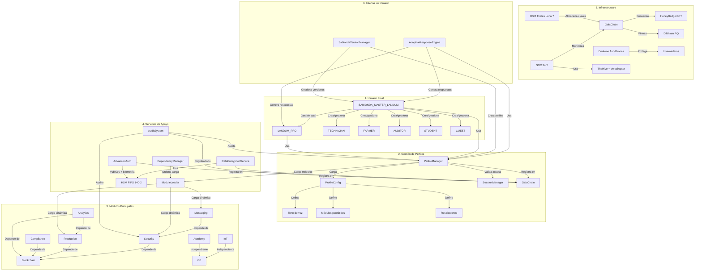

# Arquitectura SABIONDA + CASTUO-SYSTEM v5.0

Diagrama de integración de perfiles, módulos, seguridad y auditoría.

## Resumen ejecutivo

- **Seguridad**: Autenticación multicapa (YubiKey + biometría + HSM + GaiaChain). Cifrado con HSM y auditoría inmutable.
- **Perfiles**: SABIONDA_MASTER_LANDUM con acceso total. Versiones restringidas (LANDUM_PRO, TECHNICIAN, FARMER, etc.) con tonos y funcionalidades adaptadas. Motor de respuestas adaptativas.
- **Arquitectura modular**: Carga dinámica de módulos según permisos (ModuleLoader + DependencyManager). Solo se carga lo necesario.
- **Evolución SABIONDA**: Perfil master con gestión de versiones (SabiondaVersionManager). Creación de perfiles personalizados (ej. LANDUM_PRO_AGRO). Tono profesional o extremeño según contexto.
