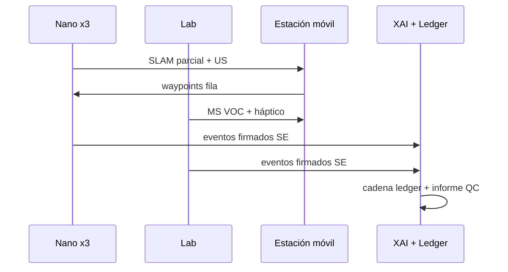

# Operación «Cripta del Silencio» — Simulación Patrimonio en Riesgo (Opción C)

**Tesis:** Si el sistema opera con la delicadeza exigida en una **cripta del s. XVI**, el mismo marco sirve para **cualquier entorno industrial crítico** (caballo de Troya técnico-jurídico).

---

## Contexto

| Condición | Implicación |
|-----------|-------------|
| Humedad **~95 %** | Electrónica encapsulada, calibración LiDAR húmedo |
| Pasadizos **~40 cm** | Nano en formación fila; sin GPS |
| Frescos / polvo centenario | Flujo aire mínimo; hélices protegidas |

---

## Fase 1 — Infiltración y mapeo (CASTUO Nano)

- **Despliegue:** **3× Nano** en **formación fila** (líder + dos relevos SLAM).
- **SLAM LiDAR estado sólido:** nube **milimétrica**; sin partes móviles expuestas que perturben capa límite → menos resuspensión de partículas sobre pintura mural.
- **Ultrasonidos:** telarañas, velos finos o desprendimientos de **baja reflectividad** que el LiDAR podría perder.
- **XAI (ejemplo):** *«Se redujo potencia succión motor 3 para evitar resonancia en arco de medio punto (f_n ≈ 14 Hz).»*

---

## Fase 2 — Diagnóstico no invasivo (CASTUO Lab)

- **Posición:** Lab (rover o plataforma apoyo) en **boca de cripta** (~2 km puede ser estación móvil en superficie).
- **Espectrometría de masas:** **VOC** en aire → huella compatible con actividad fúngica (p. ej. *Serpula lacrymans*) **sin contacto** con sustrato litológico.
- **Brazo háptico + VR:** experto remoto percibe **resistencia de grieta**; réplica en brazo aéreo **±0,5 mm**; inserción **micro-sonda fibra óptica** para perfil opto-geométrico de fisura.

---

## Fase 3 — Certificación (CASTO-QC + XAI + Ledger)

- **Informe CASTO-QC** automático: misión, límites, hallazgos, líneas de base grietas (imagen + geometría).
- **EvidenceHash** de imagen/geométrica de grieta **firmado** y anclado en **CASTUO Ledger** → prueba del estado en **t₀**; evolución a **t₀+2 años** contrastable sin repudio.
- **API logs XAI firmados:** ver [schemas/castuo_xai_ledger_log.v1.schema.json](schemas/castuo_xai_ledger_log.v1.schema.json) y `backend/patrimonio/xai_ledger.py`.

---

## Flujo de datos (resumen)

---

## Referencias

- [CASTUO-NANO-LAB-ARQUITECTURA.md](CASTUO-NANO-LAB-ARQUITECTURA.md)
- [CASTUO-LASER-v2.1-ARQUITECTURA.md](CASTUO-LASER-v2.1-ARQUITECTURA.md) (CASTO-QC)
- [protocolos/PROTOCOLO-CONSENSO-CASTUO.md](protocolos/PROTOCOLO-CONSENSO-CASTUO.md)
