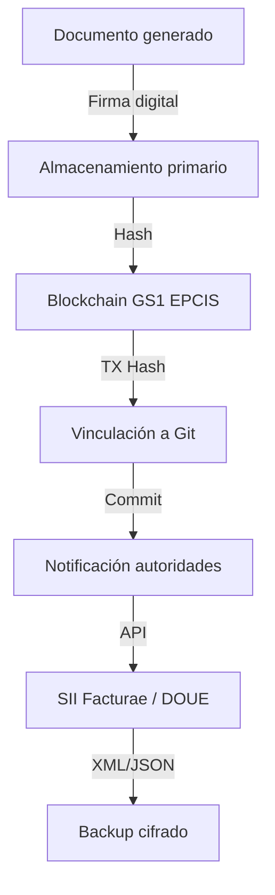

# CASTUO-SYSTEM™ | Cumplimiento legal y gestión documental

Referencia por ámbito (España BOE, Europa DOUE, global), arquitectura técnica y checklist de implementación.

---

## 1. Documentos obligatorios por ámbito

### España (BOE)

| Tipo de documento | Normativa | Requisitos para CASTUO | Implementación |
|-------------------|------------|--------------------------|----------------|
| Licencia de actividad agrovoltaica | RD 244/2019 (Autoconsumo) | Potencia, ubicación, titular, fecha | PDF firmado digitalmente, IPFS + TX BioCoin |
| Registro REA (Autoconsumo) | RD 244/2019 | Nº registro, titular, potencia | Blockchain GS1 EPCIS con hash |
| Certificado instalación eléctrica | REBT | Firma instalador, organismo de control | Cifrado Age + vinculación a commit Git |
| Contrato compraventa energía | Ley 24/2013 | Precio, condiciones, firmas | Smart contract BioCoin + copia Confluence |
| Informe impacto ambiental | Ley 21/2013 | Huella carbono, suelo, agua | Markdown en repo + métricas IoT |
| Libro de incidencias | RD 54/2022 | Fallos, mantenimientos | PostgreSQL + backup S3 cifrado |
| Facturas y liquidaciones | Ley 37/1992 (IVA) | Nº factura, NIF, fecha, concepto | SII Facturae (XML firmado) |

### Europa (DOUE)

| Tipo de documento | Normativa | Requisitos para CASTUO | Implementación |
|-------------------|------------|--------------------------|----------------|
| Declaración conformidad CE | Reglamento (UE) 2016/426 | Marcado CE, manual, evaluación riesgos | PDF firma digital (DSS), Arweave |
| Registro EUDamed | Reglamento (UE) 2017/745 | Solo si drones aplican fitosanitarios | Vinculado NFT si aplica |
| Informe sostenibilidad | Reglamento (UE) 2020/852 (Baterías) | Composición, reciclaje, huella | Dashboard Grafana + sensores |
| Contrato suministro energía | Directiva (UE) 2019/944 | Precio dinámico, renovables | Smart contract BioCoin |
| Declaración protección datos | GDPR (UE) 2016/679 | Registro actividades tratamiento (RAT) | Notion + política privacidad web |
| Certificado cannabis medicinal | Reglamento (UE) 2015/2283 | Solo si cultivo; trazabilidad semilla–producto | Hyperledger + QR con hash |

### Global (por país)

| País/Continente | Documento | Normativa local | Implementación CASTUO |
|-----------------|-----------|-----------------|------------------------|
| EE.UU. | Permiso FDA (si exportas) | 21 CFR Part 11 | DocuSign + AWS GovCloud |
| Marruecos | Autorización cultivo cannabis | Ley 13-21 | Cifrado PGP + TX BioCoin |
| Colombia | Licencia cultivo cannabis | Decreto 613/2017 | IPFS + hash en Ethereum |
| Canadá | Licencia Health Canada | Cannabis Act 2018 | Blockchain provincial |

---

## 2. Arquitectura técnica (flujo documental)

### Tecnologías recomendadas

| Componente | Tecnología | Uso en CASTUO |
|------------|------------|----------------|
| Firma digital | DSS (Digital Signature Service) | Contratos energía, licencias |
| Almacenamiento primario | Notion + Confluence | Documentos colaborativos, manuales drones |
| Blockchain | GS1 EPCIS + Hyperledger | Trazabilidad certificados, cannabis |
| Vinculación Git | Git LFS + Hooks | Cada documento → commit con TX hash |
| Notificación autoridades | API SII Facturae (España) | Envío facturas a Hacienda |
| Backup cifrado | Age + S3 | Copias de seguridad legales |
| Visualización | Grafana + Metabase | Dashboards de compliance |

---

## 3. Checklist de cumplimiento

| Ámbito | Requisito | Implementación en CASTUO |
|--------|-----------|--------------------------|
| España (BOE) | Licencias autoconsumo RD 244/2019 | Documentos Notion + blockchain (GS1 EPCIS) |
| Europa (DOUE) | Trazabilidad Reglamento (UE) 2019/1020 | GS1 EPCIS + TX BioCoin |
| GDPR | Derecho al olvido y protección datos | Cifrado Age + almacenamiento controlado |
| AI Act (UE 2024/1689) | Transparencia sistemas IA | Documentación modelos en Markdown + blockchain |
| Cannabis medicinal | Trazabilidad semilla–producto (RD 903/2025 España) | Hyperledger + QR en envases |
| Drones | Registro AESA (España) / EASA (Europa) | Confluence + licencia vinculada a TX BioCoin |
| Facturación | Formato Facturae 3.2.1 (España) | Integración SII Facturae + backup S3 |
| Seguridad | ISO 27001 y protección datos | Firewalls OVH, cifrado Age, auditorías trimestrales |

---

## 4. Herramientas recomendadas

| Herramienta | Uso en CASTUO | Cumplimiento |
|-------------|----------------|--------------|
| DSS | Firma digital documentos legales | eIDAS (UE), Ley 59/2003 (España) |
| IPFS + Filecoin | Almacenamiento descentralizado | GDPR (cifrado) |
| GS1 EPCIS | Trazabilidad en blockchain | Reglamento (UE) 2019/1020 |
| Notion + Confluence | Gestión colaborativa | ISO 9001 |
| Age + S3 | Backup cifrado | ISO 27001 |
| SII Facturae | Facturas a Hacienda (España) | Ley 37/1992 (IVA) |
| Hyperledger Fabric | Blockchain documentos legales | GDPR, AI Act |
| DocuSign | Firma electrónica (EE.UU./global) | ESIGN Act, eIDAS |

---

Para pasos concretos en **España (BOE + SII Facturae)** ver **[LEGAL-SPAIN.md](LEGAL-SPAIN.md)**.  
Para **Europa (GS1 EPCIS + AI Act)** ver **[LEGAL-EUROPE.md](LEGAL-EUROPE.md)**.
