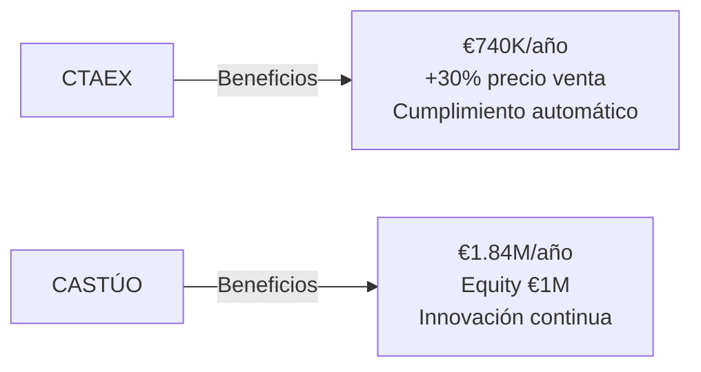
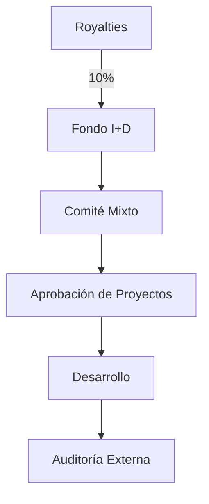
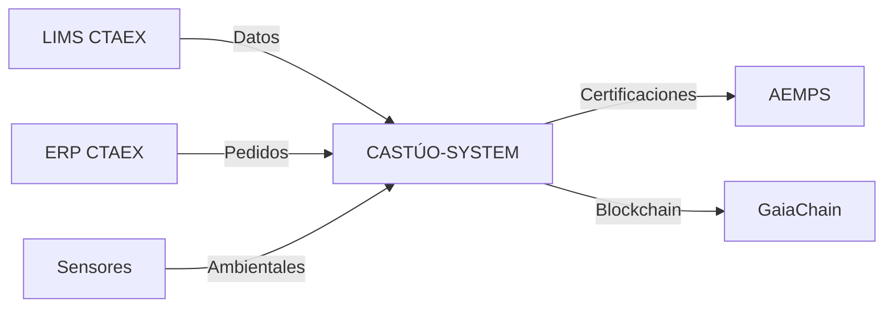

# Presentación ejecutiva para la reunión de firma
## Acuerdo de Colaboración Estratégica CTAEX–CASTÚO-SYSTEM: Innovación y Crecimiento Mutuo

**Formato sugerido:** PowerPoint o PDF, 15–20 diapositivas.  
**Uso:** Reunión de firma y alineación entre CTAEX y CASTÚO-SYSTEM.

---

## Estructura detallada

### Portada

- **Título:** Acuerdo de Colaboración Estratégica CTAEX–CASTÚO-SYSTEM.
- **Fecha y lugar:** [Ej.: 15 de diciembre de 2026, Sede CTAEX, Badajoz].
- **Logos:** CTAEX + CASTÚO-SYSTEM.

---

### 1. Introducción (1 diapositiva)

**Objetivo del acuerdo:**

- *"Transformar la agricultura 4.0 con trazabilidad blockchain, IA ética y cumplimiento normativo automático."*

**Beneficios clave:**

- **Para CTAEX:** €740K/año de beneficio neto con 50 ha (ROI 730%).
- **Para CASTÚO:** Ingresos escalables (€50K–€1,84M/año) + equity valioso (€1M en 5 años).

---

### 2. Resumen ejecutivo (2 diapositivas)

#### 2.1. Modelo de colaboración

| Componente | Detalle |
|------------|---------|
| **Licencia anual** | €50K–€100K/año (soporte 24/7 y actualizaciones). |
| **Royalty** | 0,5 %–1 % de beneficios (escalonado). |
| **Equity** | 2 % de CTAEX (valoración inicial: €100K; potencial: €1M en 5 años). |
| **Fondo de I+D** | 10 % de royalties (máx. €50K/año) para innovación. |
| **Exclusividad** | UE/Latinoamérica (protección frente a competidores). |

#### 2.2. Beneficios para ambas partes

**Diagrama comparativo:**

**Tabla comparativa:**

| Aspecto | Beneficio para CTAEX | Beneficio para CASTÚO |
|---------|----------------------|------------------------|
| **Licencia anual** | Coste fijo conocido (€50K–€100K/año). | Ingresos recurrentes desde el primer año. |
| **Royalty escalonado** | Royalty bajo en fases iniciales (0,5 %). | Ingresos crecen con el éxito de CTAEX. |
| **Equity (2 %)** | Sin coste inicial; alineación a largo plazo. | Potencial de €1M en 5 años. |
| **Fondo de I+D** | Acceso a innovación sin coste adicional. | Desarrollo de nuevos módulos (patentes). |
| **Exclusividad** | Ventaja competitiva en UE/Latinoamérica. | Protección de mercado frente a competidores. |

---

### 3. Detalles del acuerdo (5 diapositivas)

#### 3.1. Licencias y royalties

| Año | Licencia (€) | Royalty (%) | Mínimo garantizado (€) |
|-----|---------------|-------------|--------------------------|
| 1–2 | 50.000 | 0,5 % | 25.000 |
| 3–4 | 100.000 | 0,75 % | 50.000 |
| 5+ | 100.000 | 1,0 % | 75.000 |

- Incluir **gráfico de ingresos proyectados** a 5 años.

#### 3.2. Equity (2 %)

- Valoración inicial: €5M → €100.000.
- Proyección en 5 años: €50M → €1.000.000.
- Opción de compra: CTAEX puede comprar el 2 % en el Año 5 por €500.000.

#### 3.3. Fondo de I+D

**Destino exclusivo:**

- Nuevos módulos de IA (ej.: predicción de plagas).
- Integraciones con APIs externas (AEMPS, GlobalGAP).
- Subvenciones públicas (CDTI, Horizonte Europa).

**Gobernanza:**

- Comité Mixto (1 CTAEX + 1 CASTÚO).
- Reuniones trimestrales + auditoría externa anual.

#### 3.4. Exclusividad territorial

- **Mapa:** UE + Latinoamérica (área de exclusividad).
- **Protección:** CTAEX no podrá usar sistemas competidores (IBM, Salesforce) en esta región para los fines cubiertos por el Acuerdo.

#### 3.5. Propiedad intelectual

- CASTÚO retiene la PI del sistema base.
- Mejoras con Fondo I+D: **50/50** entre ambas partes.

---

### 4. Anexos clave (3 diapositivas)

#### 4.1. Anexo I: Fondo de I+D

#### 4.2. Anexo II: Integración técnica

#### 4.3. Anexo V: Seguridad y cumplimiento

| Normativa | Aplicación |
|-----------|------------|
| **GDPR** | Protección de datos personales. |
| **ISO 27001** | Seguridad de la información. |
| **RD 903/2025** | Regulación de cannabis medicinal en España. |
| **Ley 38/2003** | Subvenciones (Fondo de I+D). |
| **AI Act UE 2024/1689** | Ética en IA (transparencia, equidad). |

---

### 5. Próximos pasos y cierre (2 diapositivas)

#### 5.1. Checklist de lanzamiento

| Área | Tarea | Plazo |
|------|-------|-------|
| **Documentación** | Firma de documentos + notarización. | 1 semana |
| **Implementación técnica** | Pruebas de integración LIMS/ERP + contingencia. | 2 semanas |
| **Operaciones** | Primera reunión del Comité Mixto + auditoría de seguridad. | 1 semana |

#### 5.2. Frase de cierre

*"Este acuerdo win-win permite a CTAEX obtener €740K/año de beneficio neto con 50 ha (ROI del 730 %) y exclusividad competitiva en UE/Latinoamérica, mientras CASTÚO-SYSTEM recibe ingresos escalables (€50K–€1,84M/año) y participación en el crecimiento de CTAEX (2 % equity, valorado en €1M en 5 años). El modelo combina:*

- *Licencia base baja para cubrir costes de mantenimiento.*
- *Royalty escalonado que crece con el éxito de CTAEX.*
- *Equity estratégico para alinear intereses a largo plazo.*
- *Fondo de I+D para innovación continua sin coste adicional.*
- *Exclusividad territorial que protege a ambas partes de la competencia."*

**Contacto:** gregorio@castuo.system

---

## Documentos de apoyo

- [Resumen del Acuerdo](CTAEX-CASTUO-AGREEMENT-SUMMARY.md)
- [Guía de implementación](CTAEX-CASTUO-IMPLEMENTATION-GUIDE.md)
- Anexos I–VII en [docs/legal/](legal/)
