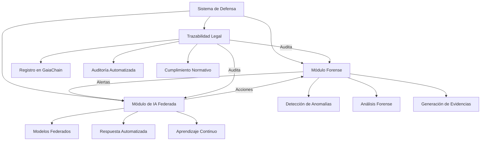

# Arquitectura del sistema de defensa

## Diagrama Mermaid

## Componentes

| Componente            | Archivo / Recurso                          | Función principal                    |
|-----------------------|--------------------------------------------|--------------------------------------|
| Módulo forense        | `backend/security/forensic_analyzer.py`    | Detección anomalías red/comportamiento, evidencias |
| Trazabilidad forense | `backend/compliance/immutable_traceability.py` (`register_forensic_event`) | Registro inmutable de evidencias     |
| Defensa federada      | `backend/ai/federated_defense.py`          | Respuesta automatizada, notificación a nodos |
| Coordinador FL        | `backend/ai/secure_federated_learning.py`  | Hook defensa post-agregación, `enable_defense_system` |
| Auditoría forense     | `backend/compliance/forensic_audit.py`    | Informes por período, export cifrado |
| GaiaChain             | `backend/compliance/gaiachain_integration.py` | Registro/verificación evidencias, informes legales |
| Orquestación          | `backend/agents/master_agent.py`          | ForensicAnalyzer, FederatedDefenseSystem, monitor, _handle_security_incident |

## Despliegue

- ConfigMap: `kubernetes/defense-configmap.yaml`
- Deployment + Service: `kubernetes/defense-deployment.yaml`, `kubernetes/defense-service.yaml`
- CronJob auditoría: `kubernetes/forensic-audit-cronjob.yaml`
- Script: `scripts/deploy_defense_system.sh`

Operaciones: [DEFENSE_RUNBOOK.md](DEFENSE_RUNBOOK.md).
