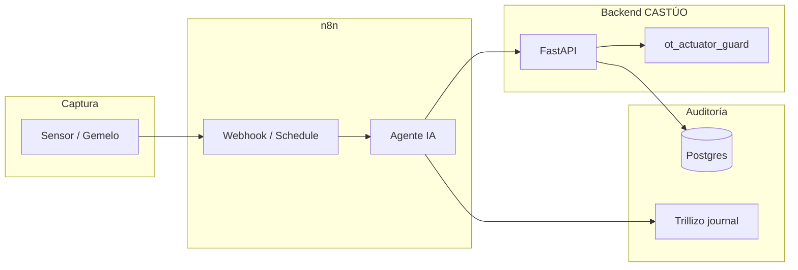

# Integración maestra: n8n + stack open source + simulación de gemelo digital

**Uso:** pieza central para **README ejecutivo**, **due diligence técnica** o **technical whitepaper** orientado a inversores. Une la narrativa de **orquestación agéntica (n8n)**, **soberanía de datos (OSS on-prem)** y **validación de madurez (TRL / V&V)** con rutas reales en este repositorio.

**Límite honesto:** lo que aquí se marca como *implementado en repo* está enlazado a archivos concretos. Lo descrito como *objetivo de arquitectura* o *laboratorio* requiere presupuesto, piloto medido y procedimiento operativo; no sustituye un SLA contractual. Ver [docs/ops/failover-strategy.md](ops/failover-strategy.md).

---

## 1. Arquitectura de integración — CASTÚO-SYSTEM (full-stack industrial)

La integración unifica **decisión agéntica** (n8n), **persistencia auditable**, **interfaces de mando**, **observabilidad** y **journal legal/humano** (Markdown), con posibilidad de **series temporales** según la imagen Postgres elegida.

| Capa | Tecnología (referencia OSS) | Rol estratégico | En este repositorio |
|------|-----------------------------|-----------------|---------------------|
| **Orquestación (cerebro)** | n8n (multi-instancia) | Flujos por núcleo/sector, webhooks, integración LLM; firma HMAC de auditoría hacia Trillizo | `docker-compose.multi-n8n.yml`, `n8n/workflows/` (p. ej. `01-trillizo-auditoria-basica.json`, `02-agente-diagnostico-ultra.json`, `03-castuo-opex-auditoria-trillizo.json`) |
| **Persistencia (telemetría / SQL)** | PostgreSQL; **TimescaleDB** como extensión recomendable para hipertablas | Series temporales y datos operativos | Postgres en `docker-compose.cerebros.yml`, `init/01-schema.sql` (nota: Timescale requiere imagen `timescale/timescaledb` o equivalente — no forzada en el init por defecto) |
| **Persistencia (journal auditoría)** | SilverBullet + volumen en disco | Decisiones `#ia-decision`, trazabilidad legible décadas | `./cerebros/auditoria` montado en **n8n-trillizo**; [n8n/README-CEREBROS.md](../n8n/README-CEREBROS.md) |
| **Control web (manual override)** | Appsmith / ToolJet / Budibase (ejemplos OSS) | Consola de mando y formularios; **no** saltar barreras OT | Patrón documentado en [docs/ops/frontend-and-observability-stack.md](ops/frontend-and-observability-stack.md) |
| **Observabilidad (ROI / salud)** | Grafana (+ Prometheus u otra TSDB) | Dashboards y alertas sobre datos **reales** | Referencia `docker/prometheus.yml`; Grafana como capa desplegable — [docs/ops/frontend-and-observability-stack.md](ops/frontend-and-observability-stack.md) |
| **Demo holográfica (UX física)** | Render/TTS vía HTTP propio; n8n como orquestador | Tangibiliza métricas sin sustituir auditoría ni SLA | [docs/architecture/HOLOGRAPHIC-CASTUO-ARCHITECTURE.md](architecture/HOLOGRAPHIC-CASTUO-ARCHITECTURE.md), `n8n/workflows/castuo-holobrain-webhook-stub.json`, `scripts/holo/cursor_holobrain_example.py` |
| **Web Sabionda (HTML / inversores)** | n8n GET + Respond Text, o `frontend/` + JSON del orquestador | Separar API JSON de capa visual; CORS e iframe n8n ≥ 1.103 | [docs/architecture/SABIONDA-N8N-WEB-FRONTEND.md](architecture/SABIONDA-N8N-WEB-FRONTEND.md), `n8n/workflows/castuo-sabionda-dashboard-html-stub.json`, `scripts/sabionda/sabionda_core.py` |
| **API núcleo** | FastAPI (CASTÚO backend) | Reglas de negocio, guardas OT, notificaciones | `backend/`, `backend/security/ot_actuator_guard.py`, [docs/deploy/OT-SEGURIDAD-ACTUADORES-CASTUO.md](deploy/OT-SEGURIDAD-ACTUADORES-CASTUO.md) |

**Firma criptográfica de auditoría (no sustituye autenticación de campo por sí sola):** cuerpo JSON canónico + `X-Castuo-Signature` — [scripts/n8n/sign_audit_webhook_body.py](../scripts/n8n/sign_audit_webhook_body.py), alineado con nodos Code en workflows `01`/`02`/`03`.

---

## 2. Validación de madurez: gemelo digital y protocolo V&V

Para argumentar **TRL 6** (o superior) ante un auditor, el sistema debe demostrarse en **entorno representativo**, no solo en diagramas.

| Fase V&V | Qué significa | Anclaje en repo / laboratorio |
|----------|----------------|-------------------------------|
| **Modelado de planta** | Un simulador (p. ej. Python) inyecta series que respetan retardos e inercias (pH, ET₀, etc.) vía webhooks n8n | *Diseño:* servicios bajo `backend/integrations/robotics/` (laboratorio / stubs) y flujos n8n que acepten `POST` de telemetría simulada; la física detallada **no** está congelada en un único ejecutable “gemelo único” en la raíz del monorepo |
| **Inyección de estrés** | Validar ráfagas de muchos núcleos concurrentes **en lo que mide el test** | `scripts/tests/stress_test_313_cores.py` (firma HMAC CPU, N “cores” lógicos); HTTP gateway n8n: `scripts/tests/stress_gateway_injection.py` (cuerpo `request_type` + `data` hacia `/webhook/castuo-orchestrate`); Trillizo HTTP: `scripts/tests/castuo_trillizo_audit_http_stress.py` — leer avisos en cabecera: **no** miden 313 instancias n8n reales ni un SLA de 25k RPS sin medición en tu piloto |
| **Chaos / red** | Caída breve de red; actuadores en **estado seguro** definido en campo | *Objetivo de ingeniería:* enlazar PLC/edge y política “fail-safe”; marco honesto en [docs/ops/failover-strategy.md](ops/failover-strategy.md) y [docs/security/BLACKOUT-RECOVERY-SOP.md](security/BLACKOUT-RECOVERY-SOP.md). Laboratorio de sondas HTTP + RTO observado: [docs/ops/CHAOS-ENGINEERING-LAB.md](ops/CHAOS-ENGINEERING-LAB.md). Un “20 s de caída” como criterio es **ejemplo de ensayo**, no constante fijada en código aquí |

**Mensaje para whitepaper:** el repositorio aporta **contratos** (webhooks, HMAC, journal, guardas OT) y **herramientas de laboratorio**; el **informe TRL firmado** sale del piloto con métricas y responsable designado.

---

## 3. Flujo de datos integrado (end-to-end)

Secuencia lógica alineada con buenas prácticas IT/OT:

1. **Captura** — Sensor real o **gemelo** emite evento (p. ej. “bajo nivel de nutrientes”) hacia webhook n8n o API FastAPI.
2. **Procesamiento** — El flujo n8n valida autenticación/HMAC según política, enriquece contexto y, si aplica, consulta al **agente LLM** (Mistral/OpenAI según credenciales).
3. **Decisión segura** — Cualquier **comando a actuador** debe pasar por reglas **deterministas**: `backend/security/ot_actuator_guard.py`, configuración en `backend/config/actuators_config.py`, y routers remotos acordes a [docs/deploy/OT-SEGURIDAD-ACTUADORES-CASTUO.md](deploy/OT-SEGURIDAD-ACTUADORES-CASTUO.md). Un workflow nominal tipo `02-actuator-safety` en n8n puede documentarse como **capa de orquestación** que llama a la API ya blindada; el **backlog** de narrativa comercial vs código está reconocido en [docs/pitch/technical-deck-castuo.md](pitch/technical-deck-castuo.md).
4. **Registro** — **Trillizo** (`POST /webhook/audit-trigger`) añade bloque al diario Markdown con `kind: ia`, tags y opcionalmente HMAC; **OpEx** puede usar `03-castuo-opex-auditoria-trillizo.json` — [docs/ops/opex-trillizo-integration.md](ops/opex-trillizo-integration.md). Postgres puede almacenar telemetría y, si se cablea, `trillizo_audit_log` — `n8n/sql/schema_auditoria_trillizo.sql`.

---

## 4. Resiliencia: Error Trigger y “lógica de supervivencia” local

Si el proveedor LLM **falla** (cuota, timeout, error 5xx), el sistema no debe quedar sin criterio operativo básico:

| Mecanismo | Función |
|-----------|---------|
| **n8n — Error Trigger** | Workflow global o por-subflujo que captura fallos del nodo LLM y ramifica a **código puro** (Code node), **umbrales fijos** o **POST** a FastAPI con modo conservador |
| **Inferencia local / reglas** | Ejemplo de patrón en `02-agente-diagnostico-ultra.json` (telemetría → decisión local → auditoría); ampliar con tablas de decisión documentadas |
| **Backend** | Políticas que **rechazan** actuación si faltan datos críticos (ver kernel / guardas OT) |

**Implementación:** no hay un único archivo “SURVIVAL.py” obligatorio; la integración maestra exige **diseñar** la rama Error Trigger en los workflows de producción y probarla en staging.

---

## 5. Tabla de enlaces rápidos (due diligence)

| Tema | Documento / artefacto |
|------|------------------------|
| Cerebros + Trillizo + HMAC | [n8n/README-CEREBROS.md](../n8n/README-CEREBROS.md) |
| Failover y claims comerciales | [docs/ops/failover-strategy.md](ops/failover-strategy.md) |
| Appsmith + Grafana (patrón) | [docs/ops/frontend-and-observability-stack.md](ops/frontend-and-observability-stack.md) |
| Seguridad actuadores OT | [docs/deploy/OT-SEGURIDAD-ACTUADORES-CASTUO.md](deploy/OT-SEGURIDAD-ACTUADORES-CASTUO.md) |
| OpEx → auditoría + blueprint masivo | [docs/ops/opex-trillizo-integration.md](ops/opex-trillizo-integration.md) (incl. sección *Blueprint export masivo*) |
| Estrés firma / HTTP / gateway | `scripts/tests/stress_test_313_cores.py`, `scripts/tests/stress_gateway_injection.py`, `scripts/tests/castuo_trillizo_audit_http_stress.py` |
| Informe técnico agregado (bash) | `scripts/generate_technical_report.sh` → `agri_brain_series_a_report.md` |
| Monitor CPU/RAM contenedores (ejemplo) | `scripts/tests/docker_stats_watch.example.sh` (ajustar nombres con `docker ps`) |
| Arquitectura histórica (Timescale mencionado) | [docs/ARCHITECTURE.md](ARCHITECTURE.md) |

---

## 6. Cierre para inversores (una frase)

CASTÚO articula **orquestación (n8n)**, **trazabilidad humana y legal (SilverBullet)**, **datos estructurados (Postgres)** y **límites físicos (guardas OT en FastAPI)**; el **gemelo digital** y los **ensayos TRL** se demuestran en **piloto medido**, apoyándose en los contratos y scripts de laboratorio versionados en este repositorio.
