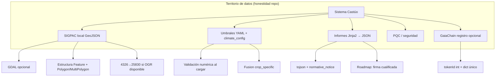

# 📜 Prontuario maestro — excelencia del análisis de sistema (Castúo-System) — v2.5

**Identidad de uso:** guía para Cursor y equipo técnico: priorizar trabajo, evitar alucinaciones de integración y mantener honestidad con el territorio (sin APIs MAPA/AEMPS inventadas en código).

---

## 1. Contexto y objetivos

**Objetivo:** sistema **coherente, eficaz, seguro y auditable**, con inventario **84/84** evidencias (`scripts/audit/audit_repo_evidence_check.py`) y referencias normativas como **documentación**, no como certificación automática. **Protocolo legal del repo:** v2.4 — [PROTOCOLO-AUDITORIA-INTERNA-LEGAL-COHERENCIA.md](legal/PROTOCOLO-AUDITORIA-INTERNA-LEGAL-COHERENCIA.md).

**Relación**

- [PRONTUARIO-MAESTRO-AUDITORIA-INTERNA.md](legal/PRONTUARIO-MAESTRO-AUDITORIA-INTERNA.md) (v2.5)
- [ROADMAP-INTEGRACIONES-SIGPAC-GAIACHAIN-AEMET.md](legal/ROADMAP-INTEGRACIONES-SIGPAC-GAIACHAIN-AEMET.md) (v2.5)
- [PRONTUARIO-MAESTRO-DEBILIDADES-POTENCIAL-SOBERANIA-EU.md](legal/PRONTUARIO-MAESTRO-DEBILIDADES-POTENCIAL-SOBERANIA-EU.md)

### 1.1. Inventario de evidencias (resumen)

| Área | Evidencia | Verificada |
|------|-----------|------------|
| SIGPAC | Local + GDAL opcional | ✅ Sí |
| Clima | Umbrales YAML | ✅ Sí |
| Informes | Jinja2 → JSON | ✅ Sí |
| Auditoría | 84/84 evidencias (script) | ✅ Sí |
| Soberanía EU | Prontuario debilidades / potencial | ✅ Sí |

**Notas para Cursor**

1. **Leer primero** el [prontuario de auditoría interna v2.5](legal/PRONTUARIO-MAESTRO-AUDITORIA-INTERNA.md), el [plan de excelencia reforzado v2.5](legal/PLAN-EXCELENCIA-V2.5-REFUERZO.md) y el protocolo v2.4 antes de proponer integraciones externas.
2. **No inventar** endpoints MAPA/AEMPS/CAAE: marcar como *roadmap* y enlazar marcos en `docs/legal/`.
3. **Cifrado y roles:** [PRONTUARIO-MAESTRO-ENCRIPTACION-ROLES-V2.5.md](legal/PRONTUARIO-MAESTRO-ENCRIPTACION-ROLES-V2.5.md) — reutilizar `backend/security/pq_crypto.py` (Kyber-1024 + AES-256 según módulo); RBAC/identidades sin datos personales en markdown.
4. **Resumen de incorporaciones:** [RESUMEN-EJECUTIVO-V2.5-INCORPORACIONES.md](legal/RESUMEN-EJECUTIVO-V2.5-INCORPORACIONES.md).
5. **Análisis crítico (brechas 🟡/🔴):** [ANALISIS-CRITICO-EXCELENCIA-V2.5.md](legal/ANALISIS-CRITICO-EXCELENCIA-V2.5.md).

**Otras referencias:** [PRONTUARIO-MAESTRO-CASTUO-SYSTEM-2040.md](PRONTUARIO-MAESTRO-CASTUO-SYSTEM-2040.md) · [PRONTUARIO-MAESTRO-MEJORA-CASTUO-SYSTEM.md](legal/PRONTUARIO-MAESTRO-MEJORA-CASTUO-SYSTEM.md) (operativa y estructura empresarial) · [PRONTUARIO-MAESTRO-CONSULTA-CRITICA-CASTUO-SYSTEM.md](legal/PRONTUARIO-MAESTRO-CONSULTA-CRITICA-CASTUO-SYSTEM.md) (consulta crítica)

**Refuerzo v2.5 (plan operativo y seguridad):** [PLAN-EXCELENCIA-INTEGRAL-CASTUO-SYSTEM.md](legal/PLAN-EXCELENCIA-INTEGRAL-CASTUO-SYSTEM.md) · [PLAN-EXCELENCIA-V2.5-REFUERZO.md](legal/PLAN-EXCELENCIA-V2.5-REFUERZO.md) · [PLAN-INTEGRACION-TECNICAS-AVANZADAS-V2.5.md](legal/PLAN-INTEGRACION-TECNICAS-AVANZADAS-V2.5.md) · [PLAN-INTEGRACION-REFORZADO-CASTUO-6.md](legal/PLAN-INTEGRACION-REFORZADO-CASTUO-6.md) · [DISENO-INTEGRAL-ECOSISTEMA-CASTUO-6.md](legal/DISENO-INTEGRAL-ECOSISTEMA-CASTUO-6.md) · [PRONTUARIO-MAESTRO-ENCRIPTACION-ROLES-V2.5.md](legal/PRONTUARIO-MAESTRO-ENCRIPTACION-ROLES-V2.5.md) · [ANALISIS-CRITICO-EXCELENCIA-V2.5.md](legal/ANALISIS-CRITICO-EXCELENCIA-V2.5.md)

**Nota inventario:** [PLAN-INTEGRACION-REFORZADO-CASTUO-6.md](legal/PLAN-INTEGRACION-REFORZADO-CASTUO-6.md), [DISENO-INTEGRAL-ECOSISTEMA-CASTUO-6.md](legal/DISENO-INTEGRAL-ECOSISTEMA-CASTUO-6.md), [PLAN-EXCELENCIA-INTEGRAL-CASTUO-SYSTEM.md](legal/PLAN-EXCELENCIA-INTEGRAL-CASTUO-SYSTEM.md), [PRONTUARIO-MAESTRO-ENCRIPTACION-ROLES-V2.5.md](legal/PRONTUARIO-MAESTRO-ENCRIPTACION-ROLES-V2.5.md), [ANALISIS-CRITICO-EXCELENCIA-V2.5.md](legal/ANALISIS-CRITICO-EXCELENCIA-V2.5.md) y [PRONTUARIO-MAESTRO-CONSULTA-CRITICA-CASTUO-SYSTEM.md](legal/PRONTUARIO-MAESTRO-CONSULTA-CRITICA-CASTUO-SYSTEM.md) **sí** están en `REQUIRED_EVIDENCE` (**84/84**). [RESUMEN-EJECUTIVO-V2.5-INCORPORACIONES.md](legal/RESUMEN-EJECUTIVO-V2.5-INCORPORACIONES.md) y [RUTA-CONQUISTADORAS-CASTUO-LINK.md](legal/RUTA-CONQUISTADORAS-CASTUO-LINK.md) siguen **fuera** hasta ampliar filas.

---

## 2. Mapa de prioridades

**Condición de soberanía técnica:** integraciones externas solo con contrato, claves oficiales y diseño; sin URLs ni certificaciones inventadas en código.

### 2.1. Necesidades críticas (NEC)

| ID | Área | Descripción | Impacto | Evidencia actual | Acciones |
|----|------|-------------|---------|------------------|----------|
| NEC-001 | Automatización SIGPAC | API oficial para validación en tiempo real (hoy: descarga manual GeoJSON + validación local). | Reducción de errores humanos | `sigpac_validator.py`, `sigpac_remote_placeholder.py` | Contrato MAPA/FEGA + cliente OAuth2 |
| NEC-002 | Datos climáticos | Integración AEMET/Copernicus para umbrales dinámicos (hoy: YAML estático + `climate_config.py`). | Alertas más precisas | `extremadura_climate.yaml` | API real bajo licencia + modelos predictivos (sin API ficticia en repo) |
| NEC-003 | Trazabilidad | Evolución hacia GaiaChain 3.0 / contrato acordado (hoy: registro vía servicio, convención 2.x en docs). | Cumplimiento legal robusto | `gaiachain_service.py`, rutas audit | Smart contracts + oráculos solo con ABI/red reales |
| NEC-004 | Informes | Firma digital cualificada (hoy: JSON + `normative_notice`, sin firma cualificada). | Validez legal ampliada | `audit_generator.py`, `aemps_audit.jinja2` | Integración eIDAS / firma cualificada según asesoría |
| NEC-005 | Seguridad PQC | Extender **cobertura operativa** PQC (hoy: `pq_crypto.py` + tests unitarios). | Seguridad futura | `backend/security/pq_crypto.py` | TLS 1.3 + HSM (o secret store) + rotación de claves |
| NEC-006 | Auditorías | Asistencia a auditorías / cumplimiento (hoy: inventario de rutas + revisión humana). | Cumplimiento proactivo | `scripts/audit/audit_repo_evidence_check.py` | Herramientas y proveedores bajo DPA; el script **no** sustituye auditor externo |
| NEC-007 | Infraestructura | CI/CD para GDAL (hoy: GDAL opcional; Windows frágil sin job documentado). | Resiliencia | `requirements-sigpac-gdal.txt` | OSGeo4W / imagen + pipeline + documentación |
| NEC-008 | Pruebas | Ampliar cobertura en módulos críticos (hoy: p. ej. **79 passed, 13 skipped** en `pytest tests/` sin backend ni Selenium obligatorios). | Sistema más robusto | `tests/` | Integración + E2E opcionales; **objetivo:** cobertura alta en informes/audit, no “100 % línea” como promesa del git |

### 2.2. Mejoras para solidez (IMP)

| ID | Área | Descripción | Beneficio | Acciones |
|----|------|-------------|-----------|----------|
| IMP-001 | Caching SIGPAC | Cachear validaciones de parcela por hash de geometría. | Reducción de tiempo | Redis (u otro store) + política de invalidación |
| IMP-002 | Modelos predictivos | IA para alertas climáticas; **opción evaluable:** Mistral-7B u otro modelo bajo ADR y soberanía de datos. | Alertas proactivas | API/servicio acordado; sin acoplar proveedor sin decisión explícita |
| IMP-003 | Informes modulares | Plantillas para distintos tipos de auditoría. | Adaptabilidad | Jinja2 modular (AEMPS / CTAEX / interno) |
| IMP-004 | Copernicus | Datos climáticos / observación terrestre hiperlocales. | Precisión | API oficial + cuotas y licencias documentadas |
| IMP-005 | Gaia‑X | Arquitectura alineada con soberanía de datos UE. | Soberanía | Roadmap contractual; sin “certificación Gaia‑X” automática desde el repo |

### 2.3. Optimizaciones complementarias (IMP‑C / OPT)

| ID | Área | Descripción | Beneficio | Acciones |
|----|------|-------------|-----------|----------|
| IMP-C01 | Monitoreo | Dashboard en tiempo real con Grafana/Prometheus (stack ya referenciado en inventario de auditoría). | Visibilidad | Métricas reales + alertas; sin nombres de métricas inventadas |
| IMP-C02 | Documentación | Guías técnicas para usuarios finales. | Adopción | Manuales + tutoriales enlazados a `docs/` |
| IMP-C03 | Cloud soberana | Despliegue en nube con garantías UE (p. ej. operadores acreditados). | Soberanía | Contrato + migración planificada |
| OPT-001 | Benchmark GDAL | Comparar rendimiento PyProj vs OGR en rutas concretas del validador. | Optimización | Informe comparativo reproducible |
| OPT-002 | APIs | Rate limiting en llamadas a GaiaChain / API audit. | Estabilidad | Límites, backoff, idempotencia |
| OPT-003 | Internacionalización | Traducción de documentación operativa (p. ej. EN). | Alcance | Traducción + revisión técnica |

---

## 3. Plan de acción

Plazos y responsables **orientativos**; no constituyen compromiso contractual.

### 3.1. Corto plazo (1–3 meses)

| ID | Acción | Responsable | Plazo | Evidencia |
|----|--------|-------------|-------|-----------|
| ACT-001 | Documentar guía de descarga manual de GeoJSON + validación local | Equipo documentación | 1 semana | Guía en `docs/legal/` (p. ej. marco SIGPAC‑clima) |
| ACT-002 | Configurar CI/CD para GDAL | Equipo DevOps | 2 semanas | Job verde + nota en guía de instalación |
| ACT-003 | Implementar pruebas para informes | Equipo QA | 2 semanas | `tests/` con suite sobre `audit_generator` / plantilla; informe de cobertura **acotado** a módulos críticos |

### 3.2. Medio plazo (3–6 meses)

| ID | Acción | Responsable | Plazo | Evidencia |
|----|--------|-------------|-------|-----------|
| ACT-004 | Negociar acceso a API SIGPAC | Equipo legal | 6 semanas | Contrato o acuerdo de acceso |
| ACT-005 | Cliente OAuth2 para API SIGPAC | Equipo backend | 4 semanas | PR sin URLs ficticias; `base_url` en despliegue |
| ACT-006 | Integración AEMET (y/o Copernicus) | Equipo IoT / backend | 8 semanas | Ingesta documentada + límites de uso; datos en flujo operativo o dashboard |

### 3.3. Largo plazo (6–12 meses)

| ID | Acción | Responsable | Plazo | Evidencia |
|----|--------|-------------|-------|-----------|
| ACT-007 | Migración / evolución a GaiaChain 3.0 (o contrato equivalente) | Equipo blockchain | 12 semanas | Eventos conforme a nueva convención, en red acordada |
| ACT-008 | Integración eIDAS / firma cualificada | Equipo legal / backend | 6 meses | Informes PDF/XAdES u formato acordado |
| ACT-009 | Extender PQC operativo (TLS, HSM, política de claves) | Equipo seguridad | 3 meses | Perímetro alineado; módulo PQC base ya en repo |

---

## 4. Métricas de éxito

| Área | Métrica actual | Métrica objetivo | Herramienta / nota |
|------|----------------|------------------|---------------------|
| Validación SIGPAC | Manual (GeoJSON) + local | Automatizada con API oficial cuando exista contrato | Tiempo de ciclo validación |
| Datos climáticos | Estáticos (YAML) | Dinámicos (AEMET/Copernicus) con fallback | Precisión / falsos positivos de alertas |
| Trazabilidad | Convención actual documentada (2.x) | Evolución 3.0 cuando haya especificación | Inmutabilidad y trazas auditables |
| Informes | JSON + aviso normativo | PDF u otro formato firmado cualificado si aplica | % aceptación según proceso legal interno |
| Seguridad | Módulo PQC en repo | PQC **y** TLS/HSM/rotación en operación | Revisiones de seguridad |
| Pruebas | ~79 passed, ~13 skipped (sin API/Selenium obligatorios) | Cobertura **alta** en rutas críticas (informes, audit) | `pytest` + cobertura acotada; 100 % global no es métrica obligatoria del repositorio |

---

## 5. Conclusión

Para avanzar hacia la excelencia operacional, el sistema necesita:

- **Automatizar** procesos críticos (SIGPAC oficial, datos climáticos con contrato).
- **Mejorar** seguridad y cumplimiento (PQC operativo, auditorías asistidas, sin sustituir juicio legal externo).
- **Optimizar** infraestructura (CI/CD GDAL, pruebas de integración y E2E donde aporte valor).
- **Integrar** tecnologías europeas (Gaia‑X, Copernicus) con marco contractual y fuentes oficiales.

**Evidencias:** **84/84** evidencias del inventario verificadas con `scripts/audit/audit_repo_evidence_check.py` (ajustar si cambia `REQUIRED_EVIDENCE`).

**Enlaces**

- [PRONTUARIO-MAESTRO-AUDITORIA-INTERNA.md](legal/PRONTUARIO-MAESTRO-AUDITORIA-INTERNA.md) (v2.5)
- [ROADMAP-INTEGRACIONES-SIGPAC-GAIACHAIN-AEMET.md](legal/ROADMAP-INTEGRACIONES-SIGPAC-GAIACHAIN-AEMET.md) (v2.5)

---

## 6. Anexo: estado actual del repositorio (resumen ejecutivo)

| Área | Evidencia en repo | Pytest | Notas de honestidad |
|------|-------------------|--------|---------------------|
| SIGPAC local | `backend/integrations/sigpac_validator.py` | `tests/integrations/test_sigpac_validator.py` (7 casos; 2 skip sin GDAL) + placeholder remoto | Sin API REST MAPA ficticia |
| Clima Extremadura | `config/extremadura_climate.yaml` + `backend/ctaex/climate_config.py` | `tests/ctaex/test_climate_config.py` + `tests/integrations/test_aemet_integration.py` (mocks) | AEMET = roadmap |
| Informes auditoría | `backend/reports/audit_generator.py` + plantilla Jinja2 | *Suite dedicada recomendada (ACT-003)* | `normative_notice`; `register_event_in_chain(dict)` |
| Trazabilidad | `gaiachain_service`, rutas audit | Mocks en tests SIGPAC | `tokenId` int |
| Seguridad PQC | `backend/security/pq_crypto.py` | `backend/security/tests/test_pq_crypto.py` | Despliegue operativo = roadmap |

**Pytest focalizado SIGPAC + clima + AEMET mock:** 15 tests en `tests/integrations/` + `tests/ctaex/` (conteos pueden variar con skips GDAL/E2E/API viva).

---

## 7. Anexo: arquitectura lógica (Mermaid)

---

## 8. Anexo: lo implementado vs. briefing genérico (anti‑deriva)

| Tema | Código real | No copiar del briefing |
|------|-------------|-------------------------|
| CRS / OGR | `Transform` + `IsValid()` post reproyección | `TransformPoint(0,0)` como test de validez |
| GDAL | Opcional (`ImportError` → validación estructural) | GDAL obligatorio en todos los entornos |
| GaiaChain | `register_event_in_chain(event_data: dict)` | kwargs sueltos; `tokenId` inconsistente |
| YAML clima | `ValueError` / `yaml.YAMLError` en carga | Devolver `{}` silencioso |
| Área SIGPAC | Comparación 5 % solo si `area_ha` numérico | Asumir 1 ha sin cálculo |

---

## 9. Conclusión para Cursor

- **Respetar** contratos existentes: GeoJSON local, YAML validado, dict único en GaiaChain.  
- **Priorizar** pruebas donde aún no hay cobertura (informes, rutas audit) y CI GDAL si el territorio exige área UTM en todos los builds.

Las directrices de lectura del prontuario de auditoría y del protocolo, y de no inventar endpoints, están en **§1 — Notas para Cursor**.

*Última revisión documental: 2026-03-21. Ajustar contadores de evidencias y de pytest si cambian el script o la suite.*
