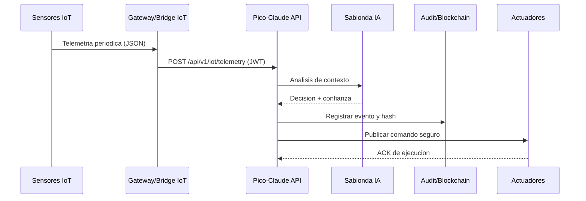
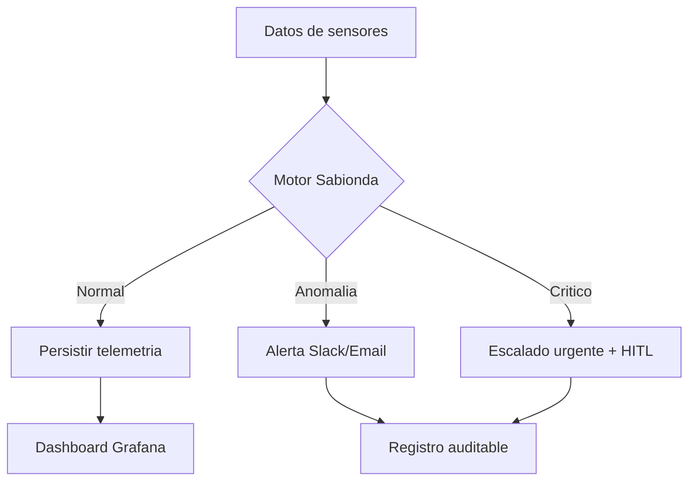

# CASTUO-SYSTEM v2.1 - Prontuario Maestro de Pico-Claude con soberania europea

## Resumen ejecutivo (1 pagina)

Objetivo operativo:
- Gestion autonoma de invernaderos con soberania europea y cumplimiento estricto (RGPD, ISO 27001, AI Act, eIDAS2, NIS2, CRA).

Stack tecnico consolidado:
- Orquestacion API: FastAPI (backend principal en `api/main.py`).
- IA soberana: Sabionda + Mistral con control de politica EU y fallback orquestado.
- IoT: ingesta por MQTT/HTTP, puentes y telemetria procesada en servicios dedicados.
- Persistencia: PostgreSQL/TimescaleDB con despliegues HA y observabilidad.
- Trazabilidad: auditoria inmutable y registro blockchain (GaiaChain + integraciones).
- Infraestructura: Kubernetes y perfiles cloud soberanos en region UE.
- Seguridad: JWT para dispositivos, RBAC, cifrado, gestion de secretos por variables/secret stores.

Flujos autonomos:
- Sensores -> API -> analisis IA -> decisiones -> actuadores.
- Deteccion de anomalias -> alerta (Slack/Email/PagerDuty) -> registro auditable.
- Prueba de trazabilidad -> hash/tx -> evidencia verificable.

SLA objetivo:
- Disponibilidad objetivo: 99.5%.
- RTO operacional para persistencia critica: < 1h (entornos HA).

---

## Arquitectura de Pico-Claude Master (vista funcional)

```text
┌─────────────────────────────────────────────────────────────┐
│            CASTUO-SYSTEM Pico-Claude Master v2.1           │
├─────────────────────────────────────────────────────────────┤
│  Capa IoT                                                   │
│  - Sensores por shard (temperatura, humedad, CO2, pH, EC)  │
│  - Telemetria: MQTT + endpoints API                         │
│  - Persistencia temporal/series: TimescaleDB HA             │
├─────────────────────────────────────────────────────────────┤
│  Capa IA (Sabionda)                                         │
│  - Inferencia con politicas soberanas EU                    │
│  - Reglas agronomicas y umbrales operativos                 │
│  - Human-in-the-loop para eventos criticos                  │
│  - Registro de decisiones y evidencia de trazabilidad       │
├─────────────────────────────────────────────────────────────┤
│  Capa de actuacion                                          │
│  - Ventilacion / riego / iluminacion / nutrientes           │
│  - Comandos por canales IoT controlados                     │
├─────────────────────────────────────────────────────────────┤
│  Capa de seguridad y cumplimiento                            │
│  - JWT dispositivos, RBAC y controles de acceso             │
│  - Cifrado y gestion de secretos sin hardcode               │
│  - Cumplimiento RGPD + ISO 27001 + AI Act + eIDAS2          │
├─────────────────────────────────────────────────────────────┤
│  Capa de observabilidad                                     │
│  - Prometheus + Grafana + Alertmanager + logs              │
│  - SLOs, alertas de riesgo y auditoria tecnica             │
└─────────────────────────────────────────────────────────────┘
```

---

## Flujos autonomos (paso a paso)

### Flujo 1: Datos IoT -> Sabionda -> Decisiones



### Flujo 2: Alertas predictivas



### Flujo 3: Trazabilidad blockchain (patron seguro)

```python
import hashlib
import json
from typing import Any


def build_action_hash(payload: dict[str, Any]) -> str:
    """Genera hash determinista para trazabilidad inmutable."""
    canonical = json.dumps(payload, sort_keys=True, separators=(",", ":"))
    return hashlib.sha256(canonical.encode("utf-8")).hexdigest()
```

Nota:
- La transaccion on-chain debe firmarse con claves en secreto gestionado (Vault/K8s Secret), nunca embebidas en codigo.

---

## Implementacion tecnica (mapeo a codigo real)

Back-end principal:
- `api/main.py`: FastAPI core, rutas, salud y observabilidad.

Seguridad y autenticacion:
- `api/middleware/security.py`: JWT para dispositivos IoT, TOTP y rate limiting.
- `api/security/rbac.py`: controles por roles.

IA y orquestacion:
- `castuo_graph/ai/sabionda_connector.py`: conector Sabionda SDK/mock.
- `tests/test_sovereign_orchestrator.py`: fallback soberano y reglas de orquestacion.

Auditoria y blockchain:
- `api/routers/audit.py`: busqueda y verificacion de cadena de custodia.
- `api/routers/blockchain_router.py`: registro blockchain con soporte de campos sensibles.
- `api/services/blockchain/logger.py`: utilidades de logging/trazabilidad blockchain.

Cumplimiento documental y operativo:
- `api/services/eidas.py`: firma digital de payload/PDF (modo real/simulado).
- `api/routers/gdpr.py`: endpoints vinculados a flujos RGPD.
- `monitoring/prometheus/prometheus.yml`: monitorizacion con enfoque soberano UE.
- `monitoring/prometheus/rules/castuo_alerts.yml`: alertas de compliance.

Infraestructura:
- `docker-compose.cloud.yml`: stack cloud soberano (api, iot-bridge, observabilidad, etc.).
- `k8s/deployment.yaml`: despliegue base de servicio API en Kubernetes.
- `k8s/timescale-ha.yaml`: plantilla HA para TimescaleDB.

---

## Baseline de cumplimiento legal y soberania

| Normativa | Implementacion en CASTUO-SYSTEM | Evidencia tecnica |
|---|---|---|
| RGPD | minimizacion, gobernanza de datos, endpoints de privacidad | `api/routers/gdpr.py` |
| ISO 27001 | controles operativos y trazabilidad de seguridad | `docs/iso-27001/` |
| AI Act UE | human-in-the-loop en decisiones criticas y auditoria | `castuo_graph/ethical_guard.py` |
| eIDAS2 | firma digital de documentos y payloads | `api/services/eidas.py` |
| NIS2 | runbooks operativos e incident response | `docs/ops/RUNBOOK-GO-LIVE-PR19.md` |
| CRA | politicas y validaciones de seguridad en CI | `docs/ci-policies.md` |

---

## Checklist tecnico de produccion (enterprise-ready)

1. Secrets:
- Configurar `DEVICE_JWT_SECRET`, claves de firma y tokens solo via secretos de entorno.
- Validar rotacion periodica y caducidad.

2. Seguridad:
- Activar MFA/TOTP en operaciones sensibles.
- Verificar RBAC minimo privilegio por tenant/rol.

3. Datos y soberania:
- Confirmar residencia en region UE en todos los servicios y backups.
- Revisar transferencias externas y alertas de fuga de datos.

4. Observabilidad:
- Validar SLO 99.5% y alertas criticas activas.
- Asegurar retencion y acceso a logs de auditoria.

5. Continuidad:
- Ejecutar pruebas de restauracion (RTO/RPO) en TimescaleDB HA.
- Confirmar runbooks y escalado operativo.

---

## Criterios de aceptacion para v2.1

- Ingesta IoT autenticada y trazable extremo a extremo.
- Decisiones IA auditables con confianza y fallback definido.
- Acciones criticas con human-in-the-loop y evidencia registrada.
- Cumplimiento verificable (RGPD/ISO/AI Act/eIDAS2/NIS2/CRA) con rutas concretas en repo.
- Entorno desplegable en Kubernetes/Cloud soberano UE con observabilidad completa.
