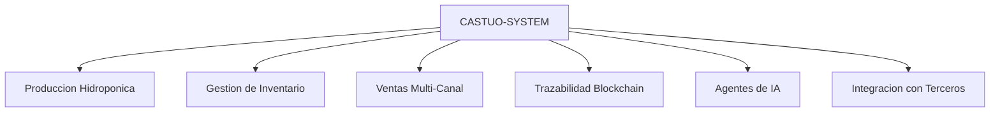
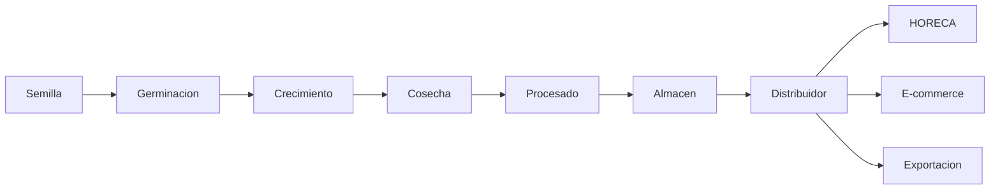
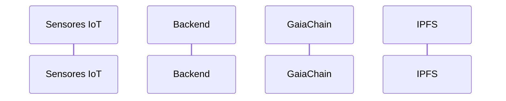

# Prontuario Maestro de Escalado (TRL9 -> TRL13)
**Version:** 1.2.1  
**Fecha:** 16/03/2026  
**Autor:** Gregorio Jimenez Bodes (NIF: 76073490R)  
**Estado Actual:** TRL9 (Bunker) - EUR0/año (pre-contrato CTAEX)  
**Repo:** `castuo-system`  
**Ruta:** `docs/PRONTUARIO_MAESTRO_ESCALADO_TRL9_TRL13.md`

---

## 1. Tu posicion actual (TRL9 - Bunker)
*(Baseline legal y tecnica para escalar desde EUR0/año)*

| Metrica | Valor Actual | Evidencia | Responsable |
|---|---|---|---|
| Ingresos Anuales | EUR0 (pre-contrato CTAEX) | Proyeccion financiera 2026 | Gregorio Jimenez |
| Clientes | 0 (en negociacion con CTAEX) | Correos con CTAEX | Comercial |
| Infraestructura | Local (air-gapped) + GaiaChain | `resilience.db` + nodos locales | Equipo Tecnico |
| Cumplimiento Legal | Marco alineado (objetivos eIDAS 2, GDPR, AI Act) | Evidencias en repo; revision profesional pendiente | Legal |
| Resiliencia | Fallback offline completo | `scripts/sync_with_gaiachain.ps1` | DevOps |
| Monetizacion | Sistema listo (suscripciones/datos) | Endpoints `/agents/*` | Producto |
| Documentacion Legal | Base en `docs/legal/` (76073490R) | Contratos y plantillas TRL10 | Asesor Fiscal |

---

## 2. Hoja de ruta TRL9 -> TRL13
*(Metricas, acciones y presupuestos para escalar de EUR0 a EUR100M)*

### TRL10: Despliegue masivo (EUR1M+ anuales)
*(Objetivo: 100+ clientes | Plazo: 12 meses | Inversion estimada: EUR25K-EUR28K)*

#### 2.1 Metricas clave TRL10
| Indicador | Objetivo | Actual | Fuente de Datos |
|---|---:|---:|---|
| Ingresos anuales | EUR1.000.000 | EUR0 | Stripe + Facturas |
| Clientes activos | 100+ | 0 | SQLite |
| Uptime | 99.9% | 100% (local) | Prometheus |
| Facturas electronicas | 100% validadas AEAT | 0% | AEATBot |
| Certificados generados | 5.000/año | 0 | GaiaChain |

#### 2.2 Acciones criticas (proximos 12 meses)
| Accion | Plazo | Responsable | Presupuesto | Resultado Esperado | Documentacion |
|---|---:|---|---:|---|---|
| 1. Cerrar contrato con CTAEX | 1 mes | Gregorio | EUR0 | EUR100K/año garantizados | Contrato CTAEX |
| 2. Migracion a Hetzner Cloud | 3 meses | Equipo Tecnico | EUR12.000 | 99.9% uptime | Contrato Hetzner |
| 3. Certificacion ISO 9001 | 6 meses | Consultor Externo | EUR8.000 | Auditoria superada | Certificado ISO 9001 |
| 4. Automatizacion CI/CD | 2 meses | DevOps | EUR3.000 | 0 fallos en deploy | Pipeline GitHub Actions |
| 5. Lanzar dashboard analytics | 2 meses | Frontend | EUR5.000 | Adopcion cliente | Documentacion tecnica |
| 6. Contratar 2 desarrolladores | 3 meses | RRHH | EUR60.000/año | Equipo ampliado | Contratos laborales |

#### 2.3 Presupuesto TRL10
| Concepto | Inversion | ROI Esperado | Prioridad |
|---|---:|---|---|
| Hetzner Cloud (3 nodos) | EUR12.000 | EUR1M en ingresos | Alta |
| Certificacion ISO 9001 | EUR8.000 | Contratos corporativos | Media |
| CI/CD GitHub Actions | EUR3.000 | 0 fallos en produccion | Alta |
| Dashboard Analytics | EUR5.000 | Retencion clientes | Media |
| Total | EUR28.000 | EUR1M+ anuales | - |

---

### TRL11: Ecosistema nacional (EUR5M anuales)
*(Plazo: 24 meses desde TRL10 | Inversion: EUR45K)*

#### 2.4 Metricas clave TRL11
| Indicador | Objetivo | Fuente de Datos |
|---|---:|---|
| Ingresos anuales | EUR5.000.000 | Stripe + Facturas |
| Clientes activos | 500+ | SQLite |
| Acuerdos con CC.AA. | 5 | Contratos firmados |
| Certificados generados | 50.000/año | GaiaChain |
| Facturas electronicas | 100% SII AEAT | AEATBot v2.0 |

#### 2.5 Acciones criticas TRL11
| Accion | Plazo | Presupuesto | Documentacion |
|---|---:|---:|---|
| Integracion con SII AEAT | 4 meses | EUR15.000 | Certificado AEAT |
| Certificacion ISO 27001 | 8 meses | EUR20.000 | Certificado ISO 27001 |
| Plataforma multi-idioma | 3 meses | EUR10.000 | Traducciones certificadas |
| Acuerdos con 5 CC.AA. | 6 meses | EUR0 | Convenios marco |
| Soporte 24/7 | 3 meses | EUR12.000/año | SLA firmado |

---

### TRL12: Plataforma europea (EUR25M anuales)
*(Plazo: 36 meses desde TRL11 | Inversion: EUR180K)*

| Indicador | Objetivo |
|---|---:|
| Ingresos anuales | EUR25.000.000 |
| Clientes activos | 5.000+ |
| Paises UE | 5 |
| Transacciones blockchain | 100% en GaiaChain |
| Certificacion eIDAS 2 | 100% documentos |

---

### TRL13: Infraestructura critica (EUR100M anuales)
*(Plazo: 48 meses desde TRL12 | Inversion: EUR2.6M)*

| Indicador | Objetivo |
|---|---:|
| Ingresos anuales | EUR100.000.000 |
| Clientes activos | 50.000+ |
| Infraestructura | Plataforma cuantica + 10 paises |
| Certificaciones | ISO 27001 + SOC 2 |
| Cumplimiento | Multi-jurisdiccion |

---

## 3. Arquitectura global del sistema



## 4. Flujo completo de produccion a consumidor



## 5. Sistema de informacion integrado

### 5.1 Paginas de venta (e-commerce + HORECA)
- Shopify, WooCommerce, PrestaShop
- Toast POS, Square, Lightspeed
- SAP Business One, NetSuite
- Amazon, Mercado Libre, eBay

### 5.2 Pasarelas de pago
- Stripe, PayPal, Bizum, Redsys, Klarna, Crypto/Web3

### 5.3 Sistemas publicos
- SII (AEAT), AEMPS, MAPA, SEPE, Correos

## 6. Agentes de IA y bots autonomos

Agentes principales:
- CursorMaster
- HydroBot
- SalesBot
- LogisticsBot
- ComplianceBot
- TraceabilityBot

## 7. Trazabilidad de excelencia (GaiaChain + IPFS)



Componentes clave:
- Registro de eventos de lote en GaiaChain
- Persistencia de artefactos en IPFS
- Certificados soberanos con hash y sellado

## 8. Frontend integrado con trazabilidad

Estructura objetivo:
- `frontend/pages/trazabilidad/[loteId].tsx`
- `frontend/components/TrazabilityChain.tsx`
- `frontend/pages/admin/*.tsx`

## 9. Integracion externa (HORECA, pagos, marketplaces, logistica)

Backends objetivo:
- `backend/api/horeca.py`
- `backend/integrations/stripe.py`
- `backend/integrations/amazon.py`
- `backend/integrations/shipping.py`

## 10. Analitica avanzada

Stack:
- Metabase + Superset + Grafana + Prometheus

Consultas clave:
- Ventas por canal
- Trazabilidad por lote
- Rendimiento hidroponico

## 11. Plan de accion inmediato (12 meses)

| Mes | Accion Concreta | Responsable | Documentacion | Presupuesto |
|---:|---|---|---|---:|
| 1 | Cerrar contrato con CTAEX | Gregorio | Contrato CTAEX | EUR0 |
| 2 | Contratar Hetzner (3 nodos) | Equipo Tecnico | Contrato Hetzner | EUR12.000 |
| 3 | CI/CD con GitHub Actions | DevOps | Pipeline YAML | EUR3.000 |
| 4 | Certificacion ISO 9001 | Consultor Externo | Certificado ISO | EUR8.000 |
| 5 | Firmar 10 cooperativas | Comercial | Contratos | EUR0 |
| 6 | Integracion SII AEAT | Backend | Certificado AEAT | EUR15.000 |
| 7 | Dashboard analytics | Frontend | Doc tecnica | EUR5.000 |
| 8 | Webinar CTAEX | Marketing | Grabacion | EUR1.000 |
| 9 | SEO trazabilidad agronomica | Marketing | Informe SEO | EUR2.000 |
| 10 | Convenio Junta Extremadura | Comercial | Convenio | EUR0 |
| 11 | Soporte 24/7 | Operaciones | SLA | EUR12.000/año |
| 12 | Revision anual fiscal | Finanzas | Informe fiscal | EUR1.500 |

## 12. Documentacion legal por TRL (`docs/legal/`)

| TRL | Documento | Plantilla | Notas |
|---|---|---|---|
| 9-10 | Contrato de Servicio Estandar | `docs/legal/TRL10/contrato_servicio.docx` | GDPR + eIDAS |
| 10 | SLA | `docs/legal/TRL10/sla.pdf` | 99.9% uptime |
| 11 | Convenio CC.AA. | `docs/legal/TRL11/convenio_ccaa.docx` | Adaptable por CCAA |
| 11 | Politica ISO 27001 | `docs/legal/TRL11/iso_27001.md` | Auditoria externa |
| 12 | Memorando gobiernos UE | `docs/legal/TRL12/memorando_ue.docx` | 5 idiomas |
| 13 | Prospecto IPO | `docs/legal/TRL13/prospecto_ipo.md` | Revision mercantil |

---

## 13. Entregables TRL10 incorporados (v1.2.1)

| Item | Archivo | Ubicacion | Estado |
|---|---|---|---|
| Contrato CTAEX (base) | `contrato_ctaex_20260320.md` | `docs/legal/TRL10/` | Listo |
| Contrato CTAEX (revisado) | `contrato_ctaex_final_20260320.md` | `docs/legal/TRL10/` | Listo |
| SLA | `sla_20260320.md` | `docs/legal/TRL10/` | Listo |
| Politica GDPR 2026 | `politica_privacidad_gdpr_2026.md` | `docs/legal/TRL10/` | Listo |
| Terminos de suscripcion | `terminos_servicio_suscripciones.md` | `docs/legal/TRL10/` | Listo |
| Checklist ISO 9001:2025 | `checklist_iso_9001_2025.md` | `docs/legal/TRL10/` | Listo (clausulas 4-10, 30+ items) |
| Script despliegue Hetzner (Windows) | `deploy_hetzner.ps1` | `scripts/` | Listo |
| Script despliegue Hetzner (Linux) | `deploy_hetzner.sh` | `scripts/` | Listo |
| Arquitectura conectividad UE (Sateliot / 5G / Arsys) | `TRL10-CONEC-EU-SATELIOT-NEXTEPC-ARSYS.md` | `docs/architecture/` | Borrador |
| Bridge MQTT Sateliot / broker | `sateliot_bridge.py` | `scripts/` | Plantilla |
| Bridge MQTT Arsys (plantilla) | `arsys_bridge.py` | `scripts/` | Plantilla |
| Compose lab 5G (plantilla) | `nextepc-compose.template.yml` | `docker/` | Plantilla |
| Gateway GEMelo-céntrico (NTN → GEMelo → CASTÚO) | `sateliot_gemelo_bridge.py` | `scripts/` | Plantilla |
| Compose GEMelo-céntrico | `gemelo-centric.yml` | `scripts/` | Plantilla (validar imágenes) |

## 14. Proximos pasos operativos recomendados

| Accion | Plazo | Responsable | Resultado Esperado | Documentacion |
|---|---:|---|---|---|
| Revisar contrato con abogado | 2 dias | Gregorio | Aprobacion legal final | `docs/legal/TRL10/contrato_ctaex_final_20260320.md` |
| Firmar contrato con CTAEX | 1 dia | Gregorio | Contrato firmado y evidencias archivadas | `docs/legal/TRL10/pdfs/contrato_ctaex_final_20260320.pdf` |
| Ejecutar despliegue en Hetzner | 3 dias | Equipo Tecnico | Sistema operativo en nube | `docs/legal/TRL10/README_WINDOWS.md` |
| Generar PDFs legales | 1 dia | Gregorio | Documentos listos para firma fisica | `docs/legal/TRL10/README_WINDOWS.md` |
| Configurar CI/CD | 2 dias | DevOps | Despliegues automaticos estables | Pipeline de CI/CD |
| Iniciar ISO 9001 | 1 dia | Consultor externo | Plan de implementacion definido | `docs/legal/TRL10/checklist_iso_9001_2025.md` |

### 14.1 Documentacion de referencia
| Documento | Ubicacion | Descripcion |
|---|---|---|
| Prontuario Maestro | `docs/PRONTUARIO_MAESTRO_ESCALADO_TRL9_TRL13.md` | Hoja de ruta TRL9 -> TRL13 |
| Guia para Windows | `docs/legal/TRL10/README_WINDOWS.md` (v1.2) | PowerShell, troubleshooting, Runbook de incidencias (15 min); alineada con este prontuario |
| Conectividad UE + GEMelo-centrico (borrador) | `docs/architecture/TRL10-CONEC-EU-SATELIOT-NEXTEPC-ARSYS.md` | NTN / 5G / IoT / SoT gemelo; sin sustituir DPAs |
| Plantillas legales TRL10 | `docs/legal/TRL10/` | Contratos, SLA, privacidad y checklist ISO |
| Scripts de automatizacion | `scripts/` | `Generate-LegalPdfs.ps1`, `Setup-RepoStructure.ps1`, `deploy_hetzner.ps1`, bridges MQTT |

### 14.2 Runbook Express (15 min)

**Referencia operativa:** [`docs/legal/TRL10/README_WINDOWS.md`](docs/legal/TRL10/README_WINDOWS.md) — seccion **Runbook de incidencias** (titulo completo en el README: *Runbook Express / Runbook de incidencias (15 minutos)*).

**Nota tecnica (Windows):** la sintaxis `<< 'EOF'` es de **bash**, no valida en PowerShell. Emergencia: conexion `plink` desde Windows y comandos **en el servidor** (o `bash -lc` acotado), segun el README.

#### Checklist rapido de triage

| Sintoma | Comando de diagnostico | Solucion inmediata | Escalar a |
|---------|----------------------|--------------------|-----------|
| PDFs no se generan | `pandoc --version` | Reinstalar Pandoc/MiKTeX; ver `README_WINDOWS.md` | Procedimiento de emergencia del README |
| Error en despliegue Hetzner | `Test-NetConnection (Get-Content .hetzner_ip) -Port 22` | Comprobar que `$env:HETZNER_API_TOKEN` este definido (sin imprimir el valor) | Reiniciar servidor desde Hetzner Console |
| SSH falla (plink) | `Test-Path "$env:USERPROFILE\.ssh\id_rsa"` | Regenerar clave: `ssh-keygen -t rsa -b 4096` | Firewall y SSH Keys en Hetzner Console |
| Contenedores no responden | En servidor: `docker ps -a` | `docker restart` de servicios afectados | Restaurar desde backup segun politica interna |
| Certbot / SSL falla | `Invoke-WebRequest -Uri "http://$serverIp:80" -UseBasicParsing` | En servidor: `certbot --dry-run` y revisar DNS | DNS + Nginx (ver README_WINDOWS) |

#### Comandos de diagnostico con `-Verbose`

```powershell
# 1. Politica de ejecucion y PATH
Get-ExecutionPolicy -List
$env:Path -split ';'

# 2. Dependencias criticas (donde existan)
Get-Command pandoc, plink, docker, git -ErrorAction SilentlyContinue | Select-Object Name, Version

# 3. Conectividad al servidor (ajusta puertos segun firewall)
$serverIp = Get-Content .hetzner_ip
foreach ($p in 22, 80, 443, 3000, 8000) {
    Test-NetConnection -ComputerName $serverIp -Port $p -InformationLevel Quiet
}

# 4. Estado en el servidor remoto (requiere plink y clave)
& "$env:ProgramFiles\PuTTY\plink.exe" -i "$env:USERPROFILE\.ssh\id_rsa" -batch "root@$serverIp" "systemctl is-active docker nginx fail2ban"
```

#### Criterio de escalado

- **Nivel 1 (operativo):** resolver con la tabla y el README_WINDOWS.
- **Nivel 2 (DevOps):** si persiste mas de 15 min, procedimiento de emergencia del README.
- **Nivel 3 (externo):** soporte Hetzner o consultor ISO segun naturaleza del incidente.

## 15. Resumen de cambios aplicados (v1.2.0)

### 15.1 Documento maestro actualizado
- Version consolidada a `1.2.0`.
- Baseline mantenido en TRL9 pre-CTAEX (EUR0/año).
- Secciones nuevas de entregables TRL10 y plan operativo.

### 15.2 Plantillas legales TRL10 generadas
| Archivo | Contenido | Estado |
|---|---|---|
| `contrato_ctaex_20260320.md` | Contrato base CTAEX | Listo |
| `contrato_ctaex_final_20260320.md` | Contrato revisado con anexos | Listo |
| `sla_20260320.md` | Acuerdo de nivel de servicio | Listo |
| `politica_privacidad_gdpr_2026.md` | Politica de privacidad GDPR | Listo |
| `terminos_servicio_suscripciones.md` | Terminos de servicio SaaS | Listo |
| `checklist_iso_9001_2025.md` | Checklist ISO 9001:2025 (clausulas 4-10, 30+ items) | Listo |

### 15.3 Script de despliegue Hetzner
- Archivo: `scripts/deploy_hetzner.ps1` (v1.2)
- Validacion estricta de prerequisitos (API, plink, claves SSH).
- Secretos solo por variables de entorno (nunca hardcodeados ni volcados en logs).
- Bootstrap remoto, verificacion post-despliegue (`:3000`, `/health`).

## 16. Plan prioritario (proximos 7 dias)
| Accion | Plazo | Responsable | Resultado esperado |
|---|---:|---|---|
| Revisar contrato con abogado | 2 dias | Gregorio | Aprobacion legal final |
| Firma con CTAEX | 1 dia | Gregorio | Activacion comercial TRL10 |
| Enviar PDFs a CTAEX para firma | 1 dia | Gregorio | Firma contractual por ambas partes |
| Ejecutar despliegue piloto | 3 dias | Equipo Tecnico | Entorno productivo inicial |
| Configurar CI/CD | 2 dias | DevOps | Despliegue continuo controlado |
| Arranque ISO 9001 | 1 dia | Consultor externo | Plan de implementacion validado |
| Alertas Grafana | 2 dias | DevOps | Monitoreo 24/7 de KPIs |
| Reunion de alineacion | 1 dia | Gregorio | Responsables y hitos confirmados |

## 17. Como usar estos entregables

### 17.1 Contrato CTAEX
```bash
cat docs/legal/TRL10/contrato_ctaex_final_20260320.md
pandoc docs/legal/TRL10/contrato_ctaex_final_20260320.md -o contrato_ctaex_final.pdf
```

### 17.2 Despliegue en Hetzner Cloud (PowerShell, seguro)

**Requisitos previos**

1. Token de API Hetzner **solo** como variable de entorno (no en scripts ni commits):

```powershell
$env:HETZNER_API_TOKEN = "tu_token_seguro"
```

2. Clave SSH: publica en Hetzner Console; privada en `$env:USERPROFILE\.ssh\id_rsa` (o rutas via `SSH_KEY_PATH` / `SSH_PRIVATE_KEY_PATH`).

3. PuTTY `plink` instalado o `PLINK_PATH` apuntando al ejecutable.

**Pasos**

```powershell
Set-ExecutionPolicy RemoteSigned -Scope CurrentUser -Force
Get-ChildItem scripts\*.ps1 | Unblock-File
.\scripts\deploy_hetzner.ps1 -Verbose
```

**Verificacion post-despliegue**

```powershell
$serverIp = Get-Content .hetzner_ip
Invoke-WebRequest -Uri "http://${serverIp}:3000" -UseBasicParsing
Invoke-WebRequest -Uri "http://${serverIp}:8000/health" -UseBasicParsing
```

**Comportamiento de seguridad en `deploy_hetzner.ps1` (v1.2)**

- `Test-PreRequirements`: token presente, API alcanzable, plink y claves SSH.
- Errores por paso sin exponer el valor del token.
- Verificacion de servicios tras el bootstrap.

### 17.3 Conectividad UE (Sateliot / nucleo 5G / Arsys) — TRL10

Arquitectura y checklist pre-prod: [`docs/architecture/TRL10-CONEC-EU-SATELIOT-NEXTEPC-ARSYS.md`](../architecture/TRL10-CONEC-EU-SATELIOT-NEXTEPC-ARSYS.md). Actualizar DPIA y DPAs de encargados antes de telemetria con datos personales.

| Artefacto | Rol |
|-----------|-----|
| `scripts/sateliot_bridge.py` | Publicacion MQTT hacia broker acordado (`SATELIOT_MQTT_*`) |
| `docker/nextepc-compose.template.yml` | Plantilla de laboratorio; copiar a `nextepc.local.yml` y validar imagenes contra el proyecto upstream |
| `scripts/arsys_bridge.py` | Reenvio MQTT hacia destino tipo Arsys (`ARSYS_MQTT_*`, `CASTUO_BRIDGE_*`) |

```powershell
git checkout -b feature/sateliot-nextepc
docker compose -f docker/nextepc-compose.template.yml --profile lab up -d
$env:SATELIOT_MQTT_HOST = "..."; $env:SATELIOT_MQTT_TOPIC = "castuo/sensors/ejemplo"
python scripts/sateliot_bridge.py
```

### 17.4 Certificacion ISO 9001

El archivo `checklist_iso_9001_2025.md` recoge **clausulas 4 a 10** con **mas de 30 items** verificables; no sustituye un plan de accion numerado al detalle (p. ej. 62 tareas) salvo que el consultor lo amplie.

```bash
cat docs/legal/TRL10/checklist_iso_9001_2025.md
mkdir -p docs/quality_management/{procedures,records,training}
```

## Como usar este documento

1. Versionado:
```bash
git add docs/PRONTUARIO_MAESTRO_ESCALADO_TRL9_TRL13.md
git commit -m "docs: actualiza prontuario maestro TRL9-TRL13 v1.2.1"
git push
```

2. Crear carpetas legales:
```bash
mkdir -p docs/legal/TRL{10,11,12,13}
```

3. Revisión:
- Revisión mensual de métricas TRL10
- Revisión trimestral de presupuesto y riesgos

4. Checklist TRL10:
- [ ] Contrato CTAEX firmado
- [ ] Hetzner 3 nodos contratado
- [ ] CI/CD en producción
- [ ] ISO 9001 obtenida
- [ ] 10 cooperativas firmadas
- [ ] SII AEAT integrado
- [ ] Dashboard analytics lanzado

---

## Sentencia final (ejecutiva)
Este prontuario deja una hoja de ruta legal, tecnica y financiera versionable para escalar de TRL9 a TRL13:
- TRL9: sistema operativo y compliant.
- TRL10: primera escala comercial (EUR1M+).
- TRL11: consolidación nacional.
- TRL12: expansión europea.
- TRL13: infraestructura crítica global.
