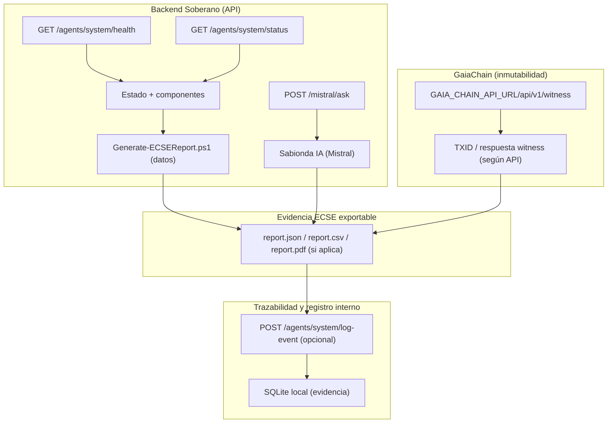
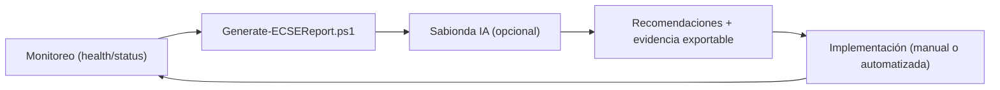

# Prontuario Maestro de Integraciones y Evolución ECSE
**Versión:** 3.0  
**Fecha:** 20/03/2026  
**Autor:** Gregorio Jiménez Bodes / Sabionda IA  
**Paradigma:** Excelencia Computacional Sistemática Evolutiva (ECSE)

> Marco de **integraciones** y **evidencia operativa** para evolucionar CASTÚO-SYSTEM hacia ECSE.  
> Legal y operativo: este documento describe trazabilidad verificable; **no sustituye** contratos, DPA, SLA ni auditorías externas.

---

## ARQUITECTURA DE INTEGRACIONES (vista lógica)



---

## 1) INVENTARIO DE INTEGRACIONES (del repo, con trazabilidad)

| Componente | Endpoint/Recurso | Propósito | Estado |
|---|---|---|---|
| Backend API | `GET /agents/system/health`, `GET /agents/system/status` | Fuente verificable del estado ECSE | ✅ (implementado) |
| Sabionda IA (Mistral vía backend) | `POST /mistral/ask` | Análisis soberano opcional bajo `-UseSabiondaIA` | ✅ (implementado) |
| Generación de informes ECSE | `scripts/Generate-ECSEReport.ps1` | Exporta evidencia (JSON/CSV y PDF si hay `New-PDF`) | ✅ (implementado) |
| GaiaChain Witness | `GAIA_CHAIN_API_URL/api/v1/witness` | Registro inmutable opcional del hash del informe | ✅ (flujo implementado; depende de entorno) |
| Registro local de evento | `POST /agents/system/log-event` | Evidencia adicional en `resilience.db` (opcional) | ✅ (implementado; depende de flags) |
| Prometheus/Grafana/Alertmanager/ArgoCD/Kubernetes | (infra externa) | Observabilidad y GitOps | Por validar en tu despliegue (no verificable solo con el repo) |

---

## 2) FLUJO DE TRABAJO SOBERANO (end-to-end con evidencias)

### 2.1 Generación de informe (base ECSE + Sabionda IA opcional)

```powershell
.\scripts\Generate-ECSEReport.ps1 -OutputFormat JSON,CSV `
  -UseSabiondaIA -MistralModel "mistral-small-latest" `
  -BackendUrl "http://localhost:8001"
```

### 2.2 Registro inmutable (opcional)

```powershell
.\scripts\Generate-ECSEReport.ps1 -OutputFormat JSON,CSV,PDF `
  -UseSabiondaIA -RegisterInGaiaChain -CoopId 1 `
  -BackendUrl "http://localhost:8001"
```

Notas verificables:
- El script siempre exporta `report.json` (y `report.csv` si lo pides).
- El `witness` se guarda localmente en `gaiachain_witness.json` junto al informe.
- El backend puede registrar un evento en `resilience.db` mediante `POST /agents/system/log-event` (controlado por flags).

---

## 3) MÉTRICAS DE EVOLUCIÓN (derivadas de evidencias ECSE)

Estas métricas derivan del **informe exportado** (`report.json` / `report.csv`):

| Métrica | Fuente (evidencia) | Objetivo (a definir) | Ejemplo de uso |
|---|---|---|---|
| `ECSECompliance.Autonomy` | `report.csv/report.json` | ✅/⚠️ según umbrales | validar carga y límites |
| `ECSECompliance.Resilience` | `report.json` | ✅/⚠️ | correlacionar con `system_status` |
| `ECSECompliance.Security` | `report.json` | ✅/⚠️ | `critical_events_count` |
| `DiskUsagePct` / `MemoryUsagePct` | `report.json` | < umbral alto | seguimiento de crecimiento de storage |
| `PendingOperations` | `report.json` | cercano a 0 | correlacionar con `sync-gaiachain` |
| `Recommendations` | `report.json` | acciones priorizadas | backlog de mejora continua |

> Para métricas Prometheus (P99, uptime real, etc.), documenta los dashboards y rules en la infraestructura desplegada; este repo no fija esos valores por defecto.

---

## 4) SISTEMA DE MEJORA CONTINUA (ciclo operativo)



### Regla legal de prudencia
- La “autonomía” del ciclo debe basarse en **evidencia exportada** y decisiones registradas (p. ej. `gaiachain_witness.json` + `report.json`).  
- Cuando una acción implique terceros (proveedores / cambios de infraestructura), se mantiene la cadena de cumplimiento (DPA/contratos) conforme corresponda.

---

## 5) PRONTUARIOS RELACIONADOS (enlaces bidireccionales)

- `PRONTUARIO_MAESTRO_EVOLUTIVO_ECSE.md` (marco ECSE global)
- `PRONTUARIO_MAESTRO_MONITOREO_DIAGNOSTICO_TRL9.md` (evidencia operativa del día a día)
- `../scripts/Generate-ECSEReport.ps1` (evidencia ECSE exportable + witness opcional)

