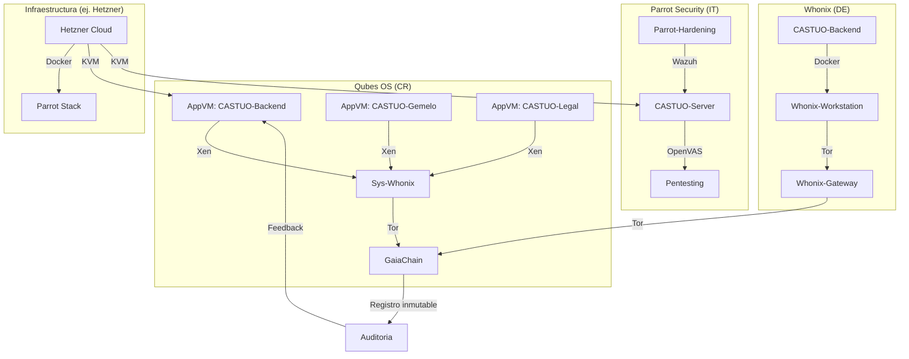

# Documento Maestro de Seguridad Reforzada
# (Integracion de Qubes OS, Whonix, Parrot Security y GaiaChain)

**Version:** 1.0  
**Fecha:** 20/03/2026  
**Autor:** Gregorio Jimenez Bodes / Sabionda IA  

> Marco documental para trazabilidad verificable. Cualquier despliegue debe validarse por pruebas, auditorias y evidencias (Wazuh/OpenVAS/pentesting) segun corresponda.

---

## 0) Paradigma, objetivo y alcance

**Paradigma:** Seguridad soberana con trazabilidad inmutable.

**Objetivo:** Integrar compartimentacion (Qubes OS), perimetro anti-forense (Whonix/Tor), hardening y verificacion continua (Parrot Security) y registro inmutable de evidencias (GaiaChain).

**Alcance verificable desde el repo:**
- Generacion de evidencia inmutable con `scripts/Register-SecurityEvent.ps1`.
- Registro de eventos en backend via `POST /agents/system/log-event` (si esta habilitado en el endpoint).

**Por validar (dependiente de tu despliegue):**
- Integraciones exactas de Wazuh/OpenVAS (config de targets/scan profiles, rutas y permisos).
- Scriptes de orquestacion adicionales (ej. `scripts/deploy-secure-infra.sh`) si no existen en el repo.

---

## 1) Arquitectura general (vista logica)



---

## 2) Integracion con Qubes OS (CR) - compartimentacion

### 2.1 Configuracion de AppVMs (plantilla)

```yaml
# qubes-config/castuo-qubes.yml
---
dom0:
  updates:
    - qvm-dom0-update
  services:
    - qubes-mgmt-salt
    - qubes-firewall

appvms:
  - name: castuo-backend
    template: fedora-38
    label: red
    provides_network: false
    netvm: sys-whonix
    include_in_balance: true
    qrexec:
      - allow
    services:
      - qubes-firewall
      - docker

  - name: castuo-gemelo
    template: debian-12
    label: green
    provides_network: false
    netvm: sys-whonix
    include_in_balance: false
    qrexec:
      - allow
    services:
      - qubes-firewall
      - postgresql

  - name: castuo-legal
    template: debian-12
    label: yellow
    provides_network: false
    netvm: sys-whonix
    include_in_balance: false
    qrexec:
      - allow
    services:
      - qubes-firewall
      - libvirtd

sysvms:
  - name: sys-whonix
    template: whonix-gw-16
    label: black
    provides_network: true
    netvm: none
    include_in_balance: false
```

### 2.2 Despliegue Docker (ejemplo en AppVM)

```bash
# En la AppVM castuo-backend:
sudo qubesctl state.apply docker.host
docker run -d \
  --name castuo-backend \
  --network qubes-tor-only \
  -v /home/user/castuo-data:/data \
  -e GAIA_CHAIN_API_KEY="$(cat /rw/config/gaiachain-key)" \
  ghcr.io/castuo-system/backend:v3.0
```

---

## 3) Integracion con Whonix (DE) - perimetro anti-forense

### 3.1 Compose para Whonix + CASTUO (plantilla)

```yaml
# docker/whonix-castuo.yml
version: "3.8"

services:
  whonix-gateway:
    image: qubesos/whonix-gateway:latest
    container_name: whonix-gateway
    cap_add:
      - NET_ADMIN
      - SYS_ADMIN
    sysctls:
      net.ipv6.conf.all.disable_ipv6: 1
    volumes:
      - /var/run/docker.sock:/var/run/docker.sock
    networks:
      whonix-external:
        ipv4_address: 10.152.152.10
    restart: unless-stopped

  castuo-backend:
    image: ghcr.io/castuo-system/backend:v3.0
    container_name: castuo-backend
    depends_on:
      - whonix-gateway
    network_mode: "service:whonix-gateway"
    environment:
      - TOR_PROXY=10.152.152.10:9050
      - GAIA_CHAIN_API_KEY=${GAIA_CHAIN_API_KEY}
    volumes:
      - castuo-data:/data
    restart: unless-stopped

  whonix-workstation:
    image: qubesos/whonix-workstation:latest
    container_name: whonix-workstation
    depends_on:
      - whonix-gateway
    network_mode: "service:whonix-gateway"
    volumes:
      - castuo-data:/home/user/castuo-data
    restart: unless-stopped

volumes:
  castuo-data:

networks:
  whonix-external:
    driver: bridge
    ipam:
      config:
        - subnet: 10.152.152.0/24
```

### 3.2 Verificacion Tor (ejemplo)

```bash
docker exec whonix-gateway curl --socks5-hostname 10.152.152.10:9050 https://check.torproject.org
```

---

## 4) Integracion con Parrot Security (IT) - hardening, Wazuh y OpenVAS

### 4.1 Compose (plantilla)

```yaml
# parrot-hardening/parrot-castuo.yml
version: "3.8"

services:
  parrot-hardening:
    image: parrotsh/parrot-security:latest
    container_name: parrot-hardening
    cap_add:
      - SYS_ADMIN
      - NET_ADMIN
    security_opt:
      - apparmor:unconfined
      - seccomp:unconfined
    volumes:
      - /var/run/docker.sock:/var/run/docker.sock
      - ./wazuh-config:/etc/wazuh
      - ./openvas-config:/var/lib/openvas
    ports:
      - "55000:55000"
      - "9390:9390"
    restart: unless-stopped

  castuo-backend:
    image: ghcr.io/castuo-system/backend:v3.0
    container_name: castuo-backend
    depends_on:
      - parrot-hardening
    environment:
      - WAZUH_MANAGER=parrot-hardening
      - OPENVAS_SCAN_TARGET=castuo-backend
    restart: unless-stopped
```

### 4.2 Pentesting OpenVAS (plantilla)

```bash
# scripts/run-openvas-scan.sh (plantilla)
docker exec parrot-hardening greenbone-nvt-sync
docker exec parrot-hardening greenbone-scapdata-sync
docker exec parrot-hardening greenbone-certdata-sync

TARGET_ID="$(docker exec parrot-hardening gvmd --create-target="CASTUO-Backend" --hosts=castuo-backend --create)"
TASK_ID="$(docker exec parrot-hardening gvmd --create-task="CASTUO Weekly Scan" --target="$TARGET_ID" --config="Full and fast" --create)"
docker exec parrot-hardening gvmd --start-task="$TASK_ID"
```

---

## 5) Integracion con GaiaChain - evidencia inmutable

### 5.1 Script de registro (usando el contrato del repo)

Script real en el repo: `scripts/Register-SecurityEvent.ps1`

Parametros principales:
- `-EventType`
- `-EventData` (objeto: diccionario con metadata minimizada)
- `-CoopId` (default 1)
- `-Severity` (valores soportados: `warning|error|critical|info`)
- `-LogEventInBackend` (switch opcional; por defecto true)

Para autenticar GaiaChain, usa:
- `GAIA_CHAIN_API_URL` (opcional si tu entorno la usa)
- `GAIA_CHAIN_API_KEY` (requerida si quieres witness remoto)

### 5.2 Ejemplo de uso

```powershell
.\scripts\Register-SecurityEvent.ps1 `
  -EventType "unauthorized_access_attempt" `
  -EventData @{ source_ip="192.168.1.100"; target_service="castuo-backend"; action="blocked" } `
  -CoopId 1 `
  -Severity "critical" `
  -LogEventInBackend
```

### 5.3 Matriz de eventos y severidad (normalizada a los valores permitidos)

| Tipo de evento | Severidad (permitida) | Accion recomendada (ejemplo) | Responsable |
|---|---|---|---|
| unauthorized_access_attempt | critical | Bloquear IP en firewall, rotar credenciales, auditar logs | Seguridad |
| high_cpu_usage | warning | Revisar procesos, considerar autoescalado | DevOps |
| failed_login_attempt | warning | Monitorear patrones, verificar credenciales | Seguridad |
| database_connection_failed | error | Revisar conexion a base de datos, verificar backups | DBA |
| gaiachain_connection_error | warning | Verificar conectividad GaiaChain, revisar logs de red | DevOps |
| whonix_tor_circuit_failed | critical | Reiniciar Whonix-Gateway, verificar configuracion de Tor | Seguridad |
| parrot_vulnerability_detected | error | Aplicar parches, revisar informe OpenVAS | Seguridad |
| qubes_vm_isolation_breach | critical | Aislar VM afectada, revisar logs Qubes | Seguridad |

> Nota: tu plantilla original usaba `high|medium|informational`. Aqui se normaliza para compatibilidad con el script del repo.

---

## 6) Script de despliegue completo (por validar)

En el repo, el documento indica que existe la idea de `deploy-secure-infra.sh`, pero no se ha verificado que el script exista con ese nombre.

Plantilla (referencia):

```bash
#!/bin/bash
export GAIA_CHAIN_API_KEY="$(cat ~/.gaiachain-key)"

docker-compose -f docker/whonix-castuo.yml up -d
docker-compose -f parrot-hardening/parrot-castuo.yml up -d

./scripts/run-openvas-scan.sh
```

Registro posterior (ejemplo):

```powershell
.\scripts\Register-SecurityEvent.ps1 `
  -EventType "secure_infra_deployment" `
  -EventData @{ components=@("whonix-gateway","castuo-backend","parrot-hardening"); status="deployed" } `
  -CoopId 1 `
  -Severity "info"
```

---

## 7) Documentacion legal y tecnica (plantilla para auditorias)

### 7.1 Plantilla de informe de seguridad

```markdown
# Informe de Seguridad y Cumplimiento Normativo
**Cooperativa ID:** {coop_id}
**Fecha:** {generation_date}
**Periodo:** {start_date} a {end_date}

## 1) Arquitectura de Seguridad
- Componentes desplegados: (Qubes OS, Whonix, Parrot Security, GaiaChain)
- Versiones: (lista de artefactos y tags reales)

## 2) Evidencia en GaiaChain
- Transacciones: {txid...}

## 3) Analisis de riesgos (resumen)
- Riesgo: {descripcion}
- Probabilidad/impacto: {criterios}
- Mitigacion y responsable: {plan}

## 4) Recomendaciones y plan de mejora continua
- Accion: {tarea}
- Responsable: {rol}
- Plazo: {fecha}

## 5) Nota legal de prudencia
Este documento describe un marco de seguridad y trazabilidad verificable. No sustituye contratos, DPA, SLA ni auditorias externas.
```

### 7.2 Declaracion de conformidad (plantilla)

La conformidad debe describirse en terminos de evidencia y resultados documentados, por lo que se recomienda:
- Incluir referencias a `GAIA_CHAIN` (txid/witness) para eventos.
- Incluir informes de Wazuh/OpenVAS y resultados de pentest.
- Incluir registros internos (por ejemplo, backend `system/log-event` si se usa).

---

## 8) Ejecucion y validacion (checklist)

1. Desplegar Whonix/Tor y verificar conectividad (ejemplo Tor test).
2. Desplegar Parrot Security stack y verificar Wazuh/OpenVAS (paneles/targets).
3. Ejecutar pentesting inicial (OpenVAS) y guardar informe.
4. Registrar eventos en GaiaChain con `scripts/Register-SecurityEvent.ps1`.
5. Verificar que el backend registra evidencia (si `-LogEventInBackend` esta habilitado).

---

## 9) Arquitectura legal y tecnica

Para cumplimiento normativo (mapa de evidencias y diagrama), ver:
- `ARQUITECTURA-LEGAL-Y-TECNICA.md`

