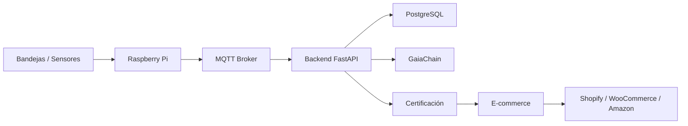
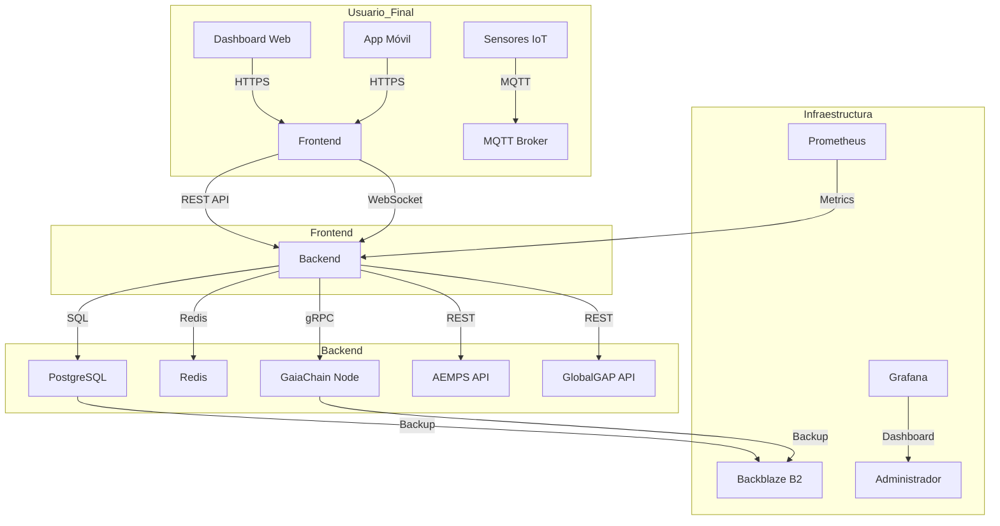

# Informe técnico CASTUO-SYSTEM para CTAEX

Documento de arquitectura y especificaciones para presentación a CTAEX, auditores y socios.

## 1. Resumen ejecutivo

CASTUO-SYSTEM es una plataforma agritech 4.0 que integra:

- Cultivos hidropónicos (microgreens, brotes, cannabis medicinal) con trazabilidad blockchain.
- Control ambiental avanzado (ozono, ósmosis inversa, UV, nutrientes).
- Red europea de drones para operaciones transfronterizas.
- Cumplimiento normativo (AEMPS, RD 903/2025, ISO 9001/27001, GlobalGAP, EcoCert).
- Comercio online (Shopify, WooCommerce, Amazon) con certificados y trazabilidad.

**Objetivos:** Reducir 30–50% el uso de agua, trazabilidad 100% desde semilla a producto final, cumplimiento RD 903/2025 e ISO 27001.

## 2. Arquitectura técnica

### 2.1. Flujo de datos (sensores → e-commerce)

### 2.2. Stack tecnológico

| Capa           | Tecnología   | Uso en CASTUO                          |
|----------------|-------------|----------------------------------------|
| Backend        | FastAPI     | API REST, WebSockets, routers producción/certificación/e-commerce |
| Base de datos  | PostgreSQL  | Perfiles, órdenes, trazabilidad       |
| Blockchain     | GaiaChain   | Registros inmutables (IoT, certificados, pedidos) |
| IoT            | MQTT        | Sensores y actuadores en tiempo real  |
| Certificación  | Compliance  | Certificados producto y exportación   |
| E-commerce      | Connector   | Sincronización Shopify, WooCommerce, Amazon |

### 2.3. Especificaciones hardware (piloto CTAEX)

- Bandejas hidropónicas 40×60 cm, food-grade.
- Sensores: DHT22 (temp/humedad), MH-Z19 (CO₂), EC/pH, ORP, turbidímetro.
- Sistema de ósmosis inversa 500–1000 L/día.
- Generador de ozono 5–10 g/h.
- Iluminación LED espectro completo 150–300 µmol/m²/s.
- Raspberry Pi 4 (4 GB) + cámara IP para monitoreo.

### 2.4. Endpoints principales

- **Control ambiental:** `POST /api/environment/data`, `GET /api/environment/thresholds/{crop_type}`
- **Microgreens:** `POST /api/microgreens/batches`, `PUT /api/microgreens/batches/{id}`, `POST .../certificate`, `GET .../batches/{id}`
- **Agua:** `POST /api/water/treatments`, `POST /api/water/analysis`, `GET /api/water/treatments/{id}`
- **Certificación:** `POST /api/certificates/product`, `POST /api/certificates/export`, `GET /api/certificates/verify/{id}`
- **E-commerce:** `POST /api/ecommerce/platforms`, `POST /api/ecommerce/products/sync`, `GET /api/ecommerce/products/{platform}/{id}`
- **Webhooks:** `POST /webhooks/shopify/orders`, `POST /webhooks/woocommerce/orders`
- **CTAEX v6.0:** `POST /trazabilidad/gaia`, `GET /microgreens/sensors`, `GET /certificacion/ctaex`, `POST /ecommerce/create-checkout`, `POST /ecommerce/webhook` (Stripe).

## 3. Arquitectura técnica y roadmap

Para una descripción detallada de la **arquitectura en capas**, **diagramas de componentes**, **flujos de datos** y **plan de implementación**, consulta:

📄 **[SABIONDA-PRO-ARCHITECTURE-ROADMAP.md](SABIONDA-PRO-ARCHITECTURE-ROADMAP.md)**

### Diagrama de arquitectura

### Componentes técnicos clave

| Componente | Tecnología | Responsable | Estado |
|------------|------------|-------------|--------|
| Backend | FastAPI + Python 3.10 | Equipo Backend | 🟢 Producción |
| Frontend | Next.js + React | Equipo Frontend | 🟢 Producción |
| Base de datos | PostgreSQL 15 | DevOps | ⚠️ Migración pendiente |
| Blockchain | GaiaChain (nodos locales) | Equipo Blockchain | 🟡 Pruebas |
| IoT | MQTT + Sensores Libelium | IoT Engineer | 🟢 Producción (piloto) |
| Monitoreo | Prometheus + Grafana | DevOps | 🟢 Producción |
| Legacy Integration | PyRFC (SAP) + PyODBC (SQL) | Integrations Team | 🟠 Desarrollo |

### Métricas de rendimiento

| Métrica | Objetivo | Herramienta | Umbral de alerta |
|---------|----------|-------------|-------------------|
| Tiempo de respuesta API | <500 ms | Prometheus | >800 ms |
| Uptime | 99,9 % | UptimeRobot | <99,5 % |
| Uso de CPU (Backend) | <70 % | Grafana | >85 % |
| Éxito en certificaciones | 99 % | Sentry | <95 % |
| Latencia de Blockchain | <2 s | Prometheus | >5 s |

---

## 4. Seguridad y cumplimiento

- Autenticación y control de acceso (RBAC).
- Trazabilidad 100% en GaiaChain para eventos críticos.
- Certificados de producto y exportación con verificación blockchain.
- Webhooks con firma HMAC (Shopify, WooCommerce).

## 5. Arquitectura Docker

### 5.1. Contenedores

| Contenedor   | Puerto      | Descripción                                                                 |
|-------------|-------------|-----------------------------------------------------------------------------|
| `backend`   | 8000        | API FastAPI con todos los módulos (production, compliance, ecommerce, blockchain). |
| `frontend`  | 3000        | Nginx sirviendo estáticos (dashboard, ecommerce.html).                      |
| `postgres`  | 5432        | Base de datos PostgreSQL (castuo_ctaex).                                   |
| `mqtt`      | 1883, 9001  | Broker Mosquitto para IoT.                                                  |

### 5.2. Flujo de datos

1. **Sensores IoT** → MQTT (1883) → Backend → GaiaChain.
2. **Backend** → PostgreSQL (datos persistentes) + GaiaChain (trazabilidad).
3. **Frontend** → Backend (API REST) → Stripe (pagos) / Shopify (e-commerce).

### 5.3. Requisitos de hardware (servidor CTAEX)

| Recurso        | Mínimo   | Recomendado |
|----------------|----------|-------------|
| CPU            | 4 núcleos| 8+ núcleos  |
| RAM            | 8 GB     | 16+ GB      |
| Almacenamiento | 50 GB    | 100+ GB SSD |
| Red            | 100 Mbps | 1 Gbps      |

### 5.4. Construcción

- **Dockerfile:** `docker/Dockerfile` (contexto = raíz del repo). Incluye backend, blockchain, production, compliance, ecommerce.
- **Compose CTAEX:** `docker/docker-compose.ctaex.yml`. Ejecutar desde la raíz:  
  `docker compose -f docker/docker-compose.ctaex.yml up -d --build`

## 6. Referencias

- Guía producción y certificación: `docs/GUIA-PRODUCCION-CERTIFICACION.md`
- Docker CTAEX: `docker/docker-compose.ctaex.yml`, `docker/Dockerfile`
- Despliegue 30 min: `docs/CTAEX-DEPLOY-30MIN.md`
- Seguridad (roles, Stripe, secrets, Nginx): `docs/CTAEX-SECURITY.md`
- Pruebas: `tests/test_all_endpoints.py`, `tests/test_webhooks.py`, `tests/validate_certificates.py`
