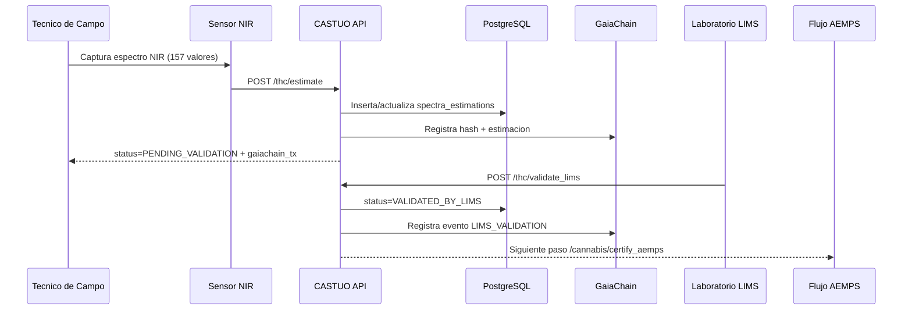

# Flujo de Trazabilidad THC - CASTUO-SYSTEM

Version operativa para equipo tecnico y auditoria interna CTAEX.

## 1) Diagrama de flujo



## 2) Evidencias minimas por etapa

| Etapa | Evidencia | Almacenamiento | Formato |
|---|---|---|---|
| Estimacion | `batch_id`, `plant_id`, `zone_id`, `thc_estimate` | PostgreSQL | columnas |
| Integridad | `spectrum_hash` (SHA-256) | PostgreSQL + GaiaChain | string (64) |
| Estado | `PENDING_VALIDATION` / `VALIDATED_BY_LIMS` | PostgreSQL + API response | string |
| Laboratorio | `lab_certificate`, `thc_validated`, `validation_method` | PostgreSQL + GaiaChain | columnas + JSON |
| Sello cadena | `gaiachain_tx` | PostgreSQL + API response | string |

## 3) Contratos de endpoint

- `POST /thc/estimate`
  - Body JSON:
    - `batch_id` (opcional)
    - `plant_id` (obligatorio)
    - `zone_id` (opcional, default `default`)
    - `spectrum` (obligatorio, longitud 157)
- `POST /thc/validate_lims`
  - Body JSON:
    - `batch_id` (obligatorio)
    - `lab_certificate` (obligatorio)
    - `thc_validated` (obligatorio)
    - `validation_method` (opcional, default `HPLC`)

## 4) Metricas y alertas

Metricas clave:

- `thc_estimations_total{status="pending|validated"}`
- `thc_estimations_pending`
- `thc_validations_total{status="success"}`
- `thc_estimation_errors_total`

Alertas en `prometheus/alert.rules.yml`:

- `HighEstimationError`
- `MissingLIMSValidation`

## 5) Validacion operativa

```bash
# Tests
pytest -q tests/test_thc_estimator.py tests/test_thc_integration.py

# Flujo end-to-end (backend en marcha)
bash scripts/validate_thc_flow.sh

# Backup THC
bash scripts/backup_castuo.sh
```

## 6) Criterios de salida a produccion

- Tests THC en verde.
- Escritura y lectura en `spectra_estimations` validada.
- Endpoints `/thc/estimate` y `/thc/validate_lims` operativos.
- Backups programados y comprobados.
- Reglas de Prometheus cargadas y visibles.
