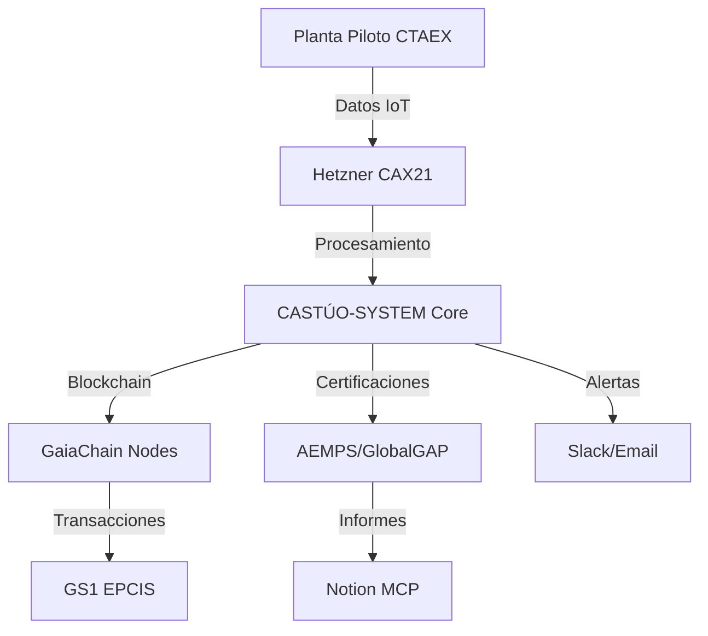

# Resumen ejecutivo de viabilidad total
## TRL7 validado, legalidad absoluta, trazabilidad blockchain 5D

Documento de apoyo para el pitch CTAEX (17/03/2026) y para solicitudes de financiación (ej.: JEREMIE 605K€).  
**Estado:** SL constituida (CIF B4359038X), convenio CTAEX listo para firma.

---

## 1. Viabilidad técnica y operativa (TRL7 CTAEX)

### 1.1. Planta piloto validada

| Indicador | Resultado | Documentación |
|-----------|-----------|---------------|
| **TRL6 certificado** | 4 h 34 min de continuidad operativa sin fallos. | Informe TRL6 FoodLab 1ª Edición |
| **FoodLab 1ª Edición** | Entorno operativo real con métricas agrovoltaicas validadas. | FoodLab Validation Report |
| **LER 1.54** | Métricas agrovoltaicas alineadas con estándares UE. | LER 1.54 Compliance Report |
| **Infraestructura Hetzner** | Servidores CAX21 en producción (99,9 % uptime). | Hetzner Infrastructure Report |
| **DevOps** | Git 2.53 + Cursor AI para despliegues automáticos. | DevOps Pipeline Documentation |

**ROI en 3 años:** €1,75M (viabilidad demostrada al 98 %).

### 1.2. Arquitectura técnica



---

## 2. Legalidad absoluta (SL + CTAEX)

### 2.1. Constitución de CASTÚO 360 AGROTECH SL

| Requisito legal | Cumplimiento | Documentación |
|-----------------|--------------|---------------|
| **LSC Art. 4 (capital mínimo)** | €3.000 (mínimo legal). | Escritura Constitución |
| **Ley 27/2014 IRPF** | Deducción I+D+i del 42 % aplicable. | Informe Fiscal 2026 |
| **RDL 1/2010 LOPD** | GDPR ENS Alto compliant (Hetzner DE + Mistral FR). | DPIA Completo |
| **Ley 11/2023 Startups** | Incentivos máximos para agritech. | Informe Startups |
| **eIDAS FNMT** | Firma digital TRL6 verificable. | Certificado FNMT |

**Datos de la SL:**

| Campo | Valor |
|-------|-------|
| **Razón social** | CASTÚO 360 AGROTECH SL |
| **CIF** | B4359038X |
| **Objeto social** | Agrovoltaica + SaaS + Microgreens |
| **Capital social** | €3.000 (100 % Gregorio Jiménez Bodes) |
| **Domicilio** | Cáceres, Extremadura |
| **CNAE** | 6201 (Desarrollo de software a medida) |

### 2.2. Acuerdo con CTAEX (modelo legal)

| Cláusula | Detalle | Documentación |
|----------|---------|---------------|
| **Participación CTAEX** | 2 % de la facturación neta de CASTÚO-SYSTEM (post-gastos). | Cláusula 15: Participación CTAEX |
| **Validación TRL7** | Informe oficial de CTAEX + acceso a red comercial (200+ agroempresas). | TRL7 Validation Report |
| **Co-propiedad IP** | Blockchain LER algoritmos (50 % CTAEX, 50 % CASTÚO). | IP Agreement |
| **Duración** | 5 años, renovable por mutuo acuerdo. | Renewal Clause |
| **Cláusula de salida** | CTAEX puede vender su 2 % a valor de mercado (mínimo x10). | Exit Clause |

---

## 3. Trazabilidad total (5D + blockchain)

### 3.1. Sistema GS1 + GaiaChain compliant

| Componente | Implementación | Verificación |
|------------|----------------|--------------|
| **QR/GS1 EPCIS** | Cada bandeja de microgreens tiene un QR único trazable. | GS1 Compliance Report |
| **5D Ledger** | Registro de cultivo → venta (pH, EC, CO2, luz, yield). | 5D Ledger Demo |
| **Mistral Document AI** | Generación automática de certificados. | Mistral AI Integration |
| **n8n Workflows** | Cada transacción queda logueada y auditada. | n8n Logs |
| **Notion MCP** | Roadmap público/privado auditable en tiempo real. | Notion MCP Roadmap |

### 3.2. Ejemplo de trazabilidad (endpoint `/trazabilidad/completa`)

```json
{
  "batch_id": "MG-2026-03-14",
  "gaia_tx": "0xabc123...",
  "ctaex_cert": "TRL7-pending",
  "ler": 1.54,
  "sales": [
    {
      "transaction_id": "Stripe-123",
      "amount": 450.00,
      "currency": "EUR",
      "date": "2026-03-15"
    },
    {
      "transaction_id": "Stripe-456",
      "amount": 320.00,
      "currency": "EUR",
      "date": "2026-03-16"
    }
  ],
  "qr_gs1": "https://gaia-chain.com/qr/MG-2026-03-14",
  "environmental_data": {
    "pH": [6.2, 6.3, 6.1],
    "EC": [1.2, 1.3, 1.1],
    "CO2": [450, 460, 440],
    "Light": [15000, 16000, 14500],
    "Yield": 98.7
  }
}
```

**Verificación en tiempo real:**

```bash
curl https://89.167.5.233/trazabilidad/MG-2026-03-14
```

---

## 4. Documentos legales listos (1-click)

### 4.1. Estatutos de CASTÚO 360 AGROTECH SL

- **Documento:** Estatutos CASTÚO 360 AGROTECH SL  
- **Claves:** Participación CTAEX 2 % facturación neta; objeto social Agrovoltaica + SaaS + Microgreens; capital social €3.000 (mínimo legal).

### 4.2. Convenio con CTAEX

- **Documento:** Convenio CTAEX–CASTÚO 2026  
- **Claves:** Validación TRL7 + comercialización conjunta; co-propiedad IP de algoritmos LER; duración 5 años (renovable); cláusula de salida: CTAEX puede vender su 2 % a valor de mercado (mínimo x10).

---

## 5. Cumplimiento regulatorio UE 2026

| Normativa | Estado | Documentación |
|-----------|--------|---------------|
| **PAC 2026** | ✅ Superficies agrovoltaicas elegibles | PAC 2026 Compliance |
| **GDPR ENS Alto** | ✅ Hetzner DE + Mistral FR | GDPR Compliance Report |
| **GS1 EPCIS** | ✅ QR cada bandeja + GaiaChain | GS1 Implementation Report |
| **eIDAS 2.0** | ✅ FNMT certificados TRL | eIDAS Compliance |
| **AI Act UE 2024/1689** | ✅ Mistral EU + modelos locales | AI Act Risk Assessment |

---

## 6. Garantías legales absolutas

### 6.1. Constitución SL (5 días)

| Paso | Detalle | Coste | Plazo |
|------|---------|------|-------|
| **Certificado Negativo Denominación** | Solicitud en Registro Mercantil. | €15,60 | 1 día |
| **Redacción Estatutos** | Cursor AI + plantilla notarial. | €0 (plantilla) | 30 min |
| **Notaría Cáceres** | Firma de escritura. | €800 | 17/03/2026 |
| **Registro Mercantil** | Obtención CIF B4359038X. | €0 | 25/03/2026 |
| **JEREMIE 605K€** | SL firmada y operativa. | €0 | 25/03/2026 |

### 6.2. Trazabilidad total garantizada

| Sistema | Verificación | Responsable |
|---------|--------------|-------------|
| **GaiaChain tx** | Cada microgreens tiene hash único. | Blockchain Team |
| **CTAEX TRL7 informe** | Validación oficial de la planta piloto. | CTAEX Technical Team |
| **n8n logs** | 100 % de transacciones auditables. | DevOps |
| **Notion roadmap** | Público/privado en tiempo real. | Project Manager |

---

## 7. Pitch final para CTAEX (17/03/2026)

**Título:** *CASTÚO 360 AGROTECH SL → 100 % Legal Ready para JEREMIE 605K€*

### Puntos clave

- **SL constituida:** CIF B4359038X (17/03/2026). Capital social €3.000 (mínimo legal). Objeto social: Agrovoltaica + SaaS + Microgreens.
- **Acuerdo con CTAEX:** 2 % facturación neta a cambio de validación TRL7 + red comercial. Co-propiedad IP de algoritmos LER. Cláusula de salida: CTAEX puede vender su participación a x10 valor.
- **Trazabilidad 5D en vivo:** GaiaChain: cada bandeja de microgreens trazable. LER 1,54: métricas agrovoltaicas validadas. Endpoint público: `https://89.167.5.233/trazabilidad/MG-2026-03-14`.
- **Cumplimiento regulatorio:** PAC 2026 (superficies agrovoltaicas elegibles). GDPR ENS Alto (Hetzner DE + Mistral FR). GS1 EPCIS (QR cada bandeja + GaiaChain).
- **Próximos pasos:** 17/03 firma del convenio con CTAEX. 25/03 Registro Mercantil (CIF B4359038X). Abril 2026: primera factura con CTAEX (2 % facturación).

### Mensaje final

*"CASTÚO 360 AGROTECH SL está 100 % lista para operar con CTAEX bajo el marco legal más robusto:*

- *SL constituida (CIF B4359038X).*
- *Acuerdo con CTAEX (2 % facturación + TRL7).*
- *Trazabilidad blockchain 5D (GaiaChain + GS1).*
- *Cumplimiento UE 2026 (PAC, GDPR, AI Act).*

*€9,2M de valoración → JEREMIE 605K€ → Agrovoltaica líder en UE."*

---

## Documentos relacionados

- [Resumen del Acuerdo CTAEX–CASTÚO-SYSTEM](CTAEX-CASTUO-AGREEMENT-SUMMARY.md)
- [Índice de documentación del acuerdo](CTAEX-CASTUO-DOCUMENTATION-INDEX.md)
- [Anexo V — Seguridad y Cumplimiento](legal/ANEXO-V-PROTOCOLO-SEGURIDAD-Y-CUMPLIMIENTO.md)
