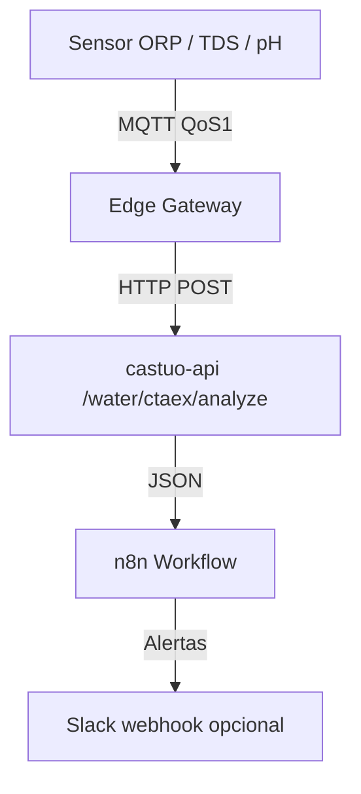

# Sistema de análisis de agua (proyecto CASTÚO / referencia CTAEX)

**Versión:** 1.7  
**Fecha:** 2026-03-28  

**Alcance:** documentación de **ingeniería de proyecto** para integrar telemetría de agua (ORP, TDS/EC, pH) con **castuo-api** y **n8n**. No constituye certificación CTAEX, garantía microbiológica ni presupuesto cerrado.

## 1. Relación con otros documentos

Este documento describe la **integración técnica** entre:

- Sensores de agua (ORP / TDS / pH)
- API de análisis (`/water/ctaex/analyze`)
- Workflow de n8n para procesamiento de alertas

**No sustituye:**

- Certificación oficial CTAEX  
- Análisis de laboratorio acreditado  
- Libro de campo regulatorio  
- Garantías de equipos  

Referencias: [CTAEX-PROTOTYPE-10M2-MQTT-N8N.md](./CTAEX-PROTOTYPE-10M2-MQTT-N8N.md), [LATENCY-ZERO-OPERATIONAL-TARGET.md](../architecture/LATENCY-ZERO-OPERATIONAL-TARGET.md).

## 2. Arquitectura



En `backend/main.py` el módulo `water_ctaex` se monta **dos veces** (sin `api_router` global, para no romper el resto de rutas):

- `app.include_router(water_ctaex.water_ctaex_router)` → `/water/ctaex/...`  
- `app.include_router(water_ctaex.water_ctaex_router, prefix="/api/v1")` → `/api/v1/water/ctaex/...`

## 3. Endpoints

### 3.1. Análisis — `POST /water/ctaex/analyze`

También: `POST /api/v1/water/ctaex/analyze`.

**Request body:**

```json
{
  "sensor_type": "orp",
  "sensor_value": 620.5,
  "historical_data": [
    {"sensor_value": 650, "timestamp": "2026-03-28T10:00:00Z"}
  ]
}
```

**Response (ejemplo ORP = 620.5, warning):**

```json
{
  "status": "success",
  "sensor_type": "orp",
  "current_value": 620.5,
  "analysis": {
    "status": "warning",
    "current_value": 620.5,
    "historical_avg": 650,
    "trend": "falling",
    "project_thresholds": {
      "critical": 600,
      "warning": 650,
      "optimal_min": 650,
      "optimal_max": 750
    },
    "ctaex_reference": {
      "min_recommended": 600,
      "optimal_range": [650, 750]
    }
  },
  "ollama_analysis": {
    "model_used": "llama3.2:3b",
    "analysis": "Texto breve generado por modelo remoto (si OLLAMA_API_KEY está definida y la llamada tiene éxito).",
    "timestamp": "2026-03-28T12:34:56.789012+00:00"
  },
  "recommendations": [
    "Monitorear ORP cada 15 minutos (actual: 620.5mV)",
    "Revisar registros históricos para identificar patrones",
    "Notificar al equipo de mantenimiento si persiste",
    "IA (Ollama, resumen): …"
  ],
  "disclaimer": "Este análisis se basa en umbrales… (si hay Ollama, se añade nota sobre modelo remoto).",
  "timestamp": "2026-03-28T12:34:56.789012+00:00"
}
```

Si `OLLAMA_API_KEY` no está definida, `ollama_analysis.model_used` será `disabled` y no se añade línea `IA (Ollama, resumen)`. Si la API falla, `model_used` será `fallback`.

**Notas ORP:**

- **580** → `status: "critical"` (580 &lt; 600)  
- **620** → `status: "warning"` (600 ≤ 620 &lt; 650)  
- **700** → `status: "optimal"` (650 ≤ 700 ≤ 750)  

**cURL:**

```bash
curl -X POST "http://127.0.0.1:8000/water/ctaex/analyze" \
  -H "Content-Type: application/json" \
  -d '{
    "sensor_type": "orp",
    "sensor_value": 580,
    "historical_data": [
      {"sensor_value": 650, "timestamp": "2026-03-28T10:00:00Z"}
    ]
  }'
```

### 3.2. Health — `GET /water/ctaex/health`

También: `GET /api/v1/water/ctaex/health`.

```json
{
  "status": "healthy",
  "endpoints": [
    {
      "path": "/water/ctaex/analyze",
      "method": "POST",
      "description": "Analiza datos de sensores de agua (ORP/TDS/pH)"
    }
  ],
  "timestamp": "2026-03-28T12:34:56.789012+00:00",
  "version": "1.7",
  "ollama_configured": true,
  "water_quota_enforcement": false,
  "subscription_plans": "/water/ctaex/subscription/plans",
  "water_quota_db": "backend/db/water_ctaex_usage.db"
}
```

### 3.3. Ollama Cloud (opcional)

Variables: `OLLAMA_API_KEY`, `OLLAMA_BASE_URL` (por defecto `https://api.ollama.com/v1`), `OLLAMA_MODEL`. El backend usa **`httpx`** contra `POST …/chat/completions` (API compatible OpenAI). No hace falta `pip install ollama` en el contenedor de la API.

### 3.4. Monetización SaaS (opcional)

- `GET /water/ctaex/subscription/plans` — catálogo público (EUR/mes orientativo, `name` / `description` por plan).
- `GET /water/ctaex/subscription/usage-report?limit=100&plan_id=basic` — trazas recientes (**`key_hash`**, no la clave). Cuerpo JSON: `items` y `report` (mismo array), `generated_at`, `db_path`. Requiere `WATER_USAGE_REPORT_KEY` en el servidor y cabecera **`X-USAGE-REPORT-KEY`** con el mismo valor.
- `POST /water/ctaex/subscription/upgrade` — puente comercial (enterprise → contacto; resto → integrar pago / asignar claves).
- Si `WATER_CTAEX_ENFORCE_QUOTA=1`: `POST /analyze` exige cabecera **`X-API-KEY`**, aplica límites mensuales (`WATER_API_KEY_TO_PLAN` JSON: clave → `free` \| `basic` \| `pro` \| `enterprise`) y desactiva Ollama en plan **free** aunque exista `OLLAMA_API_KEY` en el servidor.
- **SQLite:** `backend/db/water_ctaex_usage.db` — tablas `monthly_usage` (conteo por mes UTC `YYYYMM`) y `usage_logs` (trazabilidad de peticiones OK con resumen de entrada; sin almacenar la API key en claro). Si existía `backend/water_ctaex_usage.db` antiguo, se copia una vez al nuevo path.
- Con cuota **desactivada** (por defecto), el comportamiento es el anterior (n8n solo con `CASTUO_API_KEY` si lo usáis en el nodo HTTP).

**Scripts:** `python scripts/reset_water_quotas.py` (vaciar solo `monthly_usage`); `python scripts/reset_water_ctaex_usage.py` (vaciar contadores y logs).

**Consulta directa (ejemplo):**

```bash
sqlite3 backend/db/water_ctaex_usage.db "SELECT period, key_hash, count FROM monthly_usage ORDER BY period DESC LIMIT 20;"
sqlite3 backend/db/water_ctaex_usage.db "SELECT plan_id, period, http_status, request_timestamp FROM usage_logs ORDER BY id DESC LIMIT 20;"
```

### 3.5. Sistema de suscripciones y Stripe (referencia)

Este repositorio **no** expone rutas globales `GET /subscriptions/plans` como en tutoriales genéricos. El catálogo de planes de agua es:

- **`GET /water/ctaex/subscription/plans`** (también bajo **`/api/v1/water/ctaex/subscription/plans`**).

| Plan | Precio/mes (orientativo) | Requests/mes | Ollama | Automatón (roadmap) |
|------|---------------------------|---------------|--------|----------------------|
| free | €0 | 50 | No | No |
| basic | €49 | 500 | Sí | No |
| pro | €149 | 5.000 | Sí | Sí (flag en catálogo) |
| enterprise | A medida | Ilimitado | Sí | Sí |

**Stripe:** el checkout ya integrado en CASTÚO está en **`POST /ecommerce/create-checkout`** (router CTAEX, roles `admin` / `ecommerce`; variables `STRIPE_SECRET` o `STRIPE_SECRET_KEY`). Tras cobrar, asigna la clave del cliente en `WATER_API_KEY_TO_PLAN` o automatiza con vuestro webhook. No hace falta Alembic ni tablas `subscription_plans` en PostgreSQL para el flujo mínimo de agua descrito aquí.

**Variables típicas:** `STRIPE_SECRET_KEY`, `STRIPE_WEBHOOK_SECRET`, `FRONTEND_URL` (ver `.env.example`).

**Reset manual:** `python scripts/reset_water_quotas.py` (mensual) o `python scripts/reset_water_ctaex_usage.py` (borrar todo incl. logs).

**n8n con cuotas:** el workflow ya envía `X-API-KEY` desde `CASTUO_API_KEY`; con `WATER_CTAEX_ENFORCE_QUOTA=1` esa clave debe existir en `WATER_API_KEY_TO_PLAN`.

### 3.6. Facturación (billing) — monetización operativa

- **Registro de cliente (datos de factura, sin guardar la clave en SQLite):** `POST /water/ctaex/subscription/register` con JSON `api_key`, `plan_id`, `customer_name`, `customer_email` y cabecera **`X-BILLING-REGISTER-KEY`** = `WATER_BILLING_REGISTER_KEY` (definir en `.env`; si no está, el endpoint responde 404).
- **Resumen mensual:** `GET /water/ctaex/subscription/billing-summary?year=YYYY&month=M` + **`X-USAGE-REPORT-KEY`**. Respuesta JSON incluye:
  - `period` / `period_yyyymm`
  - `customers`: filas de `billing_customers` con `plan_name`, `requests_in_period` (conteo en `usage_logs` para ese mes)
  - `plans`: agregado por `plan_id` (precios desde catálogo en código, no tabla SQL duplicada)
  - `invoices`: `{ "count", "total_eur" }` para facturas con ese `period_yyyymm`
- **Generar borradores de factura:** `POST /water/ctaex/subscription/generate-invoices?year=YYYY&month=M` + **`X-USAGE-REPORT-KEY`**. Respuesta incluye `status`, `period`, `invoices_generated`, `invoices`. Inserta filas en tabla `invoices` (importe según `price_eur_month` del plan; omite planes sin precio fijo &gt; 0).
- **Enviar factura por email:** `POST /water/ctaex/subscription/send-invoice?invoice_number=INV-…` + **`X-USAGE-REPORT-KEY`**. Respuesta: `sent` (true si SMTP configurado y envío correcto).
- **Consultar una factura:** `GET /water/ctaex/subscription/invoice/{invoice_number}` + **`X-USAGE-REPORT-KEY`**.
- **Email:** `backend/services/billing_utils.py` + plantilla `backend/templates/billing/invoice_email.html` (SMTP: `SMTP_HOST`, `SMTP_PORT`, `SMTP_USERNAME`, `SMTP_PASSWORD`, `SMTP_FROM_EMAIL`).
- **Scripts:** `python scripts/smoke_test.py` (health → register → analyze → facturación → uso; requiere cuota activa y la clave de prueba en `WATER_API_KEY_TO_PLAN`), `python scripts/notifications.py` (stub), `python scripts/reset_quotas.py`, `python scripts/generate_invoices.py`, `python scripts/send_invoices.py`, `python scripts/send_reminders.py`, `python scripts/generate_api_keys.py`.

```bash
curl -s -X POST "http://127.0.0.1:8000/water/ctaex/subscription/register" \
  -H "Content-Type: application/json" \
  -H "X-BILLING-REGISTER-KEY: $WATER_BILLING_REGISTER_KEY" \
  -d '{"api_key":"clave-cliente","plan_id":"basic","customer_name":"Nombre","customer_email":"a@b.c"}'
```

### 3.8. Endpoints y scripts de administración

**POST** `/water/ctaex/subscription/generate-invoices?year=YYYY&month=M` + `X-USAGE-REPORT-KEY` — respuesta incluye `status`, `period`, `period_yyyymm`, `invoices_generated`, `invoices`, `timestamp`.

**POST** `/water/ctaex/subscription/send-invoice?invoice_number=INV-…` + `X-USAGE-REPORT-KEY` — `sent`, `timestamp`.

**GET** `/water/ctaex/subscription/certification?year=&month=` + `X-USAGE-REPORT-KEY` — informe JSON (facturas del mes, muestra de `usage_logs`, resumen; no sustituye auditoría externa).

**Scripts:** `python scripts/smoke_test.py`, `python scripts/monitoring.py` (JSON a stdout), `python scripts/certification.py --year Y --month M`, `python scripts/monthly_report.py --year Y --month M`, `python scripts/backup_restore.py --backup`, `python scripts/migrate_clients.py --csv clientes.csv`, `python scripts/notifications.py` (umbral ≥80 % por defecto; `WATER_QUOTA_ALERT_THRESHOLD`), `bash scripts/complete_monthly_billing.sh` (mes anterior + reset + envío + recordatorios).

### 3.9. Roles de IA y blueprint EU (soberanía del dato)

Referencias **Claude Code / asistentes EU-first** cuando la política interna exija minimizar flujos de datos fuera del operador. El blueprint organizativo vive en `config/castuo_enterprise_eu.json` (regenerable con `python scripts/seed_enterprise_eu_json.py`).

**Cabecera:** `X-AI-KEY` = `AI_INTEGRATION_KEY` (comparación en tiempo constante; si no coincide → 404).

| Rol | Método | Ruta |
|-----|--------|------|
| Gestor de cuentas | POST | `/water/ctaex/subscription/ai/register` (body igual que `/subscription/register`; requiere `AI_ACCOUNT_MANAGER_ENABLED=1` para éxito operativo) |
| Analista financiero | GET | `/water/ctaex/subscription/ai/monitoring?year=&month=` (resumen + certificación; `AI_FINANCIAL_ANALYST_ENABLED=1`) |
| Soporte técnico | GET | `/water/ctaex/subscription/ai/health` (`GET {API_BASE_URL}/water/ctaex/health` desde el contenedor; `AI_TECHNICAL_SUPPORT_ENABLED=1`) |
| Blueprint empresa | GET | `/water/ctaex/subscription/ai/enterprise-blueprint` |

```bash
curl -s -X POST "http://127.0.0.1:8000/water/ctaex/subscription/ai/register" \
  -H "Content-Type: application/json" -H "X-AI-KEY: $AI_INTEGRATION_KEY" \
  -d '{"api_key":"clave","plan_id":"basic","customer_name":"N","customer_email":"a@b.c"}'

curl -s "http://127.0.0.1:8000/water/ctaex/subscription/ai/monitoring" -H "X-AI-KEY: $AI_INTEGRATION_KEY"
curl -s "http://127.0.0.1:8000/water/ctaex/subscription/ai/health" -H "X-AI-KEY: $AI_INTEGRATION_KEY"
curl -s "http://127.0.0.1:8000/water/ctaex/subscription/ai/enterprise-blueprint" -H "X-AI-KEY: $AI_INTEGRATION_KEY"
```

**Producción (`https://api.castuo-system.es`)** — las rutas **no** son `/subscription/ai/...` en la raíz: el prefijo del router es **`/water/ctaex`**. Salvo que un API Gateway reescriba internamente, la URL completa es:

| Acción | URL correcta |
|--------|----------------|
| Blueprint | `GET https://api.castuo-system.es/water/ctaex/subscription/ai/enterprise-blueprint` |
| Registro IA | `POST https://api.castuo-system.es/water/ctaex/subscription/ai/register` |
| Health IA | `GET https://api.castuo-system.es/water/ctaex/subscription/ai/health` |
| Monitoring | `GET https://api.castuo-system.es/water/ctaex/subscription/ai/monitoring` |

**Cabecera:** en **todas** las peticiones anteriores va `X-AI-KEY: <AI_INTEGRATION_KEY>` (incluido blueprint y GET).

**Body de registro:** el JSON debe incluir `api_key`, `plan_id`, `customer_name`, `customer_email` (mismo contrato que `POST /water/ctaex/subscription/register`). Un solo `customer_id` **no** es válido para este endpoint.

```bash
export CASTUO_API="https://api.castuo-system.es"
export AI_INTEGRATION_KEY="tu_integration_key"

curl -sS "$CASTUO_API/water/ctaex/subscription/ai/enterprise-blueprint" \
  -H "X-AI-KEY: $AI_INTEGRATION_KEY"

curl -sS -X POST "$CASTUO_API/water/ctaex/subscription/ai/register" \
  -H "Content-Type: application/json" \
  -H "X-AI-KEY: $AI_INTEGRATION_KEY" \
  -d '{
    "api_key": "clave-api-cliente-min-8-chars",
    "plan_id": "basic",
    "customer_name": "Cliente CTAEX001",
    "customer_email": "contacto@ejemplo.es"
  }'

curl -sS "$CASTUO_API/water/ctaex/subscription/ai/health" \
  -H "X-AI-KEY: $AI_INTEGRATION_KEY"

curl -sS "$CASTUO_API/water/ctaex/subscription/ai/monitoring?year=2026&month=3" \
  -H "X-AI-KEY: $AI_INTEGRATION_KEY"
```

`month` en monitoring es opcional (por defecto mes UTC actual). Solo `?year=2026` sin mes usa el **mes actual** del servidor en 2026 cuando corresponda.

En Docker, `API_BASE_URL` por defecto puede ser `http://api:8000` para que el chequeo de salud resuelva el servicio interno.

## 4. Integración con n8n

Archivo: `n8n/workflows/castuo_n8n_water_mqtt_analysis.json`.

1. **MQTT Trigger:** `castuo/water/sensor/+` (QoS 1) — equivalente a orp / tds / ph.  
2. **Prepare_Analysis_Data** (Code v2): topic → `sensor_type`, payload numérico.  
3. **Call_CASTUO_Water_Analysis_API:** `POST {CASTUO_BASE_URL}/water/ctaex/analyze` con cabecera `X-API-KEY` si aplica (`CASTUO_API_KEY`).  
4. **Process_API_Response:** marca `alert` si `analysis.status === "critical"`; expone `ollama_model` / `ollama_ia_active` si la respuesta incluye `ollama_analysis`. Timeout HTTP del nodo 120 s (llamada IA).  
5. **IF_Critical** → **Notify_Critical_Slack_Webhook** (desactivado por defecto; `SLACK_WEBHOOK_WATER` o `SLACK_WEBHOOK`).

Variables de entorno típicas: `CASTUO_MQTT_BROKER`, `CASTUO_MQTT_USER`, `CASTUO_MQTT_PASS`, `CASTUO_BASE_URL`, `CASTUO_API_KEY`.

Prueba MQTT:

```bash
mosquitto_pub -h localhost -t "castuo/water/sensor/orp" -m "580" -q 1
```

### 4.1. Topics MQTT

| Topic | QoS | Descripción | Ejemplo payload |
|-------|-----|-------------|-----------------|
| `castuo/water/sensor/orp` | 1 | ORP en mV | `650.5` |
| `castuo/water/sensor/tds` | 1 | TDS en ppm | `45.2` |
| `castuo/water/sensor/ph` | 1 | pH | `6.2` |

## 5. Umbrales configurados

| Parámetro | Crítico | Advertencia | Óptimo (referencia) | Unidad |
|-----------|---------|-------------|---------------------|--------|
| ORP | &lt; 600 | &lt; 650 | 650–750 | mV |
| TDS | &gt; 50 | &gt; 40 | &lt; 40 | ppm |
| pH | &lt; 5.5 o &gt; 6.5 | &lt; 5.8 o &gt; 6.2 | 5.8–6.2 | — |

## 6. Sensores reales (Atlas / EZO)

- Conexión: **I2C o UART** según montaje.  
- Calibración y limpieza según fabricante.  
- Firmware: publicar valor numérico en los topics anteriores; el repositorio no impone una librería C++ concreta.

## 7. Persistencia opcional

```bash
psql -U postgres -d sabionda -f backend/models/migrations/optional_water_ctaex_tables.sql
```

## 8. Expansión futura

- **LangGraph / Mistral:** encadenar otro nodo HTTP tras el análisis por reglas.  
- **Prometheus / Grafana:** exponer métricas desde la app o desde n8n según política de observabilidad.

Ejemplo orientativo Prometheus:

```yaml
scrape_configs:
  - job_name: "water_system"
    scrape_interval: 15s
    metrics_path: "/metrics"
    static_configs:
      - targets: ["localhost:8000"]
```

## 9. Integración Ollama Cloud (referencia operativa)

### 9.1. Configuración

Copia `.env.example` → `.env` y define (sin commitear secretos):

```bash
OLLAMA_API_KEY=tu_clave_real
OLLAMA_BASE_URL=https://api.ollama.com/v1
OLLAMA_MODEL=llama3.2:3b
# LANGSMITH_API_KEY=   # opcional, trazas LangSmith; no requerido por /water/ctaex
```

En `docker-compose.yml` del repositorio el servicio de la API se llama **`api`** (no `castuo-api`); las variables `OLLAMA_*` ya están referenciadas ahí y en `n8n`.

### 9.2. Respuesta del endpoint

Incluye `analysis` (umbrales), `ollama_analysis` (`model_used`, `analysis`, `timestamp`; `disabled` / `fallback` si no hay clave o falla la llamada), `recommendations` y `disclaimer`.

### 9.3. Ejemplo

```bash
curl -s -X POST "http://127.0.0.1:8000/water/ctaex/analyze" \
  -H "Content-Type: application/json" \
  -d '{
    "sensor_type": "orp",
    "sensor_value": 580,
    "historical_data": [
      {"sensor_value": 650, "timestamp": "2026-03-28T10:00:00Z"}
    ]
  }'
```

### 9.4. Códigos HTTP habituales

| Código | Significado | Notas |
|--------|-------------|--------|
| 200 | Éxito | Si Ollama falla, igualmente 200 con `ollama_analysis.model_used: fallback` |
| 400 | `sensor_type` inválido | Solo `orp`, `tds`, `ph` |
| 500 | Error interno no previsto | Revisar logs del API |

No se expone un **503** específico para Ollama: el fallo de IA se indica en el cuerpo JSON (`fallback`).

### 9.5. Coexistencia con Mistral

El repositorio puede seguir usando **Mistral** en otros módulos (`MISTRAL_API_KEY`). La ruta agua no sustituye automáticamente Mistral por Ollama; son integraciones independientes.

Guía paso a paso en Cursor: [CURSOR-SETUP-WATER-OLLAMA.md](./CURSOR-SETUP-WATER-OLLAMA.md).

## 10. Limitaciones

- Umbrales específicos del proyecto; no son “oficiales CTAEX” por el solo hecho de documentarse aquí.  
- Certificación y muestreo microbiológico son externos al API.  
- Validar umbrales con ensayos reales antes de escalar.

## 11. Historial de cambios

| Versión | Fecha | Cambios |
|---------|--------|---------|
| 1.0 | 2026-03-25 | Versión inicial del sistema |
| 1.1 | 2026-03-28 | Router `water_ctaex_router`, OpenAPI con `Field`, health `version`, disclaimer ampliado, SQL/n8n/doc alineados; ORP 580→critical, 620→warning documentado |
| 1.2 | 2026-03-28 | Campo `ollama_analysis` (Ollama Cloud vía `httpx` + API OpenAI-compatible); health `ollama_configured`; compose/.env.example; n8n timeout 120 s |
| 1.3 | 2026-03-28 | Sección 9 Ollama operativa; health 3.2 alineado a v1.2; guía [CURSOR-SETUP-WATER-OLLAMA.md](./CURSOR-SETUP-WATER-OLLAMA.md) |
| 1.4 | 2026-03-28 | Cuotas opcionales por `X-API-KEY`, planes públicos, upgrade stub; health v1.3 |
| 1.5 | 2026-03-28 | §3.5 suscripciones/Stripe; `automaton_included` en catálogo; script reset cuotas; compose Stripe/FRONTEND_URL |
| 1.6 | 2026-03-28 | DB bajo `backend/db/`; `usage_logs` + informe con `X-USAGE-REPORT-KEY`; health v1.4 |
| 1.7 | 2026-03-28 | Billing: `billing_customers`/`invoices`, register + generate + SMTP; health v1.5 |

## 12. Resumen de implementación (código)

| Componente | Ubicación |
|------------|-----------|
| Router | `backend/routers/water_ctaex.py` (`water_ctaex_router`, alias `router`) |
| Cuotas / planes | `backend/services/water_ctaex_plans.py` |
| Facturación | `backend/services/water_billing.py`, `backend/services/billing_utils.py` |
| Plantilla email | `backend/templates/billing/invoice_email.html` |
| Montaje API | `backend/main.py` — dos prefijos como arriba |
| Paquete routers | `backend/routers/__init__.py` — `water_ctaex`, `water_ctaex_router` |
| SQL opcional | `backend/models/migrations/optional_water_ctaex_tables.sql` |
| n8n | `n8n/workflows/castuo_n8n_water_mqtt_analysis.json` |
| Reset cuotas (dev) | `scripts/reset_water_ctaex_usage.py`, `scripts/reset_water_quotas.py` |
