# 🌎 CASTÚO-SYSTEM™ | Arquitectura Global v9.0

**Propósito supremo (2026–2031)**: Establecer CASTÚO-SYSTEM™ como el estándar global de agrotech autónoma, operando en 5 continentes con:

- **Núcleo 100 % europeo** (GDPR, AI Act, PAC 2027) + adaptaciones locales legales.
- **9.100 farms en 50 países** con ROI 50.000x y trazabilidad blockchain auditada (GaiaChain + GS1 EPCIS).
- **Cumplimiento legal por continente**:
  - **América**: USDA/FDA (USA), SAG (Chile), SENASA (Argentina).
  - **Europa**: AEMPS (ES), ANSM (FR), BfArM (DE).
  - **Asia**: MHLW (JP), GACC (CN), FSSAI (IN).
  - **África**: SAHPRA (ZA), ANSES (MA).
  - **Oceanía**: FSANZ (AU), MPI (NZ).
- **Protección anti-fraude global**: HSM (Thales Luna) + Zero Trust + Chainalysis; detección de anomalías (Isolation Forest + SHAP); blockchain inmutable (GaiaChain + IPFS) con notarización DocuSign.
- **Métricas internacionales**: Yield (FAO/OCDE), huella de carbono (ISO 14064), ROI adaptado a subvenciones locales (PAC UE, USDA USA, JAS Japón).
- **Replicabilidad legal**: Contratos inteligentes por continente (Solidity + adaptaciones locales); auditorías locales anuales (Fraunhofer UE, SGS Asia, USDA América).

---

## 🌎 Arquitectura global v9.0 (20 módulos)

Diseñada para coherencia internacional y protección anti-fraude.

```mermaid
graph TD
    A[Usuario Global] --> B[Frontend: Next.js + i18n + Adaptación Cultural]
    B --> C[API Gateway: FastAPI + OAuth2 + Geobloqueo]
    C --> D[Microservicios]
    D --> E1[Europa: GDPR/AI Act/PAC 2027]
    D --> E2[América: USDA/FDA/SAG]
    D --> E3[Asia: MHLW/GACC/FSSAI]
    D --> E4[África: SAHPRA/ANSES]
    D --> E5[Oceanía: FSANZ/MPI]
    D --> E6[Blockchain: GaiaChain + IPFS + Notarización]
    D --> E7[IoT: Libelium + Sigfox + Adaptación Local]
    D --> E8[Legal: Contratos Inteligentes por Continente]
    D --> E9[Seguridad: HSM + Zero Trust + Darktrace]
    D --> E10[Anti-Fraude: Chainalysis + IA + Listas Negras]
    D --> E11[Sostenibilidad: ISO 14064 + Adaptación Climática]
    D --> E12[Sabionda Educa: Moodle + NFTs + Universidades Locales]
    D --> E13[Integración: SAP/ERP Local + Cursor]
    D --> E14[Métricas: FAO/OCDE/ISO + Conversión Automática]
    D --> E15[Emergencia: Protocolos Locales + GaiaChain]
    D --> E16[Auditoría: Fraunhofer + Locales SGS/USDA]
    D --> E17[Tono: Adaptación Cultural + Extremeño Base]
    D --> E18[Cursor: Automatización Global Coherente]
    D --> E19[Contingencia: Fallback por Continente]
    D --> E20[Compliance: Adaptación Legal Automática]
    E6 --> F1[Notarización: DocuSign + Blockchain]
    E8 --> F2[Contratos: Solidity + Adaptación Local]
    E9 --> F3[HSM: Thales Luna + Claves por Región]
    E10 --> F4[Chainalysis: Análisis de Transacciones]
    E12 --> F5[NFTs: Certificados + Universidades Locales]
    E14 --> F6[FAO: Conversión Automática de Métricas]
    E16 --> F7[Auditorías: Fraunhofer UE + SGS Asia + USDA América]
    E18 --> F8[Cursor: Workflows por Continente]
```

---

## 1. Núcleo europeo (inquebrantable)

- **Servidores**: OVH (Europa) + backups en Suiza.
- **Blockchain**: GaiaChain (nodos UE) + IPFS.
- **Legal**: GDPR ENS Alto + AI Act 2024/1689 + PAC 2027.
- **Seguridad**: HSM (Thales Luna) + Zero Trust.

Contrato: `contracts/global/EUCore.sol`.

---

## 2. Cumplimiento por continente

| Continente | Países clave | Normativas | Adaptación Sabionda | Contrato |
|------------|--------------|------------|---------------------|----------|
| Europa | España, Francia, Alemania | GDPR, AI Act, PAC 2027 | DPO + registro AEPD | EUCore.sol |
| América | EE.UU., Chile, Argentina | USDA, FDA, SAG, SENASA | Certificación USDA + trazabilidad FDA | AmericasCompliance / ChileCompliance.sol |
| Asia | Japón, China, India | MHLW, GACC, FSSAI | JAS (Japón), GACC (China) | JapanCompliance.sol |
| África | Sudáfrica, Marruecos | SAHPRA, ANSES | Exportación africana | AfricaCompliance.sol |
| Oceanía | Australia, Nueva Zelanda | FSANZ, MPI | Bioseguridad | OceaniaCompliance.sol |

Contratos: `contracts/global/JapanCompliance.sol`, `contracts/global/ChileCompliance.sol`.

---

## 3. Seguridad anti-fraude global

| Capa | Tecnología | Implementación | Herramienta |
|------|------------|----------------|-------------|
| Autenticación | HSM + 2FA | Claves en HSM, backup Suiza | Thales Luna HSM |
| Red | Zero Trust (Cloudflare) | Microsegmentación + geobloqueo | Cloudflare Enterprise |
| Datos | AES-256 + TLS 1.3 | Cifrado tránsito/reposo | OpenSSL |
| Comportamiento | IA (Isolation Forest + SHAP) | Anomalías por región | Scikit-learn |
| Blockchain | GaiaChain + Chainalysis | Transacciones sospechosas | Chainalysis API |
| Legal | Contratos inteligentes | Cláusulas por continente | OpenZeppelin |
| Física | Centros regionales | UE (OVH) + Asia (Alibaba) + América (AWS) | Multi-Cloud |
| Anti-Fraude | Listas negras globales | IPs/wallets (Interpol + Chainalysis) | Chainalysis + Interpol API |
| Contingencia | Fallback por continente | Modo degradado (ej. AEMPS → LIMS) | Redis + Kubernetes |

Código: `backend/services/chainalysis_fraud.py`, `backend/services/carbon_footprint.py`.

---

## 4. Métricas internacionales (FAO/OCDE/ISO)

| Métrica | Estándar | Adaptación Sabionda | Fuente | Conversión |
|---------|----------|---------------------|--------|------------|
| Yield (t/ha) | FAO | Conversión automática por cultivo | FAOSTAT API | kg → t |
| Huella de carbono | ISO 14064 | Factores de emisión por país/región | ISO 14064-1 | kg CO₂/ha |
| Consumo de agua | OCDE | Metodología OCDE por clima | OCDE Water | m³ → L/ha |
| ROI | IFRS | Normas contables por país | IFRS 16 | €/$/¥/₩ |
| Calidad suelo | ISO 11074 | Sensores Libelium + laboratorios locales | ISO 11074:2015 | pH, % MO |
| Energía | ISO 50001 | Contadores inteligentes | ISO 50001:2018 | kWh → MWh |

Código: `backend/services/carbon_footprint.py` (factores por país).

---

## 5. Trazabilidad global (GaiaChain + GS1 EPCIS)

| Continente | Estándar | Integración Sabionda | Ejemplo evento |
|------------|----------|----------------------|----------------|
| Europa | GS1 EPCIS v2.0 | Eventos estándar + AEMPS | EPCIS EU |
| América | PTI (Produce Traceability) | Mapeo EPCIS → PTI + USDA | EPCIS US |
| Asia | JGS (Japan GAP) | JGS + MHLW | EPCIS JP |
| África | AFRIM | SAHPRA (ZA) | EPCIS ZA |
| Oceanía | FSANZ Traceability | Bioseguridad AU/NZ | EPCIS AU |

Ejemplo EPCIS Japón (JGS): ver sección en doc de trazabilidad o `docs/traceability/EPCIS-JP-example.json`.

---

## 6. Anti-fraude por región

| Región | Amenaza principal | Protocolos Sabionda | Herramienta |
|--------|-------------------|----------------------|-------------|
| Europa | Phishing + Ransomware | Darktrace + listas negras UE | Darktrace |
| América | Fraude en pagos | Chainalysis + KYC (Jumio) | Chainalysis + Jumio |
| Asia | DDoS | Cloudflare + HSM | Cloudflare + Thales HSM |
| África | Fraude en certificaciones | Blockchain + auditorías locales | GaiaChain + SGS |
| Oceanía | Robo de datos | AES-256 + MFA | Duo Security |

---

## 7. Replicabilidad legal (contratos por continente)

| Continente | País | Requisitos | Contrato | Validación |
|------------|------|------------|----------|------------|
| Europa | España | RD 903/2025 | EU/SpainCompliance | AEMPS |
| Europa | Francia | Arrêté 22 août 2021 | EU/FranceCompliance | ANSM |
| América | EE.UU. | Farm Bill 2018 | Americas/USCompliance | USDA |
| América | Chile | Ley 20.000 | ChileCompliance.sol | SAG |
| Asia | Japón | Ley Cannabis 2023 | JapanCompliance.sol | MHLW |
| Asia | China | GB Standards | Asia/ChinaCompliance | GACC |
| África | Sudáfrica | Ley Cannabis 2021 | Africa/SouthAfricaCompliance | SAHPRA |
| Oceanía | Australia | TGA (cannabis medicinal) | Oceania/AustraliaCompliance | TGA |

---

## 8. Adaptación cultural (tono + UX)

| Continente | Cultura | Tono Sabionda | Ejemplo |
|------------|---------|---------------|---------|
| Europa | Directo + técnico | Extremeño base + datos técnicos | "¡Hostia, crack! Tu rucola está a 99.2% de yield. ¿Probamos con broccoli?" |
| América | Pragmático + motivador | Resultados y ROI | "Great job! Your yield is 27% above average. Let's optimize for 62x ROI." |
| Asia | Formal + respetuoso | Técnico con honoríficos | "敬具, [Apellido]-様. お客様のルッコラの収量は99.2%に達し…" |
| África | Cálido + comunitario | Beneficios comunitarios | "Mashujaa, mazao yako ya rucola yamefikia asilimia 99.2! …" |
| Oceanía | Relajado + práctico | Lenguaje sencillo | "G'day mate! Your rucola's at 99.2% yield. How about broccoli for 62x ROI?" |

**Estructura de respuesta adaptable**: 🌍 Saludo cultural → 📊 Datos (FAO/OCDE) → 💡 Acción local → 🚀 Resultado → 🔒 Cumplimiento local + GaiaChain → 💰 Beneficio (moneda local) → 🎓 Educación → 🌎 Éxito en región similar → 🛡️ Barreras → Cierre local.

---

## 9. Integración Cursor (automatización global)

- **Workflow**: `.github/workflows/global-certify.yml` — matriz por país (ES, US, JP, ZA, AU); validate local → register GaiaChain → issue certificate local.
- **Scripts**: `scripts/validate_JP.py`, `scripts/validate_<country>.py`, `scripts/issue_certificate_<country>.py`.
- **Despliegue**: `cursor deploy --env production --region EU|ASIA|AMERICAS` (cuando esté soportado).

---

## 10. Roadmap global 2026–2031 (5 continentes)

| Año | Hito | KPI | Regiones | Herramienta | Presupuesto |
|-----|------|-----|----------|-------------|-------------|
| 2026 | Sabionda Educa v1.0 | 500 alumnos | UE | Moodle + GaiaChain | €30.000 |
| 2026 | ISO 27001 | 0 no conformidades | Global | AENOR | €25.000 |
| 2027 | Francia/Alemania | 5.000 farms | UE | HubSpot CRM | €50.000 |
| 2027 | Normativas asiáticas | 3 países (JP, CN, IN) | Asia | Local Legal APIs | €75.000 |
| 2027 | USDA/FDA | 100 % cumplimiento | América | USDA API | €60.000 |
| 2028 | ISO 14064 | Reducción 50 % CO₂ | Global | SGS | €40.000 |
| 2028 | Piloto Japón/Corea | 500 farms | Asia | MHLW/KOLAS | €100.000 |
| 2029 | Mercado USA | 2.000 farms | América | Stripe + USDA | €150.000 |
| 2029 | Expansión África (ZA/MA) | 1.000 farms | África | SAHPRA/ANSES | €80.000 |
| 2030 | Validación Fraunhofer Global | Informe sin observaciones | Global | Fraunhofer API | €50.000 |
| 2030 | IPO Euronext Growth | €82M valuation | Global | Euronext Connect | €200.000 |
| 2031 | Cobertura 5 continentes | 9.100 farms | Global | Multi-Cloud | €500.000 |

Detalle: [Roadmap-Global-2026-2031-v9.md](../operations/Roadmap-Global-2026-2031-v9.md).

---

## Checklist de implementación global v9.0

| Módulo | Estado | Responsable | Plazo | Presupuesto | Métrica de éxito |
|--------|--------|-------------|--------|-------------|------------------|
| Núcleo Europeo | ✅ Implementado | Seguridad | Q1 2026 | €50.000 | 100 % GDPR/AI Act |
| Contratos por Continente | ⏳ En progreso | Legal Team | Q2 2026 | €75.000 | 5 contratos implementados |
| Métricas FAO/OCDE | ✅ Implementado | IA Team | Q1 2026 | €20.000 | 100 % conversión automática |
| Anti-Fraude Global | ⏳ En progreso | Seguridad | Q3 2026 | €100.000 | 0 incidentes fraude 2026 |
| Trazabilidad por Región | ✅ Implementado | Backend Team | Q2 2026 | €30.000 | 100 % eventos EPCIS válidos |
| Adaptación Cultural | ✅ Implementado | UX Team | Q1 2026 | €15.000 | NPS > 70 todas las regiones |
| Integración Cursor | ⏳ En progreso | DevOps | Q4 2026 | €40.000 | 100 % flujos automatizados |
| Contingencia por Región | ✅ Implementado | DevOps | Q3 2026 | €25.000 | 0 fallos críticos 2026 |
| Auditorías Locales | ⏳ En progreso | Compliance | Q4 2026 | €60.000 | 100 % auditorías superadas |
| Protección de IP | ✅ Implementado | Legal Team | Q1 2026 | €20.000 | 3 patentes registradas 2026 |

---

## Referencias

- Contratos globales: `contracts/global/EUCore.sol`, `JapanCompliance.sol`, `ChileCompliance.sol`.
- Servicios: `backend/services/carbon_footprint.py`, `backend/services/chainalysis_fraud.py`.
- Workflow: `.github/workflows/global-certify.yml`.
- SABIONDA v7.1: [SABIONDA_MASTER-v7.1.md](SABIONDA_MASTER-v7.1.md).
