# SABIONDA v10.0 | Estándar global de agrotech autónoma (escalable ∞)

**Propósito supremo (2026–2040)**  

*Establecer CASTÚO-SYSTEM™ como el estándar global de agrotech autónoma sin límites, capaz de escalar de 9.100 a ∞ farms en 5 continentes mediante:*

- **Núcleo 100 % europeo** (GDPR, AI Act 2024/1689, PAC 2027) con adaptación legal dinámica a cualquier jurisdicción que cumpla buenas prácticas globales (FAO/OCDE/ISO).
- **Arquitectura sin límites**: escalabilidad horizontal automática (Kubernetes + Serverless), adaptación legal automática (Smart Contracts + IA Jurídica), protección anti-fraude escalable (HSM + Chainalysis + Darktrace).
- **Cumplimiento legal en tiempo real**: 50+ APIs legales integradas (capacidad de añadir nuevas sin límite), contratos inteligentes auto-adaptables (Solidity + IA para cláusulas), auditorías continuas (Fraunhofer + SGS + locales).
- **Métricas globales estandarizadas**: Yield FAO/OCDE (conversión automática a estándares locales), sostenibilidad ISO 14064 + ODS (adaptado a regulaciones climáticas locales), ROI dinámico con subvenciones locales (PAC UE, USDA, JAS, etc.).
- **Protección anti-fraude de grado militar**: HSM (Thales Luna), Zero Trust con autenticación biométrica, Chainalysis + Darktrace 24/7.
- **Replicabilidad ilimitada**: plantillas legales auto-generadas para nuevos países, integración con sistemas locales (ERP, LIMS, gobiernos), formación automática (Sabionda Educa con certificados NFT).

---

## SABIONDA v10.1 — Integración legal + técnica

*CASTÚO-SYSTEM™ (marca EUIPO-YYYY/2026, patente PCT/ESXXXX/2026) con:*

- Núcleo legal 100 % europeo (RPI-XXXX/2026, EUIPO-YYYY/2026, ISO 27001:2022, TRL9) + adaptación dinámica a 50+ jurisdicciones.
- Escalabilidad ilimitada (9.100 → ∞ farms) con serverless + Kubernetes.
- Protección anti-fraude militar (HSM Thales Luna, Chainalysis, Darktrace).
- Cumplimiento legal automático en 5 continentes (Smart Contracts + IA Jurídica).
- Gobernanza descentralizada (DAO + GaiaChain).
- Integración Cursor para automatización legal y técnica (sustitución automática de placeholders post-registro).

---

## Arquitectura global escalable v10.0 (25 módulos)

Diseñada para crecimiento ilimitado con adaptación legal dinámica y protección anti-fraude escalable.

```mermaid
graph TD
    A[Usuario Global] --> B[Frontend: Next.js + i18n + Adaptación Cultural Dinámica]
    B --> C[API Gateway: FastAPI + OAuth2 + Geobloqueo Dinámico]
    C --> D[Microservicios Escalables]
    D --> E1[Núcleo Europeo: GDPR/AI Act/PAC 2027]
    D --> E2[Adaptador Legal Dinámico: IA + Smart Contracts]
    D --> E3[Protección Anti-Fraude: HSM + Chainalysis + Darktrace]
    D --> E4[Blockchain: GaiaChain + IPFS + Notarización Global]
    D --> E5[IoT Global: Libelium + Sigfox + LoRaWAN]
    D --> E6[Métricas: FAO/OCDE/ISO + Conversión Automática]
    D --> E7[Sabionda Educa: Moodle + NFTs + Universidades Globales]
    D --> E8[Integración: ERP/SAP/LIMS Local + Cursor]
    D --> E9[Escalabilidad: Kubernetes + Serverless + Auto-Scaling]
    D --> E10[Contingencia: Fallback por Región + GaiaChain]
    D --> E11[Auditoría: Fraunhofer + SGS + Locales]
    D --> E12[Tono: Adaptación Cultural Dinámica + Extremeño Base]
    D --> E13[Legal: Contratos Inteligentes Auto-Adaptables]
    D --> E14[Seguridad: Zero Trust + HSM + Biometría]
    D --> E15[Anti-Fraude: Chainalysis + IA + Listas Negras Globales]
    D --> E16[Compliance: Adaptación Legal Automática]
    D --> E17[Sostenibilidad: ISO 14064 + ODS + Adaptación Climática]
    D --> E18[Cursor: Automatización Global Coherente]
    D --> E19[Emergencia: Protocolos Locales + GaiaChain]
    D --> E20[Métricas Dinámicas: FAO/OCDE + Adaptación Local]
    D --> E21[APIs Legales: 50+ Integradas + Auto-Añadido]
    D --> E22[Formación: Sabionda Educa Global + Certificados NFT]
    D --> E23[Monitoreo: Darktrace + Chainalysis 24/7]
    D --> E24[Almacenamiento: Multi-Cloud + IPFS + GaiaChain]
    D --> E25[Gobernanza: DAO + Smart Contracts Decisiones Globales]
    E1 --> F1[Notarización: DocuSign + Blockchain]
    E3 --> F2[HSM: Thales Luna + Claves por Región]
    E4 --> F3[GaiaChain: Nodos UE/USA/Asia]
    E13 --> F4[IA Jurídica: Análisis Normativas Locales]
    E15 --> F5[Chainalysis: Análisis Transacciones Globales]
    E21 --> F6[APIs: USDA, MHLW, SAHPRA, etc.]
    E25 --> F7[DAO: Votación Nuevas Normativas]
```



---

## 1. Núcleo europeo inquebrantable (GDPR + AI Act + PAC 2027)

- **Servidores**: OVH (Europa) + backups en Suiza (leyes de privacidad estrictas) + edge computing global.
- **Blockchain**: GaiaChain (nodos UE/USA/Asia) + IPFS (datos inmutables) + notarización DocuSign.
- **Legal**: GDPR ENS Alto + AI Act 2024/1689 + PAC 2027 como base inquebrantable.
- **Seguridad**: HSM (Thales Luna), Zero Trust con autenticación biométrica + 2FA adaptativo, Darktrace + Chainalysis 24/7.

Contrato: `contracts/global/EUCore.sol` (v10: eventos `StandardAdded`, `NodeAuthorized`; funciones `addCompliantStandard`, `authorizeNode`, `isCompliant`, `isAuthorized`).

---

## 2. Módulo de adaptación legal dinámica (IA + Smart Contracts)

- **IA Jurídica**: Análisis automático de normativas locales (ej. nuevas leyes en Brasil o Indonesia).
- **Smart Contracts auto-adaptables**: Generación dinámica de cláusulas según país.
- **APIs legales**: Conexión con 50+ sistemas (USDA, MHLW, SAHPRA, etc.) + capacidad de añadir nuevas sin límite.

Contrato: `contracts/global/DynamicCompliance.sol`.

---

## 3. Módulo de escalabilidad ilimitada (Kubernetes + Serverless)

- **Kubernetes**: Auto-escalado horizontal según demanda (ej. +1.000 farms → +10 pods).
- **Serverless**: Funciones sin servidor para picos (certificación masiva).
- **Multi-Cloud**: OVH (UE) + Alibaba (Asia) + AWS (América) con balanceo global.

Manifiestos: `k8s/sabionda-core/deployment.yaml`, `k8s/sabionda-core/hpa.yaml`.

---

## 4. Módulo de protección anti-fraude escalable

| Capa | Tecnología | Implementación | Herramienta |
|------|------------|-----------------|-------------|
| Autenticación | HSM + Biometría + 2FA | Biométrica + 2FA por riesgo | Thales HSM + Duo Security |
| Red | Zero Trust + Microsegmentación | Por región/finca + auth continua | Cloudflare Enterprise |
| Datos | AES-256 + TLS 1.3 | Cifrado E2E con claves regionales en HSM | OpenSSL + Thales HSM |
| Comportamiento | IA (Isolation Forest + SHAP) | Anomalías por región | Scikit-learn + TensorFlow |
| Blockchain | GaiaChain + Chainalysis | Análisis transacciones ∞ | Chainalysis API |
| Legal | Smart Contracts auto-adaptables | Contratos dinámicos por jurisdicción | OpenZeppelin + IA Jurídica |
| Contingencia | Fallback por región | Modo degradado + sincronización al restaurar | Redis + Kubernetes |
| Anti-fraude | Chainalysis + listas negras globales | Monitoreo 24/7 + actualización listas | Chainalysis + Interpol API |

Servicio: `backend/services/chainalysis_fraud.py` + script `scripts/chainalysis_monitor.py`.

---

## 5. Módulo de cumplimiento legal automático (50+ APIs)

| Región | APIs integradas | Normativas | Uso |
|--------|-----------------|------------|-----|
| Europa | AEMPS (ES), ANSM (FR), BfArM (DE) | GDPR, AI Act, PAC 2027 | Lotes cannabis THC < 0,3 % |
| América | USDA (USA), SAG (Chile), SENASA (AR) | Farm Bill 2018, normas SAG | Certificación exportación USA |
| Asia | MHLW (JP), GACC (CN), FSSAI (IN) | JAS, GB, FSSAI | Importación China |
| África | SAHPRA (ZA), ANSES (MA) | African Traceability | Exportación Sudáfrica |
| Oceanía | FSANZ (AU), MPI (NZ) | FSANZ, MPI | Bioseguridad Australia |

Servicio: `backend/services/usda_compliance.py` (y análogos por región).

---

## 6. Módulo de métricas dinámicas (FAO/OCDE/ISO)

- **Yield**: Estándar FAO con conversión a unidades locales (lb/ac USA, kg/ha UE).
- **Huella de carbono**: ISO 14064 con factores de emisión por país.
- **ROI**: Cálculo dinámico con subvenciones locales (PAC UE, USDA, JAS, etc.).

Servicio: `backend/services/roi_subsidies.py`.

---

## 7. Módulo de tono extremeño global v10.0

Estructura adaptable a cualquier cultura:

- 🌍 [Saludo cultural], [Nombre]
- 📊 [Datos técnicos FAO/OCDE]: Yield, ROI (subvenciones locales), sostenibilidad ISO 14064.
- 💡 [Acción recomendada con justificación local].
- 🚀 [Resultado esperado con impacto local].
- 🔒 [Cumplimiento legal local + GaiaChain].
- 💰 [Beneficio económico en moneda local + programa local].
- 🎓 [Recomendación educativa adaptada].
- 🌎 [Ejemplo de éxito en región similar].
- 🛡️ [Barras de protección activas (traducidas)].
- [Cierre motivador en tono local].

Ver ejemplos Japón (formal + técnico) en [Sabionda-Persona-v7.0.md](Sabionda-Persona-v7.0.md) y guía de idioma.

---

## 8. Módulo de contingencia global

| Región | Fallo crítico | Protocolo | Herramienta |
|--------|----------------|-----------|-------------|
| Europa | Caída AEMPS | Últimos datos LIMS CTAEX + notificar AEPD | Redis + Slack |
| América | Caída USDA | Modo degradado FDA + sincronización al restaurar | PostgreSQL + K8s |
| Asia | Caída MHLW | Datos JAS + alerta autoridades locales | MongoDB + Webhooks |
| África | Caída SAHPRA | Validación manual temporal + LIMS local | Airtable + SMS |
| Oceanía | Caída FSANZ | Datos MPI (NZ) como backup | DynamoDB + Email |

Servicios: `backend/services/contingency_fallback.py` (USDA, SAHPRA, MHLW, etc.).

---

## 9. Módulo de gobernanza global (DAO + Smart Contracts)

- **DAO**: Votación de agricultores para añadir estándares locales.
- **Smart Contracts**: Implementación automática de decisiones.
- **Transparencia**: Decisiones registradas en GaiaChain.

Contrato: `contracts/global/GlobalGovernance.sol`.

---

## 10. Roadmap global 2026–2040 (escalabilidad ilimitada)

| Año | Hito | KPI | Regiones | Herramienta | Presupuesto | Impacto |
|-----|------|-----|----------|-------------|-------------|---------|
| 2026 | Núcleo europeo 100 % compliant | ISO 27001 | UE | AENOR | €50.000 | Base legal inquebrantable |
| 2027 | Adaptación a 50 países | 50 APIs legales | Global | OpenZeppelin + IA Jurídica | €200.000 | Cumplimiento automático |
| 2028 | Escalabilidad ilimitada | K8s + Serverless | Global | GCP + AWS + Alibaba | €150.000 | Soporte ∞ farms |
| 2029 | Protección anti-fraude global | 0 incidentes críticos | Global | Chainalysis + Darktrace | €250.000 | Seguridad militar |
| 2030 | DAO global | 1.000 agricultores votantes | Global | Aragon + GaiaChain | €100.000 | Gobernanza descentralizada |
| 2031 | 50.000 farms | €1B valuation | 5 continentes | Multi-Cloud | €500.000 | Líder global |
| 2035 | 500.000 farms | €10B valuation | 100 países | Edge Computing | €2M | Estándar global |
| 2040 | 5M+ farms | €100B valuation | 150 países | IA Cuántica | €10M | Revoluciona agrotech global |

---

## Integración legal final (ejecutable)

### Secuencia de registro 24 h (15/03/2026)

1. **RPI (15:00 CET, 13,59 €)**  
   [sede.mcu.gob.es/rpi4](https://sede.mcu.gob.es/rpi4) — Certificado digital, subir código + memoria + ejecutable v1.0.0-trl9 → RPI-XXXX/2026.

2. **EUIPO (16:00 CET, 850 €)**  
   [euipo.europa.eu](https://euipo.europa.eu) — CASTÚO-SYSTEM + SABIONDA Clase 9+42 → EUIPO-YYYY/2026.

3. **Git (17:00 CET)**  
   Sustituir placeholders en `docs/legal/*` con números reales; commit + tag v1.0.0.

Ver [CASTUO-Legal-Framework.md](../legal/CASTUO-Legal-Framework.md) y script `scripts/replace-placeholders.sh`.

### Estructura legal (`docs/legal/`)

```
docs/legal/
├── CASTUO-Legal-Framework.md
├── TRL9-AntiTampering-Certification.md
├── TRL9-status.txt
├── v1.0.0/
│   ├── README.md
│   ├── RPI-XXXX-2026.pdf    # post-registro
│   ├── EUIPO-YYYY-2026.pdf  # post-registro
│   └── ...
└── verify-integrity-legal.sh
```

### Verificación de integridad legal

Script `docs/legal/verify-integrity-legal.sh` (checksums SHA256 de documentos críticos). Ejecutar tras cualquier cambio en documentación legal.

---

## Checklist ejecutivo v10.1 (legal + técnica)

Ver [Checklist-Ejecutivo-v10.1.md](../operations/Checklist-Ejecutivo-v10.1.md) para la tabla completa. Resumen:

- **Registro RPI / EUIPO / Sustitución placeholders**: ejecutar secuencia 24 h (15/03/2026).
- **Verificación integridad**: `verify-integrity.sh` (código) + `verify-integrity-legal.sh` (legal).
- **Contratos inteligentes**: EUCore, DynamicCompliance, GlobalGovernance, CASTUO_System desplegados en GaiaChain.
- **Cursor**: Workflows para sustitución automática de placeholders y validación TRL9.
- **Protocolos contingencia**: África (SAHPRA/DAFF), Asia (MHLW/JAS/PMDA) implementados.
- **ISO 27001 / TRL9**: Certificación documentada en TRL9-AntiTampering-Certification.md.
- **PCT internacional**: Solicitud PCT/ESXXXX/2026 (Q2 2026).
- **DAO, Darktrace, Chainalysis**: Operativos en producción.

---

**Referencias**

- [CASTUO-Global-Architecture-v9.0.md](CASTUO-Global-Architecture-v9.0.md) — Base arquitectura 5 continentes.
- [SABIONDA_MASTER-v7.1.md](SABIONDA_MASTER-v7.1.md) — Módulos 12 y barreras v7.1.
- [CASTUO-Legal-Framework.md](../legal/CASTUO-Legal-Framework.md) — Marco legal maestro.
- [TRL9-AntiTampering-Certification.md](../legal/TRL9-AntiTampering-Certification.md) — Certificación TRL9.
