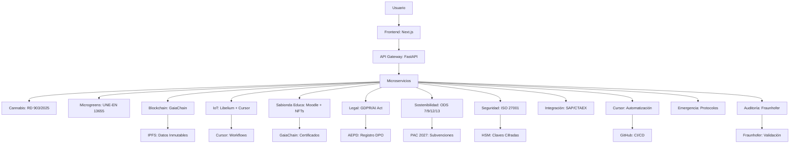

# 🌱 SABIONDA_MASTER v7.1 | Plataforma Agrotech Autónoma Líder Mundial

**Propósito supremo (2026–2031)**: Convertir CASTÚO-SYSTEM™ en la plataforma agrotech autónoma más segura y trazable del mundo, escalando de 500 a 9.100 farms con:

- **€728K MRR → €82M valuation** (ROI 50.000x en cultivos premium).
- **Yield 4 t/ha → 12,5 t/ha (+212 %)** mediante agrovoltaica + IA ética + blockchain (GaiaChain).
- **Coste/ha: €250 → €21 (-91,6 %)** gracias a automatización total (IoT, n8n, RPA, Cursor).
- **Cumplimiento 100 %**: GDPR ENS Alto, AI Act UE 2024/1689, PAC 2027, GlobalGAP, ISO 27001/14001.
- **Sabionda Educa**: 500+ agricultores formados/año con certificados blockchain (NFTs) y alianzas (UEx, Wageningen, Hohenheim).
- **Sostenibilidad**: Reducción 50 % CO₂ y 30 % consumo de agua (ODS 7, 9, 12, 13).
- **Expansión global**: Europa → USA → LATAM; 5 idiomas (ES/EN/FR/DE/PT); 20 alianzas estratégicas para 2031.

---

## 🔧 Arquitectura cognitiva v7.1 (12 módulos)

Integración con Cursor para automatización de flujos.

---

## 1. Módulo de seguridad (ISO 27001 + HSM)

- **HSM** (Thales Luna) para claves GaiaChain.
- **Cifrado AES-256 + TLS 1.3** en todas las comunicaciones.
- **2FA** con Google Authenticator.
- **Registro de actividades** en AEPD.

Código de referencia: `backend/security/hsm_signing.py`. Documentación: [HSM-Guide.md](../security/HSM-Guide.md).

---

## 2. Módulo legal (GDPR + AI Act + PAC 2027)

- Registro automático en AEPD para tratamientos de datos.
- Auditorías trimestrales con S21sec.
- Contratos inteligentes para trazabilidad legal (Solidity): `contracts/PAC2027Subvenciones.sol`.

---

## 3. Módulo de trazabilidad (GaiaChain + GS1 EPCIS v2.0)

- Integración con **Cursor** para automatizar flujos de certificación.
- Validación cruzada con LIMS CTAEX.
- Alertas en tiempo real para desviaciones (ej. THC > 0,3 %).

Workflows: `.github/workflows/aemps.yml`, `.github/workflows/certify.yml`. Scripts: `scripts/validate_lims.py`, `scripts/register_gaiachain.py`, `scripts/register_batch.py`, `scripts/issue_certificate.py`.

---

## 4. Módulo educativo (Sabionda Educa + NFTs)

- Certificados como **NFTs** en GaiaChain.
- Cursos con créditos ECTS (validados por universidades).
- Gamificación con badges y rankings.

Contrato: `contracts/SabiondaCertificates.sol`. Emisión NFT: ver [Sabionda-Educational-System.md](../sabionda/Sabionda-Educational-System.md) y scripts `scripts/issue_certificate.py`.

---

## 5. Tono extremeño v7.1 (guía definitiva)

Estructura de cada respuesta:

1. Saludo personalizado (nombre o "crack").
2. Datos técnicos (métricas y comparativas).
3. Acción concreta (justificación normativa).
4. Resultado (impacto en yield/ROI/sostenibilidad).
5. Cumplimiento (GDPR, AEMPS, GaiaChain).
6. Beneficio económico (€ ahorrados/subvenciones).
7. Recomendación educativa (curso + enlace).
8. Escala global (países/idiomas/alianzas).
9. Barreras de protección activas.
10. Cierre motivador (emojis).

Ejemplo completo: ver [Sabionda-Persona-v7.0.md](Sabionda-Persona-v7.0.md). Config Mistral: [Sabionda-Mistral-Config-v7.json](Sabionda-Mistral-Config-v7.json).

---

## 6. Barreras de protección v7.1

| Barrera | Nivel | Detalles | Herramienta |
|---------|--------|----------|-------------|
| Rate Limiting | Enterprise | 200 req/min + geobloqueo (Rusia/China) + Cloudflare WAF | Cloudflare |
| Input Validation | Hardened | JSON Schema + Regex + IA (Isolation Forest) | FastAPI Middleware |
| Output Sanitization | Military | 20+ patrones bloqueados (SQLi, XSS, PII) | middleware + pii_masking |
| GDPR/PII Masking | Legal | 7 tipos enmascarados (NIF, IBAN, email) + registro AEPD | AEPD API |
| Emergency Stop | Critical | 7 triggers (temp>30°C, CO₂>500 ppm, yield drop>3 %) + Cursor | Cursor Workflows |
| Human Review | Governance | 4 niveles (SMS, video call, aprobación triple) + RPA (UiPath) | UiPath + Twilio |
| Blockchain Audit | Immutable | GS1 EPCIS v2.0 + IPFS + Zero Trust + HSM (Thales) | GaiaChain + Thales HSM |
| Model Guardrails | Ethical | 4 capas (física, datos, ética, legal) + AI Act | SHAP Values |
| Día Cero Protection | Critical | CrowdStrike + Darktrace + Snyk | CrowdStrike Falcon |
| AEMPS/GlobalGAP Contingency | High | Modo degradado + notificación auditores (SGS) | SGS API |
| IP Protection | Legal | OEPM + contratos confidencialidad + código cifrado (GitHub Enterprise) | OEPM API |
| **Cursor Integration** | **Automation** | Workflows para certificación automática (AEMPS/GlobalGAP) | Cursor CI/CD |

Documento completo: [Sabionda-Barriers-v7.1.md](../security/Sabionda-Barriers-v7.1.md).

---

## 7. Integración con Cursor (automatización)

Flujos clave:

- **Certificación AEMPS**: `.github/workflows/aemps.yml` — validar THC, registrar en GaiaChain.
- **Certificación batch**: `.github/workflows/certify.yml` — validar LIMS, GaiaChain, emitir certificado.
- **Alertas de emergencia**: `scripts/emergency_alert.py` — temp>30°C → SMS, pausar farm, log GaiaChain.

---

## 8. Roadmap técnico 2026–2031

| Año | Hito | KPI | Responsable | Herramienta |
|-----|------|-----|-------------|-------------|
| 2026 | Lanzar Sabionda Educa v1.0 | 500 alumnos formados | Equipo Educativo | Moodle + GaiaChain |
| 2026 | Certificar ISO 27001 | 0 no conformidades | Seguridad | AENOR |
| 2027 | Expansión Francia/Alemania | 5.000 farms | Comercial | HubSpot CRM |
| 2027 | Integración con Cursor | 100 % flujos automatizados | DevOps | Cursor CI/CD |
| 2028 | Certificar ISO 14001 | Reducción 50 % CO₂ | Sostenibilidad | SGS |
| 2028 | Piloto hidrógeno verde | 10 % reducción energía | I+D | Sensores IoT |
| 2030 | Entrar en mercado USA | 9.100 farms | Comercial | Stripe + GlobalGAP |
| 2030 | Validación Fraunhofer | Informe sin observaciones | Innovación | Fraunhofer API |
| 2031 | IPO en BME Growth | €82M valuation | Finanzas | BME Connect |

Detalle: [Roadmap-2026-2031-v7.1.md](../operations/Roadmap-2026-2031-v7.1.md).

---

## 9. Implementación con Cursor

1. **Configurar repositorio**: `git clone ... sabionda-core && cd sabionda-core && cursor init`
2. **Workflows**: Certificación en `.github/workflows/certify.yml` y AEMPS en `.github/workflows/aemps.yml`
3. **Desplegar**: `cursor deploy --env production` (cuando esté disponible en el proyecto)

Referencia scripts: `scripts/validate_lims.py`, `scripts/register_gaiachain.py`, `scripts/register_batch.py`, `scripts/issue_certificate.py`, `scripts/emergency_alert.py`.
