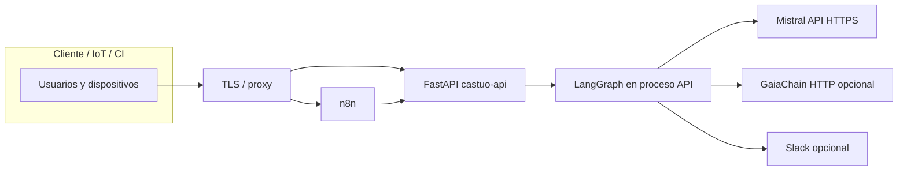

# Visión arquitectónica frente a límites del repositorio CASTÚO

Los diagramas tipo “Paperclip AI”, “CEO cuántico”, “n8n swarm ×313”, “GaiaChain 4.0”, “Mistral 8×7B-CEO”, simulación electromagnética en Unreal/ANSYS o workflows de **cientos de nodos** hacia `langgraph-cerebro:8123` son **material conceptual o de planificación**. No están implementados como subsistema único en este monorepo.

Este documento fija **límites técnicos y de gobernanza** para que documentación y demos no se confundan con evidencia de cumplimiento (RGPD, CTAEX, AI Act, etc.).

---

## 1. Diagrama de referencia (real, simplificado)

- **MQTT:** broker aparte (p. ej. Mosquitto); no sustituye la seguridad HTTP.
- **QElectroTech / PIX4D / Unreal:** herramientas externas; la integración documentada pasa por exportación de datos y webhooks/API, no por gRPC mágico a QElectroTech desde n8n salvo que lo implementéis vosotros.

---

## 2. Tabla visión ↔ repositorio

| Elemento en borradores “hiper-dimensionales” | Estado en CASTÚO-SYSTEM |
|----------------------------------------------|-------------------------|
| LangGraph en `*:8123` / `langgraph-cerebro` | **No.** Grafo en `backend/integrations/langgraph_castuo/`, rutas `/langgraph/castuo/*`. |
| GaiaChain URL fija v3/v4 | **No.** `GAIACHAIN_REGISTER_URL` configurable en API. |
| Agente CEO, Paperclip, consenso cuántico | **No** como servicio desplegable aquí. |
| 313 workers n8n, workflow 400+ nodos | **No** como artefacto único mantenido; orquestador mínimo: `castuo_orchestrator_minimal.json`. |
| IPFS Pinata como requisito | **Opcional** y externo; no hardcodeado en el core. |
| Hypertables TimescaleDB | Requieren **extensión** y diseño DBA; el SQL genérico con `create_hypertable` no es aplicable tal cual en Postgres vanilla. |
| Valoraciones €500M, EBITDA, KPI 99.999% | **No** son métricas técnicas del repo; no usar como prueba de auditoría. |
| AES-512, “quantum hash”, Blake3 en n8n | Criptografía y claims deben alinearse con estándares reales y revisión humana. |

---

## 3. Dónde está la implementación útil

| Necesidad | Dónde mirar |
|-----------|-------------|
| LangGraph + Mistral + huella + Gaia | `docs/architecture/LANGGRAPH-CASTUO.md`, `backend/integrations/langgraph_castuo/graph.py` |
| n8n → API | `docs/architecture/N8N-LANGGRAPH-INTEGRATED.md`, `docs/deploy/N8N-INITIAL-SETUP-CASTUO.md` |
| Seguridad y trazas | `docs/security/SECURITY_AND_TRACING.md` |
| QElectroTech / PLC | `docs/deploy/PRONT-MASTER-QELECTROTECH-CASTUO-INTEGRATION.md` |
| Despliegue Hetzner / enterprise | `deploy/docker-compose.castuo.enterprise.example.yml`, `docs/deploy/CASTUO-ENTERPRISE-HETZNER-ARSYS.md` |

---

## 4. Si se prioriza una “capa decisión” en el futuro

Un diseño **sostenible** sería: nuevo `payload.kind` o router FastAPI que llame al mismo `run_castuo_langgraph` con prompts acotados, registro en tablas **definidas por migraciones** y revisión humana para cualquier salida que se presente como decisión empresarial o cumplimiento normativo. Eso es trabajo de producto explícito, no un JSON de 422 nodos pegado al repositorio.

---

## 5. Cumplimiento

Las afirmaciones legales, financieras y de certificación deben respaldarse con **procedimientos y evidencia** fuera del código. El repositorio facilita trazabilidad técnica (`trace_hash`, logs, integraciones opcionales), no sustituye al responsable del tratamiento ni al organismo de certificación.

## 6. “Latencia 0”

Esa formulación, tomada al pie de la letra, es **imposible**. El diseño CASTÚO separa **control en borde** (bucles locales, sin LLM en el camino crítico) de **inteligencia y trazas** en nube/API. Ver [LATENCY-ZERO-OPERATIONAL-TARGET.md](LATENCY-ZERO-OPERATIONAL-TARGET.md).
