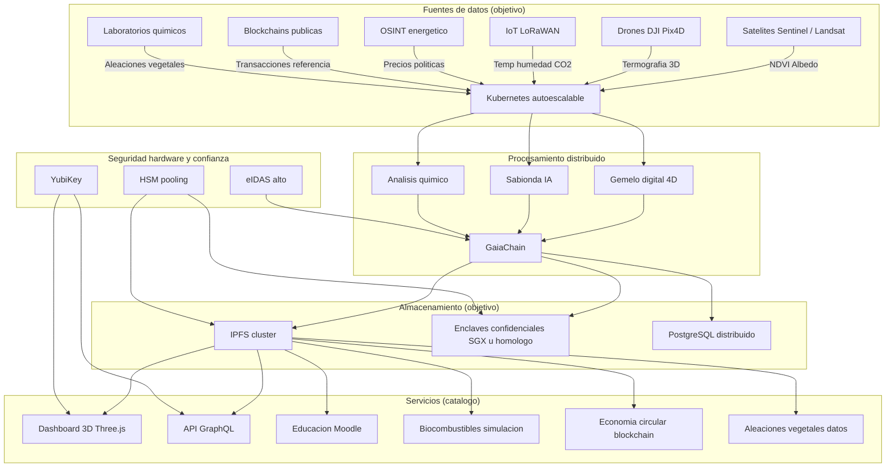
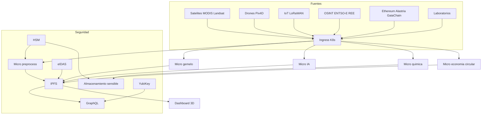
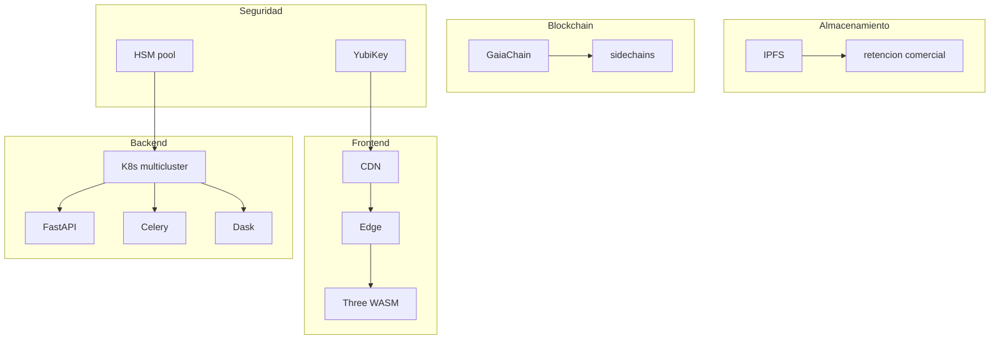
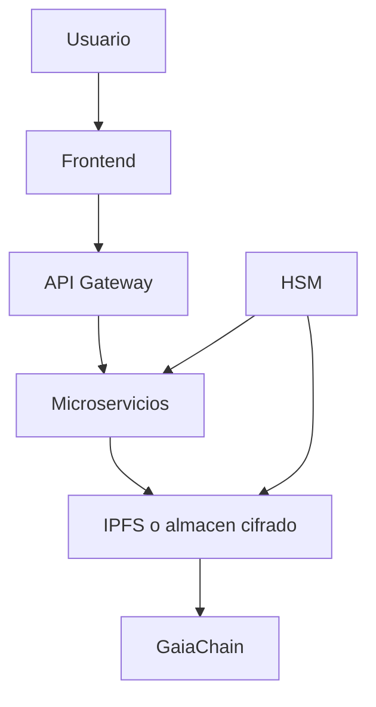
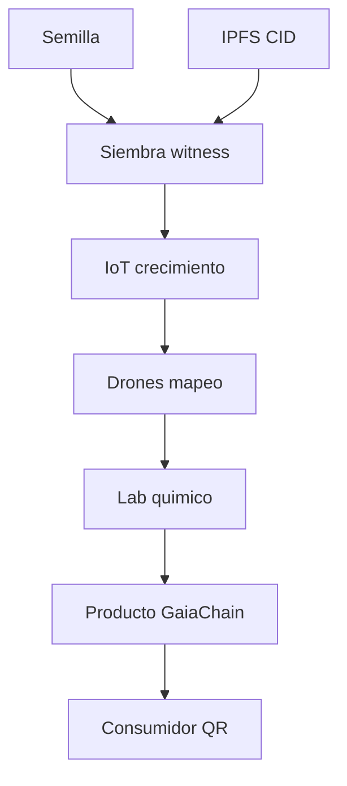

# Vision de arquitectura escalable Castuo-System (referencia 2026)

*(Documento de **direccion estrategica** y **roadmap tecnico**. No describe el despliegue actual del repositorio ni certificaciones obtenidas. Autor propuesto: Gregorio Julian Jimenez Bodes.)*

**Aviso**: Terminos como "ilimitado", "infinito", costes fijos por millon de usuarios o listados de productos (Thales Luna 9, Chainlink, Hyperledger, etc.) son **objetivos o hipotesis de diseno** salvo que exista contrato o evidencia en el repo. Cumplimiento normativo: **por validar** con asesoria legal y auditor externo.

---

## 1. Arquitectura de sistema global (vision)

### 1.1 Capacidad y limites (enfoque ingenieril)

| Componente | Tecnologia referencia | Escalado horizontal | Limite real tipico |
|---|---|---|---|
| Frontend | Three.js WASM CDN | Edge replicas | Presupuesto CDN egress latencia |
| Backend | Kubernetes Knative | Pods HPA | Coste cluster API saturation |
| Almacenamiento | IPFS Filecoin Arweave | Mas nodos | Coste pin retencion |
| Blockchain | GaiaChain PoA sidechains | Mas validadores | Gobernanza latencia TPS acordado |
| Colas | Celery Dask | Mas workers | Redis broker DB locks |
| HSM | Pool modulos | Balanceo | Throughput firmas licencias |
| Red | 5G Starlink | Multihoming | SLA proveedor |

---

## 2. Catalogo ampliado de servicios (roadmap)

| Categoria | Servicio | Descripcion | Tecnologia referencia | Estado en repo |
|---|---|---|---|---|
| Auditoria energetica | Satelite + gemelo | NDVI agrovoltaico | Sentinel rasterio Three.js | Scaffold [`../ops/energy-audit/`](../ops/energy-audit/README.md) |
| Compliance ICT | DORA NIS2 | Evidencia y pruebas | GaiaChain docs | Stubs [`../compliance/dora.md`](../compliance/dora.md) |
| Aleaciones vegetales | Base materiales | Propiedades mecanicas quimicas | PostgreSQL RDKit | Por disenar |
| Simulacion materiales | LAMMPS | Propiedades predichas | LAMMPS Python | Por disenar |
| Biocombustibles | Produccion LCA | Aspen OpenLCA | Aspen Plus OpenLCA | Por disenar |
| Educacion | Moodle LTI | Cursos agri 4.0 | Moodle | Por integrar |
| Laboratorios virtuales | Unity | Hidroponia parametrizada | Unity Python | Por disenar dominio regulado |
| Economia circular | Residuos | Trazabilidad QR | GaiaChain | Por disenar |
| Mercado carbono | Creditos | Ledger permisionado | Hyperledger u homologo | Por validar legal |
| Agrivoltaico | PVsyst ML | Diseno prediccion | PVsyst TensorFlow | Parcial [`../../backend/agrivoltaic/`](../../backend/agrivoltaic/) |
| Quimica vegetal | Extraccion | Protocolos lab | Herramientas cheminformatica | Por disenar |
| Trazabilidad | Cadena custodia | Semilla a producto | GaiaChain IPFS | Alineado witness minimal |

**Nota legal**: Cultivos sujetos a normativa (p. ej. cannabis medicinal) solo en **jurisdicciones** y **licencias** validas.

---

## 3. Integraciones reforzadas (mapa)

### 3.1 Integraciones clave (contrato y frecuencia **por validar**)

| Sistema externo | Protocolo tipico | Datos | Seguridad objetivo |
|---|---|---|---|
| Copernicus Hub | HTTPS OAuth | L2A metadatos | Credenciales rotacion |
| DJI SDK MQTT | TLS | Vuelo termografia | Certificados dispositivo |
| ENTSO-E | REST XML token | Precios | Rate limit secretos |
| GaiaChain | REST JSON witness | Hashes actas | API key coop_id |
| Moodle | LTI OIDC | Cursos | CORS OAuth |
| Fabric u otro DLT | gRPC mTLS | Carbono si aplica | Canales privados |

---

## 4. Escalado global (vision)

**Costes**: Cualquier cifra €/mes por millon de usuarios es **ejemplo ilustrativo**; depende de region proveedor y modelo economico.

---

## 5. Seguridad y trazabilidad (objetivos)

| Categoria | Medida objetivo | Estandar referencia | Estado repo |
|---|---|---|---|
| Autenticacion | MFA hardware | NIST 800-63 | Por despliegue |
| Cifrado | TLS 1.3 AES-256-GCM | FIPS orientativo | Parcial segun servicio |
| Acceso | Zero Trust | NIST 800-207 | Roadmap |
| Blockchain | Witness minimal | Contrato interno | [`../../scripts/ops/research/Register-LabEvidence.sh`](../../scripts/ops/research/Register-LabEvidence.sh) |
| Monitorizacion | Prometheus Grafana | ISO 27017 | Por homogeneizar |

### 5.1 Trazabilidad cadena (vision)

---

## 6. Cumplimiento normativo (matriz orientativa)

| Normativa | Referencia | Implementacion objetivo | Evidencia en repo (hoy) |
|---|---|---|---|
| RGPD | Arts 25 32 | Minimizacion cifrado DPIA | [`../legal/DPIA-CASTUO-SYSTEM.md`](../legal/DPIA-CASTUO-SYSTEM.md) |
| DORA | Arts 5 6 16 | Resiliencia registros | [`../compliance/dora.md`](../compliance/dora.md) |
| NIS2 | Anexos I II | Medidas notificacion | [`../compliance/nis2/README.md`](../compliance/nis2/README.md) |
| AI Act | Transparencia | Documentacion modelo | Por ampliar segun uso IA |
| eIDAS | Nivel alto | Firma cualificada | Por validar con PSCP |
| ISO 27001 | ISMS | SoA controles | [`../ops/compliance/ISO27001/`](../ops/compliance/ISO27001/) |
| ISO 14001 | EMS | Huella circular | Por crear carpeta si aplica |
| Ley 7/2022 ES | Economia circular | Trazabilidad residuos | Por enlazar legal interno |

**Responsable**: asignar por comite; **auditor externo** solo tras contrato.

---

## 7. Conclusion y siguientes pasos (realistas)

1. **Anclar vision a codigo**: completar APIs FastAPI para gemelo energetico y colas de preprocess satelital.  
2. **Aleaciones / quimica**: modelo de datos PostgreSQL + politica de no-PII en witnesses.  
3. **Carga**: pruebas Locust **en staging** con SLO definidos (no "1M usuarios" sin presupuesto).  
4. **Cumplimiento**: cerrar DPIA y mapeo DORA/NIS2 con evidencia GaiaChain **real**, no placeholders.  
5. **Terceros**: cada integracion (ChemAxon ICE FIX etc.) requiere contrato licencia y revision legal.

---

## Enlaces

- Auditoria energetica satelite: [`../ops/energy-audit/AUDITORIA-ENERGETICA-SATELITE-CASTUO-2026.md`](../ops/energy-audit/AUDITORIA-ENERGETICA-SATELITE-CASTUO-2026.md)  
- Seguridad Qubes Parrot Omega-9: [`../ARQUITECTURA-SEGURIDAD-REFORZADA-QUBES-WHONIX-PARROT.md`](../ARQUITECTURA-SEGURIDAD-REFORZADA-QUBES-WHONIX-PARROT.md)  
- Gemelo Extremadura: [`../../backend/digital_twin/digital_twin_4d_extremadura.py`](../../backend/digital_twin/digital_twin_4d_extremadura.py)  
