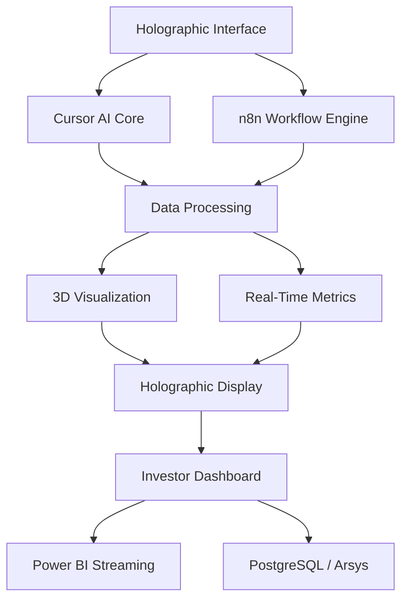

# Arquitectura holográfica + sistema CASTÚO (narrativa y anclaje técnico)

**Propósito:** guion de **demo / pitch** y mapa de integración con el repo real. Lo holográfico (proyector LED, Looking Glass, WebXR, etc.) es **capa de presentación**: los contratos auditable y soberanos siguen siendo webhooks, gateway y guardas OT documentados en el monorepo.

**Límite honesto:** no existen en este repositorio imágenes Docker `holographic/render-engine`, `tts/sabionda-voice` ni el paquete Python `hologramapi`. Cualquier render/TTS comercial o DIY se conecta por **HTTP** o por **n8n → HTTP Request** hacia tu servicio.

---

## Diagrama lógico



Flujo recomendado en producción-piloto: **telemetría y decisiones** entran por **gateway** (`/webhook/castuo-orchestrate`) o webhooks dedicados; la **salida** hacia holograma es un **POST** a un servicio de render propio (`HOLOGRAM_RENDER_URL`). **Power BI** y **PostgreSQL** (p. ej. Arsys) son destinos habituales de reporting: se cablean con conectores o nodos HTTP en n8n cuando existan URLs y credenciales reales, no como contenedores ficticios en este repo.

**HMAC:** no uses `sha256(json.dumps(x) + secret)` como “firma”; el stub y `scripts/holo/holobrain_client.py` usan **HMAC-SHA256** sobre la misma cadena que `JSON.stringify({ metrics, plant_status })` en el nodo Code de n8n. Si envías cabecera `X-Holobrain-HMAC`, el workflow valida contra `HOLOBRAIN_HMAC_SECRET` cuando ambos están definidos.

---

## Anclaje en este repositorio

| Elemento | Dónde está |
|----------|------------|
| Gateway n8n | `n8n/workflows/castuo_main_orchestrator_gateway.json`, `n8n/README-AGRI-BRAIN.md` |
| Avatar Sabionda (web) | `frontend/public/assets/sabionda/` (ver reglas Castúo / README de assets) |
| Integración maestra E2E | `docs/INTEGRACION-MAESTRA-N8N-GEMELO-DIGITAL.md` |
| Ejemplo Python sin SDK ficticio | `scripts/holo/cursor_holobrain_example.py`, `scripts/holo/holobrain_client.py` |
| Webhook n8n mínimo (holobrain) | `n8n/workflows/castuo-holobrain-webhook-stub.json` |

---

## Implementación técnica (patrón real)

1. **Importar** `castuo-holobrain-webhook-stub.json` en n8n y activarlo.
2. Definir en el entorno de n8n (si usas HMAC opcional sobre el cuerpo recibido): `HOLOBRAIN_HMAC_SECRET` (nombre alineado al nodo; ajustable en el Code).
3. Configurar `HOLOGRAM_RENDER_URL` solo si tienes un servicio HTTP que acepte JSON; si está vacío, el flujo responde igualmente con el payload listo para el front o para otro nodo que añadas.
4. Desde Cursor, un script o el backend, **POST** al path del webhook con un cuerpo JSON coherente (ver ejemplo en `scripts/holo/cursor_holobrain_example.py`).

El snippet original con `HologramAPI`, `TextToSpeech` y `AvatarController` es **pseudocódigo de producto**; sustitúyelo por llamadas HTTP reales a tus contenedores o APIs.

---

## Workflow n8n (esqueleto)

No pegues JSON suelto de nodos mezclados con `parameters` duplicados: usa el archivo versionado `n8n/workflows/castuo-holobrain-webhook-stub.json`. Amplía con nodos **HTTP Request** hacia TTS o render cuando tengas URLs reales.

---

## Docker / infraestructura holográfica

Las imágenes del borrador (`holographic/render-engine`, etc.) son **placeholders**. Opciones coherentes con soberanía y trazabilidad:

- **DIY:** Raspberry Pi + proyección; el “motor” es un servicio tuyo (FastAPI + Three.js, Unity headless, etc.) expuesto en un puerto y llamado desde n8n.
- **Comercial:** SDK del fabricante (p. ej. Looking Glass) en una máquina dedicada; n8n solo envía comandos o enlaces a escenas ya publicadas.

Si añades un `docker-compose` propio, colócalo junto a documentación que liste **imagen real**, licencia y versión (no nombres genéricos sin registro en un registry).

---

## Guion para presentación holográfica (demo)

### Introducción

“Lo que ven es el **sistema operativo del cultivo** en tiempo real: datos que ya pasan por orquestación y políticas de seguridad; la capa holográfica es la **interfaz** que hace tangible el estado.”

### Demostración 1: gemelo digital

1. Mostrar visualización en estado óptimo (paleta Castúo: agro `#228B22`, holo `#00BFFF`).
2. Inyectar evento de prueba (webhook o script):

```json
{
  "metrics": {
    "plant_status": "critical",
    "ph": 8.2,
    "ec": 2.1,
    "temperature": 31,
    "sensor_id": "V-102"
  }
}
```

3. Narrar el cambio visual (alerta) y la rama **determinista** (umbrales, guardas OT) antes de cualquier narrativa “IA mágica”.

### Demostración 2: red de núcleos

Si habláis de **muchos núcleos** u orquestación federada, enlazadlo a **arquitectura documentada** (`docker-compose.multi-n8n.yml`, `n8n/README-MULTI-N8N.md`) y a **métricas medidas** en vuestro piloto. Evitad cifras tipo “12.450 decisiones/hora” sin registro o panel que las respalde ante due diligence.

### Demostración 3: Sabionda

Mantener el mensaje en **correlaciones explicables** y **protocolos** referidos a documentación interna (calidad, trazabilidad), no a normas citadas de memoria sin comprobar el número exacto de la norma aplicable a vuestro caso.

---

## Hardware (orientación)

| Enfoque | Notas |
|---------|--------|
| Open source / DIY | SBC, ventilador LED o pirámide de metacrilato, pantalla auxiliar; el repo no incluye `github.com/castuo-system/hologram-di` hasta que exista ese módulo público verificable. |
| Comercial | Integración vía API/SDK del proveedor; evitad `curl https://castuo-system.com/...` como instalación única sin fuente en el repo o sin dominio operativo real. |

---

## Beneficios para valoración (con matices DD)

- **Tangibilización:** traduce telemetría y decisiones a experiencia; refuerza storytelling.
- **Diferenciación:** combina soberanía de datos (stack on-prem/OSS) con UX física.
- **Validación técnica:** la prueba es **contrato webhook + latencia medida + trazabilidad**; el holograma no sustituye auditoría ni SLA por sí solo.

---

## Referencias cruzadas

- Web HTML / dashboard Sabionda + CORS + opciones enterprise: [SABIONDA-N8N-WEB-FRONTEND.md](SABIONDA-N8N-WEB-FRONTEND.md).
- Colores y branding holográfico (SVG/CSS): reglas de workspace Castúo / Sabionda.
- Stress e inyección al gateway: `scripts/tests/stress_gateway_injection.py`.
