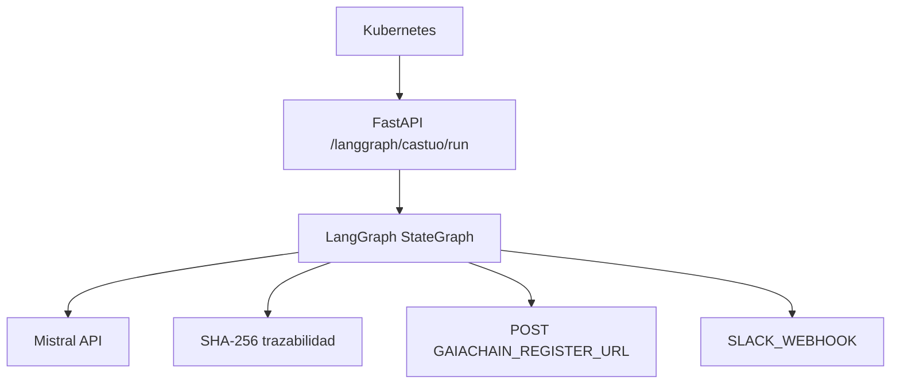

# LangGraph + FastAPI (CASTÚO)

## Diagrama

## Endpoints

| Método | Ruta | Descripción |
|--------|------|-------------|
| POST | `/langgraph/castuo/run` | Cuerpo `{"payload": { ... }}` — ejecuta el grafo. |
| POST | `/langgraph/castuo/execute-graph` | Alias de `/run` (mismo cuerpo); útil tras proxy `grafo.dominio`. |
| GET | `/langgraph/castuo/health` | Comprueba que `langgraph` importa y el grafo compila. |

Orquestación desde n8n: [N8N-LANGGRAPH-INTEGRATED.md](N8N-LANGGRAPH-INTEGRATED.md) y `n8n/workflows/castuo_n8n_langgraph_orchestrator.json`.

**Payloads industriales (QElectroTech / PLC):** si `payload.kind` es `qelectrotech_svg` o `plc_generate` (o hay `svg_base64` no vacío), el nodo Mistral usa prompts de automatización en lugar del modo agrícola. Ver [PRONT-MASTER-QELECTROTECH-CASTUO-INTEGRATION.md](../deploy/PRONT-MASTER-QELECTROTECH-CASTUO-INTEGRATION.md).

**Payload IoT:** `kind` `iot_sensor` o `iot_ingest` → salida JSON orientativa (`summary`, `alerts`, `recommended_actions`). Workflow: `n8n/workflows/castuo_n8n_iot_sensor_langgraph.json`.

## Variables de entorno

| Variable | Uso |
|----------|-----|
| `MISTRAL_API_KEY` | Llamada a `api.mistral.ai` (vacío → nodo analítico omitido con aviso en `errors`). |
| `MISTRAL_LANGGRAPH_MODEL` | Por defecto `mistral-small-latest`. |
| `GAIACHAIN_REGISTER_URL` | URL completa de **vuestro** backend de registro (vacío → no llama). |
| `N8N_GAIACHAIN_API_KEY` o `GAIACHAIN_API_KEY` | Bearer opcional para ese POST. |
| `SLACK_WEBHOOK` | Webhook entrante (vacío → no notifica). |

Soberanía: el código corre donde despliegues la imagen (p. ej. Hetzner + clúster UE); Mistral API es servicio del proveedor del modelo salvo que uses endpoint compatible alojado en UE.

## Kubernetes

Ejemplos en `deploy/k8s/castuo-langgraph-ingress.example.yaml` y `castuo-api-deployment.env.example.yaml` (secretos, Service, Ingress).

## n8n

Importar `n8n/workflows/castuo_langgraph_invoke.json`. Variables: `CASTUO_BASE_URL`, opcional `CASTUO_LANGGRAPH_URL`, `CASTUO_API_KEY` si el API la exige.

## Nota sobre el ejemplo “Graph()” lineal

La API antigua `langgraph.graph.Graph` del rumor no coincide con el paquete actual: aquí se usa **`StateGraph` + `START`/`END`** y `ainvoke`, alineado con LangGraph ≥ 0.2.

## Coexistencia con n8n

n8n sigue siendo adecuado para integraciones rápidas y no código; LangGraph conviene para ramas condicionales, estado compartido y tests unitarios en Python. Pueden convivir: n8n llama al endpoint FastAPI.
