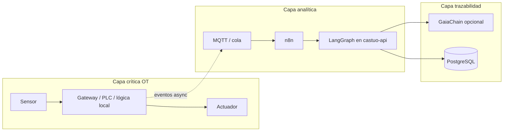

# Objetivo operativo: latencia “cero” (interpretación técnica)

## 1. Lo que no es posible

En cualquier sistema distribuido hay **latencia estrictamente mayor que cero**: propagación electromagnética, colas de SO, serialización, red, disco y modelo de cómputo. Prometer **latencia 0 ms** de forma literal sería falso en auditoría técnica o legal.

## 2. Lo que sí puede exigirse (diseño CASTÚO)

**Latencia efectiva nula para el operador del territorio** significa:

| Capa | Objetivo |
|------|----------|
| **Control y seguridad (OT)** | Bucles críticos (riego, actuadores, alarmas) **sin depender** de n8n, LLM ni nube en el camino caliente. Lógica local, PLC o gateway edge, MQTT al broker de finca/VLAN. |
| **Observabilidad** | Métricas y logs con marcas de tiempo; si la nube cae, el borde **sigue**. Coherente con modo soberanía ante pérdida prolongada de conectividad (véase kernel del proyecto). |
| **IA / orquestación** | LangGraph, Mistral y n8n en **rutas asíncronas**: recomendaciones, trazas, informes. No bloquean válvulas ni relés. |
| **Colas y caché** | Redis u otro almacén rápido **junto al API** para sesiones y deduplicación; no sustituye decisión OT local. |

En resumen: **cero latencia percibida en el actuador** = decisión y failover en borde; la nube aporta inteligencia y trazabilidad, no el tick del bucle.

## 3. Patrones concretos en el ecosistema del repo

- **MQTT** entre sensores y broker en red local o VPN; TLS en exposición pública (`docker/remote-access/mosquitto/`).
- **FastAPI / LangGraph** en VPS o edge fuerte para análisis; timeouts y colas explícitos en n8n (no “hiper-convergencia” bloqueante).
- **No** encadenar: sensor → n8n → internet → LLM → n8n → actuador para un umbral de emergencia; ese patrón introduce latencia y puntos de fallo evitables.

## 4. KPIs realistas (ejemplo)

Definir por instalación, con agrónomo y responsable OT:

- Latencia sensor → actuador local: **&lt; X ms** (solo red LAN + PLC).
- Latencia a API de análisis: **P95 &lt; Y s** (no en camino crítico).
- Disponibilidad del borde ante caída WAN: **autonomía documentada** (horas/días según diseño).

Un **SLA del 99,999%** sobre “todo el stack” es una **obligación contractual** que debe medirse con umbrales, ventana temporal y exclusiones de mantenimiento; el repositorio no la garantiza por sí solo.

## 5. Modelo de tres capas (crítica / analítica / trazabilidad)

Los milisegundos del diagrama son **orden de magnitud orientativo**, no certificación. Solo medición en planta (osciloscopio, lógica del PLC, trazas del broker) puede fijar números.

| Capa | Rol | Latencia | Regla |
|------|-----|----------|--------|
| **Crítica** | Riego, alarmas, parada segura | **Mínima** (LAN, PLC, Modbus/IO directo) | **Nunca** n8n ni LLM en el camino del actuador. |
| **Analítica** | Agregación, reglas, IA, informes | ms–s según carga | Colas, timeouts explícitos; puede degradarse sin parar el campo. |
| **Trazabilidad** | Huellas, auditoría, cadena opcional | Mayor, por lotes o HTTP | No bloquea OT; batching aceptable. |

LangGraph y Mistral viven en **castuo-api** (`/langgraph/castuo/*`), no en un contenedor `langgraph:8123` separado salvo que lo montéis vosotros fuera de este repo.

## 6. Seguridad frente a “MQTT rápido”

Configuraciones tipo **sin persistencia**, **QoS 0 everywhere**, **`allow_anonymous true`** en la finca pueden **acortar latencia** en laboratorio, pero en producción abren **abuso interno/externo**. Mínimo razonable:

- VLAN o segmentación; broker no expuesto a Internet sin TLS.
- `allow_anonymous false` + `password_file` o certificados cliente (8883).
- Políticas de topic y ACL por tipo de dispositivo.

En el API, la barrera OT para actuadores remotos está en `backend/security/ot_actuator_guard.py` (rate limit, killswitch, actuadores críticos).

## 7. Despliegue de ejemplo (solo broker en borde)

- `deploy/docker-compose.edge-mqtt.example.yml` — Mosquitto con volumen de configuración.
- `deploy/mosquitto.edge.example.conf` — Plantilla; **sustituir** por política real (auth, TLS).

No hay imagen `castuo-system/plc-gateway` en este monorepo: el gateway PLC/Modbus es **proyecto de integración** con hardware y validación en campo.

## 8. Referencias

- [ARCHITECTURE-VISION-AND-BOUNDARIES.md](ARCHITECTURE-VISION-AND-BOUNDARIES.md)
- [SECURITY_AND_TRACING.md](../security/SECURITY_AND_TRACING.md)
- [IOT-MARCO-REPOSITORIO.md](../iot/IOT-MARCO-REPOSITORIO.md) (borde, MQTT)
- `backend/security/ot_actuator_guard.py`
