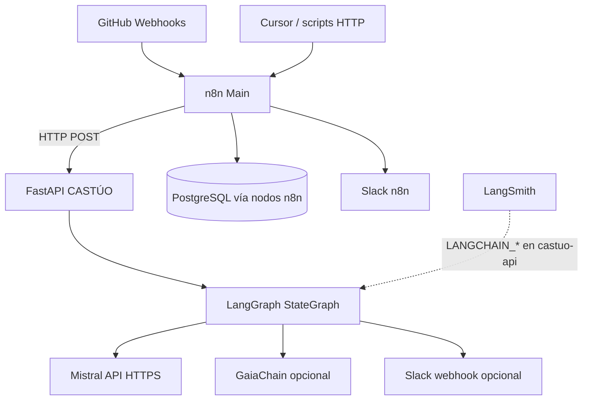

# Arquitectura integrada n8n + LangGraph (CASTÚO)

Versión alineada al **monorepo**: un solo motor LangGraph dentro del **FastAPI** (`backend`), no un microservicio `langgraph-api:8123` ni `mistral-proxy:11434`.

## Diagrama real



- **LangSmith**: variables en el contenedor del **API** (`LANGCHAIN_TRACING_V2`, `LANGSMITH_API_KEY`). No esperes `langsmith_trace_id` en el JSON de respuesta salvo que instrumentes el grafo explícitamente.
- **Cursor “MCP”**: Cursor no usa `http://n8n/mcp` como en los borradores genéricos. Patrón válido: **webhook n8n** o **puente** `castuo_enterprise_cursor_bridge.json` / `langgraph_invoke`.
- **GaiaChain**: solo si defines `GAIACHAIN_REGISTER_URL` (+ Bearer opcional); no hay URL fija `api.gaiachain.eu/v3/register` en el código.

## Endpoints API (mismo servicio, puerto 8000)

| Ruta | Descripción |
|------|-------------|
| `POST /langgraph/castuo/run` | Cuerpo `{"payload":{...}}` |
| `POST /langgraph/castuo/execute-graph` | **Alias** del anterior (útil si el Ingress usa host `grafo.*`). |
| `GET /langgraph/castuo/health` | Grafo compilable |
| `GET /health/enterprise` | Flags LangSmith / Mistral |

## Workflow n8n importable

- **`n8n/workflows/castuo_n8n_langgraph_orchestrator.json`**
  - Webhook: `POST …/webhook/langgraph-executor`
  - Reenvía a `CASTUO_BASE_URL/langgraph/castuo/execute-graph`
  - Normaliza `analysis`, `trace_hash`, `errors`, estados Gaia/Slack del grafo

### Sensores (`recibir-datos-sensores`)

- **`n8n/workflows/castuo_n8n_sensores_langgraph.json`** — cuerpo webhook → `payload` con `action: analizar_sensores` y campos de sensor; respuesta del API mapeada a `tx_hash` **= `trace_hash`** (huella local del grafo, no confundir con transacción on-chain salvo que GaiaChain esté configurado).
- Tabla opcional: `backend/models/migrations/optional_castuo_prod_sensores_analisis.sql`.

No uses `http://langgraph-api:8123` ni respuestas `status: success` inventadas: el API Castúo devuelve JSON plano (`analysis`, `trace_hash`, `errors`, …).

### QElectroTech y generación PLC

- `n8n/workflows/castuo_n8n_qelectrotech_langgraph.json` — webhook `qelectrotech-svg` (cuerpo con `svg_base64`).
- `n8n/workflows/castuo_n8n_plc_generate_langgraph.json` — webhook `cursor-plc-gen` (`kind: plc_generate` en el payload hacia el API).
- Prontuario: [PRONT-MASTER-QELECTROTECH-CASTUO-INTEGRATION.md](../deploy/PRONT-MASTER-QELECTROTECH-CASTUO-INTEGRATION.md).

### IoT con trazabilidad

- `n8n/workflows/castuo_n8n_iot_sensor_langgraph.json` — webhook `iot-sensor-data`; huella en `trace_hash` del API (no duplicar lógica GaiaChain en n8n salvo requisito explícito).
- [PRONT-INTEGRACION-SEGURA-TRAZABILIDAD-2026.md](../deploy/PRONT-INTEGRACION-SEGURA-TRAZABILIDAD-2026.md) · [SECURITY_AND_TRACING.md](../security/SECURITY_AND_TRACING.md).

### Orquestador único (webhook)

- `n8n/workflows/castuo_orchestrator_minimal.json` — `castuo-orchestrate` con `request_type` → un solo `execute-graph`. Credenciales n8n: [N8N-INITIAL-SETUP-CASTUO.md](../deploy/N8N-INITIAL-SETUP-CASTUO.md).

Variables de entorno en n8n:

- `CASTUO_BASE_URL` (ej. `http://castuo-api:8000` en Docker)
- `CASTUO_API_KEY` si el API la valida en esas rutas

## Pruebas rápidas

```bash
# Directo al API
curl -sS -X POST "http://127.0.0.1:8000/langgraph/castuo/execute-graph" \
  -H "Content-Type: application/json" \
  -d "{\"payload\":{\"cultivo\":\"tomate\",\"humedad\":75,\"temperatura\":22,\"ph\":6.5}}"

# Vía n8n (tras importar y activar el workflow)
curl -sS -X POST "https://TU-N8N/webhook/langgraph-executor" \
  -H "Content-Type: application/json" \
  -d "{\"cultivo\":\"tomate\",\"humedad\":75,\"temperatura\":22,\"ph\":6.5}"
```

## DNS (simplificado)

Puede ser **una sola IP** (Hetzner) y varios nombres apuntando al mismo reverse proxy:

| Host | Backend sugerido |
|------|------------------|
| `n8n.tudominio` | n8n :5678 |
| `api.tudominio` o `grafo.tudominio` | Mismo FastAPI :8000 (`/langgraph/...`) |

No hace falta `ai.tudominio` para “Mistral proxy” si usas la API oficial de Mistral desde el backend.

## Más documentación

- [LANGGRAPH-CASTUO.md](LANGGRAPH-CASTUO.md)
- [CASTUO-ENTERPRISE-HETZNER-ARSYS.md](../deploy/CASTUO-ENTERPRISE-HETZNER-ARSYS.md)
