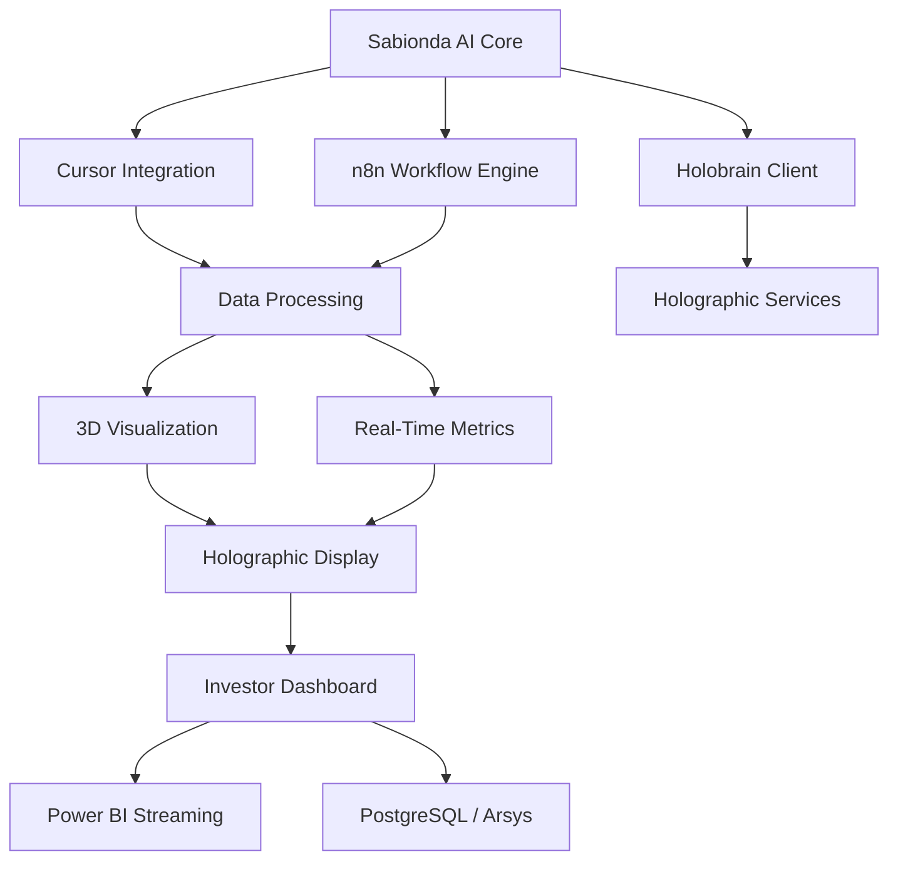
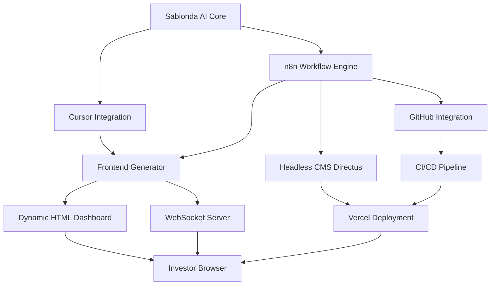

# Sabionda + n8n: web avanzada (HTML dinámico, CI/CD, CORS)

**Propósito:** extender el cerebro n8n (Slack, Gmail, tablas, gateway) para que Castúo y Sabionda puedan **alimentar** una experiencia web sin confundir **API JSON** con **presentación HTML**, y sin depender de contenedores genéricos no verificables (`holographic/render-engine`, `tts/sabionda-voice`, etc.).

---

## Diagrama A — Orquestación + Holobrain (referencia anterior)



## Diagrama B — Arquitectura híbrida (frontend dinámico + CMS + CI/CD)



- **E** puede ser n8n (`Respond` Text) o el **`frontend/`** del monorepo consumiendo JSON; lo segundo evita límites del iframe n8n para JS pesado.
- **F** suele ser un **servicio aparte** (Node `ws`, FastAPI WebSocket, MQTT bridge), no “PostgreSQL en el puerto 5432”.
- **H→I:** Directus expone REST/GraphQL; Vercel (u otro) sirve el sitio estático que lee esa API. n8n **actualiza** items vía HTTP con token, no sustituye a Postgres como servidor HTTP.
- **J→K→I:** despliegues por Actions, hook de Vercel, o imagen Docker; credenciales solo en secretos del CI.

**Gateway JSON** del repo: `n8n/workflows/castuo_main_orchestrator_gateway.json` → `POST .../webhook/castuo-orchestrate`.

### Antipatrones del snippet “SABIONDA Dynamic Frontend Generator”

| Incorrecto | Por qué | Patrón correcto |
|------------|---------|-----------------|
| `fetch('http://postgres-service:5432/api/...')` | Postgres habla **protocolo wire**, no HTTP REST en 5432 | **Directus** `/items/...`, **FastAPI** `/api/...`, o nodo **Postgres** en n8n y luego ensamblas HTML en Code |
| `WebSocket('ws://localhost:3001')` en HTML servido al inversor | `localhost` es **el PC del visitante**, no tu servidor | URL pública o misma origin + `wss://` tras TLS; variable `WS_METRICS_PUBLIC_URL` |
| `n8n-nodes-base.function` + `webhookResponse` antiguos | Export frágil en n8n actual | **Code** + **Respond to Webhook** (`respondWith: text`), como `castuo-sabionda-dashboard-html-stub.json` |
| Tablas “TRL 11”, valoraciones € en pitch | Due diligence las descalifica si no están auditadas | Usar cifras solo con **fuente**; plantilla abajo marcada como borrador |

---

## Opción 1 — HTML servido por n8n (GET + Respond “Text”)

| Paso | Nodo | Notas |
|------|------|--------|
| 1 | **Webhook** `GET` p. ej. `sabionda-dashboard` | `responseMode`: usar nodo **Respond to Webhook**. |
| 2 | **Code** o **Data Table / Postgres** | Consolidar cultivos, sensores, último análisis (items JSON). |
| 3 | **Agente IA (LangChain en n8n)** *(opcional)* | System prompt: devolver **solo** HTML (o Markdown si luego conviertes). |
| 4 | **Markdown → HTML** *(si el agente devuelve MD)* | Nodo de utilidad o Code con librería permitida en tu entorno; o forzar salida HTML en el prompt. |
| 5 | **Respond to Webhook** | **Respond With: Text**; cuerpo = `{{ $json.html }}` (o campo equivalente). `Content-Type` suele ser `text/html` por defecto en modo Text. |

**Riesgos que debes asumir en due diligence:**

1. **XSS:** si inyectas HTML crudo del LLM en la respuesta, trátalo como **contenido no confiable**. Preferible plantilla HTML fija + datos escapados, o sanitizar.
2. **Iframe sandbox (n8n ≥ 1.103):** las respuestas HTML a webhooks pueden ir en **iframe**; JS que asume `window.top`, almacenamiento o rutas relativas puede fallar. Para dashboards “de inversión” serios, suele ser más sólido un **frontend estático** (Vite/React en `frontend/`) que consuma **JSON** del mismo orquestador.
3. **CORS:** abrir el dashboard en una pestaña directa a la URL del webhook **no** exige CORS. Sí lo exige un **SPA** en otro origen que haga `fetch`. Ahí conviene **CORS en reverse proxy** (nginx, Traefik, API Gateway) delante de n8n, o cabeceras en el nodo **Respond** si tu versión de n8n las expone de forma estable.

**Stub importable (sin LangChain, HTML de demostración):** `n8n/workflows/castuo-sabionda-dashboard-html-stub.json`.

---

## Opción 2 — Enterprise: CI/CD, vector store, tiempo real

| Capa | Rol | En Castúo |
|------|-----|-----------|
| **HTTP Request** → GitHub / Vercel / pipeline | Disparar despliegue o commit cuando el análisis marque estado crítico | Credenciales solo en n8n Credentials / vault; nunca en JSON exportado. |
| **Directus** (headless CMS) | Contenido y colecciones sobre Postgres con API REST/GraphQL | Ejemplo de compose: `docker-compose.directus.example.yml`; marco en [docs/ops/frontend-and-observability-stack.md](../ops/frontend-and-observability-stack.md). |
| **Vector store** (Qdrant, Supabase pgvector, etc.) | Memoria larga para chat “Sabionda” en web | Conectar nodos LangChain a instancia **real**; el repo no fija Pinecone/Qdrant por defecto. |
| **WebSocket / SSE** | Métricas sin recargar | Stub de laboratorio: `scripts/ws-metrics-stub/` (Node + `ws`). En producción: auth, `wss://`, límites de tasa; alternativa **MQTT** en `docker-compose` remote-access o WS en **FastAPI**. |

### Integración n8n → Directus (resumen)

1. Variables: `DIRECTUS_URL` (p. ej. `http://directus:8055`), `DIRECTUS_STATIC_TOKEN` (token de usuario con permiso mínimo sobre la colección).
2. Flujo: **Webhook** → **Code** (validar payload, mapear a `{ collection, body }`) → **HTTP Request** `POST {{$env.DIRECTUS_URL}}/items/{{ $json.collection }}` con `Authorization: Bearer …`.
3. No uses el nodo **Set** como sustituto de Postgres; la persistencia en SQL es vía Directus o nodo **Postgres** explícito.

El orquestador actual responde `{ ok, orchestrator, downstream }`; el frontend avanzado puede consumir ese JSON y renderizar Chart.js o Three.js **fuera** del iframe de n8n.

---

## Markdown del agente

Si el modelo devuelve Markdown, convierte antes del Respond Text o sirve JSON `{ "markdown": "..." }` y renderiza en el **frontend** con un motor controlado (menos XSS que HTML crudo del modelo).

---

## Cliente Python de producción (orquestador + Holobrain)

No uses el snippet con `TextToSpeechEngine` ficticio ni firmas HMAC ad hoc distintas del stub Holobrain. El módulo alineado al repo es:

- `scripts/sabionda/sabionda_core.py` — `SabiondaBridge`: `POST /webhook/castuo-orchestrate` con `request_type` + `data`, cabecera `X-API-KEY` si aplica, y opcionalmente `HolobrainClient`.

---

## Guion breve para inversores (demo)

1. **Óptimo:** métricas en JSON vía gateway o webhook sensor; dashboard en `frontend` o HTML stub; Holobrain opcional con `scripts/holo/cursor_holobrain_example.py`.
2. **Crítico:** mismo canal; colores y narrativa acordes a `docs/architecture/HOLOGRAPHIC-CASTUO-ARCHITECTURE.md`; actuadores bajo políticas OT documentadas.
3. **Power BI:** nodo HTTP al dataset/API de streaming **real** (`POWER_BI_STREAMING_ENDPOINT` u otro nombre que defináis); no hardcodear URLs en el export.
4. **Híbrido:** Directus en la URL configurada (`DIRECTUS_URL`) y dashboard n8n GET o sitio estático (p. ej. Vercel) contra la API del CMS.
5. **Tiempo real:** laboratorio con `scripts/ws-metrics-stub` en LAN; en producción documentar latencias **medidas** y usar `wss://` con auth.

### Plantilla de pitch extendida (revisión legal y datos obligatorios)

Diapositivas con **TRL**, **valoración** o tablas comparativas frente a competencia requieren **fuente verificable**. Sustituye `[...]` antes de uso externo.

---

## Panel estático `api/query` y CORS

El archivo `frontend/public/sabionda-n8n-agents-dashboard.html` hace `POST` al webhook con cuerpo:

```json
{ "query": { "type": "sensores|cultivos|cosechas|analisis" } }
```

### Formato de respuesta recomendado

Para gráficos y tablas, devolver JSON con filas numéricas (campo `value`) o anidar arrays en `data` / `rows` / `items`:

```json
{
  "success": true,
  "data": [
    { "id": "sensor-001", "type": "humedad", "value": 75.5, "timestamp": "2026-03-28T12:00:00Z", "location": "Nodo-042" }
  ],
  "timestamp": "2026-03-28T12:00:00Z"
}
```

### CORS y proxy

Si sirves el HTML en otro origen que el de n8n, el navegador aplicará CORS. Opciones habituales:

1. **Reverse proxy** delante de n8n (nginx/Traefik) añadiendo `Access-Control-Allow-Origin` solo para orígenes permitidos, métodos `GET,POST,OPTIONS` y cabeceras `Content-Type`, `X-API-Key` / `Authorization` si las usas.
2. **Misma origin**: publicar el panel detrás del mismo dominio que el webhook.
3. Variables de entorno de n8n: revisar la documentación de tu versión para opciones de webhook/CORS; no asumir claves `config` idénticas entre releases.

### Parámetros del panel

| Parámetro | Descripción |
|-----------|-------------|
| URL webhook | Ruta completa `…/webhook/api/query` (o la que defináis en el flujo). |
| Cabecera + secreto | Opcional; p. ej. `X-API-Key` alineada con el backend. |
| `?n8n=` | Query string que rellena la URL al cargar (compartir enlaces de prueba). |

### Solución de problemas

- **CORS**: confirma orígenes en el proxy; evita `*` si usáis credenciales.
- **403**: token o API key incorrecta en n8n / gateway.
- **Gráfico vacío**: la respuesta debe ser lista o `data` iterable con campo `value` numérico para la pestaña sensores.

---

## Referencias cruzadas

- Orquestador: `n8n/workflows/castuo_main_orchestrator_gateway.json`
- Holobrain: `n8n/workflows/castuo-holobrain-webhook-stub.json`, `scripts/holo/holobrain_client.py`
- Arquitectura holográfica (honestidad infra): `docs/architecture/HOLOGRAPHIC-CASTUO-ARCHITECTURE.md`
- Integración maestra: `docs/INTEGRACION-MAESTRA-N8N-GEMELO-DIGITAL.md`
- Directus (marco OSS): `docker-compose.directus.example.yml`, `docs/ops/frontend-and-observability-stack.md`
- WebSocket stub (demo): `scripts/ws-metrics-stub/README.md`