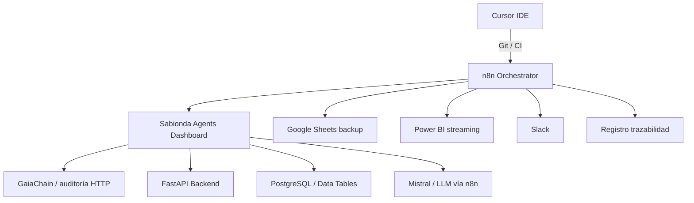

# Sabionda Workspace — mapa de componentes (Castúo-System)

Diagrama lógico: el monorepo **no** usa la carpeta `sabionda-workspace/`; la equivalencia está en rutas existentes.

## Equivalencia en el repositorio

| Componente (especificación) | Ubicación en Castúo-System |
|----------------------------|----------------------------|
| Dashboard HTML + Chart.js | `frontend/public/sabionda-n8n-agents-dashboard.html`, `control-center.html` |
| API workspace paginada | `GET /workspace/agents`, `GET /workspace/nodes`, `GET /workspace/items` |
| WebSocket (stub) | `WS /workspace/ws/agents` |
| SSE métricas (demo) | `GET /agents/dashboard/stream` |
| Sitio Markdown ligero | `web/app.py` |
| Orquestación n8n | `n8n/workflows/castuo_main_orchestrator_gateway.json`, `castuo_sabionda_orchestrator_stub.json` |
| Variables entorno | `.env.n8n-castuo.example` (`N8N_*`) |
| Tablas SQL | `scripts/sql/n8n_castuo_tables.sql` |
| React + Three.js a gran escala | Subproyectos bajo `frontend/*` (p. ej. dashboards); no hay una única app “Sabionda React” en raíz. |

## Workflows añadidos (plantilla)

- `CASTUO_Reporte_Diario` — informe HTML + hash; enlazar Gmail/SMTP en UI.
- `CASTUO_IPFS_Investment_Memo` — `POST /webhook/ipfs-investment-memo`; Pinata `pinJSONToIPFS` si `IPFS_API_KEY` (JWT).
- `CASTUO_Backup_Google_Sheets` — filas placeholder; nodo Google Sheets con OAuth2.
- `CASTUO_Sabionda_Orchestrator_Stub` — `POST /webhook/sabionda/orchestrator` con `agent_id` + `action`.

## Notas de soberanía y realismo

- GaiaChain 3.0, Mistral 8x22B on-prem y exploradores públicos solo entran en el diagrama cuando existan **endpoints y contratos** reales; los JSON del repo usan env y credenciales n8n.
- Cursor no expone un “Cursor API” genérico para despliegues: usar Git, Actions y hooks opcionales (ver `.githooks/post-commit.example`).
