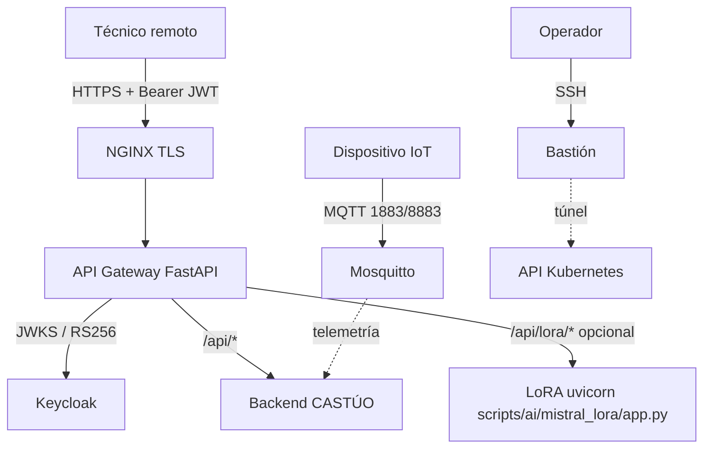

# Arquitectura de acceso remoto seguro (CTAEX / CASTÚO-SYSTEM)

**Ámbito:** plantilla técnica alineada con el monorepo (Keycloak ya referenciado en `docker-compose.eu-oss.yml`, backend con `backend/api/security/keycloak.py`, MQTT en `docker/docker-compose.ctaex.yml`).

**Fecha:** 2026-03-25

## Diagrama lógico



## Qué está en el repositorio (implementado como plantilla)

| Componente | Ruta | Notas |
|------------|------|--------|
| Compose acceso remoto | `docker-compose/remote-access.yml` | NGINX + Keycloak + Postgres + api-gateway + backend + Mosquitto |
| Bastión SSH | `docker-compose/bastion.yml` | Requiere red Docker `castuo_remote` |
| NGINX (TLS → gateway) | `docker/remote-access/nginx/conf.d/api.conf` | **Sin** `auth_request` a la URL de login de Keycloak (incorrecto para APIs Bearer) |
| API Gateway | `docker/api-gateway/` | JWT vía JWKS; proxy `/api/*` → backend; `/api/lora/*` → `LORA_UPSTREAM` |
| Mosquitto (lab) | `docker/remote-access/mosquitto/mosquitto.conf` | Solo `1883` por defecto; TLS en `mosquitto.tls.conf.example` |
| Bootstrap Keycloak | `scripts/remote-access/setup_keycloak.py` | Realm por defecto `castuo-system` |
| Túnel kubectl | `scripts/remote-access/connect_k8s.sh` | Plantilla; ajustar host interno del plano de control |
| Cliente MQTT ejemplo | `scripts/iot/mqtt_client.py` | `paho-mqtt` opcional |
| SIGPAC local | `scripts/integration/sigpac_local_bridge.py` | Usa `SIGPACValidator` (GeoJSON local), **no** API REST ficticia |
| Despliegue rápido | `scripts/deploy/deploy_ctaex_remote_stack.sh` | Cert autofirmado + `docker compose` |

## Qué no se afirma como “producción lista”

- **NGINX + `auth_request` al endpoint `/auth` de Keycloak** no valida tokens Bearer de API; para SSO navegador usar **oauth2-proxy**, **Traefik ForwardAuth** u otro componente IdP-aware (el stack EU OSS ya usa Traefik en `docker-compose.eu-oss.yml`).
- **No** hay proxy HTTP hacia el broker MQTT: los clientes deben usar el protocolo MQTT (puerto publicado o TLS).
- **LoRA/GGUF:** el servicio reproducible en repo es `scripts/ai/mistral_lora/app.py`; el gateway reenvía solo si defines `LORA_UPSTREAM`.
- **SIGPAC:** la integración honesta es validación **local** (`backend/integrations/sigpac_validator.py`); no usar URLs REST inventadas hacia administraciones.

## Variables de entorno clave

Copia `docker/remote-access/.env.remote-access.example` a `.env.remote-access`.

- `KEYCLOAK_REALM` — por defecto `castuo-system` (coherente con `docker-compose.eu-oss.yml` y `backend/api/security/keycloak.py`).
- `KEYCLOAK_CLIENT_ID` en el gateway — audience JWT; si Keycloak emite `aud` distinto, prueba `GATEWAY_VERIFY_AUD=false` **solo en laboratorio**.
- `LORA_UPSTREAM` — p. ej. `http://host.docker.internal:8899` si corres LoRA en el host.
- `GATEWAY_AUTH_DISABLED` / `BACKEND_AUTH_DISABLED` — atajos de laboratorio; **no** en exposición pública.

## Comandos rápidos

```bash
cp docker/remote-access/.env.remote-access.example .env.remote-access
# Editar secretos
bash scripts/deploy/deploy_ctaex_remote_stack.sh
```

Tras arrancar Keycloak:

```bash
pip install -r scripts/remote-access/requirements.txt
set -a && source .env.remote-access && set +a
export KEYCLOAK_SERVER_URL=http://localhost:8090
python scripts/remote-access/setup_keycloak.py
```

Token (password grant de ejemplo; ajustar client y scopes en tu realm):

```bash
curl -s -X POST "$KEYCLOAK_SERVER_URL/realms/$KEYCLOAK_REALM/protocol/openid-connect/token" \
  -d "client_id=api-gateway" \
  -d "client_secret=change-me-gateway-secret" \
  -d "grant_type=password" \
  -d "username=tecnico1" \
  -d "password=TU_PASSWORD"
```

Llamada vía gateway:

```bash
curl -sk https://localhost:8443/api/iot/... -H "Authorization: Bearer $ACCESS_TOKEN"
```

## Documentación de usuario

- `docs/user/REMOTE_ACCESS_GUIDE.md`
- `docs/user/MQTT_GUIDE.md`
- `docs/user/K8S_ACCESS_GUIDE.md`
- `docs/user/API_EXAMPLES.md`

## Coexistencia con otros stacks

- Stack soberano OSS: `docker-compose.eu-oss.yml`.
- CTAEX monorepo backend+MQTT: `docker/docker-compose.ctaex.yml`.
- Esta plantilla **no** sustituye revisión DPO, DPIA ni hardening operativo (WAF, rotación de claves, backups).
