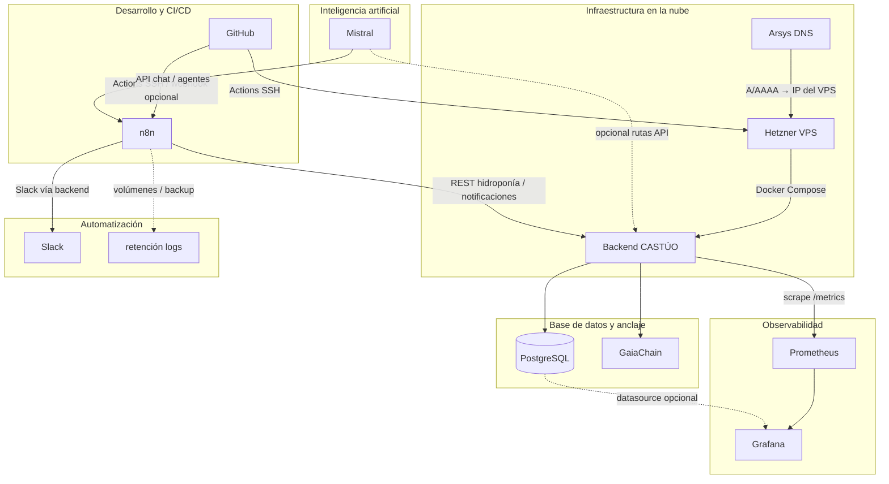
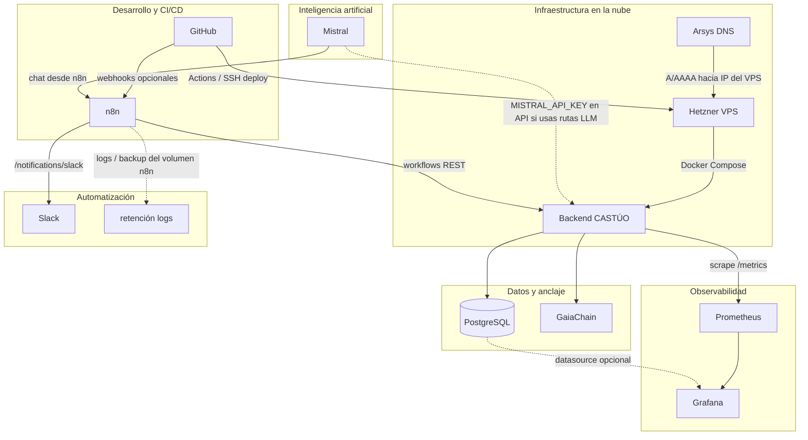
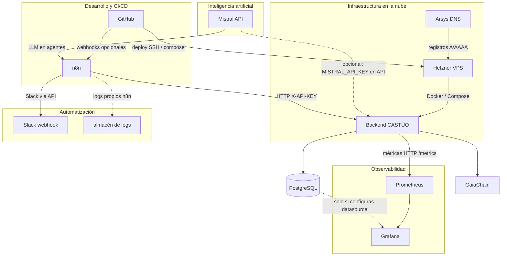
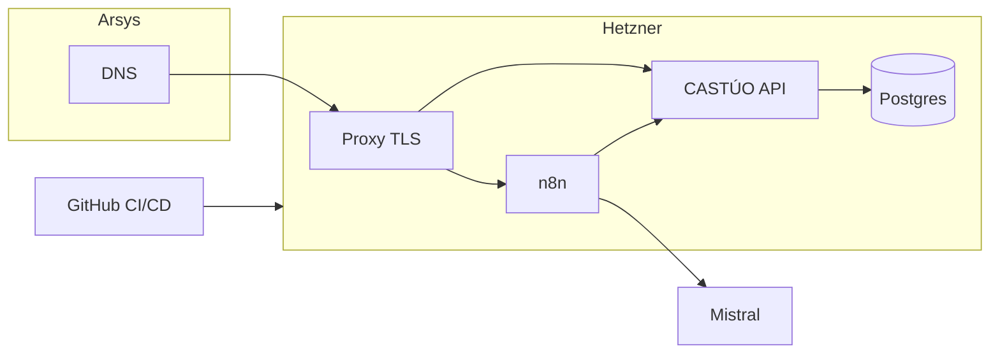
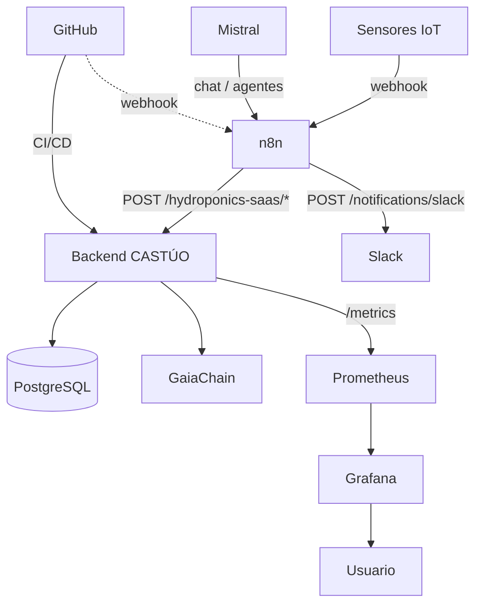

# Integración completa: n8n, Hetzner, Arsys, GitHub, Mistral y CASTÚO-SYSTEM

Documento único de referencia para enlazar dominio, infraestructura, código, orquestación e IA con el backend **CASTÚO-SYSTEM** (hidroponía SaaS, notificaciones, observabilidad). Úsalo como checklist de implementación.

**Estado del repo (coherencia funcional):** `docker-compose.prod.yml` inyecta en **n8n** las variables `CASTUO_BASE_URL`, `CASTUO_API_KEY`, `CASTUO_ZONE_ID` y `MISTRAL_API_KEY` (desde `.env.production`). El workflow **`n8n/workflows/castuo_hydro_sensor_mistral_min.json`** importa en un solo flujo: webhook → CASTÚO `sensor-readings` → Mistral (opcional).

---

## Resumen ejecutivo (integración final)

### Arquitectura final

Arsys aporta **DNS** (y opcionalmente correo); los **certificados TLS** se obtienen **en el VPS Hetzner** (Certbot + Nginx del repo o `certbot` con profile en compose), no como “envío” separado desde Arsys. **Prometheus** (si añades stack de métricas) **scrapea el backend**, no recibe métricas desde n8n por defecto. **Mistral** suele consumirse desde **n8n**; el backend puede usar `MISTRAL_API_KEY` en rutas concretas.



### Pasos críticos para implementar

1. **Clonar** el repo en el VPS (p. ej. `/opt/castuo/Castuo-System`).
2. **`.env.production`** en el servidor (no commitear): copiar desde `.env.production.example`. Este proyecto usa **`DATABASE_URL`** y **`POSTGRES_*`** con Docker; no basta un `DB_HOST` suelto si el compose espera la URL al servicio `postgres`. Alinear **`HYDROPONICS_SAAS_API_KEYS`** con **`CASTUO_API_KEY`**.
3. **Arrancar** con Compose **v2** (plugin `docker compose`, no obsoleto `docker-compose`):

```bash
docker compose -f docker-compose.prod.yml --env-file .env.production up -d
```

4. **Arsys**: registros **A** para `api`, `n8n` (y `grafana` solo si despliegas Grafana) hacia la IP del VPS. **TLS** según `castuo.conf` / Certbot del repo.
5. **GitHub**: workflow **`.github/workflows/n8n-deploy.yml`**. Secrets: **`HETZNER_HOST`**, **`HETZNER_SSH_KEY`**, opcional **`CASTUO_DEPLOY_PATH`** (ruta del repo en el VPS). **No** incluyas **`.env.production`** en el repositorio ni como `paths` del workflow; los secretos viven en el servidor y/o en GitHub Secrets (solo claves de despliegue).
6. **n8n**: importar **`n8n/workflows/castuo_hydro_sensor_mistral_min.json`**. Tras activar, la URL del webhook usa el path del nodo: **`/webhook/hydro-sensor-ingest`** (prefijo = tu `WEBHOOK_URL` público con `https://`).

```bash
curl -sS -X POST "https://n8n.tudominio.eu/webhook/hydro-sensor-ingest" \
  -H "Content-Type: application/json" \
  -d '{"sensor_type":"ph","value":6.8,"location":"greenhouse_1"}'
```

7. **Verificación**: `GET https://api.tudominio.eu/health` y **`/docs`**. Postgres: desde el host o contenedor con `psql` y tu `DATABASE_URL`. **Prometheus** (`:9090`): solo si añades ese servicio; **`docker-compose.prod.yml` del repo no incluye Prometheus por defecto**.

### Archivos clave

| Archivo | Descripción |
|--------|-------------|
| `docker-compose.prod.yml` | API, PostgreSQL, n8n, nginx, certbot (profile). |
| `docker-compose.n8n-castuo.yml` | Solo n8n + variables CASTÚO / Mistral. |
| `n8n/workflows/castuo_hydro_sensor_mistral_min.json` | Webhook → sensor-readings + Mistral opcional. |
| `scripts/n8n/patch_workflow_castuo_hydro.py` | Parche de exports hidroponía. |
| `.env.production.example` | Plantilla (DATABASE_URL, HYDROPONICS_*, CASTUO_*, MISTRAL_*). |
| `.env.n8n-castuo.example` | Plantilla stack solo n8n. |
| `.github/workflows/n8n-deploy.yml` | Deploy SSH al VPS (stack prod o legacy n8n). |
| Este documento | Guía maestra. |

### Orden de implementación sugerido

1. Hetzner: VPS, Docker, firewall (443/80, SSH acotado).  
2. Clonar repo, crear **`.env.production`**, levantar **`docker compose … up -d`**.  
3. Arsys: DNS; TLS en el VPS.  
4. GitHub: secrets + **n8n-deploy** (o deploy manual).  
5. n8n: importar workflow mínimo y probar webhook.  
6. Mistral: **`MISTRAL_API_KEY`** en `.env.production` (ya inyectada en n8n por compose).  
7. Pruebas end-to-end y monitorización (Prometheus/Grafana si añades stack).

---

## 1. Arquitectura general del sistema

### 1.1 Vista ejecutiva (todas las piezas)

Los certificados TLS **no los “envía” Arsys al servidor**: Arsys aloja **DNS**; en **Hetzner** ejecutas **Certbot** (o el servicio `certbot` del compose con profile) una vez resuelto el dominio. **Prometheus** scrapea **métricas del backend**, no recibe push desde n8n salvo que añadas un exportador aparte.



Visión por capas (texto): **Arsys** publica DNS hacia **Hetzner**; **GitHub** despliega y puede despertar **n8n**; **n8n** orquesta llamadas al **backend** y a **Mistral**; el **backend** persiste en **PostgreSQL**, ancla en **GaiaChain** cuando aplica, y expone **métricas** para **Prometheus**; **Grafana** consume Prometheus (y/o Postgres si lo configuras).



Notas sobre el diagrama:

- El flujo principal **n8n → backend** es el habitual (workflows). El backend **no** suele llamar a n8n salvo que diseñes webhooks entrantes a n8n desde otro servicio.
- **Prometheus** obtiene series del **backend** (scrape), no al revés desde n8n.
- **Mistral → backend** solo aplica si tus rutas FastAPI usan `MISTRAL_API_KEY` (p. ej. `docker-compose.prod.yml` lo admite); si no, Mistral vive en **n8n**.



---

## 2. Workflow mínimo CASTÚO + Mistral (importable)

1. Arranca el stack con `.env.production` que incluya `CASTUO_API_KEY`, `CASTUO_ZONE_ID`, `HYDROPONICS_SAAS_API_KEYS` (misma clave que `CASTUO_API_KEY`) y opcionalmente `MISTRAL_API_KEY`.
2. En n8n: **Import from File** → `n8n/workflows/castuo_hydro_sensor_mistral_min.json`.
3. Activa el workflow y copia la URL del webhook (respeta `WEBHOOK_URL` con `https://` en producción).
4. Prueba:

```bash
curl -sS -X POST "https://TU-N8N/webhook/hydro-sensor-ingest" \
  -H "Content-Type: application/json" \
  -d '{"sensor_type":"ph","value":6.2,"location":"invernadero_1"}'
```

La respuesta JSON incluye `castuo_response` y `mistral` (o `skipped` si no hay clave Mistral).

### 2.1. Conexión n8n ↔ CASTÚO en Docker (workflows hidroponía)

1. **Nombre del servicio API**  
   En `docker-compose.prod.yml` el servicio ya se llama **`api`** (no `backend`). Desde el contenedor **n8n** en la misma red Docker, la URL interna es **`http://api:8000`** (sin barra final en `CASTUO_BASE_URL`).

2. **Dos despliegues de n8n**  
   - **Mismo compose que la API** (`docker-compose.prod.yml`): en `.env.production` usa `CASTUO_BASE_URL=http://api:8000`.  
   - **Solo n8n** (`docker-compose.n8n-castuo.yml`): el valor por defecto del compose es `http://host.docker.internal:8000` para alcanzar la API en el host; no uses `http://api:8000` salvo que conectes n8n a la red del stack prod (`docker network connect` o un solo compose).

3. **Base de datos e hidroponía**  
   El router `hydroponics-saas` usa `backend/database.py` (psycopg2). Además de `DATABASE_URL`, define **`DB_HOST`**, **`DB_PORT`**, **`DB_NAME`**, **`DB_USER`**, **`DB_PASSWORD`** en `.env.production` apuntando al servicio `postgres` (ver `.env.production.example`).

4. **No copiar nodos con `bodyParametersJson` de guías antiguas**  
   En HTTP Request v4 conviene **`specifyBody: json`** y **`jsonBody`** con expresiones `={{ ... }}`. El repo lo aplica automáticamente con:

   ```bash
   python scripts/n8n/patch_workflow_castuo_hydro.py tu_export.json -o tu_export.patched.json
   ```

5. **Análisis diario**  
   Tras **Preparar Reporte Diario**, los campos suelen ser `problemas` / `recomendaciones` (a veces string JSON), no `problemas_detectados` en la raíz. El script de parcheo ajusta **Preparar Análisis para BD** y el POST a **`daily-analysis`** al modelo `DailyAnalysis`.

6. **Cosecha**  
   La URL debe usar el **`crop_id`** registrado (`crop_id_final` en tu flujo), no un id arbitrario.

7. **Verificación**  
   - API: `curl -fsS http://127.0.0.1:8000/health` desde el contenedor `api` o vía Nginx TLS.  
   - Postgres: `psql` con la misma `DB_*` / URL que el backend.  
   - Prometheus en `:9090` solo si añades ese servicio (no forma parte del `docker-compose.prod.yml` mínimo del repo).

---

## 3. Pasos para la integración completa

### 3.1. Hetzner — objetivo: hosting del backend y base de datos

1. Crear VPS (región UE si aplica soberanía), instalar **Docker** y **Docker Compose** plugin.
2. **Firewall (producción)**:
   - Permitir **22** solo desde IPs administración.
   - Permitir **80** y **443** al proxy (Nginx/Caddy/Traefik).
   - **No** publicar **5432** (Postgres), **8000** (API) ni **9090** (Prometheus) a Internet salvo requisito excepcional; acceso interno Docker o túnel VPN.
3. **Despliegue en este repo**: usar **`docker-compose.prod.yml`** como referencia principal (servicios `postgres`, `api`, `n8n`, `nginx`, `certbot` con profile). Copia `.env.production.example` → `.env.production` y rellena secretos.
4. Variables típicas del backend: `DATABASE_URL` o equivalente según `backend/database.py`, `HYDROPONICS_SAAS_API_KEYS` / `N8N_API_KEY`, `SLACK_WEBHOOK_URL`, claves GaiaChain si activas anclajes.

**No uses en producción** un `docker-compose.yml` genérico con Postgres/Redis/Prometheus todos los puertos abiertos al mundo. Ajusta al compose del repositorio y al proxy.

Fragmento ilustrativo (referencia mental; **detalle real** en `docker-compose.prod.yml`):

```yaml
# Referencia: ver docker-compose.prod.yml en la raíz del repo.
# - api: expose 8000 (no publicar sin proxy)
# - postgres: solo red interna castuo_internal
# - nginx: 80/443 con TLS
# - n8n: CASTUO_* vía .env.n8n-castuo o .env.production según tu stack
```

Arranque ejemplo (desde raíz del repo en el servidor):

```bash
docker compose -f docker-compose.prod.yml --env-file .env.production up -d
```

Para **solo n8n** contra API en el host: `docker compose -f docker-compose.n8n-castuo.yml --env-file .env.n8n-castuo up -d`.

---

### 2.2. Arsys — DNS y TLS

1. **DNS**: registros **A** / **AAAA** de `api.tudominio.eu`, `n8n.tudominio.eu`, `grafana.tudominio.eu` (o los hosts que uses) hacia la **IP del VPS Hetzner**.
2. **Certificados**: Let’s Encrypt. En este repo, `certbot` va con **profile** en `docker-compose.prod.yml`; alternativa en el servidor: `certbot` + Nginx (según tu `castuo.conf`).
3. Tras DNS propagado, emite certificados y fuerza **HTTPS** en `WEBHOOK_URL` de n8n.

---

### 3.3. GitHub — control de versiones y CI/CD

1. Repositorio con `.gitignore` que excluya `.env*`, secretos y volúmenes.
2. **GitHub Actions** (ejemplo modernizado): despliegue por SSH al servidor.

Crea `.github/workflows/deploy-hetzner.example.yml` copiando y adaptando (renombra quites `.example` si lo activas):

```yaml
name: Deploy to Hetzner

on:
  push:
    branches: [main]

jobs:
  deploy:
    runs-on: ubuntu-latest
    steps:
      - uses: actions/checkout@v4

      - name: Install SSH key
        uses: webfactory/ssh-agent@v0.9.0
        with:
          ssh-private-key: ${{ secrets.SSH_PRIVATE_KEY }}

      - name: Add known hosts
        run: |
          mkdir -p ~/.ssh
          echo "${{ secrets.KNOWN_HOSTS_ENTRY }}" >> ~/.ssh/known_hosts

      - name: Deploy
        run: |
          ssh ${{ secrets.DEPLOY_USER }}@${{ secrets.DEPLOY_HOST }} << 'EOF'
            set -e
            cd ${{ secrets.DEPLOY_PATH }}
            git pull origin main
            docker compose -f docker-compose.prod.yml --env-file .env.production pull
            docker compose -f docker-compose.prod.yml --env-file .env.production up -d --build
          EOF
```

**Secrets recomendados**: `SSH_PRIVATE_KEY`, `KNOWN_HOSTS_ENTRY` (salida de `ssh-keyscan`), `DEPLOY_USER`, `DEPLOY_HOST`, `DEPLOY_PATH`. No guardes contraseñas en el workflow en claro.

3. **Webhooks** (opcional): en GitHub → Settings → Webhooks → URL del webhook n8n para eventos de push o releases.

---

### 3.4. n8n — automatización

1. Instalar en el mismo Docker network que la API (`castuo_internal` en producción) o usar `host.docker.internal` según `docker-compose.n8n-castuo.yml`.
2. Variables mínimas CASTÚO (hidroponía):

| Variable | Ejemplo producción |
|----------|-------------------|
| `CASTUO_BASE_URL` | `https://api.tudominio.eu` (sin `/` final) |
| `CASTUO_API_KEY` | Misma clave que `HYDROPONICS_SAAS_API_KEYS` o `N8N_API_KEY` |
| `CASTUO_ZONE_ID` | ej. `zone_cannabis_1` |
| `WEBHOOK_URL` | `https://n8n.tudominio.eu/` |
| `N8N_ENCRYPTION_KEY` | obligatorio en prod (`openssl rand -hex 24`) |

Plantilla: `.env.n8n-castuo.example`. Compose: `docker-compose.n8n-castuo.yml` (pasa `CASTUO_*`).

3. **Workflows**: exporta desde n8n, ejecuta el parche y reimporta:

```bash
python scripts/n8n/patch_workflow_castuo_hydro.py tu_export.json -o tu_export.patched.json
```

4. Nodos **HTTP Request** deben usar cuerpo JSON acorde a `backend/routers/hydroponics_saas.py` (ver sección 6 del presente doc).

---

### 3.5. Mistral — IA

1. Obtener API key en Mistral (UE).
2. **En n8n**: credencial oficial Mistral o variable de entorno (según tu política; evita hardcode).
3. **Llamada HTTP directa** (ejemplo alineado a API chat; nodo HTTP v4: `specifyBody: json`):

```json
{
  "parameters": {
    "url": "={{ 'https://api.mistral.ai/v1/chat/completions' }}",
    "method": "POST",
    "sendHeaders": true,
    "headerParameters": {
      "parameters": [
        { "name": "Authorization", "value": "=Bearer {{ $env.MISTRAL_API_KEY }}" },
        { "name": "Content-Type", "value": "application/json" }
      ]
    },
    "sendBody": true,
    "specifyBody": "json",
    "jsonBody": "={{ {\n  model: 'mistral-small-latest',\n  messages: [\n    { role: 'system', content: 'Experto en hidroponía. Sé conciso.' },\n    { role: 'user', content: `pH=${$json.ph} T=${$json.temperature} RH=${$json.humidity}` }\n  ]\n} }}"
  },
  "name": "Analizar con Mistral",
  "type": "n8n-nodes-base.httpRequest",
  "typeVersion": 4.4
}
```

Ajusta `model` al que tengas contratado. Preferible usar **nodos LangChain + Mistral** si tu instancia los trae, para menos fricción con JSON.

4. **Backend**: si usas `docker-compose.prod.yml`, existe `MISTRAL_API_KEY` en el servicio `api` para rutas que lo consuman; no implica que todo el tráfico LLM pase por ahí.

---

## 4. Flujo de datos extremo a extremo (IoT → CASTÚO → vista)



**Ejemplo de pasos en un workflow n8n**

1. Recibir datos (Webhook `/sensor-data`).
2. Clasificar / umbrales (Switch + IF).
3. Enviar lectura a CASTÚO (`sensor-readings`) con `X-API-KEY`.
4. Opcional: análisis con Mistral (agente o HTTP).
5. Alertas: nodo Slack nativo o `POST` a `/notifications/slack` (requiere `SLACK_WEBHOOK_URL` en el backend).
6. Análisis diario: `POST /hydroponics-saas/daily-analysis` con el esquema `DailyAnalysis`.

---

## 5. Variables de entorno unificadas (resumen)

### 5.1. Backend

| Variable | Uso |
|----------|-----|
| `HYDROPONICS_SAAS_API_KEYS` | Claves `X-API-KEY` (lista separada por comas). |
| `N8N_API_KEY` | Alternativa si no defines la lista anterior. |
| `DATABASE_URL` / `DB_*` | Conexión Postgres (ver código y compose prod). |
| `SLACK_WEBHOOK_URL` | Webhook entrante Slack usado por `/notifications/slack`. |
| `MISTRAL_API_KEY` | Opcional en API (`docker-compose.prod.yml`). |

Modelos: `backend/routers/hydroponics_saas.py`.

### 5.2. n8n (inyectadas en `docker-compose.prod.yml` desde `.env.production`)

| Variable | Notas |
|----------|--------|
| `CASTUO_BASE_URL` | Sin barra final. |
| `CASTUO_API_KEY` | Alineada al backend. |
| `CASTUO_ZONE_ID` | Zona lógica de negocio. |
| `MISTRAL_API_KEY` | Si usas expresiones `Bearer`. |

---

## 6. Workflows n8n y parche CASTÚO

Ver secciones equivalentes en versiones anteriores del doc: ejecutar `scripts/n8n/patch_workflow_castuo_hydro.py`, criterios de `jsonBody`, `crop_id` en cosechas, y evitar doble POST desde Data Tables.

---

## 7. Verificación y depuración

### 7.1. Backend

```bash
curl -sS "https://api.tudominio.eu/health"
curl -sS "https://api.tudominio.eu/docs"
```

### 7.2. Base de datos

Desde el host o un contenedor con cliente, usando credenciales reales:

```bash
psql "$DATABASE_URL" -c "\dt hydroponics_*"
```

### 7.3. n8n

Ejecutar workflow manualmente; revisar **Executions** y logs del contenedor.

### 7.4. GitHub Actions

Pestaña Actions: comprobar job `deploy` y fallos SSH/path.

### 7.5. Mistral

Ejecutar nodo de prueba; revisar cuerpo de error 401 (key) o 400 (modelo).

---

## 8. Orden de implementación sugerido

Lista ampliada; la versión de una página está en **Resumen ejecutivo** al inicio.

1. Hetzner: VPS, firewall mínimo, Docker.
2. Clonar repo, `.env.production`, `docker compose -f docker-compose.prod.yml up -d`.
3. Arsys: DNS → IP Hetzner; TLS operativo; `WEBHOOK_URL` https en n8n.
4. Probar `/health`, hidroponía con `curl`, Postgres con tablas `hydroponics_*`.
5. n8n: vars `CASTUO_*`, parche workflow, webhooks públicos.
6. GitHub: Actions + secrets.
7. Mistral: credencial + nodos.
8. Observabilidad: scrape Prometheus, dashboards Grafana.

---

## Checklist final operativo (Cursor, n8n, Hetzner, Arsys, GitHub, Mistral)

### Backend y base de datos (Cursor / `.env.production`)

1. Copia **`.env.production.example`** → **`.env.production`** (no lo subas a Git).
2. Configura al menos: **`DATABASE_URL`**, **`POSTGRES_*`**, **`DB_HOST`/`DB_PORT`/`DB_NAME`/`DB_USER`/`DB_PASSWORD`** (hidroponía vía `backend/database.py`), **`HYDROPONICS_SAAS_API_KEYS`**, **`CASTUO_API_KEY`** (misma clave que una entrada de la lista), **`CASTUO_ZONE_ID`**, **`SLACK_WEBHOOK_URL`** (para `/notifications/slack` en el **api**), **`MISTRAL_API_KEY`** (opcional en api y n8n).
3. **`docker-compose.prod.yml`** ya inyecta en **api** `DB_*`, `HYDROPONICS_SAAS_API_KEYS` (por defecto igual a `CASTUO_API_KEY` si no definiste la primera) y `SLACK_WEBHOOK_URL` además de `env_file: .env.production`.
4. **Tablas hidroponía**: con volumen **nuevo**, Postgres ejecuta `init-db/002_hydroponics_saas.sql` en el primer arranque. Si el volumen **ya existía** sin esas tablas, aplícalo una vez:
   `docker compose -f docker-compose.prod.yml exec -T postgres psql -U castuo -d castuo -f /docker-entrypoint-initdb.d/002_hydroponics_saas.sql`
5. Comprobación:
   `docker compose -f docker-compose.prod.yml exec postgres psql -U "${POSTGRES_USER:-castuo}" -d "${POSTGRES_DB:-castuo}" -c "\dt hydroponics_*"`

### n8n

1. **Prod**: el servicio **n8n** del mismo `docker-compose.prod.yml` recibe `CASTUO_BASE_URL`, `CASTUO_API_KEY`, `CASTUO_ZONE_ID`, `MISTRAL_API_KEY` desde `.env.production`.
2. **Solo n8n**: `docker-compose.n8n-castuo.yml` + `.env.n8n-castuo`; **`N8N_USER`** o **`N8N_BASIC_AUTH_USER`** + **`N8N_PASSWORD`** + **`N8N_ENCRYPTION_KEY`**.
3. Importar **`n8n/workflows/castuo_n8n_import_guide.json`** y **`castuo_hydro_full_integration.json`** (y/o `castuo_hydro_sensor_mistral_min.json`). Webhook integración completa: **`/webhook/castuo-hydro-full`**.

### Hetzner

- Instalar **Docker Engine** + plugin **Compose v2** (comando unificado: **`docker compose`**, no el binario obsoleto `docker-compose` si tu distro ya no lo empaqueta).
- Clonar repo, crear `.env.production`, `docker compose -f docker-compose.prod.yml --env-file .env.production up -d --build`.

### Arsys (DNS + TLS)

- Registros **A/AAAA** hacia la IP del VPS (`api`, `n8n`; `grafana` solo si despliegas Grafana).
- **TLS** en el VPS: Certbot + Nginx del repo (`castuo.conf`, etc.) o perfil certbot del compose; no “certificado desde Arsys” al servidor salvo que uses delegación específica.

### GitHub Actions

- Workflow **`.github/workflows/n8n-deploy.yml`** (nombre **Deploy to Hetzner**): dispara en `push` a `main` si cambian compose, Dockerfile, backend, `init-db`, workflows n8n o el propio workflow.
- **Secrets**: `HETZNER_HOST`, `HETZNER_SSH_KEY`; opcionales `HETZNER_SSH_USER` (default **root**), `CASTUO_DEPLOY_PATH` (default `/opt/castuo/Castuo-System`), `KNOWN_HOSTS` (entrada fija; si falta, el job usa `ssh-keyscan` al host).
- **No** incluyas **`.env.production`** en el repositorio ni en `paths` del workflow.

### Mistral

- **`MISTRAL_API_KEY`** en `.env.production` (inyectada también en n8n por compose prod).

### Verificación

- Script único (VPS, raíz del repo): **`./deploy/verify_stack.sh`** (opcional `PUBLIC_API_HEALTH_URL=https://api.tudominio.eu/health`, `VERIFY_PROMETHEUS=1` si tienes scrape en `:9090`).
- API: `curl -sS "https://api.tudominio.eu/health"` (o `http://127.0.0.1:8000/health` dentro del contenedor api).
- **Prometheus** (`curl http://localhost:9090/targets`): solo si desplegaste un stack de métricas; **`docker-compose.prod.yml` del repo no incluye Prometheus por defecto**.
- Webhook n8n (ajusta URL y basic auth si aplica):
  `curl -sS -X POST "https://n8n.tudominio.eu/webhook/castuo-hydro-full" -H "Content-Type: application/json" -u usuario:password -d '{"sensor_type":"ph","value":6.8,"location":"greenhouse_1","threshold":7.0,"threshold_low":6.0}'`

---

## 9. Archivos clave en el repositorio

| Archivo | Propósito |
|---------|-----------|
| `docker-compose.prod.yml` | Producción: `CASTUO_*` y `MISTRAL_API_KEY` en servicio **n8n**. |
| `docker-compose.n8n-castuo.yml` | Solo n8n + vars CASTUO + Mistral. |
| `n8n/workflows/castuo_hydro_sensor_mistral_min.json` | Webhook → hidroponía + Mistral. |
| `n8n/workflows/castuo_hydro_full_integration.json` | Sensor → análisis diario → Slack vía API. |
| `init-db/002_hydroponics_saas.sql` | Crea tablas `hydroponics_*` en primer arranque de Postgres. |
| `scripts/n8n/patch_workflow_castuo_hydro.py` | Parche de workflows hidroponía exportados. |
| `.env.n8n-castuo.example` / `.env.production.example` | Plantillas (`HYDROPONICS_SAAS_API_KEYS`, `CASTUO_*`). |
| `.github/workflows/n8n-deploy.yml` | Deploy SSH al VPS (**Deploy to Hetzner**). |
| `backend/routers/hydroponics_saas.py` | Contrato API. |
| `backend/routers/notifications.py` | Slack proxy. |

---

## 10. Errores frecuentes

- Abrir **Postgres** o **Prometheus** a Internet innecesariamente.
- **401/403** n8n: clave API desalineada con el backend.
- **Webhook n8n** con `http://` cuando el proveedor IoT exige `https://`.
- **Slack sin mensaje**: falta `SLACK_WEBHOOK_URL` en el **proceso del backend**.
- **Cosecha fallida**: `crop_id` del formulario distinto al registrado en CASTÚO.

---

*CASTÚO-SYSTEM — integración soberana n8n + infra UE. Actualiza este documento si cambian `docker-compose.prod.yml` o los contratos de `hydroponics_saas`.*
