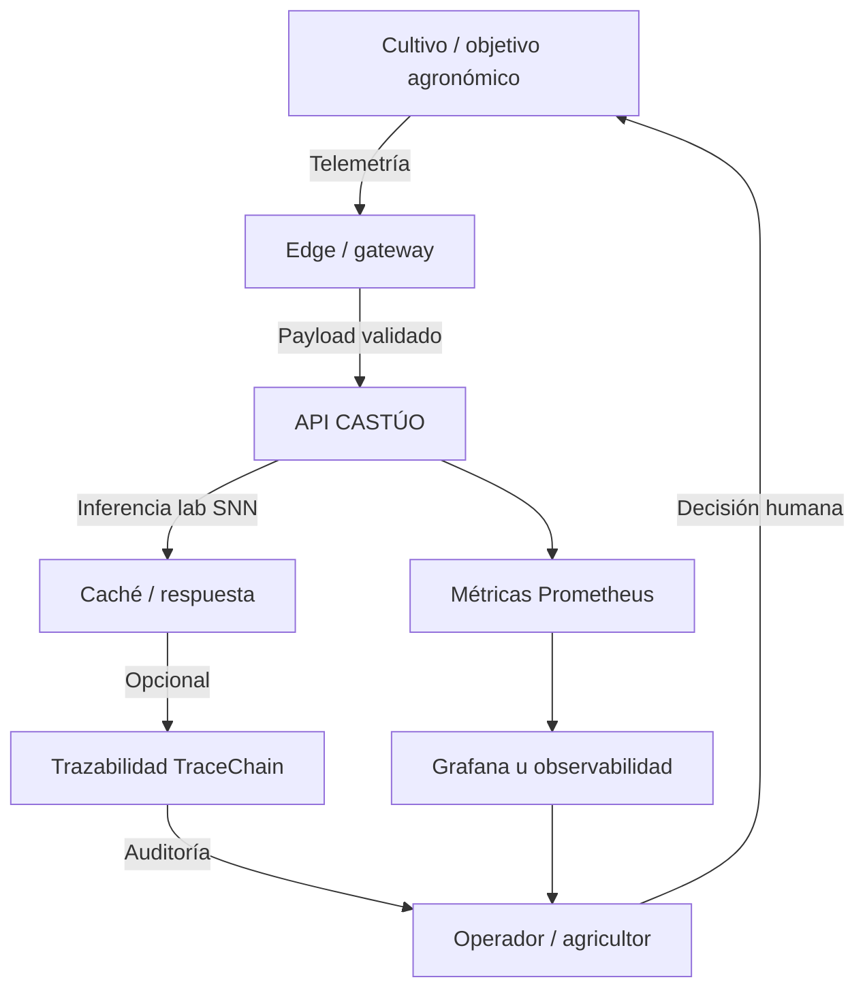
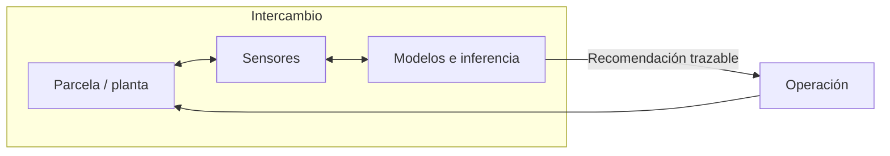

# Mapa — redes simbióticas (visualización)

**Relación:** [PRONTUARIO-MAESTRO-ECOLOGIA-DIGITAL-AGRICOLA-2026.md](./PRONTUARIO-MAESTRO-ECOLOGIA-DIGITAL-AGRICOLA-2026.md) · [PRONTUARIO-MAESTRO-INTEGRACION-BIOLOGICA-DIGITAL-2026.md](./PRONTUARIO-MAESTRO-INTEGRACION-BIOLOGICA-DIGITAL-2026.md)

Los diagramas son **lenguaje de diseño** para alinear equipos agronómicos y de software. Las cajas “TraceChain”, “Grafana” o “memristor” deben interpretarse según lo **realmente desplegado** en cada entorno.

---

## 1. Ciclo datos ↔ decisión ↔ campo

---

## 2. Red simbiótica pedagógica *(versión narrativa)*

---

## 3. Flujo neuromórfico lógico *(alineado al stub en repo)*

Ver diagrama detallado en [NEUROMORPHIC-MEMRISTOR-ORIENTACION-2026.md §1.1](../integrations/NEUROMORPHIC-MEMRISTOR-ORIENTACION-2026.md).

---

*Si el diagrama no coincide con el cableado real del invernadero o del VPS, actualizar este mapa: el territorio gana a la metáfora.*
