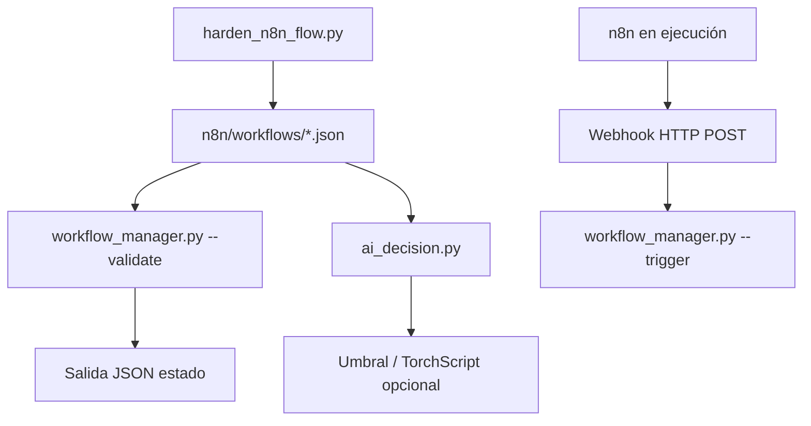

# PRONT CASTÚO–N8N
## Automatización de workflows

| Campo | Valor |
|-------|--------|
| **Versión** | 1 |
| **Fecha** | Marzo 2026 |
| **Alcance** | Validación JSON export, disparo webhook opcional, hardening |
| **Uso** | Guía rápida A4; no sustituye DPIA ni asesoría legal/regulatoria |
| **Patrón** | `docs/deploy/PRONT-PATRON-SISTEMAS-INTEGRADOS.md` |

**Responsable (copia interna):** _______________________

---

## Aviso

- Los workflows exportados pueden contener secretos: no commitear credenciales; usar variables de entorno en n8n.
- Documentación extensa: `docs/deploy/PRONTUARIO-AUTOMATIZACION-N8N-2026.md`.

---

## 1. Diagrama (Mermaid)



---

## 2. Componentes

| Componente | Ruta en repo | Notas |
|------------|--------------|--------|
| Exports workflows | `n8n/workflows/*.json` | Formato export n8n (`nodes`, `connections`) |
| CLI utilidades | `scripts/ai/n8n/workflow_manager.py` | `--list`, `--validate`, `--trigger` + env `CASTUO_N8N_WEBHOOK_BASE` |
| Dependencias CLI | `scripts/ai/n8n/requirements_n8n.txt` | `requests` |
| Decisión lab | `scripts/ai/n8n/ai_decision.py` | Heurística JSON; TorchScript opcional (`requirements_n8n_ai.txt`) |
| Compose referencia | `docker-compose.n8n-castuo.yml`, `.env.n8n-castuo.example` | Despliegue aparte |
| Hardening | `scripts/harden_n8n_flow.py` | Ver prontuario |

---

## 3. Flujo operativo

1. **Listar stems disponibles:** `python scripts/ai/n8n/workflow_manager.py --list`
2. **Validar estructura mínima:** `python scripts/ai/n8n/workflow_manager.py --validate castuo_system_monitor`
3. **Disparar webhook (producción/staging):** definir base real del nodo Webhook y ejecutar:
   ```bash
   export CASTUO_N8N_WEBHOOK_BASE=https://tu-instancia/webhook
   pip install -r scripts/ai/n8n/requirements_n8n.txt
   python scripts/ai/n8n/workflow_manager.py --trigger nombre_ruta_webhook --payload '{"ping":true}'
   ```
4. **Decisión para ramas (lab):** `python scripts/ai/n8n/ai_decision.py --data '{"humedad":0.8,"temperatura":0.2}'` (umbral `CASTUO_N8N_ALERT_THRESHOLD`).
5. **Tests:** `pytest scripts/ai/n8n/tests/ -q`

---

## 4. TRL y evidencia

| Área | Estado en repo | Evidencia objetivo |
|------|----------------|--------------------|
| Validación estática | CLI + tests | CI que valide exports en PR |
| Ejecución end-to-end | Manual / staging | Logs n8n + respuesta HTTP documentados |
| Seguridad flujos | `harden_n8n_flow.py` + revisión humana | Informe de nodos prohibidos / secretos |
| IA en workflow | `ai_decision.py` | Calibrar umbrales o modelo con datos reales; no confundir demo con TRL productivo |

---

## 5. Incidencias

| Problema | Acción |
|----------|--------|
| `No existe ...json` | Comprobar `CASTUO_N8N_WORKFLOWS_DIR` o ruta `n8n/workflows/` |
| 404 / timeout webhook | Ver path del nodo, TLS, firewall, auth del webhook |
| JSON inválido | Re-exportar desde n8n; validar con `--validate` |

---

## 6. Anexos — comandos

```bash
pip install -r scripts/ai/n8n/requirements_n8n.txt
python scripts/ai/n8n/workflow_manager.py --list
python scripts/ai/n8n/ai_decision.py --data '{"humedad":0.7,"temperatura":0.3}'
pip install -r scripts/ai/n8n/requirements_n8n_ai.txt   # solo si usas TorchScript
python scripts/generate_pront.py N8N --version 1
```

Si el fichero PRONT ya existe, el generador no sobrescribe; editar manualmente o usar `--version` mayor.
