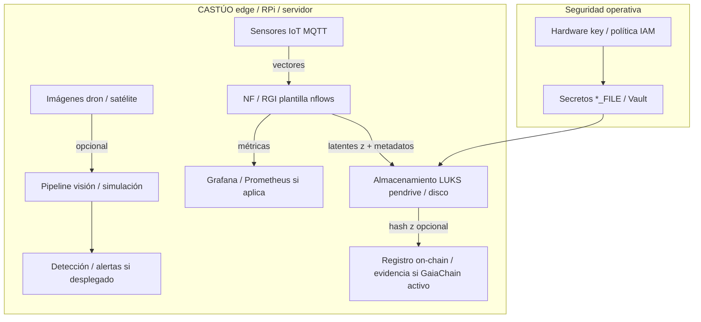

# PRONT CASTÚO–RGI  
## Integración técnica, TRL y operación en campo / laboratorio

| Campo | Valor |
|-------|--------|
| **Versión** | 2.0 |
| **Fecha** | Marzo 2026 |
| **Alcance** | CASTÚO-SYSTEM + módulo RGI (`scripts/ai/generative/`) |
| **Uso** | Guía rápida A4; no sustituye DPIA, asesoría legal ni auditoría regulatoria |
| **Patrón** | Cómo replicar este tipo de guías: `docs/deploy/PRONT-PATRON-SISTEMAS-INTEGRADOS.md` |

**Responsable del documento (completar en copia controlada):** _______________________

---

## Aviso (obligatorio)

- Este PRONT es **técnico y operativo**. No constituye **certificación AEMPS**, **validación TRL** ni **conformidad** con normativa citada: eso requiere proceso, evidencia y firmas fuera del repositorio.
- El repositorio mantiene una **puerta de integración TRL-6** en varias líneas (p. ej. laboratorio `hydroponics/infer`); un **TRL superior** exige checklist industrial, piloto y métricas (ver `deploy/CHECKLIST-TRL7-INDUSTRIAL-LIVE.md` y documentación legal del repo).
- **RGI / Normalizing Flows:** la compresión “N×” y la reversibilidad **exacta** dependen de diseño del modelo, codificación y datos; no asumir ratios (p. ej. 100 MB→10 MB) sin medición en tu despliegue.

---

## 1. Diagrama de integración (referencia)



---

## 2. Componentes y estado en el repositorio

| Componente | Ubicación / notas | TRL en repo | Objetivo de trabajo (campo) |
|------------|-------------------|-------------|------------------------------|
| Normalizing Flow (plantilla) | `scripts/ai/generative/train_sensor_flow.py` | Experimental / sin datos CICYTEX por defecto | Calibrar con datos reales y validar reconstrucción |
| Contrato invertible mínimo | `scripts/ai/generative/reversible_affine.py` | Demostrador NumPy | Pruebas de pipeline y hash de latentes |
| Deps opcionales | `scripts/ai/generative/requirements_rgi.txt` | No en `backend/requirements.txt` | Instalar solo en estación de entrenamiento o edge con recursos |
| API laboratorio | `POST .../hydroponics/infer` | TRL-6 integración (sim/lab) | Decidir si RGI se acopla aquí o en rutas dedicadas |
| Pendrive | `Prepare-CastuoPendrive.ps1`, LUKS Linux | Operativo (tokens + copia RGI) | LUKS para volumen cifrado; NTFS en Windows = paquete transporte |
| Edge Docker (ejemplo) | `docker-compose.rgi.example.yml` | Plantilla | Ajustar imagen, MQTT, DB antes de producción |

*No asignar “TRL 9” a un componente por estar en tabla: TRL es **evidencia de despliegue**, no versión de librería.*

---

## 3. Flujo de operaciones

### 3.1 Adquisición

- Sensores → broker MQTT / API según tu arquitectura.
- Definir **dimensión fija** del vector por muestra (p. ej. 4, 20, 200) antes de entrenar NF.

### 3.2 Procesamiento RGI (línea base en repo)

1. Entorno opcional: `pip install -r scripts/ai/generative/requirements_rgi.txt`
2. Entrenamiento / prueba:  
   `python scripts/ai/generative/train_sensor_flow.py --dim <D> --epochs <N> --out models/rg/sensor_flow.pt`  
   (sustituir datos sintéticos por tensor real cuando exista dataset acordado).
3. Verificación de integridad de latentes (stub): usar `hash_latent` en `reversible_affine.py` como patrón de auditoría hasta tener NF exportado y medido en edge.

### 3.3 Almacenamiento y trazabilidad

- **Secretos y tokens:** `tokens/` en volumen **LUKS** (Linux); rutas `*_FILE` en `.env.production` / compose (ver `deploy/PENDRIVE-CONTENIDO.md`).
- **Latentes `z`:** política de datos personales / ubicación precisa → revisar base legal y DPIA antes de exponer en cadena o dashboards.
- **On-chain:** si se usa GaiaChain/Web3, registrar **hashes** y metadatos mínimos acordados con legal; no sustituir informe AEMPS.

### 3.4 Visualización y alertas

- Umbrales (p. ej. “estrés hídrico”) deben calibrarse con **validación cruzada** y contexto agronómico; evitar alertas sin contrafactual en campo.

---

## 4. TRL por área (plantilla)

| Área | Evidencia mínima sugerida | Notas |
|------|---------------------------|--------|
| Compresión / NF | Informe con error de reconstrucción en hold-out + registro de versiones de modelo | Sin dataset acordado = TRL bajo |
| Interpretabilidad (INN) | Correlación con mediciones de referencia (laboratorio / CTAEX) | FrEIA opcional, no incluido por defecto |
| Edge RPi | Latencia medida con ONNX/torch en el mismo hardware y carga | No afirmar “10×” sin benchmark |
| Trazabilidad | Cadena de custodia de `z`, hashes, logs y revisiones | Alinear con `agrotech/ETHICS_TRACEABILITY.md` |

---

## 5. Seguridad y cumplimiento (checklist corta)

| Riesgo | Medida en CASTÚO | Referencia repo |
|--------|------------------|-----------------|
| Exposición de secretos | `*_FILE`, LUKS, sin tokens en git | `deploy/PENDRIVE-CONTENIDO.md`, `.env.production.example` |
| IAM | Roles `auth_roles.py`, admin acotado | `backend/auth_roles.py` |
| Datos sensibles en alertas | Prefijos legales, sin PII en Telegram | `PRONTUARIO-AGROTECH-TLS.md` §8 |

*Kyber / YubiKey / Shamir: solo si forman parte de **tu** arquitectura desplegada; no están automatizados en este PRONT.*

---

## 6. Cronograma (editable)

| Fecha | Hito | Responsable |
|-------|------|---------------|
| … | Congelar dimensión `D` y formato de dataset | IA + campo |
| … | Entrenar NF con datos reales y validar reconstrucción | IA |
| … | Decisión API: extender `hydroponics/infer` vs `/rg/*` | Backend |
| … | ONNX / cuantización en RPi de prueba | DevOps |
| … | Informe para revisión legal / regulador | Legal |
| … | Piloto documentado (TRL industrial) | Todos |

---

## 7. Resolución de incidencias

| Problema | Causa probable | Acción |
|----------|----------------|--------|
| NF inestable o NLL divergente | Datos OOD o `dim` incorrecta | Revisar normalización y hold-out |
| Latencia alta en edge | Modelo pesado o sin ONNX | Medir; optimizar o reducir `dim` |
| Pendrive no monta (Linux) | Partición / LUKS / permisos | `deploy/mount_secure.example.sh` + `by-id` |
| “No monta” en Windows | Confusión NTFS vs LUKS | NTFS solo empaqueta; LUKS se crea en Linux (`prepare_pendrive_luks.example.sh`) |
| Tokens con BOM | Editor Windows | `Prepare-CastuoPendrive.ps1` avisa; regenerar sin BOM |

---

## 8. Anexos — comandos rápidos (rutas reales)

```bash
# Dependencias RGI (opcional)
pip install -r scripts/ai/generative/requirements_rgi.txt

# Plantilla entrenamiento NF (datos sintéticos por defecto)
python scripts/ai/generative/train_sensor_flow.py --dim 20 --epochs 30 --out models/rg/sensor_flow.pt

# Empaquetar en pendrive (Windows → volumen D:)
# .\scripts\windows\prepare_pendrive_final.ps1 -DriveLetter D
```

```bash
# Linux: montaje seguro + verificación tokens (ajustar rutas)
export CASTUO_TOKENS_PATH=/mnt/castuo_secure/tokens
python3 scripts/verify_castuo_tokens.py
```

---

## 9. Contactos (completar en copia interna)

| Rol | Nombre | Email | Teléfono |
|-----|--------|-------|----------|
| Director técnico | | | |
| IA / datos | | | |
| DevOps | | | |
| Legal / DPO | | | |

---

*Fin del PRONT v2.0 — mantener coherente con `docs/deploy/PRONTUARIO-AGROTECH-TLS.md` y `scripts/ai/generative/README.md`.*
