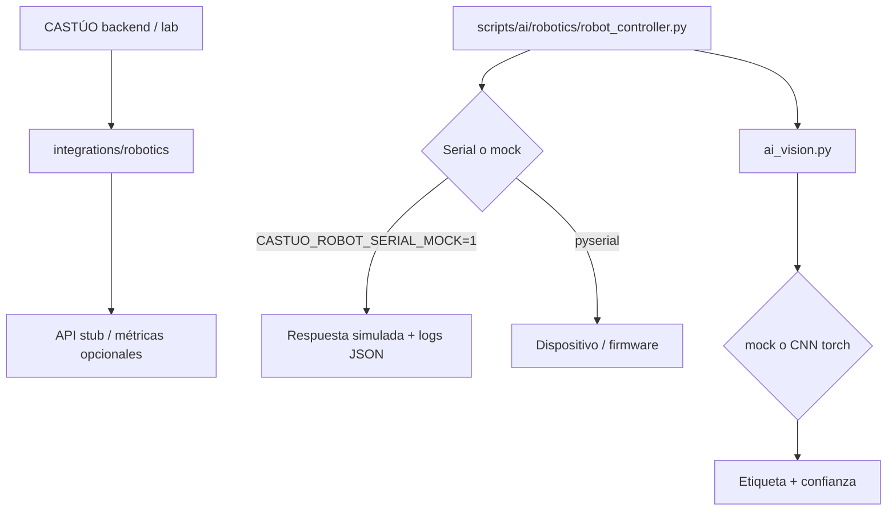

# PRONT CASTÚO–ROBOTICS
## Edge y laboratorio serial (mock / hardware)

| Campo | Valor |
|-------|--------|
| **Versión** | 1 |
| **Fecha** | Marzo 2026 |
| **Alcance** | Script CLI lab, integración backend, seguridad |
| **Uso** | Guía rápida A4; no sustituye DPIA ni asesoría legal/regulatoria |
| **Patrón** | `docs/deploy/PRONT-PATRON-SISTEMAS-INTEGRADOS.md` |

**Responsable (copia interna):** _______________________

---

## Aviso

- Hardware real: zona controlada, parada de emergencia, procedimiento de desconexión.
- DPIA y marco legal: `docs/legal/DPIA-Robotics-2026.md`.

---

## 1. Diagrama (Mermaid)



---

## 2. Componentes

| Componente | Ruta en repo | Notas |
|------------|--------------|--------|
| Integración principal | `backend/integrations/robotics/README.md` | Traza, seguridad, lab opcional |
| CLI laboratorio | `scripts/ai/robotics/robot_controller.py` | `--port`, `--baud`, `--command`, `--log` |
| Mock sin hardware | `CASTUO_ROBOT_SERIAL_MOCK=1` | No requiere `pyserial` para pruebas básicas |
| Dependencias serial | `scripts/ai/robotics/requirements_robotics.txt` | `pyserial` |
| Visión lab | `scripts/ai/robotics/ai_vision.py` | Mock por defecto; `--torch` + `requirements_robotics_vision.txt`; cámara con `--camera` |
| Frontend demo | `frontend/public/robotics-lab/` | UI opcional |

---

## 3. Flujo operativo

1. **Modo mock (reproducible en CI / portátil):**
   ```powershell
   $env:CASTUO_ROBOT_SERIAL_MOCK="1"
   python scripts/ai/robotics/robot_controller.py --command "MOVE X 10" --log logs/robotics_controller.json
   ```
2. **Modo serial (hardware real):** instalar `pyserial`, desactivar mock, ajustar `COMx` o `/dev/ttyUSB0`.
3. **Visión (lab, sin cámara):** `python scripts/ai/robotics/ai_vision.py` — con CNN: `python scripts/ai/robotics/ai_vision.py --torch` (sin `CASTUO_VISION_MOCK=1`).
4. **Tests:** `pytest scripts/ai/robotics/tests/ -q`

---

## 4. TRL y evidencia

| Área | Estado en repo | Evidencia objetivo |
|------|----------------|--------------------|
| Código lab + mock | Script + tests | Logs JSON de sesión de prueba |
| Integración producto | Paquete `backend/integrations/robotics` | Informe piloto con hardware y checklist seguridad |
| Cumplimiento | Documentos legales enlazados | Registro tratamiento / DPIA firmado según organización |
| Visión + robot | `ai_vision.py` + controller | Dataset, calibración, E-stop físico; TRL solo con evidencia de campo |

---

## 5. Incidencias

| Problema | Acción |
|----------|--------|
| Puerto ocupado / permiso | Cerrar otras apps; en Linux añadir usuario a `dialout` |
| Sin pyserial en mock | Normal; solo hace falta para hardware real |
| Respuesta vacía | Revisar fin de línea del firmware y `timeout` serial |

---

## 6. Anexos — comandos

```bash
pip install -r scripts/ai/robotics/requirements_robotics.txt
python scripts/ai/robotics/ai_vision.py
pip install -r scripts/ai/robotics/requirements_robotics_vision.txt   # torch + opencv para --camera / --torch
pytest scripts/ai/robotics/tests/ -q
python scripts/generate_pront.py ROBOTICS --version 1
```
