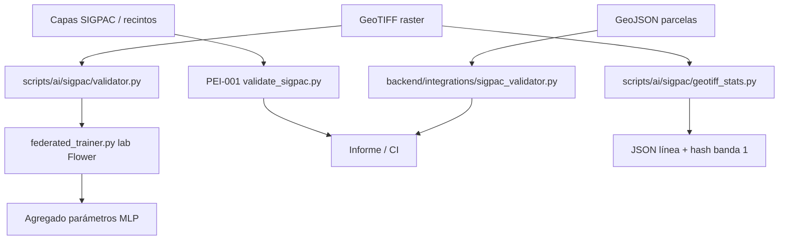

# PRONT CASTÚO–SIGPAC
## Validación parcelas y datos geoespaciales

| Campo | Valor |
|-------|--------|
| **Versión** | 1 |
| **Fecha** | Marzo 2026 |
| **Alcance** | PEI-001, validador GeoJSON, estadísticas raster opcionales |
| **Uso** | Guía rápida A4; no sustituye DPIA ni asesoría legal/regulatoria |
| **Patrón** | `docs/deploy/PRONT-PATRON-SISTEMAS-INTEGRADOS.md` |

**Responsable (copia interna):** _______________________

---

## Aviso

- No certifica SIGPAC oficial ni AEMPS sin evidencia y fuentes propias.
- Comparar siempre con datos oficiales y procedimientos del organismo competente.
- Comandos y rutas: verificar en tu checkout antes de campo.

---

## 1. Diagrama (Mermaid)



---

## 2. Componentes

| Componente | Ruta en repo | Notas |
|------------|--------------|--------|
| PEI-001 SIGPAC | `pei-001-sigpac/README.md`, `pei-001-sigpac/scripts/validate_sigpac.py` | Cruce mapping + capas; artefactos en `pei-001-sigpac/reports/` |
| Validador GeoJSON | `backend/integrations/sigpac_validator.py` | Integración API / servicios |
| Estadísticas raster | `scripts/ai/sigpac/geotiff_stats.py` | Band 1: media, std, min, max, área aprox., `hash_sha256_band1` |
| Validador por parcela_id | `scripts/ai/sigpac/validator.py` | Delega en `geotiff_stats`; alias `hash` / `area`; log JSON |
| Dependencias raster | `scripts/ai/sigpac/requirements_sigpac.txt` | `rasterio`, `numpy` (opcional) |
| Features 8D + huecos NDVI/humedad | `scripts/ai/sigpac/sigpac_features.py` | Solo rellenar NDVI/humedad con fuente real (multispectral/sensores) |
| Lab federado (Flower) | `scripts/ai/sigpac/federated_trainer.py` | `server` / `client`; requiere `requirements_sigpac_federated.txt`; ≥2 clientes |

---

## 3. Flujo operativo

1. **Validación PEI-001 (canónica para el repo):** seguir `pei-001-sigpac/README.md` y workflow CI `.github/workflows/sigpac-validation-pei001.yml` si aplica.
2. **Resumen técnico de un GeoTIFF (auditoría / trazabilidad de raster):**
   ```bash
   pip install -r scripts/ai/sigpac/requirements_sigpac.txt
   python scripts/ai/sigpac/geotiff_stats.py ruta/al/archivo.tif --json-log logs/sigpac_raster_audit.jsonl
   ```
3. **Por ID de parcela** (`data/sigpac/<id>.tif`):
   ```bash
   python scripts/ai/sigpac/validator.py <parcel_id> --data-dir data/sigpac --log logs/sigpac_validation.json
   ```
4. **Tests locales:** `pytest scripts/ai/sigpac/tests/ -q` (requiere `rasterio` para prueba con TIFF real).

---

## 4. TRL y evidencia

| Área | Estado en repo | Evidencia objetivo |
|------|----------------|--------------------|
| Automatización PEI-001 | Workflow + scripts en repo | Ejecución en datos reales anónimizados, informes archivados |
| Raster stats | Script + tests opcionales | Muestras TIFF controladas + revisión CRS/resolución |
| Alineación oficial SIGPAC | Fuera de alcance del código | Procedimiento operativo documentado por el cliente |

---

## 5. Incidencias

| Problema | Acción |
|----------|--------|
| `ImportError` rasterio | `pip install -r scripts/ai/sigpac/requirements_sigpac.txt` |
| CRS / resolución dudosa | Documentar `crs` y `transform` del salida JSON; no usar área aprox. como título registral |
| Discrepancia con oficial | No corregir solo con estadísticas raster; repetir validación normativa |

---

## 6. Anexos — comandos

```bash
# Plantilla PRONT (nueva versión; falla si el .md ya existe)
python scripts/generate_pront.py SIGPAC --version 1

# PEI-001 (desde raíz del repo; ajustar rutas a tus datos)
pip install -r pei-001-sigpac/scripts/requirements.txt
python pei-001-sigpac/scripts/validate_sigpac.py --help

# Lab federado (otra shell por cliente; mismo servidor)
pip install -r scripts/ai/sigpac/requirements_sigpac_federated.txt
python scripts/ai/sigpac/federated_trainer.py server --address 0.0.0.0:8080
python scripts/ai/sigpac/federated_trainer.py client --server 127.0.0.1:8080 --parcel-id A --data-dir data/sigpac
python scripts/ai/sigpac/federated_trainer.py client --server 127.0.0.1:8080 --parcel-id B --data-dir data/sigpac
```

Generar de nuevo solo si no existe el fichero; si ya existe, editar esta copia o subir versión (`--version 2`).
