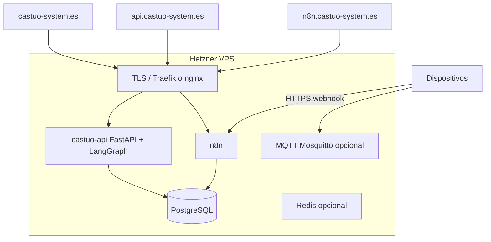

# Prontuario — integración segura con trazabilidad (CASTÚO-SYSTEM)

**Abril 2026 · alineado al monorepo** (corrige stacks genéricos con `langgraph:8123`, imágenes Mistral inexistentes o MCP Cursor ficticio).

---

## 1. Dominios y servicios (referencia)



**`grafo.castuo-system.es`:** en este repositorio LangGraph **no** es un microservicio aparte. Puedes:

- Apuntar el subdominio al **mismo** reverse proxy y path `/langgraph/castuo/`, o  
- Dejar solo `api.*` y usar rutas bajo el API.

**`castuo.eu` / `castuo.online`:** redirecciones y hosting Arsys son decisiones de DNS; no están codificadas en el repo.

---

## 2. DNS (Arsys u otro proveedor)

| Host | Tipo | Valor típico | Destino lógico |
|------|------|----------------|----------------|
| `castuo-system.es` | A | IP Hetzner | Landing / proxy |
| `www.castuo-system.es` | CNAME | apex o A | Misma IP |
| `api.castuo-system.es` | A | IP Hetzner | castuo-api :8000 |
| `n8n.castuo-system.es` | A | IP Hetzner | n8n :5678 |
| `castuo.eu` | CNAME/A | según política | Redirección |
| `castuo.online` | A | IP Arsys | WordPress / estática |

Verificación:

```bash
dig +short castuo-system.es A
dig +short api.castuo-system.es A
dig +short n8n.castuo-system.es A
openssl s_client -connect api.castuo-system.es:443 -servername api.castuo-system.es </dev/null 2>/dev/null | openssl x509 -noout -dates
```

---

## 3. Docker Compose en este repo

Stack de referencia **sin** servicios `langgraph` ni `mistral` embebidos:

- `deploy/docker-compose.castuo.enterprise.example.yml` — `castuo-api`, n8n, Postgres, Redis.
- `deploy/traefik.yml` — plantilla Traefik v2 (ACME, TLS 1.2+).

No clones repositorios ajenos tipo `castuo-system/integration.git` salvo que sean **vuestro** fork documentado.

```bash
cp deploy/.env.castuo-enterprise.example deploy/.env.castuo-enterprise
# Editar secretos reales

docker compose -f deploy/docker-compose.castuo.enterprise.example.yml \
  --env-file deploy/.env.castuo-enterprise up -d --build
```

Variables relevantes en **castuo-api**:

- `MISTRAL_API_KEY`, `GAIACHAIN_REGISTER_URL`, `GAIACHAIN_API_KEY` / `N8N_GAIACHAIN_API_KEY`
- `SLACK_WEBHOOK`
- `LANGCHAIN_TRACING_V2`, `LANGSMITH_API_KEY`, `LANGCHAIN_PROJECT`

**n8n:** `CASTUO_BASE_URL`, `CASTUO_API_KEY`; **no** es obligatorio poner `LANGSMITH_API_KEY` en n8n para trazar el grafo del API.

---

## 4. MQTT seguro (opcional)

Patrón recomendado: `allow_anonymous false`, `password_file`, listener TLS 8883 con certificados propios. Ejemplos en `docker/remote-access/mosquitto/`.

Usuarios:

```bash
mosquitto_passwd -c mosquitto/config/passwd iot_user
```

---

## 5. Workflows n8n con trazabilidad (repo)

| Flujo | Archivo | Webhook |
|--------|---------|---------|
| IoT sensor → LangGraph | `n8n/workflows/castuo_n8n_iot_sensor_langgraph.json` | `iot-sensor-data` |
| QElectroTech SVG | `n8n/workflows/castuo_n8n_qelectrotech_langgraph.json` | `qelectrotech-svg` |
| PLC / “Cursor” | `n8n/workflows/castuo_n8n_plc_generate_langgraph.json` | `cursor-plc-gen` |

**GaiaChain:** el registro automático va en el **grafo** del API si configuráis URL; evitad duplicar `https://api.gaiachain.eu/...` en nodos HTTP salvo que sea vuestro endpoint real.

**LangSmith:** proyectos y runs en el dashboard de LangSmith cuando el proceso que ejecuta LangChain/LangGraph es castuo-api con variables activadas.

---

## 6. Cursor AI

- Edición del repo y PRs hacia GitHub/GitLab.
- Disparo de webhooks n8n con `curl` o CI (no `fastapi_gateway/services/cursor_service.py` + `langgraph:8123` si no existen en vuestro fork).

---

## 7. Comandos de verificación

```bash
docker ps
curl -sS "http://127.0.0.1:8000/health/enterprise"
curl -sS "http://127.0.0.1:8000/langgraph/castuo/health"
curl -sS "http://127.0.0.1:5678/healthz"
```

Prueba IoT (local, sin TLS):

```bash
curl -sS -X POST "http://127.0.0.1:5678/webhook/iot-sensor-data" \
  -H "Content-Type: application/json" \
  -d "{\"sensor_id\":\"RPI-001\",\"value\":65.3,\"type\":\"humedad_suelo\",\"location\":\"invernadero-1\"}"
```

---

## 8. Backups

- Volúmenes Postgres y `.n8n`: política de copias en el VPS (pg_dump, snapshots).
- No incluimos script único obligatorio; adaptad `deploy/` a vuestro `rclone`/S3 soberano UE.

---

## 9. Documentación relacionada

- [SECURITY_AND_TRACING.md](../security/SECURITY_AND_TRACING.md)
- [PRONT-MASTER-QELECTROTECH-CASTUO-INTEGRATION.md](PRONT-MASTER-QELECTROTECH-CASTUO-INTEGRATION.md)
- [DEPLOYMENT_GUIDE.md](../DEPLOYMENT_GUIDE.md)
