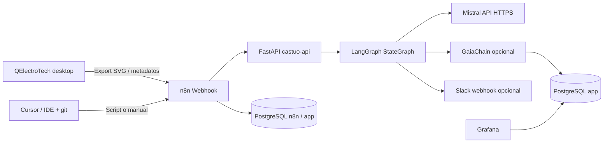

# Prontuario maestro — QElectroTech → CASTÚO (n8n, LangGraph, Mistral, GaiaChain)

**Versión alineada al repositorio Castúo-System** (soberanía UE: datos en VPS UE, Mistral API EU, sin URLs de terceros hardcodeadas).  
Sustituye borradores con `langgraph:8123`, imágenes Docker inexistentes o `qelectrotech-cli` dentro del contenedor n8n.

---

## 1. Arquitectura técnica (real)



| Componente | Rol |
|------------|-----|
| **QElectroTech** | Esquemas eléctricos en estación de trabajo; exportación **SVG** (o conversión DXF→SVG **fuera** de n8n). |
| **n8n** | Orquestación, webhooks, inserción en BD, alertas. **No** ejecuta binarios QET salvo que tú montes un worker dedicado. |
| **castuo-api** | Único servicio LangGraph: `POST /langgraph/castuo/execute-graph` con `{"payload":{...}}`. |
| **Mistral** | `https://api.mistral.ai` con `MISTRAL_API_KEY` en **castuo-api** (no contenedor `mistral:11434` obligatorio). |
| **GaiaChain** | Solo si defines `GAIACHAIN_REGISTER_URL` (+ token opcional); el hook POST envía `trace_hash`, `payload`, `analysis_preview`. |
| **LangSmith** | Variables `LANGCHAIN_TRACING_V2`, `LANGSMITH_API_KEY` en **castuo-api** (no en n8n como sustituto del trazado del grafo). |
| **Cursor** | Generación/edición de código y workflows en el repo; dispara n8n vía **webhook** o `curl` desde script local (no hay “MCP HTTP oficial” hacia n8n). |

---

## 2. Checklist ~30 minutos

1. **VPS (p. ej. Hetzner)** con Docker; DNS/TLS delante (Arsys u otro) para `api.*` y `n8n.*`.
2. Copiar y rellenar `deploy/.env.castuo-enterprise.example` → `deploy/.env.castuo-enterprise`.
3. `docker compose -f deploy/docker-compose.castuo.enterprise.example.yml --env-file deploy/.env.castuo-enterprise up -d --build`.
4. Verificar `GET http://<api>:8000/health/enterprise` y `GET .../langgraph/castuo/health`.
5. Importar en n8n:
   - `n8n/workflows/castuo_n8n_qelectrotech_langgraph.json`
   - `n8n/workflows/castuo_n8n_plc_generate_langgraph.json`
6. Ajustar variables n8n: `CASTUO_BASE_URL`, `CASTUO_API_KEY` (si aplica).
7. En Postgres de aplicación: `optional_castuo_prod_qelectrotech.sql` (si usas el nodo Postgres del workflow).
8. Probar webhooks (sección 5).

**CTAEX / normativa:** el modelo puede sugerir texto ST o análisis energético; la **validación**, **marcado CE** y **certificación** siguen siendo responsabilidad humana y de procedimiento interno. No uses salidas LLM como evidencia de conformidad sin revisión.

---

## 3. Tipos de `payload` soportados en LangGraph

Definidos en `backend/integrations/langgraph_castuo/graph.py`:

| `payload.kind` o señal | Comportamiento Mistral |
|------------------------|-------------------------|
| `qelectrotech_svg` / `qelectrotech` o campo `svg_base64` | Prompt IEC 61131-3 + JSON (`plc_code`, `energy_analysis`, `svg_notes`). |
| `plc_generate` / `cursor_plc` | Generación ST + `validation` en JSON. |
| *(resto)* | Modo agrícola histórico (análisis de finca/cultivo). |

Respuesta HTTP estándar: `analysis`, `trace_hash`, `errors`, `gaia_http_status`, `gaia_body`, `slack_http_status`.

---

## 4. Comandos de despliegue (repo real)

```bash
cd /ruta/Castuo-System
cp deploy/.env.castuo-enterprise.example deploy/.env.castuo-enterprise
# Editar POSTGRES_PASSWORD, N8N_*, MISTRAL_API_KEY, GAIACHAIN_REGISTER_URL, SLACK_WEBHOOK, etc.

docker compose -f deploy/docker-compose.castuo.enterprise.example.yml \
  --env-file deploy/.env.castuo-enterprise up -d --build
```

Comprobar:

```bash
curl -sS "http://127.0.0.1:8000/langgraph/castuo/health"
curl -sS "http://127.0.0.1:5678/healthz"
```

---

## 5. Pruebas de flujo

### 5.1 SVG QElectroTech → LangGraph

Tras exportar SVG, codificar en base64 en tu máquina (Linux/macOS):

```bash
SVG_B64=$(base64 -w0 esquema.svg 2>/dev/null || base64 esquema.svg | tr -d '\n')
curl -sS -X POST "http://127.0.0.1:5678/webhook/qelectrotech-svg" \
  -H "Content-Type: application/json" \
  -d "{\"project_id\":\"PROY-001\",\"author\":\"equipo\",\"svg_base64\":\"$SVG_B64\"}"
```

### 5.2 Generación PLC (webhook tipo “Cursor”)

```bash
curl -sS -X POST "http://127.0.0.1:5678/webhook/cursor-plc-gen" \
  -H "Content-Type: application/json" \
  -d "{\"project_id\":\"PROY-001\",\"requirements\":\"Bomba de riego según humedad\",\"hardware\":\"S7-1200\"}"
```

### 5.3 Directo al API (sin n8n)

```bash
curl -sS -X POST "http://127.0.0.1:8000/langgraph/castuo/execute-graph" \
  -H "Content-Type: application/json" \
  -d "{\"payload\":{\"kind\":\"plc_generate\",\"project_id\":\"P1\",\"requirements\":\"test\",\"hardware\":\"S7-1200\"}}"
```

---

## 6. Integración Cursor (realista)

- **Repositorio:** clonar/editar `n8n/workflows/*.json` y `backend/` desde Cursor; `git push` y despliegue según tu CI.
- **Disparo n8n:** tarea en terminal, Git hook, o GitHub Action que llame al webhook con `curl` (misma red o túnel seguro).
- **No** sustituir esto por URLs ficticias tipo `http://langgraph:8123/process-svg` o `http://n8n/mcp/cursor`.

---

## 7. Grafana

- Añade datasource PostgreSQL apuntando a la **misma base** donde ejecutes `optional_castuo_prod_qelectrotech.sql`.
- Paneles sugeridos: `COUNT(*)` por hora sobre `castuo_prod_qelectrotech`. Si pasas `energy_analysis` a JSONB en una migración posterior, podrás consultar claves internas; con TEXT almacena JSON serializado.
- No incluimos un dashboard JSON con UUID de datasource genérico: créalo en UI y expórtalo a tu propio repositorio de infra.

---

## 8. CI/CD (ejemplo)

Un job que haga SSH al VPS y ejecute `docker compose ... up -d --build` es válido; **ajusta rutas** (`~/Castuo-System`, no `integration.git` ajeno). Reutiliza secretos `HETZNER_*` y no commitees claves. Si ya tienes workflows en `.github/workflows/`, fusiona criterios en lugar de duplicar nombres.

---

## 9. Errores frecuentes del borrador “v4.2 Nov 2024”

| Afirmación incorrecta | En Castúo |
|----------------------|-----------|
| `docker-compose.prod.yml` con servicio `langgraph` en 8123 | LangGraph va **dentro** de `castuo-api`. |
| Imagen `ghcr.io/mistralai/mistral-sovereign` | No es parte del compose de referencia; usar API Mistral desde el API. |
| `qelectrotech-cli` en n8n `executeCommand` | CLI no está garantizada en el contenedor; flujo = SVG base64 desde host. |
| `https://api.gaiachain.eu/v3/register` fijo en n8n | Usar `GAIACHAIN_REGISTER_URL` en backend o nodo HTTP configurable. |
| LangSmith solo en variables n8n | Trazas útiles del grafo: configurar **castuo-api**. |

---

## 10. Referencias

- [LANGGRAPH-CASTUO.md](../architecture/LANGGRAPH-CASTUO.md)
- [N8N-LANGGRAPH-INTEGRATED.md](../architecture/N8N-LANGGRAPH-INTEGRATED.md)
- [CASTUO-ENTERPRISE-HETZNER-ARSYS.md](CASTUO-ENTERPRISE-HETZNER-ARSYS.md)
- [DEPLOYMENT_GUIDE.md](../DEPLOYMENT_GUIDE.md)
