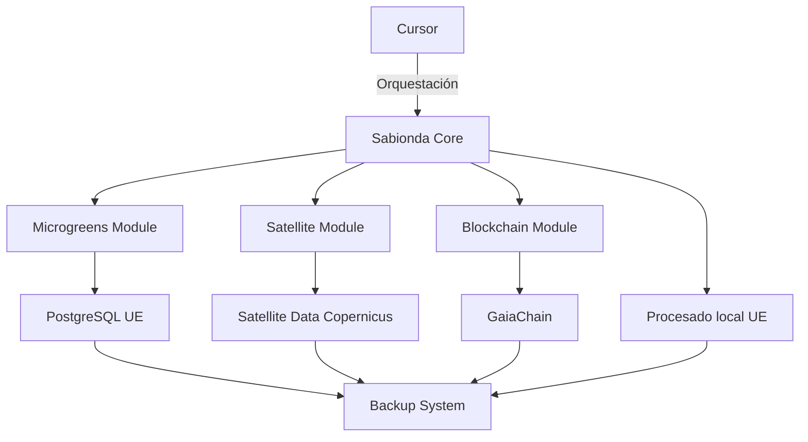
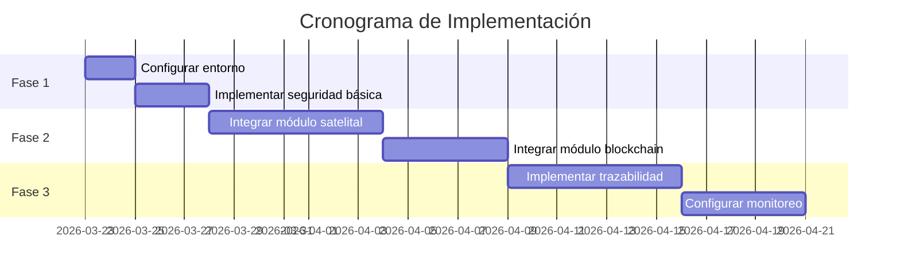

# **PRONTUARIO DE ANÁLISIS CRÍTICO Y CONEXIONES DEL SISTEMA**

*(Análisis completo para activación del sistema mediante Cursor - 2026)*  
*(Soberanía de datos y procesado **100 % marco europeo**: Copernicus/ESA, residencia UE, RGPD Art. 44–49.)*

**Enlaces:** [Marco legal y soberanía UE](../legal/MARCO-LEGAL-SOBERANIA-UE-2026.md) · [Stack FOSS activación UE](./EU-FOSS-SOVEREIGNTY-STACK.md) · [Integración satelital](./PRONTUARIO-MAESTRO-INTEGRACION-SATELITAL-REFORZAMIENTO-2026.md) · [Evolución completa](./PRONTUARIO-MAESTRO-EVOLUCION-COMPLETA-CASTUO-2026.md) · [Automatización](./PRONTUARIO-MAESTRO-AUTOMATIZACION-EVOLUCION-SISTEMA-2026.md) · Código UE: `backend/energy_audit/eu_data_sovereignty.py`

---

## **🇪🇺 0. SOBERANÍA DE DATOS Y PROCESADO UE (OBLIGATORIO OPERATIVO)**

| **Control** | **Implementación en repo** |
|-------------|------------------------------|
| Fuente satelital preferente | **Sentinel-2 / Copernicus** (`scihub.copernicus.eu` o `*.dataspace.copernicus.eu`); OData validado contra host `*.copernicus.eu`. |
| Exclusión fuentes terceros | Con `CASTUO_EU_DATA_SOVEREIGNTY=1` (por defecto), **Landsat (USGS)** queda fuera del catálogo en `SatelliteProcessor`. Para excepciones documentadas: `CASTUO_EU_DATA_SOVEREIGNTY=0`. |
| Variables | `COPERNICUS_USER` / `COPERNICUS_PASSWORD`; `COPERNICUS_DHUS_BASE` (opcional, siempre dominio Copernicus UE). |
| Trazas de proceso | NDVI y witness incluyen `eu_sovereignty` en metadatos (`satellite_preprocess.py`). |
| RGPD / transferencias | Infra **PostgreSQL, Keycloak, backups y cadena** deben residir en UE o basarse en **decisión de adecuación / SCCs** actualizadas; evitar procesamiento de datos personales en clouds USA sin DPIA. |
| Cursor (IDE) | Orquestación local: política de **no enviar código/datos personales** a servicios cloud del editor sin acuerdo; preferir modo privacidad / instancia UE si aplica. |

---

## **📋 1. ANÁLISIS CRÍTICO DEL SISTEMA**

### **1.1. Estado Actual del Sistema**



**Nota:** Cursor actúa como IDE/orquestador, no como servicio en runtime. **Procesado y residencia** deben anclarse en UE (véase §0).

### **1.2. Análisis de Capacidades**

| **Área** | **Estado** | **Evidencia en repo** | **Notas** |
|----------|------------|------------------------|-----------|
| Microgreens | Parcial | `production/routers.py`, `production/microgreens_manager.py` | Blockchain vía cliente inyectado; **RPC y nodos en UE** recomendados. |
| Satellite | Parcial | `backend/energy_audit/satellite_preprocess.py`, `eu_data_sovereignty.py`, `castuo/cloud/sentinel.py` | NDVI/albedo **Sentinel-2**; descarga solo hosts Copernicus UE; sin Sentinel Hub comercial tercero. |
| GaiaChain | Parcial | `backend/api/services/gaiachain_service.py`, `backend/services/gaia_chain.py` | Configurar env; **nodo/RPC en jurisdicción UE** si el dato es personal o estratégico. |
| Autenticación | Implementada | `backend/api/security/keycloak.py`, `security/physical_mfa.py` | JWT/OIDC; **desplegar IdP en UE**. |
| Monitoreo | Implementado | `docker-compose.monitor.yml`, `monitor/prometheus.yml` | Prometheus/Grafana **en región UE** en producción. |

---

## **🔧 2. CONEXIONES NECESARIAS**

### **2.1. Matriz de Conexiones**

| **Conexión** | **Estado actual** | **Acción requerida** | **Prioridad** |
|--------------|-------------------|----------------------|---------------|
| Cursor → Sabionda Core | Implementada | Verificar configuración + política de datos hacia el IDE | 🔥🔥🔥 |
| Sabionda Core → PostgreSQL | Implementada | Verificar conexión; **instancia UE** | 🔥🔥 |
| Sabionda Core → Sentinel (Copernicus) | Parcialmente implementada | Completar credenciales OData UE; no redirigir a CDNs USA | 🔥🔥 |
| Sabionda Core → GaiaChain | Configuración pendiente | Variables de entorno + **residencia UE del RPC** | 🔥 |
| Microgreens → Blockchain | Configuración pendiente | Red y variables; anclaje **UE** | 🔥 |
| Satellite → Blockchain | No implementada | Implementar conexión con hash/metadatos **sin PII innecesaria** | 🔥 |

---

## **📊 3. INTEGRACIÓN TÉCNICA**

### **3.1. Ejemplo de Integración Satelital (UE)**

*El `SatelliteProcessor` real usa `compute_ndvi_from_pair` / `preprocess_sentinel` y aplica `filter_band_catalog_for_eu`. Las anomalías de sensores: `castuo/cloud/sentinel.py`.*

```python
# Patron UE: backend/energy_audit/satellite_preprocess.py + eu_data_sovereignty
import logging
from typing import Any, Dict

import numpy as np

from backend.api.services.gaiachain_service import register_event_in_chain
from backend.energy_audit.eu_data_sovereignty import eu_data_sovereignty_strict
from backend.energy_audit.satellite_preprocess import SatelliteProcessor

logger = logging.getLogger(__name__)


def _ndvi_from_bands(red_band: np.ndarray, nir_band: np.ndarray) -> np.ndarray:
    denom = nir_band.astype("float32") + red_band.astype("float32")
    return np.where(denom == 0, 0, (nir_band.astype("float32") - red_band.astype("float32")) / denom)


class SatelliteIntegrationFacade:
    """NDVI Copernicus/Sentinel-2; catalogo sin Landsat si CASTUO_EU_DATA_SOVEREIGNTY=1."""

    def __init__(self, output_dir: str = "data/satellite/processed") -> None:
        self._processor = SatelliteProcessor(output_dir=output_dir)

    def process_ndvi(self, image_data: Dict[str, np.ndarray]) -> np.ndarray:
        return _ndvi_from_bands(image_data["B04"], image_data["B08"])

    def process_ndvi_from_files(self, red_path: str, nir_path: str) -> Dict[str, Any]:
        return self._processor.compute_ndvi_from_pair(red_path, nir_path)

    def detect_anomalies(self, ndvi_data: np.ndarray) -> np.ndarray:
        mean = float(np.mean(ndvi_data))
        std = float(np.std(ndvi_data))
        return np.where(ndvi_data < mean - 2 * std)[0]

    def store_in_gaiachain(self, event_data: Dict[str, Any], *, gaiachain_enabled: bool) -> str:
        if not gaiachain_enabled:
            logger.warning("GaiaChain no configurado — sin ancla on-chain")
            return "local-skip"
        try:
            return register_event_in_chain(event_data)
        except Exception as exc:
            logger.warning("GaiaChain no disponible: %s", exc)
            return "local-fallback"

    def eu_strict_active(self) -> bool:
        return eu_data_sovereignty_strict()
```

---

## **🛡️ 4. MEDIDAS DE SEGURIDAD**

### **4.1. Configuración de Seguridad**

```bash
# Configuración de firewall (implementar según necesidades)
sudo ufw default deny incoming
sudo ufw default allow outgoing
sudo ufw allow 22/tcp
sudo ufw allow 80/tcp
sudo ufw allow 443/tcp
sudo ufw allow 8080/tcp
sudo ufw enable

# Configuración de TLS (ejemplo básico; producción: Certbot / proxy en UE)
openssl req -x509 -newkey rsa:4096 -keyout key.pem -out cert.pem -days 365 -nodes
```

**UE / RGPD:** cifrado en tránsito (TLS 1.3), minimización de datos, registro de actividades de tratamiento, DPIA si hay transferencias internacionales (Schrems II).

---

## **📅 5. PLAN DE ACCIÓN**

### **5.1. Cronograma de Implementación**



---

## **🎯 6. CONCLUSIÓN Y PRÓXIMOS PASOS**

### **6.1. Checklist de Acción Inmediata**

- [ ] Configurar entorno de desarrollo (**región / VPS UE**)
- [ ] Implementar seguridad básica (TLS, firewall, secretos)
- [ ] Integrar módulo satelital (**Copernicus + `CASTUO_EU_DATA_SOVEREIGNTY=1`**)
- [ ] Configurar GaiaChain (variables; **RPC en UE**)
- [ ] Implementar sistema de trazabilidad
- [ ] Configurar monitoreo (**stack en UE**)
- [ ] Revisar política **Cursor / IDE** (no filtrar datos personales sin base legal)

*Nota:* Este documento y `eu_data_sovereignty.py` están registrados en `backend/models/system_admin_playbook.py` → `GOVERNANCE_DOCUMENTATION`. Validar con `PYTHONPATH=. pytest tests/models/test_system_admin_playbook.py tests/energy_audit/test_eu_data_sovereignty.py -q`.

---

*El dato que cruza el Atlántico sin ancla jurídica deja el territorio sin defensa frente al RGPD.*
