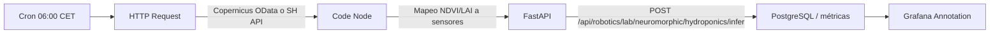
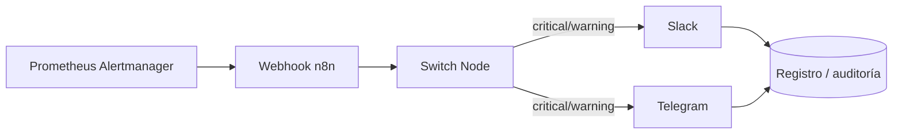
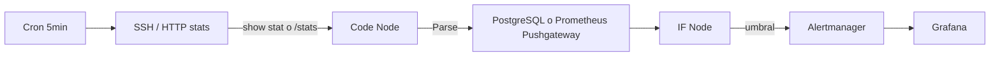
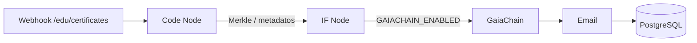
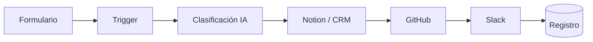

# PRONTUARIO: CONEXIONES CRÍTICAS PARA AUTOMATIZAR CASTÚO-SYSTEM CON N8N

*Orquestación de flujos operativos. Las **estimaciones de ROI** son orientativas y no constituyen promesa económica; validar con contabilidad.*

**Evidencia en repo:** `n8n/workflows/` (p. ej. `castuo_biohub_sentinel_v2_0.json`, `castuo_satellite_neuro_infer_manual.json`), `infra/n8n/`, `backend/integrations/robotics/neuromorphic_edge.py`  
**Conexiones completas (compose, uvicorn, PowerShell):** [PRONTUARIO-CONEXIONES-COMPLETAS-AUTOMATIZACION-2026.md](./PRONTUARIO-CONEXIONES-COMPLETAS-AUTOMATIZACION-2026.md)  
**Soberanía UE:** [MARCO-LEGAL-SOBERANIA-UE-2026.md](../legal/MARCO-LEGAL-SOBERANIA-UE-2026.md) · [EU-FOSS-SOVEREIGNTY-STACK.md](./EU-FOSS-SOVEREIGNTY-STACK.md)

---

## 1. FLUJO #1: SATÉLITE → INFERENCIA LAB → GRAFANA (PRIORIDAD)



**Implementación técnica (evidencia git):**

- Endpoint real: **`POST /api/robotics/lab/neuromorphic/hydroponics/infer`** — cuerpo JSON `HydroSensorIn`: `humedad`, `ph`, `ec`, `luz_umol` (ver `neuromorphic_edge.py`). El nodo Code debe **mapear** estadísticas NDVI (p. ej. media NDVI → heurística `luz_umol` / humedad proxy) o ampliar backend con endpoint dedicado `satellite/ndvi` en roadmap.
- **Soberanía UE:** preferir **Copernicus** (`COPERNICUS_*`, `eu_data_sovereignty.py`). **Sentinel Hub** es servicio comercial (evaluar RGPD/encargado y contrato); no sustituye la validación `*.copernicus.eu` del módulo UE.
- Auth lab: cabecera **`Authorization: Bearer <token>`** con `CASTUO_ROBOTICS_LAB_BEARER_TOKEN` (no confundir con `CASTUO_JWT_SECRET` genérico).

**Variables (Docker / entorno n8n):**

```bash
# Copernicus (alineado con soberanía UE)
export COPERNICUS_USER=your_copernicus_user
export COPERNICUS_PASSWORD=your_copernicus_password
export CASTUO_API_URL=https://api.castuo-system.eu
export CASTUO_ROBOTICS_LAB_BEARER_TOKEN=your_lab_bearer

# Opcional Sentinel Hub (licencia propia; DPIA si hay datos personales)
export SH_CLIENT_ID=your_sentinel_hub_id
export SH_CLIENT_SECRET=your_sentinel_hub_secret
```

**Beneficios:** automatización de telemetría + inferencia lab + visualización; coherencia con `eu_data_sovereignty` si la descarga es Copernicus.

---

## 2. FLUJO #2: ALERTAS PROMETHEUS → SLACK / TELEGRAM



**Configuración:**

```bash
export SLACK_WEBHOOK=https://hooks.slack.com/services/...
export TELEGRAM_BOT_TOKEN=your_telegram_token
```

En `monitor/alertmanager.yml`, añadir receptor `webhook_configs` apuntando a la URL del workflow n8n (HTTPS, TLS 1.3 en borde).

**Nota TraceChain / GaiaChain:** registrar eventos vía servicios existentes solo si `GAIA_CHAIN_*` está configurado y el DPO avala el contenido del payload (minimización).

---

## 3. FLUJO #3: HAPROXY STATS → MONITORING



**Configuración:** clave SSH con permisos mínimos (solo lectura stats); preferir **exponer stats por HTTPS autenticado** en lugar de SSH desde n8n si es posible.

```bash
export HETZNER_SSH_KEY=path_to_your_ssh_key
```

---

## 4. FLUJO #4: SABIONDA EDU → CERTIFICADOS



**Documentación educativa:** [Sabionda-Educational-System.md](../sabionda/Sabionda-Educational-System.md)

```bash
export SMTP_CASTUO_USER=your_smtp_user
export SMTP_CASTUO_PASS=your_smtp_pass
export GAIA_CHAIN_RPC_URL=your_gaia_chain_rpc
```

**IPFS:** si se usa CID, documentar proveedor y cláusulas (residencia / RGPD).

---

## 5. FLUJO #5: ONBOARDING TALENTO (100 KAIRÓS)



**Advertencia RGPD:** flujos con **Google Forms, OpenAI, Notion, GitHub** implican transferencias y encargados **fuera de la UE** salvo SCC/BCR y DPIA. Para alineación con [MARCO-LEGAL-SOBERANIA-UE-2026.md](../legal/MARCO-LEGAL-SOBERANIA-UE-2026.md), valorar: formulario autoalojado, **Mistral EU**, CRM UE, repositorio Git self-hosted o GitLab EU.

```bash
export GMAIL_OAUTH=your_gmail_oauth
export NOTION_TOKEN=your_notion_token
export GITHUB_TOKEN=your_github_token
```

---

## CONFIGURACIÓN INMEDIATA N8N (~15 min)

Variables base (inyectar vía Docker `-e`, fichero `.env` del servicio, o credenciales n8n según versión):

```bash
CASTUO_API_URL=https://api.castuo-system.eu
CASTUO_ROBOTICS_LAB_BEARER_TOKEN=your_lab_bearer
HETZNER_SSH_KEY=~/.ssh/hetzner_castuo

COPERNICUS_USER=...
COPERNICUS_PASSWORD=...
SH_CLIENT_ID=...
SH_CLIENT_SECRET=...
SLACK_WEBHOOK=...
TELEGRAM_BOT_TOKEN=...
SMTP_CASTUO_USER=...
SMTP_CASTUO_PASS=...
GAIA_CHAIN_RPC_URL=...
GMAIL_OAUTH=...
NOTION_TOKEN=...
GITHUB_TOKEN=...
```

---

## VALOR Y PRIORIZACIÓN (ORIENTATIVO)

| Flujo | Beneficio | ROI estimado (no auditado) |
|-------|-----------|----------------------------|
| Satélite → inferencia → Grafana | Procesamiento y visualización | ~€2K/mes * |
| Alertas → Slack/Telegram | Tiempo de reacción | ~€500/mes * |
| HAProxy → monitoring | Disponibilidad | ~€1K/mes * |
| Sabionda certificados | Trazabilidad formativa | ~€500/mes * |
| 100 Kairós onboarding | Captación talento | ~€1K/mes * |

\* **Indicadores internos; no uso fiscal ni legal.**

---

## PRÓXIMOS PASOS

### Desplegar n8n (ejemplo Docker, VPS UE)

```bash
docker volume create n8n_data
docker run -d --name n8n-castuo \
  -p 5678:5678 \
  -v n8n_data:/home/node/.n8n \
  -e N8N_HOST=castuo-n8n.yourdomain.eu \
  -e N8N_PROTOCOL=https \
  -e WEBHOOK_URL=https://castuo-n8n.yourdomain.eu/ \
  docker.n8n.io/n8nio/n8n:latest
```

### Flujo #1

1. Probar **Copernicus OData** o pipeline que alimente el Code node.  
2. `POST` a `/api/robotics/lab/neuromorphic/hydroponics/infer` con JSON válido y Bearer.  
3. Grafana: anotación o panel alimentado por métricas/DB según diseño.

### GitHub Actions

Ver [`.github/workflows/n8n-deploy.yml`](../../.github/workflows/n8n-deploy.yml) (plantilla SSH + pull imagen; requiere `HETZNER_HOST`, `HETZNER_SSH_KEY` en secrets).

---

## WORKFLOWS EXISTENTES (IMPORTAR EN N8N)

- `n8n/workflows/castuo_biohub_sentinel_v2_0.json`  
- `n8n/workflows/sabionda.json` · `n8n/sabionda.json`  
- `infra/n8n/orchestrator-template.json`

---

*Sin Bearer en el lab y sin HTTPS en webhooks, la automatización abre la compuerta al territorio equivocado.*
