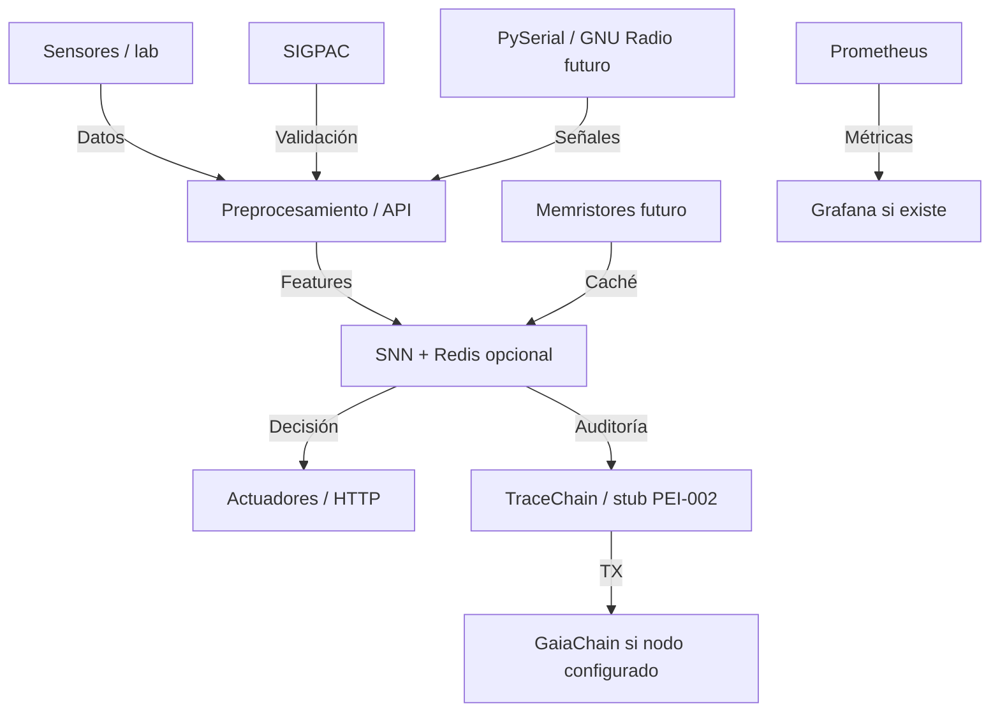

# PRONTUARIO MAESTRO DE ANÁLISIS CRÍTICO (2026)

*Análisis técnico y legal del sistema actual, basado en **evidencia medible** y **código real**. Sin SLA numérico inventado; objetivos cualitativos o condicionados a benchmark archivado.*

**Relación:** [PRONTUARIO-MAESTRO-EVALUACION-TECNICA-CASTUO-2026.md](./PRONTUARIO-MAESTRO-EVALUACION-TECNICA-CASTUO-2026.md) (estado repo + gaps) · [PRONTUARIO-MAESTRO-EVOLUCION-TRL-SUPERIOR-2026.md](./PRONTUARIO-MAESTRO-EVOLUCION-TRL-SUPERIOR-2026.md) (subir TRL) · [PRONTUARIO-ANALISIS-CURSOR-INTEGRACIONES-2026.md](./PRONTUARIO-ANALISIS-CURSOR-INTEGRACIONES-2026.md) · [CHECKLIST-INTEGRACIONES-MEJORAS-2026.md](./CHECKLIST-INTEGRACIONES-MEJORAS-2026.md)

---

## 🗺️ 1. Estructura actual del sistema

*Módulos, flujos e indicadores **cómo medirlos** (no cifras ficticias).*

### 1.1. Módulos principales

| Módulo | Función | Tecnologías clave | Integraciones | Estado |
|--------|---------|-------------------|---------------|--------|
| **SNN + Redis** | Inferencia neuromórfica lab (p. ej. `castuo_neuro_hydro_infer_seconds`) + caché opcional | Redis, Pydantic, NumPy; `prometheus_client` opcional | SIGPAC (usos), TraceChain (vía backend) | 🟡 Parcial |
| **TraceChain** | Trazabilidad; stub PEI-002 con SQLite | FastAPI, SQLite, GaiaChain según despliegue | SNN, SIGPAC | 🟡 Parcial |
| **SIGPAC** | Validación usos / geometrías (informes PEI-001) | GDAL/osgeo si instalado; GeoJSON; Shapely en scripts donde aplique | SNN, TraceChain | 🟡 Parcial |
| **Señales (RF/IoT)** | Lab: datos sintéticos / serial en otros paquetes | PySerial (p. ej. exporters); GNU Radio **stub** en repo | SNN (hints) | 📋 I+D |
| **Memristores** | Simulación + I+D hardware (Nb₂O₅, VO₂) | Sin muestra física en este clon | SNN | ⬜ / 📋 |
| **Monitorización** | `/metrics` en lab si se activa | Prometheus scrape; Grafana si se despliega | Donde exista endpoint | 🟡 Parcial |
| **Seguridad** | PQC opcional, Bearer lab, TLS según runtime | Kyber/Dilithium vía `pq_crypto` si deps; TLS 1.3 / YubiKey **dependen de despliegue** | Transversal | 🟡 Parcial |

### 1.2. Flujos de datos

### 1.3. Métricas clave *(sin valores inventados)*

| Métrica / indicador | Cómo medir | Fuente | Objetivo *(no contrato)* |
|---------------------|------------|--------|---------------------------|
| `castuo_neuro_hydro_infer_seconds` | Histograma / percentiles sobre buckets | Prometheus (si scrape activo) | Reducir p95 **respecto a línea base medida** |
| Throughput | Locust o métricas del gateway / API | `tests/stress/locustfile.py` | Documentar tras prueba de carga *(no asumir contador genérico en `/metrics`)* |
| Trazabilidad | Ratio eventos auditables vs decisiones *(definir unidad en despliegue)* | Stub PEI-002 + backend audit | Acercar cobertura a política acordada con DPO |
| Latencia señales RF | Medir pipeline cuando exista captura real | GNU Radio (futuro) | Objetivo numérico solo **después** de hardware |
| Consumo energético (SNN) | Instrumentación física | Lab / edge | I+D memristor |

---

## ⚠️ 2. Puntos débiles

### 2.1. SNN + Redis

| Debilidad | Impacto | Evidencia | Prioridad |
|-----------|---------|-----------|-----------|
| **Riesgo regresión TTL fijo** | Caché subóptima | Auditar `rg "setex.*300"`; código actual: `snn_cache_ttl_seconds()` | Alta |
| **Validación parcial** | Decisiones incoherentes si se bypasea modelo | Solo `/lab/neuromorphic/hydroponics/infer` usa `HydroSensorIn` | Alta |
| **Sin fallback Redis** | Más carga si Redis cae | Sin LRU/SQLite de segunda capa | Media |
| **Logs no estructurados** | Auditoría difícil | Sin esquema JSON uniforme (`parcela_id`, etc.) | Media |

### 2.2. TraceChain

| Debilidad | Impacto | Evidencia | Prioridad |
|-----------|---------|-----------|-----------|
| **Persistencia stub + ops** | Pérdida sin volumen Docker | `sqlite_store.py` implementado; smoke 🟡 | Crítica (ops) |
| **Integridad heterogénea** | Suplantación según amenaza | Digest stub vs `dilithium_sign` en inferencia | Alta |
| **`/parcel` vs SIGPAC vivo** | Trazabilidad parcela limitada | Endpoint existe; flujo productivo no cerrado | Media |

### 2.3. Señales y memristores

| Debilidad | Impacto | Evidencia | Prioridad |
|-----------|---------|-----------|-----------|
| **GNU Radio** | RF no en pipeline | Stub documental | Media |
| **Memristores físicos** | Latencia “de laboratorio” | Redis + simulación | Baja |
| **Cifrado en canal RF/serial** | Confidencialidad | Sin Kyber end-to-end sobre RF | Alta *si* canal real |

### 2.4. SIGPAC

| Debilidad | Impacto | Evidencia | Prioridad |
|-----------|---------|-----------|-----------|
| **Mapeo estático** | Riesgo normativo | `mapping.json` sin sync automático | Alta |
| **Validación no universal** | Errores geográficos | `sigpac_validator.py` no en todo borde | Crítica |

### 2.5. Monitorización

| Debilidad | Impacto | Evidencia | Prioridad |
|-----------|---------|-----------|-----------|
| **Grafana no versionada** | Menos visibilidad | Plantillas en `alerts.md` | Media |
| **Alertas** | Reacción lenta | Umbral = **X medido**, no fijo en repo | Media |

---

## 🚨 3. Puntos críticos inmediatos

| Punto crítico | Riesgo | Evidencia | Acción inmediata |
|---------------|--------|-----------|------------------|
| **SQLite PEI-002 + volumen** | Pérdida de eventos | BD bajo `/app/data` | [`tests/smoke/smoke_test_persistence.sh`](../../tests/smoke/smoke_test_persistence.sh) |
| **Auditoría TTL** | Regresión | `rg "setex.*300"` | Mantener `snn_cache_ttl_seconds()` + `pytest -k ttl` |
| **Geometrías** | Error territorial | Validador no universal | Validación en ingesta; valorar `shapely.is_valid` donde no haya GDAL |
| **Firma / digest** | Integridad | Payloads sin política única | `dilithium_sign` en [`pq_crypto.py`](../../backend/security/pq_crypto.py) según DPO |
| **Logs JSON** | Trazabilidad | Formato inconsistente | Esquema mínimo (`JSONFormatter` o equivalente) |

---

## 🔧 4. Mejoras aplicables

*Enlaces relativos desde **`docs/deploy/`**.*

| Mejora | Beneficio | Esfuerzo | Dependencias | Enlace |
|--------|-----------|----------|--------------|--------|
| Validar persistencia SQLite | Continuidad PEI-002 | Medio | sqlite3, Docker | [../../pei-002-tracechain/api/sqlite_store.py](../../pei-002-tracechain/api/sqlite_store.py) |
| Auditar TTL | Sin regresión literal 300 | Bajo | `rg`, env | [../../backend/integrations/robotics/neuromorphic_edge.py](../../backend/integrations/robotics/neuromorphic_edge.py) |
| Extender Pydantic | Menos datos basura | Bajo | pydantic | [../../backend/integrations/robotics/neuromorphic_edge.py](../../backend/integrations/robotics/neuromorphic_edge.py) *(rutas adjuntas aquí; no existe `routes.py` en este paquete)* |
| Firma payloads TraceChain | Anti-suplantación | Medio | pq_crypto | [../../pei-002-tracechain/register_sigpac_digest.py](../../pei-002-tracechain/register_sigpac_digest.py) |
| Validación geometrías | Precisión parcelas | Bajo | GDAL / shapely | [../../backend/integrations/sigpac_validator.py](../../backend/integrations/sigpac_validator.py) |
| GNU Radio runtime | RF real | Alto | gnuradio | [../../backend/integrations/robotics/GNU_RADIO.md](../../backend/integrations/robotics/GNU_RADIO.md) |
| Grafana + alertas | Visibilidad | Medio | grafana | [../monitoring/alerts.md](../monitoring/alerts.md) |
| Fallback Redis | Resiliencia | Medio | redis, sqlite | [../../backend/integrations/robotics/neuromorphic_edge.py](../../backend/integrations/robotics/neuromorphic_edge.py) |

---

## 🌱 5. Evolución recomendada

### 5.1. Corto plazo (1–2 semanas)

| Acción | Objetivo | Plazo orientativo | Criterio de éxito *(verificable)* |
|--------|----------|-------------------|-----------------------------------|
| Persistencia PEI-002 | Volumen `/app/data` | ~3 días | Smoke: envelope tras `docker restart` |
| Auditar TTL | Sin `setex(..., 300)` indebido | ~2 días | `rg` + tests TTL |
| Política TTL | Operación clara | ~1 día | Tabla en [robotics README](../../backend/integrations/robotics/README.md) |
| Pydantic | Nuevas rutas sensores | ~3 días | Modelo por ruta nueva; inventario de rutas si se exige cobertura |

### 5.2. Medio plazo (~1 mes)

| Acción | Objetivo | Criterio de éxito |
|--------|----------|-------------------|
| GNU Radio | Captura acotada | Señal RF en pipeline de prueba |
| Grafana | Tableros | Import versionado o doc |
| Alertas | Umbral real | Disparo en ensayo |
| Firma payloads | Coherencia | Verificación donde se defina |

### 5.3. Largo plazo (~3 meses)

| Acción | Objetivo | Criterio de éxito |
|--------|----------|-------------------|
| Memristores / lab | Latencia física | Informe de medición archivado |
| GaiaChain | TX | Hash en staging |
| Rendimiento | Capacidad | Informe Locust/prod con fecha y config |

---

## ⚖️ 6. Cumplimiento legal

*Orientación; no asesoría legal.*

### 6.1. RGPD

| Riesgo | Medida mitigadora | Estado | Documentación |
|--------|-------------------|--------|---------------|
| Datos sensores / parcela | Minimización, logs acotados | 🟡 | [../legal/DPIA-Robotics-2026.md](../legal/DPIA-Robotics-2026.md) |
| Trazabilidad TraceChain | Digest + firma según política | 🟡 | [../legal/TraceChain-Compliance-2026.md](../legal/TraceChain-Compliance-2026.md) |
| Conservación | Retención **a definir** con DPO | ⬜ | Registro tratamiento + playbook *(no afirmar plazo en código sin fuente)* |

### 6.2. AI Act (UE)

| Requisito | Acción | Estado | Documentación |
|-----------|--------|--------|---------------|
| Clasificación / registro si aplica | Asesoría cualificada | ⬜ | — |
| Trazabilidad decisiones | Logs timestamp + I/O acordados | 🟡 | [../../backend/integrations/robotics/README.md](../../backend/integrations/robotics/README.md) |
| Evaluación riesgos | DPIA coherente | 🟡 | [../legal/DPIA-Robotics-2026.md](../legal/DPIA-Robotics-2026.md) |

### 6.3. PAC / condicionalidad *(marco)*

| Requisito | Acción | Estado | Documentación |
|-----------|--------|--------|---------------|
| Usos del suelo | PEI-001 + validación | 🟡 | [../../pei-001-sigpac/README.md](../../pei-001-sigpac/README.md) |
| Trazabilidad actuaciones | TraceChain + audit Castuo | 🟡 | [../legal/TraceChain-Compliance-2026.md](../legal/TraceChain-Compliance-2026.md) |
| Sostenibilidad hídrica | Objetivos **medibles en despliegue** | ⬜ | [./ROADMAP-MEJORAS-P1-P5-2026.md](./ROADMAP-MEJORAS-P1-P5-2026.md) |

---

## 📈 7. Excelencia operativa

### 7.1. Indicadores clave

| Indicador | Cómo medir | Fuente | Objetivo |
|-----------|------------|--------|----------|
| Latencia SNN | `histogram_quantile` sobre buckets | Prometheus | Mejorar vs línea base archivada |
| Throughput | Locust / gateway | Locust | Documentar SLO tras medición |
| Trazabilidad | Ratio definida en despliegue | TraceChain | Política + DPO |
| RF | Pipeline futuro | GNU Radio | Tras hardware |
| Energía | Instrumentación | Lab | I+D |

### 7.2. Procesos

| Proceso | Descripción | Estado | Enlace |
|---------|-------------|--------|--------|
| CI / pruebas | Pytest, workflows | 🟡 / ✅ | `.github/workflows` |
| Monitorización | Scrape, alertas | 🟡 | [../monitoring/alerts.md](../monitoring/alerts.md) |
| Revisión DPIA | Ante cambio o revisión periódica | 🟡 | [../legal/DPIA-Robotics-2026.md](../legal/DPIA-Robotics-2026.md) |
| Formación RF | Cuando se active captura | 📋 | [../../backend/integrations/robotics/GNU_RADIO.md](../../backend/integrations/robotics/GNU_RADIO.md) |
| Auditoría seguridad | Deps, secretos, configuración | 🟡 | — |

*Sin nombres propios ni equipos nominativos (política del repositorio).*

---

## 📝 8. Documentación crítica

*Enlaces relativos desde **`docs/deploy/`**.*

| Documento | Propósito | Estado | Enlace |
|-----------|-----------|--------|--------|
| Prontuario análisis + `rg` | Debilidades técnicas | ✅ | [./PRONTUARIO-ANALISIS-CURSOR-INTEGRACIONES-2026.md](./PRONTUARIO-ANALISIS-CURSOR-INTEGRACIONES-2026.md) |
| Checklist integraciones | P1–P3 | ✅ | [./CHECKLIST-INTEGRACIONES-MEJORAS-2026.md](./CHECKLIST-INTEGRACIONES-MEJORAS-2026.md) |
| **Este maestro** | Vista 1→9 + TRL | ✅ | [./PRONTUARIO-MAESTRO-ANALISIS-CRITICO-2026.md](./PRONTUARIO-MAESTRO-ANALISIS-CRITICO-2026.md) |
| DPIA Robotics | RGPD | 🟡 | [../legal/DPIA-Robotics-2026.md](../legal/DPIA-Robotics-2026.md) |
| TraceChain Compliance | Trazabilidad | 🟡 | [../legal/TraceChain-Compliance-2026.md](../legal/TraceChain-Compliance-2026.md) |
| GNU Radio (stub) | RF | 📋 | [../../backend/integrations/robotics/GNU_RADIO.md](../../backend/integrations/robotics/GNU_RADIO.md) |
| Alertas | PromQL | 🟡 | [../monitoring/alerts.md](../monitoring/alerts.md) |
| Smoke PEI-002 | Persistencia | 🟡 | [../../tests/smoke/smoke_test_persistence.sh](../../tests/smoke/smoke_test_persistence.sh) |
| Diagnóstico workspace TRL | Estimación agregada | 🟡 | [../DIAGNOSTICO-WORKSPACE-CURSOR-2026.md](../DIAGNOSTICO-WORKSPACE-CURSOR-2026.md) |

---

## 🎯 9. Resumen ejecutivo

### 9.1. Top 5 acciones críticas

| # | Acción | Criterio de éxito *(verificable)* |
|---|--------|-------------------------------------|
| 1 | Validar SQLite PEI-002 + volumen | Smoke verde |
| 2 | Auditar TTL (`rg`, tests) | Sin literales 300 no justificados |
| 3 | Unificar firma / digest TraceChain | Diseño + verificación acordados |
| 4 | Grafana / alertas | Dashboard + alerta de prueba con umbral medido |
| 5 | TTL documentado | README robotics actualizado |

### 9.2. Riesgos legales pendientes

| Riesgo | Mitigación |
|--------|------------|
| Datos personales / sensores | DPIA + minimización |
| AI Act | Clasificación con asesoría |
| GaiaChain | Nodo y evidencias TX |

### 9.3. Roadmap por fases *(sin SLA numérico inventado)*

| Fase | Objetivo | Criterio de éxito |
|------|----------|-------------------|
| Corto | Stub, caché, TTL | Smoke + tests TTL + `rg` acordado |
| Medio | Observabilidad, RF licenciada | Dashboards + pipeline RF acotado |
| Largo | Hardware, cadena, carga | Informes de medición fechados |

---

## 🔬 10. Autoevaluación TRL *(basada en evidencia del clon)*

| Ámbito | TRL declarado / inferido | Evidencia en repo |
|--------|-------------------------|-------------------|
| **SNN neuromórfica (módulo lab)** | **TRL-4** (*simulación laboratorio*) | `neuromorphic_edge.py`: comentario *«Simulador TRL-4»* y salida de inferencia `"trl": "TRL-4-lab-sim"`. |
| **Sistema / plataforma (agregado)** | **~TRL 5–6** (*estimación*, no certificación) | [DIAGNOSTICO-WORKSPACE-CURSOR-2026.md](../DIAGNOSTICO-WORKSPACE-CURSOR-2026.md): *«TRL real estimado: 5–6 (componentes validados, integración en entorno relevante; falta operación prolongada en entorno real con usuarios finales)».* |
| **Gap hacia TRL 7+** | — | Demo/operación prolongada **en campo** con usuarios finales; cierre de observabilidad y persistencia ops (PEI-002 smoke); política TraceChain/GaiaChain en producción. |

**Límite:** documentos legales o marketing que citen «TRL9» u otras cifras **no sustituyen** esta autoevaluación técnica basada en código y diagnóstico del workspace; cualquier TRL contractual requiere evidencia y proceso aparte.

---

*Territorio: el TRL se gana con **horas de campo y trazas**, no con el titular del markdown.*
