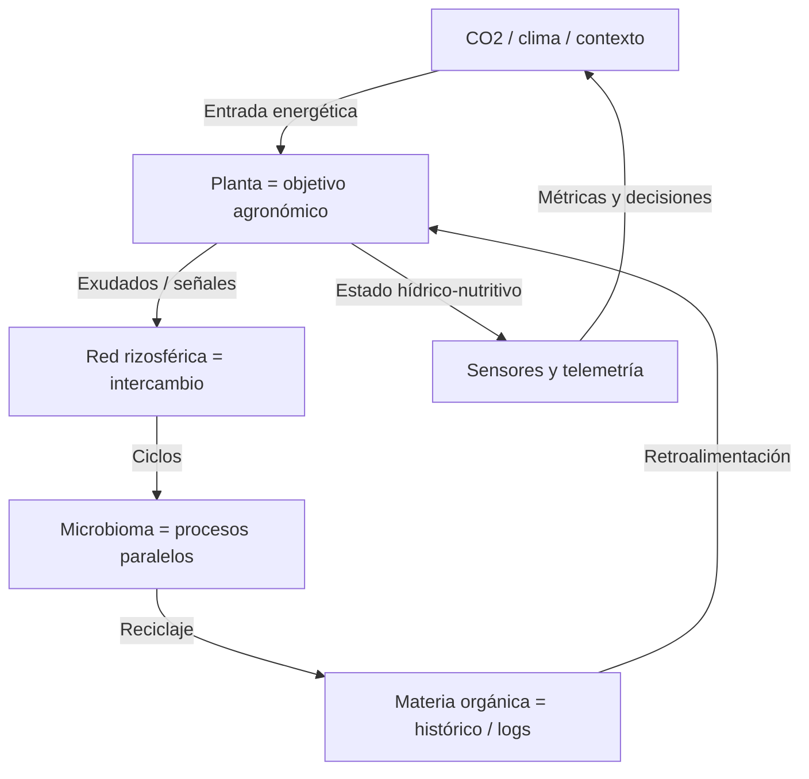

# Prontuario maestro — ecología digital agrícola (2026)

*Integración **conceptual** entre procesos **biológicos del suelo y la planta** y el **diseño de software** CASTÚO-System para agricultura regenerativa. Las tablas mezclan **ciencia agronómica real** con **metáforas de arquitectura**; no son especificación de producto ni catálogo de hardware desplegado en este repositorio.*

**Relación:** [PRONTUARIO-MAESTRO-INTEGRACION-BIOLOGICA-DIGITAL-2026.md](./PRONTUARIO-MAESTRO-INTEGRACION-BIOLOGICA-DIGITAL-2026.md) *(equivalencias técnicas y éticas)* · [NEUROMORPHIC-MEMRISTOR-ORIENTACION-2026.md](../integrations/NEUROMORPHIC-MEMRISTOR-ORIENTACION-2026.md) · [PRONTUARIO-MAESTRO-REFUERZO-INTEGRAL-2026.md](./PRONTUARIO-MAESTRO-REFUERZO-INTEGRAL-2026.md) · [TraceChain-Compliance-2026.md](../legal/TraceChain-Compliance-2026.md) · [DPIA-Robotics-2026.md](../legal/DPIA-Robotics-2026.md) · [CHECKLIST-INTEGRACION-BIODIGITAL.md](./CHECKLIST-INTEGRACION-BIODIGITAL.md) · [MAPA-REDES-SIMBIOTICAS.md](./MAPA-REDES-SIMBIOTICAS.md)

---

## 📋 1. Principios de integración biológica-digital

1. **Simbiosis tecnológica** — Los módulos digitales imitan **redes** (intercambio, retroalimentación), no sustituyen la biología.  
2. **Ciclos cerrados** — Datos y decisiones con **retención mínima** y **reutilización** (caché, trazas, informes) alineados a eficiencia hídrica y energética.  
3. **Inteligencia distribuida** — Del campo (sensores, edge) al backend; el **SNN de laboratorio** en repo es **simulación software** — ver orientación neuromórfica.  
4. **Soberanía alimentaria y territorial** — Tecnología adaptable a **contexto local**, proveedores y DPIA acordes a UE cuando trate datos personales o parcela.  
5. **Datos como insumo** — La información válida **nutre** modelos; la basura o el dato sin validación **acidifica** la decisión — validar la vida antes que el número.

---

## 🔧 2. Matriz de integración biológica-digital

### 2.1 Redes de nutrientes y datos *(metáfora + anclaje honesto)*

| Elemento biológico | Analogía digital | Interfaz / puente real en CASTÚO *(cuando existe)* | Límite |
|--------------------|------------------|---------------------------------------------------|--------|
| Micorrizas | Red de sensores + inferencia distribuida | Lab SNN + Redis caché inferencia hidropónica | Sin IoT subterráneo genérico en git |
| Bacterias del suelo | Microservicios / workers | Integraciones backend por dominio | “API de metabolismo” es lenguaje de diseño |
| Hongos saprófitos | Archival, TTL, limpieza de datos | Políticas de retención + observabilidad | No hay “protocolo de descomposición” formal |
| Reguladores de crecimiento | Optimización / políticas de riego | Modelos y umbrales en rutas validadas (Pydantic) | GNU Radio **no** es stack CASTÚO por defecto |
| Fauna del suelo *(p. ej. nematodos benéficos)* | Agentes de vigilancia / hardening | Playbook red: LLMNR/mDNS, segmentación | Analogía operativa; ver [Multilinker](./PRONTUARIO-MAESTRO-SEGURIDAD-MULTILINKER-2026.md) |

---

## 📊 3. Sistema de “nutrientes digitalizados”

### 3.1 Mapa conceptual *(no es un simulador de suelo)*

### 3.2 Equivalencias *(pedagógicas — columna digital no sustituye análisis de suelo)*

| Nutriente / factor biológico | Analogía en datos/sistema | Función en CASTÚO *(orientativa)* | Tecnología asociada *(repo / docs)* |
|------------------------------|---------------------------|-----------------------------------|-------------------------------------|
| C orgánico | Volumen y calidad de datos de cultivo | Entrena / alimenta modelos de decisión | Pipelines + validación |
| N | Estructura semántica (esquemas) | Base para predicción coherente | Pydantic, contratos API |
| P | Capacidad de cómputo pico | Inferencias bajo carga | Escalado edge/backend *(diseño)* |
| K | Throughput y colas | Regula flujos entre módulos | Redis / colas *(si se despliegan)* |
| Ca | Integridad referencial | Fortalece trazabilidad | SQL / registros auditables |
| Mg | Núcleo de procesamiento | Funciones críticas en caliente | Servicios principales FastAPI |
| S *(azufre)* | Integridad y autenticidad | Protege contra manipulación | Cifrado, tokens, hardening — [refuerzo integral](./PRONTUARIO-MAESTRO-REFUERZO-INTEGRAL-2026.md) |
| Micronutrientes | Señales de baja latencia | Ajustes finos de control | Sensores de precisión *(campo)* |

*Nb₂O₅, memristores físicos, post-cuántico en enlace: ver [NEUROMORPHIC-MEMRISTOR-ORIENTACION-2026.md](../integrations/NEUROMORPHIC-MEMRISTOR-ORIENTACION-2026.md) y política criptográfica del despliegue; **no** afirmar Kyber/YubiKey como “equivalente de azufre” en sentido agronómico.*

---

## 🔬 4. “Procesadores vegetales” digitales

| Proceso vegetal | Analogía operativa | Anclaje CASTÚO |
|-----------------|-------------------|----------------|
| Fotosíntesis | Ingesta de señales + inferencia en tiempo real | SNN lab + sensores luz/CO₂ en JSON de prueba |
| Transpiración | Disipación térmica / backpressure | Rate limits, colas, agrovoltaica *(expediente físico aparte)* |
| Respiración radicular | Consumo de recursos en edge | Uso CPU/RAM; política de caché Redis |
| Translocación | Enrutamiento entre servicios | Arquitectura microservicios / módulos |
| Senescencia | Fin de vida útil de datos | TTL, archivado, minimización RGPD |
| Dormancia | Modo bajo consumo | Standby edge, apagado de módulos no críticos |
| Floración / fructificación | Ventanas críticas de negocio | Alertas, informes, cosecha de KPIs medidos |

---

## 🌐 5. Red simbiótica interdependiente

Diagramas consolidados: [MAPA-REDES-SIMBIOTICAS.md](./MAPA-REDES-SIMBIOTICAS.md).

### 5.1 Protocolos de comunicación *(mapeo conceptual)*

| Señal biológica | Patrón digital | Implementación típica |
|-----------------|----------------|----------------------|
| Químicas | APIs síncronas | REST / OpenAPI |
| Eléctricas / rápidas | Eventos / spikes | Colas, WebSockets, SNN sim |
| Hormonales | Orquestación | Event-driven, sagas *(si aplica)* |
| Luminosas | Canales ópticos | Red de campo / fibra *(infra propia)* |
| Mecánicas / acústicas | Sensores | Ultrasonidos, vibración *(selección por finca)* |

---

## 📈 6. Métricas de integración

### 6.1 Parcela y solución *(referencias agronómicas reales)*

| Métrica | Unidad | Rango óptimo orientativo *(cultivo/sustrato dependiente)* | Nota |
|---------|--------|-----------------------------------------------------------|------|
| Relación C/N *(suelo orgánico)* | ratio | ~24–30:1 *(literatura suelo)* | Medir en laboratorio / análisis; **no** confundir con “C/N digital” |
| pH solución / suelo | escala | Típico 5,5–6,5 hidroponía; suelo variable | Sensores calibrados |
| CE | mS/cm | Según cultivo y fase | Sensores IoT |
| Materia orgánica suelo | % | Objetivos según tipología | Análisis de suelo |

### 6.2 Software y plataforma *(baselines a definir en vuestro Prometheus/Grafana)*

| Familia | Ejemplos | Acción |
|---------|----------|--------|
| Latencia inferencia | `castuo_neuro_hydro_infer_seconds` | Medir; comparar con SLO interno |
| Carga | `req/s`, errores 5xx | Alertas con dueño |
| Trazas | eventos TraceChain / cadena opt-in | Coherencia con [TraceChain-Compliance-2026.md](../legal/TraceChain-Compliance-2026.md) |

*No fijar en el git rangos como “40–60 req/s” o “100–200 events/min” sin medición en vuestro entorno.*

---

## 📜 7. Documentación y recursos

| Documento | Propósito | Enlace |
|-----------|-----------|--------|
| **Este prontuario** | Marco biológico-digital honesto | *(este archivo)* |
| Índice corto | Punto de entrada | [PRONTUARIO-ECOLOGIA-DIGITAL.md](./PRONTUARIO-ECOLOGIA-DIGITAL.md) |
| Checklist integración | Evidencia en campo + código | [CHECKLIST-INTEGRACION-BIODIGITAL.md](./CHECKLIST-INTEGRACION-BIODIGITAL.md) |
| Mapa de redes | Diagramas Mermaid | [MAPA-REDES-SIMBIOTICAS.md](./MAPA-REDES-SIMBIOTICAS.md) |

---

## 🎯 8. Conclusión y recomendaciones

### 8.1 Top 5 acciones *(realistas respecto al repositorio)*

1. **Validar** telemetría (pH, EC, humedad) con esquemas y tests — calidad = “nutriente” del modelo.  
2. **Medir** latencias y baselines en observabilidad antes de prometer SLAs.  
3. **Alinear** flujos de datos personales / parcela con DPIA y minimización.  
4. **Documentar** qué partes son **simulación lab** (SNN) vs **piloto campo**.  
5. **Completar** [CHECKLIST-INTEGRACION-BIODIGITAL.md](./CHECKLIST-INTEGRACION-BIODIGITAL.md) con evidencia.

### 8.2 Plan ~6 meses *(orientativo)*

| Fase | Objetivo | Resultado esperado |
|------|----------|-------------------|
| 1–2 | Baseline sensores + validación | Informes reproducibles, menos 422 por datos basura |
| 3–4 | Observabilidad y trazas | Dashboards con SLO internos medidos |
| 5–6 | Integración campo-piloto | Acta de lecciones; actualización DPIA si aplica |

---

🚜 *Pa'lante, campeón.* 🌱

*Ecología digital: el dato que no pasa por el mismo filtro que el agua del depósito, no debería regar la decisión.*
