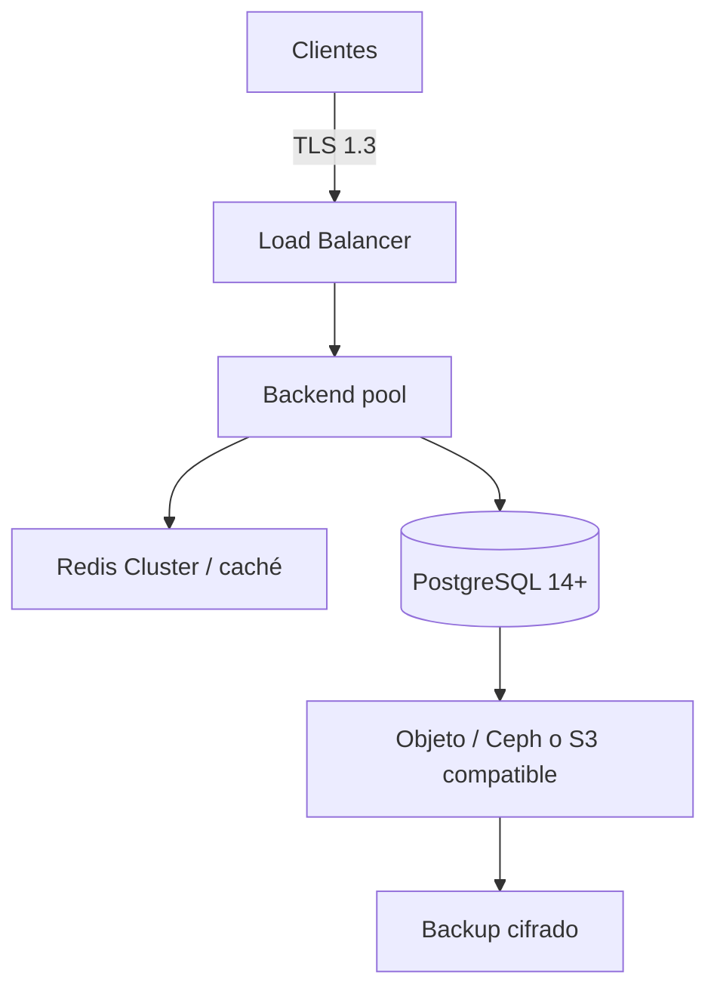

# Prontuario maestro — escalado para más clientes, Sabionda AI y expansión UE (2026)

*Visión **coherente**: arquitectura multi-cliente, línea educativa Sabionda, implementación técnica y expansión europea. Lo **pedagógico por edades** es **hoja de ruta de producto** — contrastar con código y [Sabionda-Educational-System.md](../sabionda/Sabionda-Educational-System.md). Plazos legales: **orientativos** con asesoría.*

**Relación:** [PLAN-MEJORA-TECNICA-ESCALADO-CASTUO-2026.md](./PLAN-MEJORA-TECNICA-ESCALADO-CASTUO-2026.md) · [PRONTUARIO-PLAN-FASES-ESTABILIZACION-20S-2026.md](./PRONTUARIO-PLAN-FASES-ESTABILIZACION-20S-2026.md) · [PRONTUARIO-MAESTRO-EVALUACION-TECNICA-CASTUO-2026.md](./PRONTUARIO-MAESTRO-EVALUACION-TECNICA-CASTUO-2026.md) · [DPIA-Robotics-2026.md](../legal/DPIA-Robotics-2026.md) · [Sabionda-Educational-System.md](../sabionda/Sabionda-Educational-System.md)

---

## 1. Escalado técnico para más clientes

### 1.1. Arquitectura escalable

*Redis es **caché**; la base relacional principal en despliegue maduro es **PostgreSQL**. Ajustar nombres a vuestro stack.*



| Componente | Escalado actual *(típico en repo / staging)* | Escalado objetivo | Acción |
|------------|---------------------------------------------|-------------------|--------|
| Backend | 1 nodo `:8000` | 3+ nodos + healthcheck | HAProxy / NLB — [PLAN-MEJORA-TECNICA-ESCALADO-CASTUO-2026.md](./PLAN-MEJORA-TECNICA-ESCALADO-CASTUO-2026.md) |
| Base de datos | SQLite en `LocalResilienceDB` + posible PG en otros módulos | PostgreSQL 14+ como servicio principal | Migración planificada, réplicas lectura |
| Caché | Redis opcional *(SNN lab)* | Redis Cluster si carga lo exige | Cluster 6 nodos típico + TLS/ACL |
| Almacenamiento | Local / volúmenes | Objeto distribuido *(Ceph / S3)* | Política ciclo de vida + versionado |

---

## 2. Sistema educativo y Sabionda AI

### 2.1. Estructura por edades *(roadmap — validar protección de menores y DPIA)*

| Edad | Enfoque | Tecnología asociada *(objetivo)* |
|------|---------|-----------------------------------|
| 5–7 | Aprendizaje lúdico | Asistentes de voz / juegos *(consentimiento parental, datos mínimos)* |
| 8–12 | Educación adaptativa | LMS personalizado, IA acotada |
| 13–18 | Preparación académica | Tutoría IA + simulaciones *(transparencia, edad digital)* |
| Adultos | Formación continua | Cursos especializados, certificación |

**Corpus existente:** programas, Moodle y métricas orientativas en [Sabionda-Educational-System.md](../sabionda/Sabionda-Educational-System.md). **No** implica que todos los canales por edad estén implementados en el monolito Castúo.

---

## 3. Implementación técnica

### 3.1. HAProxy *(healthcheck en backend, no en frontend)*

```haproxy
frontend http_front
    bind *:80
    bind *:443 ssl crt /etc/haproxy/certs/api.pem alpn h2,http/1.1
    default_backend http_back

backend http_back
    balance roundrobin
    option httpchk GET /health
    server node1 192.168.1.10:8000 check
    server node2 192.168.1.11:8000 check
    server node3 192.168.1.12:8000 check
```

```bash
sudo mkdir -p /run/haproxy
sudo chown haproxy:haproxy /run/haproxy
# En global: stats socket /run/haproxy/admin.sock mode 660 level admin
sudo haproxy -c -f /etc/haproxy/haproxy.cfg
```

### 3.2. Rotación de certificados *(PEM combinado sin `install` multi-fichero)*

```bash
#!/usr/bin/env bash
set -euo pipefail
DOMAIN="${CERT_DOMAIN:-api.castuo-system.eu}"
EMAIL="${CERTBOT_EMAIL:-admin@example.com}"
OUT="/etc/haproxy/certs/${DOMAIN}.pem"

sudo certbot certonly --webroot -w /var/www/certbot -d "$DOMAIN" \
  --email "$EMAIL" --agree-tos --non-interactive --keep-until-expiring

sudo bash -c "cat /etc/letsencrypt/live/${DOMAIN}/fullchain.pem /etc/letsencrypt/live/${DOMAIN}/privkey.pem > /tmp/haproxy-$$.pem"
sudo install -m 640 -o root -g haproxy /tmp/haproxy-$$.pem "$OUT"
rm -f /tmp/haproxy-$$.pem
sudo systemctl reload haproxy
```

**Cron:** preferir fichero en `/etc/cron.d/castuo-certbot` en lugar de `tee -a /etc/crontab` *(evita duplicados)*.

### 3.3. Alertmanager *(plantilla)*

```yaml
global:
  resolve_timeout: 5m

route:
  group_by: ['alertname']
  group_wait: 10s
  group_interval: 5m
  repeat_interval: 3h
  receiver: 'slack-notifications'
  routes:
    - match:
        severity: critical
      receiver: 'slack-critical'

receivers:
  - name: 'slack-notifications'
    slack_configs:
      - channel: '#alertas-castuo'
        api_url: 'REPLACE_WITH_WEBHOOK_URL'
        send_resolved: true
  - name: 'slack-critical'
    slack_configs:
      - channel: '#castuo-critical'
        api_url: 'REPLACE_WITH_WEBHOOK_URL'
        send_resolved: true
```

---

## 4. Expansión europea

### 4.1. Cumplimiento normativo

| Normativa | Acción | Plazo *(orientativo)* |
|-----------|--------|------------------------|
| RGPD | Auditoría tratamientos, DPIA, encargados | ~2 semanas *+ calendario DPO* |
| AI Act | Asesoría para clasificación y documentación | ~1 mes |
| PAC / suelo | Validación usos *(SIGPAC / regional)* con agrónomo | ~2 semanas *según integración real* |

### 4.2. Estrategia por fases *(negocio — no contractual en git)*

- **Fase 1 (~3 meses):** España y Portugal — normativas locales, cooperativas.  
- **Fase 2 (~6 meses):** Francia y Alemania — integraciones y requisitos sectoriales.  
- **Fase 3 (~12 meses):** Europa del Este — normativa local, multilingüe.

*Cada fase requiere DPA, hosting UE si soberanía, y revisión de [PRONTUARIO-MAESTRO-INFRAESTRUCTURA-SOBERANA-TRL6-TRL7-2026.md](./PRONTUARIO-MAESTRO-INFRAESTRUCTURA-SOBERANA-TRL6-TRL7-2026.md).*

---

## 5. Recomendaciones y plan de acción

### 5.1. Inmediatas

- Balanceo + healthchecks *(~2 semanas)*.  
- Renovación certificados automatizada *(~1 semana)*.  
- Alertas mínimas operativas *(~1 semana)*.

### 5.2. ~3 meses

- PostgreSQL 14+ como eje de datos de producto.  
- Redis Cluster si métricas lo justifican.  
- Backup automatizado *(objeto + prueba restauración)*.

### 5.3. ~6 meses

- Pilotos ES/PT con marco legal cerrado.  
- Módulos educativos alineados a Sabionda + DPIA menores si aplica.  
- Alianzas *(fuera del alcance del código)*.

---

*Más clientes sin más observabilidad es más superficie sin brújula; escala el monitoreo con el mismo ritmo que el balanceador.*

🚜 *Pa'lante, campeón.* 🌱
