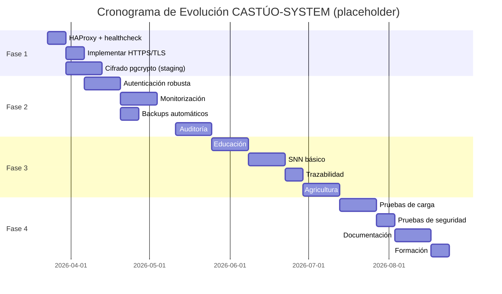

# Prontuario maestro — evolución completa CASTÚO-System (2026)

*Plan técnico detallado de evolución **basado en evidencia del repositorio**. Las recetas son plantillas y “implementado” significa que hay código/tests/docs que lo sostienen. Cuando una capacidad depende del despliegue (Redis Cluster, Ceph, pen drive air-gap), se marca como tal y se enlaza al prontuario canónico correspondiente.*

**Relación (canónicos):** [PRONTUARIO-MAESTRO-EVALUACION-TECNICA-CASTUO-2026.md](./PRONTUARIO-MAESTRO-EVALUACION-TECNICA-CASTUO-2026.md) · [PRONTUARIO-MAESTRO-REFUERZO-INTEGRAL-2026.md](./PRONTUARIO-MAESTRO-REFUERZO-INTEGRAL-2026.md) · [PRONTUARIO-MAESTRO-INTEGRACION-CIFRADA-SOBERANA-2026.md](./PRONTUARIO-MAESTRO-INTEGRACION-CIFRADA-SOBERANA-2026.md) · [PLAN-MEJORA-TECNICA-ESCALADO-CASTUO-2026.md](./PLAN-MEJORA-TECNICA-ESCALADO-CASTUO-2026.md) · [PLAN-MEJORA-INMEDIATA-CASTUO-2026.md](./PLAN-MEJORA-INMEDIATA-CASTUO-2026.md) · [PRONTUARIO-MAESTRO-SEGURIDAD-BACKUP-PEN-DRIVE-2026.md](./PRONTUARIO-MAESTRO-SEGURIDAD-BACKUP-PEN-DRIVE-2026.md) · [PRONTUARIO-MAESTRO-EVOLUCION-SISTEMA-2026.md](./PRONTUARIO-MAESTRO-EVOLUCION-SISTEMA-2026.md) · [Sabionda-Educational-System.md](../sabionda/Sabionda-Educational-System.md)

---

## 1. Visión y objetivos

### 1.1 Objetivos medibles (con evidencia)

1. **Escalar de 100 a 10,000+ usuarios concurrentes** → evidencia: baselines y reportes de **Locust** (ver `tests/stress/locustfile.py`) y métricas `/metrics` cuando estén habilitadas. No asumir “10,000” como hecho antes de baseline.
2. **Seguridad de grado empresarial** → evidencia: informe de **ZAP** sobre alcance acordado (en staging existe `zap` en `docker-compose.staging.yml`) + checklists de hardening y runbooks.
3. **Integrar módulos de Sabionda AI** → evidencia: código en `backend/sabionda_master.py`, `backend/sabion_edu/*` y flujos en `academy/lms_integration.py`.
4. **Soberanía tecnológica europea** → evidencia: ubicación del tratamiento y contratos/DPA (no inferidos por git). En repo se documenta la lógica de soberanía y cifrado en prontuarios.
5. **Automatizar operaciones y mantenimiento** → evidencia: scripts de backup y rotación (ver `scripts/backup/automated-backup.sh`, `backend/scripts/auto_rotate_keys.py` y prontuario de rotación).
6. **Cumplir con normativas UE** → evidencia: documentación técnica + legal/DPO en `docs/legal/` (este doc guía técnica, no certifica cumplimiento).

> Nota: “cumplimiento” se decide con marco DPIA/DPO; el repo aporta implementación y trazabilidad.

---

## 2. Plan de evolución por fases (20 semanas)

### 2.1 Fase 1 — Infraestructura base escalable y segura (4 semanas)

| Tarea | Evidencia en repositorio | Criterio de aceptación (verificable) | Recursos |
|------|---------------------------|-----------------------------------------|----------|
| Configurar HAProxy (balance + healthcheck) | `docs/deploy/PLAN-MEJORA-TECNICA-ESCALADO-CASTUO-2026.md` (plantilla `haproxy.cfg`) | `haproxy -c` OK + `option httpchk` respondiendo + tráfico balanceado a nodos con `GET /health` | 20h |
| Implementar TLS 1.3 / HTTPS + rotación | `DEPLOY.md` (auto-renovación certbot) + HAProxy/SSL templates en `PLAN-MEJORA-TECNICA-ESCALADO...` | Endpoint HTTPS responde y hay renovación automática (ver `DEPLOY.md` §12.5) | 15h |
| Configurar PostgreSQL 14+ | docker compose usa `postgres:15-alpine`/`postgres:16` en `docker/docker-compose*.yml` | `SELECT version();` muestra PostgreSQL >= 14 en el despliegue | 10h |
| Enfoque de cifrado con pgcrypto (aplicativo) | `docs/deploy/PRONTUARIO-MAESTRO-INTEGRACION-CIFRADA-SOBERANA-2026.md` (SQL `pgcrypto` didáctico) | Extensión `pgcrypto` disponible y una prueba de cifrado/descifrado hecha en staging sin hardcodear claves | 10h |

---

### 2.2 Fase 2: Seguridad avanzada (8 semanas)
Objetivo: autenticar con roles/MFA, observar y proteger con evidencia verificable.

| Tarea | Evidencia en repositorio (real) | Criterio de aceptación (verificable) | Recursos |
|------|----------------------------------|-----------------------------------------|----------|
| Implementar autenticación robusta | `backend/api/security/keycloak.py` + `security/physical_mfa.py` + `scripts/security/authenticate_with_yubikey.py` + `backend/config/vault_staging.hcl` | Endpoints protegidos requieren auth/roles coherentes; el flujo MFA funciona según política definida y secretos se consumen desde staging | 25h |
| Configurar monitorización | `docs/monitoring/alerts.md` + `backend/integrations/robotics/lab_metrics_optional.py` + `docker/prometheus.yml`/`monitor/prometheus.yml` | `/metrics` accesible donde aplique y reglas de alerta con runbook (la configuración concreta puede vivir fuera del repo) | 30h |
| Automatizar backups | `scripts/backup/automated-backup.sh` + `scripts/backup_script.sh` + `PRONTUARIO-MAESTRO-SEGURIDAD-BACKUP-PEN-DRIVE-2026.md` | Backups se generan y existe prueba de restauración documentada (archivo + hash/tamaño + resultado) | 15h |
| Implementar auditoría | `docs/legal/verify-integrity-legal.sh` + `docs/legal/TraceChain-Compliance-2026.md` + `backend/api/services/gaiachain_service.py` | Script de integridad pasa y la trazabilidad registra evento (o fallback documentado si RPC/chain no está disponible) | 20h |

---

### 2.3 Fase 3 — Integración Sabionda AI (4 semanas)

| Tarea | Evidencia en repositorio | Criterio de aceptación (verificable) | Recursos |
|------|---------------------------|-----------------------------------------|----------|
| SNN Engine | `backend/integrations/robotics/neuromorphic_edge.py` + tests `tests/integrations/test_neuromorphic*.py` | Endpoint lab `/api/robotics/lab/neuromorphic/.../infer` devuelve respuesta + registra métricas cuando habilitado | 40h |
| TraceChain / trazabilidad audit | `docs/legal/TraceChain-Compliance-2026.md` + `backend/api/services/gaiachain_service.py` (ruta audit real) + `pei-002-tracechain/*` | Evento de auditoría registrado si la config de chain está activa; si falla RPC, existe fallback documentado (no “tx inventada”) | 30h |
| Módulo educativo Sabionda | `backend/sabion_edu/*`, `backend/sabionda/sabionda_master.py`, `academy/lms_integration.py` | Prototipo funcional de inscripción + emisión/verificación (y registro opt-in cuando corresponda) | 35h |
| Módulo agrícola (en repo: agrivoltaico/datos) | `backend/agrivoltaic/*` + rutas de análisis `backend/federated/routes.py` | Integración de recomendaciones con datos del sistema (sin imponer “agriculture_ai.py” no existente) | 35h |

> Nota: en este repo el “SNN Engine” es simulación software (numpy/fastapi). TF no se impone: cualquier cambio se hace por PR con tests y baseline.

---

### 2.4 Fase 4 — Validación y producción (4 semanas)

| Tarea | Evidencia en repositorio | Criterio de aceptación (verificable) | Recursos |
|------|---------------------------|-----------------------------------------|----------|
| Pruebas de carga (Locust) | `tests/stress/locustfile.py` | Informe con baseline medido y comparación tras cambios | 20h |
| Pruebas de seguridad (ZAP/OWASP) | `docker-compose.staging.yml` incluye `zap` (owasp/zap2docker) | Informe ZAP en alcance acordado + remediación documentada (ticket) | 25h |
| Documentación técnica | `docs/deploy/*` + runbooks `docs/deploy/RUNBOOK-RESPUESTA-INCIDENTES.md` | Documentación completa y enlazada a canónicos; sin placeholders críticos sin resolver | 20h |
| Formación del equipo | `docs/training/*` | Formación = checklist/tabletop + evidencia de asistencia o acta | 15h |

---

## 3. Arquitectura objetivo (2026)

```mermaid
graph TD
  subgraph Clients
    A[Web/Mobile/IoT] -->|HTTPS| B[Load Balancer (HAProxy)]
  end
  subgraph Security
    B -->|TLS 1.3| C[Auth / servicios]
  end
  subgraph Core
    C --> D[SNN Engine (sim)] 
    C --> E[TraceChain / trazabilidad opt-in]
    C --> F[Redis Cluster *si* se despliega]
    C --> G[PostgreSQL]
    G --> H[Ceph/S3 *según despliegue*]
  end
  H --> I[Backup cifrado]
  I --> J[Air-gap: pen drive con restauración probada]
```

---

## 4. Integración con Sabionda AI (mapeo a código del repo)

| Módulo | Ubicación en repo | Estado actual en git | Funcionalidad objetivo |
|--------|-------------------|-----------------------|---------------------------|
| Sabionda Core | `backend/services/sabionda_master.py` | Prototipo funcional | Orquestación educativa |
| Education Module | `backend/sabion_edu/*` | En desarrollo/funcional | Matrícula + emisión/verificación |
| Trazabilidad educativa | `academy/lms_integration.py` | Integración opt-in | Emitir/verificar certificados |
| SNN Engine | `backend/integrations/robotics/neuromorphic_edge.py` | TRL-4 sim | Inferencia de laboratorio |
| Agricultura (agrivoltaico) | `backend/agrivoltaic/*` | Operativo para demo | Recomendaciones/metrics agrivoltaicas |

> Nota: no se asume “Ethereum/Go/TraceChain” en producción si el contrato/explorer real no está desplegado; la vía en repo es opt-in con fallback.

---

## 5. Cronograma (visual; placeholders)



> Fechas placeholders: sustituir tras kick-off y baseline real.

---

## 6. Conclusión y próximos pasos

### 6.1 Top 3 acciones inmediatas

1. Configurar infraestructura base (4 semanas)
```bash
# Comprobar que el staging levanta (config validada por Compose)
docker-compose -f docker-compose.staging.yml config > staging-config.yml
```

2. Implementar seguridad básica (2 semanas)
```bash
# (Ejemplo) Verificar pgcrypto en la base de staging (sin hardcodear claves)
psql "$POSTGRES_URL" -c "CREATE EXTENSION IF NOT EXISTS pgcrypto;"
```

3. Automatizar operaciones (2 semanas)
```bash
# Backup PostgreSQL local (variables POSTGRES_* opcionales; si faltan, el script avisa)
chmod +x scripts/backup_script.sh
./scripts/backup_script.sh
```

### 6.2 Recomendación de ejecución

- Convertir este doc en checklist ejecutable con [CHECKLIST-INTEGRACIONES-MEJORAS-2026.md](./CHECKLIST-INTEGRACIONES-MEJORAS-2026.md).  
- Cada entrega debe adjuntar artefactos de evidencia (logs, hashes, informe ZAP/Locust, capturas).

---

*El territorio se convence con pruebas; el repo con rutas. Nada se promete sin poder verificarse.*

