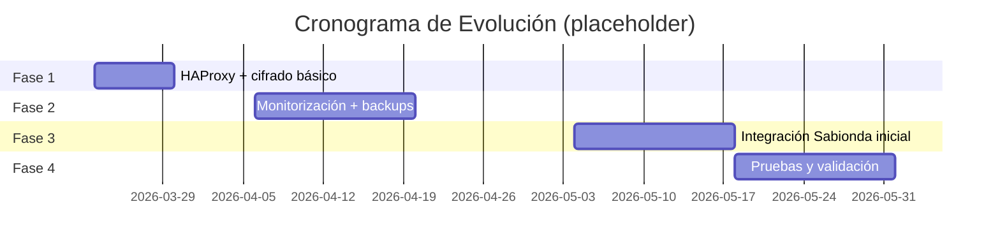

# Prontuario maestro — evolución **segura y ética** del sistema (2026)

*Estudio técnico para **mejora, desarrollo y evolución segura** del sistema CASTÚO-System, con **enfoque ético** y alineación a **código abierto** y soberanía tecnológica **europea** donde el despliegue lo permita.*

**Relación:** [PRONTUARIO-MAESTRO-AUDITORIA-EVOLUCION-RESILIENTE-2026.md](./PRONTUARIO-MAESTRO-AUDITORIA-EVOLUCION-RESILIENTE-2026.md) *(auditoría + roadmap resiliente, evidencia git)* · [PRONTUARIO-AUDITORIA-TECNICA-ETICA-CASTUO-2026.md](./PRONTUARIO-AUDITORIA-TECNICA-ETICA-CASTUO-2026.md) *(auditoría ampliada)* · [PRONTUARIO-MATRIZ-TRL-ACELERADORA-2026-2027.md](../legal/PRONTUARIO-MATRIZ-TRL-ACELERADORA-2026-2027.md) · [PRONTUARIO-MAESTRO-EVOLUCION-TRL-SUPERIOR-2026.md](./PRONTUARIO-MAESTRO-EVOLUCION-TRL-SUPERIOR-2026.md) · [PRONTUARIO-MAESTRO-SEGURIDAD-MULTILINKER-2026.md](./PRONTUARIO-MAESTRO-SEGURIDAD-MULTILINKER-2026.md) · [CHECKLIST-INTEGRACIONES-MEJORAS-2026.md](./CHECKLIST-INTEGRACIONES-MEJORAS-2026.md) · [CHECKLIST-TRL6-HETZNER-STAGING.md](./CHECKLIST-TRL6-HETZNER-STAGING.md) · [DPIA-Robotics-2026.md](../legal/DPIA-Robotics-2026.md)

*Límites:* sin certificaciones ni TRL “oficial” inferidos solo del git; las herramientas de §9 exigen **mandato**, **alcance** y **licencias** explícitas; no sustituyen DPIA ni decisión DPO.

---

## 🗺️ 1. Diagnóstico actual del sistema

*Análisis técnico integral de componentes, vulnerabilidades y **valores éticos**.*

### 1.1 Componentes principales

| Componente | Función | Tecnologías clave | Estado | Riesgos | Valores éticos |
|------------|---------|-------------------|--------|---------|----------------|
| **SNN** (`neuromorphic_edge.py`) | Inferencia neuromórfica para riego | Redis, Pydantic, Prometheus | 🟡 TRL 4–5 | Regresión TTL sin `snn_cache_ttl_seconds()`; validación parcial de sensores | Sostenibilidad rural; eficiencia de cómputo/agua |
| **TraceChain** | Trazabilidad en cadena | FastAPI, SQLite, GaiaChain *(futuro)* | 🟡 TRL 5 | Stub SQLite; sin firma operativa aún | Transparencia; trazabilidad responsable |
| **SIGPAC** | Uso del suelo | GDAL, GeoJSON, Shapely | 🟡 TRL 6 | Mapeo estático; geometrías incompletas | Respeto a usos del suelo; datos agrícolas minimizados |
| **Señales (RF/IoT)** | Captura sensores | PySerial, GNU Radio *(stub)* | 📋 TRL 3–4 | GNU Radio no productivo; memristores no hardware | Innovación rural sostenible; accesibilidad |
| **Multilinker** | Seguridad + eficiencia unificadas | CASTÚO-SYSTEM *(doc + playbook)* | 🟡 Diseño | Integración fragmentada | Interoperabilidad; gobernanza clara |
| **Monitorización** | Métricas y alertas | Prometheus, Grafana | 🟡 TRL 5 | Grafana no en repo; alertas parciales | Transparencia operativa; privacidad en métricas ([alerts.md](../monitoring/alerts.md)) |

---

## 🔍 2. Mitigación de LLMNR poisoning

*Solución técnica **ética** para hosts que custodian `CASTUO_*` / Vault: **mínima intervención**, **verificable**, **documentada**.*

### 2.1 Cadena de ataque

1. Cliente: `ping "impresora"` → DNS falla.  
2. Cliente: LLMNR broadcast UDP **5355**.  
3. Atacante: **IP/MAC falsas**.  
4. Cliente: `\\falsa-impresora` → **NTLMv2** capturado.  
5. Pass-the-Hash → escalada.

**Riesgo compuesto**

- Exposición del entorno con `castuo_admin_general_bearer`.  
- Robo de tokens Vault (staging / Hetzner).  
- Escalada en sistemas críticos.

**Valores éticos afectados** si no se mitiga: soberanía de **datos agrícolas y operativos**; **privacidad** de quienes operan el edge; confianza del **territorio** en la plataforma.

### 2.2 Mitigación en Hetzner (Ubuntu)

```bash
# 1. Verificar estado actual (ética: transparencia previa)
grep -E '^LLMNR=|^MulticastDNS=' /etc/systemd/resolved.conf

# 2. Editar resolved.conf (ética: acción mínima necesaria; preferir editor si hay duda)
sudo sed -i '/\[Resolve\]/a LLMNR=no\nMulticastDNS=no' /etc/systemd/resolved.conf

# 3. Reiniciar resolución (ética: impacto acotado y reversible con backup)
sudo systemctl restart systemd-resolved

# 4. Verificar (ética: evidencia reproducible)
sudo resolvectl status
sudo tcpdump -i any udp port 5355 -c 10   # Objetivo: 0 paquetes LLMNR salvo excepción acordada y documentada
```

**Advertencia ética:** reejecutar `sed` puede **duplicar líneas** y degradar la **integridad** del fichero; preferir edición manual o comprobar ausencia de claves. GNU `sed`; debe existir `[Resolve]`.

**Windows** (interfaces):

```powershell
Get-ChildItem "HKLM:\SYSTEM\CurrentControlSet\Services\NetBT\Parameters\Interfaces" -ErrorAction SilentlyContinue |
  Get-ChildItem | Where-Object { $_.PSChildName -like "Tcpip*" } |
  ForEach-Object { Set-ItemProperty -Path $_.PSPath -Name "NetbiosOptions" -Value 2 -Type DWord }
```

*Ampliar:* [PRONTUARIO-MAESTRO-SEGURIDAD-MULTILINKER-2026.md](./PRONTUARIO-MAESTRO-SEGURIDAD-MULTILINKER-2026.md).

---

## 🔗 3. Integración con Multilinker

*Gestión unificada de seguridad y eficiencia con **criterios éticos** (minimización, trazabilidad de *proceso*, no de datos personales innecesarios).*

### 3.1 Implementación en CASTÚO-SYSTEM

**En el repositorio hoy** figura en código la clave `llmnr_multicast_off` (con `scope`, `verify`, `territorio`). La clave **`ethical_monitoring` siguiente es hoja de ruta**: no está en `system_admin_playbook.py` y **no** debe asumirse un fichero `/etc/castuo/config.json` hasta estandarizarlo en despliegue.

```python
# backend/models/system_admin_playbook.py — implementado hoy
CRITICAL_HARDENING_CHECKS = {
    "llmnr_multicast_off": {
        "cmd": "grep -E '^LLMNR=|^MulticastDNS=' /etc/systemd/resolved.conf || true",
        "expected": ["LLMNR=no", "MulticastDNS=no"],
        "remediation": "Editar /etc/systemd/resolved.conf (ver PRONTUARIO-MAESTRO-EVOLUCION-SISTEMA-2026.md §2.2)",
    },
}

# Diseño futuro (no mergeado como check ejecutable hasta política y ruta acordadas):
# "ethical_monitoring": { ... }  # p. ej. banderas de minimización en logs/métricas
```

**Funcionalidades éticas objetivo:** autenticación reforzada (YubiKey + Kyber-1024 donde aplique); custodia **transparente** de tokens (A/B Vault); monitorización **sin exponer** titulares innecesarios; GaiaChain **opt-in** con DPIA §6.

---

## 📊 4. Monitorización y eficiencia ética

### 4.1 Métricas clave

| Métrica | Descripción | Estado | Valor ético |
|---------|-------------|--------|-------------|
| `castuo_neuro_hydro_infer_seconds` | Latencia SNN (`snn_cache_ttl_seconds()`) | ✅ Implementada | Eficiencia energética / uso responsable de cómputo |
| `ethical_decision_count` | Conteo de decisiones con bitácora ética *(diseño)* | 📋 Diseño futuro | Transparencia de *decisiones* sin datos personales |
| `data_privacy_compliance` | Señales técnicas de minimización / DPIA | 🟡 Parcial | Protección de datos agrícolas y operadores |
| `system_uptime` | Disponibilidad del servicio | ✅ *(según stack)* | Confiabilidad para explotaciones |

---

## 🔄 5. Sistema de mejora continua ética

### 5.1 Procesos clave

| Proceso | Descripción | Frecuencia | Herramienta | Valor ético |
|---------|-------------|------------|-------------|-------------|
| Auditoría de seguridad | Vulnerabilidades + PQC / Kyber | Trimestral | OpenSCAP, Nessus, Multilinker | Integridad y defensa del territorio digital |
| Pruebas de campo | SNN / RF con consentimientos y alcance | Mensual | Multilinker; GNU Radio *(roadmap)* | Innovación responsable |
| Revisión DPIA | Impacto tratamiento | Anual | [DPIA-Robotics-2026.md](../legal/DPIA-Robotics-2026.md) | Cumplimiento y confianza |
| Optimización | TTL, SLO, recursos | Mensual | Multilinker, Prometheus | Responsabilidad social y ambiental |

---

## 🛡️ 6. Hardening y seguridad ética

### 6.1 Medidas de hardening

| Medida | Comando | Prioridad | Documentación | Valor ético |
|--------|---------|-----------|---------------|-------------|
| Deshabilitar LLMNR | `grep -E '^LLMNR=' /etc/systemd/resolved.conf` | 🔥 | [§2.2](#22-mitigación-en-hetzner-ubuntu) | Privacidad y autenticidad en la LAN |
| Deshabilitar mDNS | `grep -E '^MulticastDNS=' /etc/systemd/resolved.conf` | 🔥 | [§2.2](#22-mitigación-en-hetzner-ubuntu) | Reducción de superficie de abuso |
| Reiniciar resolved | `sudo systemctl restart systemd-resolved` | 🔥 | — | Mantenimiento predecible |
| Verificar | `sudo resolvectl status` | 🔥 | — | Transparencia operativa |

---

## 📜 7. Documentación y enlaces éticos

| Documento | Propósito | Estado | Enlace | Valor ético |
|-----------|-----------|--------|--------|-------------|
| Evolución TRL superior | TRL y evidencia | ✅ | [PRONTUARIO-MAESTRO-EVOLUCION-TRL-SUPERIOR-2026.md](./PRONTUARIO-MAESTRO-EVOLUCION-TRL-SUPERIOR-2026.md) | Innovación responsable |
| Integraciones P1–P3 | Tareas | ✅ | [CHECKLIST-INTEGRACIONES-MEJORAS-2026.md](./CHECKLIST-INTEGRACIONES-MEJORAS-2026.md) | Mejora continua transparente |
| TRL6 Hetzner | Staging | ✅ | [CHECKLIST-TRL6-HETZNER-STAGING.md](./CHECKLIST-TRL6-HETZNER-STAGING.md) | Entornos acotados y auditables |
| DPIA Robotics | Impacto legal | 🟡 | [DPIA-Robotics-2026.md](../legal/DPIA-Robotics-2026.md) | RGPD / AI Act / campo |

*LLMNR / Multilinker técnico:* [PRONTUARIO-MAESTRO-SEGURIDAD-MULTILINKER-2026.md](./PRONTUARIO-MAESTRO-SEGURIDAD-MULTILINKER-2026.md).

---

## 🎯 8. Hoja de ruta de evolución ética (~6 meses)

| Acción | Plazo | Criterio de éxito | Valor ético |
|--------|-------|-------------------|-------------|
| Mitigar LLMNR (Hetzner) | 1 semana | 0 paquetes UDP 5355 *(tcpdump)* salvo excepción documentada | Privacidad rural / edge |
| Multilinker (ops) | 2 semanas | Playbook + tests `trl6` en referencia | Soberanía operativa |
| Validar configuración | 1 día | `resolvectl` + captura archivada | Transparencia |
| Grafana | 2 semanas | Dashboards sin datos personales innecesarios | Monitoreo responsable |
| Auditoría | 1 mes | Informe sin críticos **sin** plan/fecha | Protección integral |
| Política de TTL | 1 día | Tabla vigente en [README robotics](../../backend/integrations/robotics/README.md#política-de-ttl-para-caché-snn) | Eficiencia responsable |

---

## 🔧 9. Herramientas de código abierto y evaluación ética

*Uso solo con **autorización**, **alcance escrito** y **jurisdicción** clara; preferir FOSS y proveedores alineados con política europea cuando exista alternativa equivalente.*

| Herramienta | Finalidad | Enfoque ético | Nota / integración CASTÚO |
|-------------|-----------|---------------|---------------------------|
| **Nmap** | Inventario de puertos/servicios | Superficie de ataque conocida y acotada | Documentar en informes de hardening; no escanear terceros sin permiso |
| **OWASP ZAP** | Pruebas web *(FOSS)* | Sustituto **código abierto** de suites propietarias | Alinear con endpoints documentados del lab/staging |
| **Burp Suite** | Pruebas web comerciales / CE | Solo con licencia y mandato; **no** es FOSS | Si política lo exige, preferir ZAP para reproducibilidad comunitaria |
| **Metasploit** | Simulación controlada | Red team con reglas de engagement | Integración futura solo vía proceso Multilinker + legal |
| **OpenVAS / Greenbone** | Escaneo de vulnerabilidades | Evaluación continua en **activos propios** | Staging Hetzner con ventana acordada |
| **Wireshark / tcpdump** | Análisis de tráfico | Evidencia LLMNR/mDNS (este prontuario) | Ya usado en §2.2; no capturar contenido personal innecesario |

---

## 🌱 10. Principios éticos y valores rurales

### 10.1 Principios rectores

1. **Soberanía tecnológica europea** — priorizar stack desplegable con componentes auditables y, cuando sea viable, origen y licencias alineadas con política UE.  
2. **Protección de datos agrícolas** — RGPD, AI Act y DPIA como marco; minimización por diseño.  
3. **Innovación responsable** — respeto a ciclos y prácticas agrarias; no forzar obsolescencia del territorio.  
4. **Accesibilidad rural** — interfaces y runbooks comprensibles fuera del núcleo técnico.  
5. **Sostenibilidad ambiental** — agua, energía y cómputo como recursos del mismo ecosistema.  
6. **Transparencia operativa** — decisiones y cambios trazables sin exponer secretos ni datos personales.

### 10.2 Valores de implementación

- **Código abierto** — el repositorio CASTÚO se desarrolla y comparte bajo licencias del proyecto; dependencias de terceros sujetas a sus licencias.  
- **Seguridad ética** — controles que reduzcan abuso sin violar privacidad legítima.  
- **Resiliencia rural** — diseño para conectividad y mantenimiento limitados.  
- **Respeto a la pequeña explotación** — escalabilidad humana, no solo técnica.  
- **Largo plazo** — evitar “obsolescencia programada” de confianza en el sistema.

---

## 📈 6. Plan de evolución del sistema (2026)

*Plan de evolución técnica y estratégica: describe un camino **orientado a evidencia** (repo + docs) y enlaza a los prontuarios canónicos. Los objetivos de capacidad y “cumplimiento” son metas que se miden con evidencias, no afirmaciones automáticas del git.*

### 6.1 Estado actual y objetivos

#### 6.1.1 Estado actual (diagnóstico inicial)

1. Sistema funcional con componentes básicos (lab y stubs donde aplique).
2. Necesidad de evolución en escalabilidad y seguridad operativa.
3. Oportunidad de integración educativa y certificación con Sabionda.
4. Requisito de soberanía europea y alineación a RGPD/AI Act mediante DPA/DPIA y evidencia.

#### 6.1.2 Objetivos de evolución (roadmap)

- Escalar capacidad de usuarios y superficie operativa (de orden “pequeño” a “multi-cliente”) con métricas baselined en staging.
- Reforzar seguridad con cifrado por capas y hardening de red.
- Integrar Sabionda AI en flujos educativos (matrícula, módulos, emisión/verificación de certificados) con trazabilidad.
- Cumplir normativas UE (RGPD y AI Act) con asesoría: el repo aporta implementación y evidencia técnica, no decisión legal.
- Automatizar procesos críticos: backups, rotación, alertas y runbooks.

### 6.2 Plan de evolución técnica por fases

| Fase | Duración | Objetivos | Resultados esperados (verificables) |
|------|-----------|-----------|----------------------------------------|
| Fase 1 | 4 semanas | Escalado inicial y cifrado básico | HAProxy con healthcheck y pool definido; TLS y cabeceras de seguridad en el proxy; datos cifrados en el ámbito definido por el prontuario cifrado |
| Fase 2 | 8 semanas | Observabilidad avanzada y backups | `/metrics` disponible en servicios donde aplique; alertas con dueños (según [docs/monitoring/alerts.md](../monitoring/alerts.md)); backups automáticos con restauración probada |
| Fase 3 | 4 semanas | Integración inicial con Sabionda AI | Flujos educativos básicos operativos (enrolamiento/certificado) y registro de eventos donde esté implementado en el repo |
| Fase 4 | 4 semanas | Pruebas y validación | Baselines medidos (Locust), evidencias de seguridad (ZAP o equivalente autorizado) y runbooks completados |

### 6.3 Arquitectura evolucionada (objetivo lógico)

```mermaid
graph TD
    A[Clientes / Edge] -->|TLS 1.3| B[Load Balancer (HAProxy)]
    B -->|OIDC/OAuth2 (según IdP)| C[Servicios Castúo]
    C -->|SNN| D[Procesamiento neuromórfico (sim)]
    D -->|Trazabilidad / eventos| E[TraceChain / trazas]
    C --> R[Redis Cluster (objetivo si carga lo exige)]
    C --> G[PostgreSQL + pgcrypto (cifrado aplicativo si aplica)]
    G --> F[Ceph / almacenamiento cifrado (según proveedor/volumen)]
    F --> BKP[Backup cifrado]
    BKP --> J[Recuperación + pen drive air-gap]
```

*Nota de honestidad: Redis Cluster, Ceph y “pen drive” se tratan como capacidades de despliegue cuando se adopten; hoy el repo aporta scripts/docs y componentes lab. Ver: [PRONTUARIO-MAESTRO-INTEGRACION-CIFRADA-SOBERANA-2026.md](./PRONTUARIO-MAESTRO-INTEGRACION-CIFRADA-SOBERANA-2026.md) y [PRONTUARIO-MAESTRO-SEGURIDAD-BACKUP-PEN-DRIVE-2026.md](./PRONTUARIO-MAESTRO-SEGURIDAD-BACKUP-PEN-DRIVE-2026.md).*

### 6.4 Integración con Sabionda AI (mapeo a código/documentación)

| Módulo (objetivo) | Funcionalidad | Anclaje en repo |
|------------------|---------------|------------------|
| Sabionda Core | Orquestación educativa + perfiles | `backend/sabionda/sabionda_master.py` (y módulos Sabionda) |
| SNN Engine | Inferencia neuromórfica (sim) para decisiones | `backend/integrations/robotics/neuromorphic_edge.py` |
| TraceChain / trazas | Registro responsable de eventos y certificados | `backend/traceability/` y cumplimiento relacionado (opt-in) |
| Security Layer | Capa de seguridad: secretos, sellado, cifrado aplicativo | `backend/security/pq_crypto.py`, Vault y playbook admin |
| Data Manager | Gestión de datos cifrada y coherente | PostgreSQL + `pgcrypto` si política lo exige (ver prontuario cifrado) |
| Educ. / Certificación | Matrícula, emisión y verificación de certificados | `academy/lms_integration.py`, `backend/sabion_edu/edu_enroll.py`, `backend/sabion_edu/edu_certificates.py` |

*El roadmap educativo por edades vive en [Sabionda-Educational-System.md](../sabionda/Sabionda-Educational-System.md). El repo no “certifica” menores sin DPIA/consentimiento; ese punto lo cierra DPO con evidencia.*

### 6.5 Cronograma de implementación (visual; placeholders)



> Las fechas son **placeholders**. Sustituir tras kick-off y baseline en staging.

---

## Siguiente paso operativo

- Mitigación LLMNR en Hetzner **con** evidencia (`resolvectl`, `tcpdump`).  
- Multilinker **con** tests de referencia en verde.  
- Cualquier herramienta de §9 **solo** con mandato y alcance por escrito.

---

*Quien cultiva ética en el despliegue, riega la confianza del territorio con la misma tubería que el dato.*
